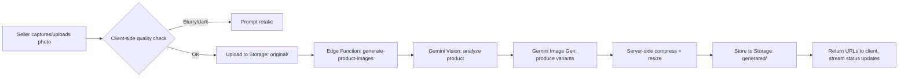
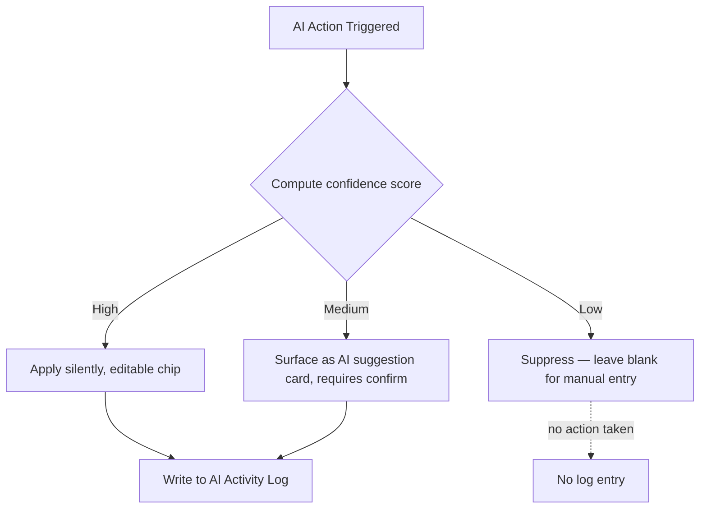
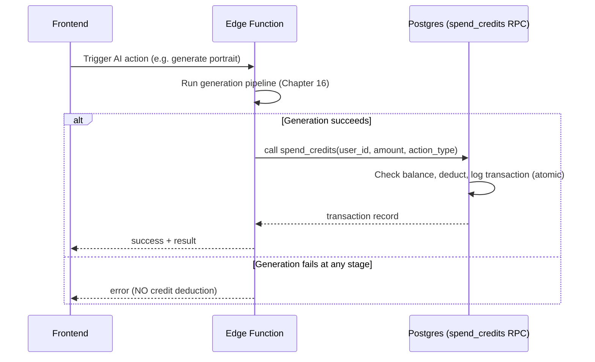
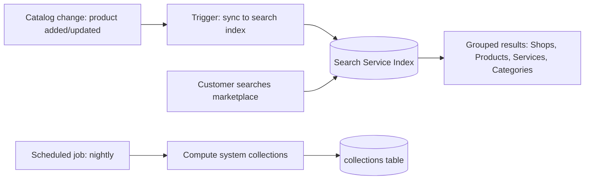

# The CowQ Engineering Handbook
### Official Engineering Law
**Confidential · Internal Use Only · v1.0**

> Every engineering decision must support: **"CowQ runs my entire business."**

---

## Preface

This handbook is binding on every human engineer and every AI coding agent (Claude, Lovable, or any future agent) that touches the CowQ codebase. It assumes the reader has read the *CowQ Product Bible* (business "why") and the *CowQ Design DNA* (design "how") — this document is the engineering "how." Where any of the three conflict, resolve in this order: Product Bible (business intent) → Design DNA (user-facing behavior) → this Handbook (implementation) — the Handbook implements the other two, it never overrides them.

Every chapter follows: **Purpose, Rules, Standards, Best Practices, Anti-patterns, Examples, Folder Examples, Code Examples, Edge Cases, Acceptance Criteria, Future Considerations.**

**Stack:** Lovable (React 18 + TypeScript + Vite), Tailwind CSS, shadcn/ui, Supabase (Postgres, Auth, Storage, Edge Functions), Gemini API, fal.ai/Kling, GitHub, Vercel (or Lovable's own hosting where applicable).

**The One Rule:** if a PR, a schema change, or an AI-agent-generated file doesn't trace back to making "CowQ runs my entire business" more true, it doesn't ship.

---

# 1. Engineering Principles

**Purpose**
Establish the non-negotiable engineering values every other chapter derives from.

**Rules**
1. **Invisible AI is a backend contract, not just a UX pattern.** Every AI-driven feature has a confidence-tiered code path (Chapter 17) — this is enforced in code, not left to prompt engineering alone.
2. **One shared credit-deduction path, always** (Chapter 21). No feature may implement its own credit-spending logic — this is a direct, permanent response to the known `spendOrThrow`/`spend_credits` mismatch bug.
3. **Seller data is scoped at the database layer, not the UI layer.** RLS (Chapter 12) is the source of truth for access control — a UI that merely hides a button is not a security boundary.
4. **Every screen ships with loading, empty, error, and success states** (Chapters 29, 30) — a PR without all four is incomplete, not "later."
5. **Multi-agent safety.** Because multiple AI coding agents (Lovable sessions, Claude Code, human engineers) touch this repo concurrently, every module must be independently comprehensible — no implicit cross-file coupling that only makes sense if you've read every other file first.
6. **Performance is measured, not assumed** (Chapter 32) — mid-range Android + patchy network is the default test condition, not an edge case.

**Standards**
- TypeScript strict mode is on, everywhere, no exceptions (`"strict": true` in `tsconfig.json`).
- No `any` without an inline comment justifying it and a linked ticket to remove it.
- Every exported function has a JSDoc comment stating its purpose in one line minimum.

**Best Practices**
- Prefer composition over configuration — a component with 15 boolean props is a smell (Chapter 5).
- Prefer explicit over clever — an AI agent six months from now (possibly a different model entirely) needs to understand this code without your context.

**Anti-patterns**
- ❌ "It works in Lovable's preview" as a sole quality bar — preview success ≠ production readiness.
- ❌ Copy-pasting a similar-but-not-identical component instead of extracting a shared one (Chapter 5).
- ❌ Silent `catch {}` blocks that swallow errors (Chapter 29).

**Examples**
A new AI feature (e.g., a future "smart pricing" suggestion) is built by: (1) checking if it can be inference-only per Chapter 17's confidence tiers, (2) if credit-consuming, wiring through `spend_credits` per Chapter 21, (3) shipping with all four UI states per Chapter 30, (4) RLS-scoping any new table per Chapter 12 — in that order, before any UI is built.

**Folder Examples**
```
src/
  features/
    smart-pricing/
      SmartPricingSuggestion.tsx
      useSmartPricing.ts
      smart-pricing.types.ts
```

**Code Examples**
```typescript
// ❌ Anti-pattern: ad hoc credit spend
await supabase.from('credits').update({ balance: balance - cost });

// ✅ Standard: shared RPC
const { data, error } = await supabase.rpc('spend_credits', {
  p_user_id: userId,
  p_amount: cost,
  p_action_type: 'smart_pricing_suggestion',
});
```

**Edge Cases**
An AI agent generating a "quick fix" under time pressure must still follow these principles — there is no "prototype exception" in this codebase; Lovable prompts should never request "just make it work" without these constraints restated.

**Acceptance Criteria**
- [ ] Every PR description states which principle(s) from this chapter it upholds.
- [ ] CI fails on `any` without a justification comment (Chapter 38).

**Future Considerations**
As the team grows past the founder, these six principles become the literal onboarding checklist for new engineers (human or AI) — Chapter 43 formalizes this as required reading before first commit.

---

# 2. Repository Structure

**Purpose**
Define the top-level shape of the CowQ monorepo so any contributor (human or AI) can navigate it without a map.

**Rules**
1. Single repository, single Lovable project, single Supabase project per environment (dev/staging/prod) — no repo-splitting until Chapter 50's scaling triggers are met.
2. Top-level structure is fixed and may only be extended by an explicit architecture review (Chapter 41).

**Standards**
```
cowq/
  src/                    # application source (see Chapter 3)
  supabase/
    migrations/           # SQL migrations, timestamped, append-only
    functions/             # Edge Functions (one folder per function)
    seed.sql
  docs/
    01-Product-Bible/
    02-Design-DNA/
    03-Engineering-Handbook/
  public/
  tests/
  .github/
    workflows/             # CI/CD (Chapter 38)
  .env.example
  package.json
  tsconfig.json
  tailwind.config.ts
  vite.config.ts
```

**Best Practices**
- `docs/` is a first-class citizen of the repo, not an afterthought wiki — the Product Bible, Design DNA, and this Handbook live here, versioned alongside code.
- Every top-level folder has a `README.md` stating its purpose in under 5 lines.

**Anti-patterns**
- ❌ A `misc/` or `utils/` folder at the repo root — utilities belong inside the feature or shared module that owns them (Chapter 3).
- ❌ Committing generated files (build output, `.env`) — enforced via `.gitignore` and CI checks.

**Examples**
A new Edge Function for video generation lives at `supabase/functions/generate-video/index.ts`, never inline in a frontend API route — Edge Functions are the only place server-side secrets (Gemini/fal.ai keys) are used (Chapter 35).

**Folder Examples**
See Standards above — this is the canonical, complete top-level tree.

**Code Examples**
```json
// package.json (relevant excerpt)
{
  "scripts": {
    "dev": "vite",
    "build": "vite build",
    "test": "vitest",
    "lint": "eslint . --ext ts,tsx",
    "typecheck": "tsc --noEmit"
  }
}
```

**Edge Cases**
A Lovable-generated file that doesn't fit this structure (Lovable sometimes scaffolds its own conventions) must be moved to conform before merge — Lovable's defaults are a starting point, not the final structure (Chapter 49).

**Acceptance Criteria**
- [ ] No file exists outside this defined top-level structure without a documented exception.

**Future Considerations**
If CowQ ever splits into multiple deployable services (Chapter 50's scaling triggers), this chapter is rewritten first, before any code is split.

---

# 3. Folder Structure

**Purpose**
Define the internal structure of `src/` — the day-to-day working structure every engineer touches constantly.

**Rules**
1. Feature-first, not type-first. Code is organized by what it does (`features/catalog/`), not by what kind of file it is (`components/`, `hooks/` as global dumping grounds).
2. Shared, cross-feature code lives in `shared/`, and only graduates there after being used by 2+ features — no premature abstraction.

**Standards**
```
src/
  app/                     # routing, providers, app shell
    routes/
    providers/
  features/
    catalog/
      components/
      hooks/
      api/
      catalog.types.ts
    orders/
    storefront/
    ai-generation/
    brand-memory/
    credits/
  shared/
    components/            # truly cross-feature UI (Button, Card, etc. — mirrors Design DNA §24)
    hooks/
    lib/                    # supabase client, gemini client wrappers, utils
    types/
  styles/
    tokens.css              # Design DNA token definitions (Chapter 6 cross-ref)
```

**Best Practices**
- A feature folder is self-contained: its own components, hooks, API calls, and types live together, not scattered across global folders.
- `shared/components/` mirrors the Design DNA Component Library (§24) 1:1 — every shared component name matches its Design DNA section name.

**Anti-patterns**
- ❌ A global `components/` folder containing both `Button.tsx` (truly shared) and `ProductCard.tsx` (catalog-feature-specific) mixed together.
- ❌ Deeply nested feature folders (`features/catalog/components/cards/product/variants/`) — max 3 levels deep inside a feature.

**Examples**
The Storefront feature (public shop, per Design DNA §51.1) lives at `features/storefront/`, consuming shared components from `shared/components/` (Card, Button) but owning its own `ShopHero.tsx`, `TrustStrip.tsx` components since those are storefront-specific.

**Folder Examples**
```
features/storefront/
  components/
    ShopHero.tsx
    TrustStrip.tsx
    CollectionShelf.tsx
  hooks/
    useShopData.ts
  api/
    storefront.api.ts
  storefront.types.ts
```

**Code Examples**
```typescript
// features/storefront/api/storefront.api.ts
import { supabase } from '@/shared/lib/supabase';
import type { ShopData } from '../storefront.types';

export async function getShopBySlug(slug: string): Promise<ShopData> {
  const { data, error } = await supabase
    .from('storefronts')
    .select('*, products(*)')
    .eq('slug', slug)
    .single();
  if (error) throw new StorefrontFetchError(error.message);
  return data;
}
```

**Edge Cases**
A component used by exactly one other feature (not yet 2+) stays in its owning feature folder and is imported directly — do not preemptively move it to `shared/` "in case" it's needed elsewhere later (YAGNI, enforced explicitly).

**Acceptance Criteria**
- [ ] No component is duplicated across two feature folders — a second usage triggers a "promote to shared" refactor.
- [ ] `shared/components/` names map 1:1 to Design DNA §24 component names.

**Future Considerations**
As feature count grows, consider a `features/index.ts` barrel registry for feature-flag-driven feature toggling (Chapter 45).

---

# 4. Naming Conventions

**Purpose**
Eliminate a whole class of AI-agent and human inconsistency by fixing naming rules explicitly.

**Rules**
1. Components: `PascalCase.tsx` (`ProductCard.tsx`).
2. Hooks: `useCamelCase.ts`, always prefixed `use` (`useCreditBalance.ts`).
3. Types/interfaces: `PascalCase`, suffixed by kind where ambiguous (`ProductDTO`, `ProductFormValues`).
4. API/service functions: `camelCase`, verb-first (`getShopBySlug`, `spendCredits`).
5. Database tables: `snake_case`, plural (`storefronts`, `catalog_items`, `credit_transactions`) — mirroring the five-pillar IA naming already established (Design DNA §46).
6. Database columns: `snake_case` (`created_at`, `seller_id`).
7. Edge Functions: `kebab-case` folder names matching their route (`generate-brand-portrait`).
8. CSS/Tailwind custom tokens: match Design DNA token names exactly (`bell-gold-500`, not `gold` or `accent`).

**Standards**
- Boolean props/variables prefixed `is`/`has`/`should` (`isLoading`, `hasError`, `shouldAutoSave`).
- Event handler props prefixed `on` (`onSubmit`), handler implementations prefixed `handle` (`handleSubmit`).

**Best Practices**
- Name things for what they mean to the seller (Design DNA §39's microcopy principle applied to code) — `catalog_items`, not `products_v2` or `items_table`.
- Avoid abbreviations an AI agent unfamiliar with CowQ-specific jargon would misread (`qty` is fine; `bmp` for "brand model portrait" is not).

**Anti-patterns**
- ❌ `data`, `info`, `item`, `temp` as variable names with no further context.
- ❌ Inconsistent casing for the same concept across files (`productId` in one file, `product_id` in a TS interface for the same entity).

**Examples**
The known bug (`spendOrThrow` vs `spend_credits`) is partly a naming-convention failure — two names for functionally the same concept invited the mismatch. This chapter exists in part to prevent a recurrence: there is now exactly **one** name, `spend_credits`, for this operation, everywhere, in both SQL and TypeScript call sites.

**Folder Examples**
```
features/credits/
  useCreditBalance.ts
  CreditCostLabel.tsx
  credits.types.ts        // CreditTransaction, CreditBalance
  api/
    spendCredits.ts        // wraps the spend_credits RPC — the ONLY call site
```

**Code Examples**
```typescript
// credits.types.ts
export interface CreditBalance {
  userId: string;
  balance: number;
  updatedAt: string;
}

export interface CreditTransaction {
  id: string;
  userId: string;
  amount: number;
  actionType: CreditActionType;
  createdAt: string;
}

export type CreditActionType =
  | 'brand_model_portrait'
  | 'product_photo_generation'
  | 'video_generation'
  | 'smart_pricing_suggestion';
```

**Edge Cases**
When Lovable auto-generates a name that violates these conventions (common with rapid scaffolding), it must be renamed before merge — a rename PR is cheap now, expensive after other code depends on the wrong name.

**Acceptance Criteria**
- [ ] ESLint naming-convention rule enforces PascalCase components, camelCase functions, and `use`-prefixed hooks (Chapter 38).
- [ ] A single canonical name exists for every cross-cutting concept (credits, orders, storefront) — verified via a repo-wide search before each major release.

**Future Considerations**
As the Product Bible's persona set grows (SMEs, agencies), naming should stay anchored to the current five-pillar vocabulary rather than introducing parallel terminology for new personas.

---

# 5. Component Architecture

**Purpose**
Define how React components are structured, composed, and kept consistent with the Design DNA component library (§24).

**Rules**
1. Every component in `shared/components/` corresponds 1:1 to a Design DNA §24 component spec — no shared component exists that isn't documented there, and vice versa.
2. Components are function components with typed props — no class components, no untyped `props: any`.
3. A component does one job. If a component's JSX exceeds ~150 lines or handles more than one visual concern, split it.
4. Presentational and container concerns are separated: a `ProductCard` renders; a `useProductCardData` hook (or parent) fetches.

**Standards**
```typescript
// Standard shared component shape
interface ButtonProps {
  variant: 'primary' | 'secondary' | 'ghost';
  size?: 'sm' | 'md' | 'lg';
  children: React.ReactNode;
  onClick?: () => void;
  disabled?: boolean;
}

export function Button({ variant, size = 'md', children, onClick, disabled }: ButtonProps) {
  return (
    <button
      className={cn(buttonVariants({ variant, size }))}
      onClick={onClick}
      disabled={disabled}
    >
      {children}
    </button>
  );
}
```

**Best Practices**
- Use `class-variance-authority` (cva) for variant-driven styling, matching shadcn/ui conventions, so `variant`/`size` props map directly to Design DNA tokens (§45's Tailwind mapping).
- Co-locate a component's Storybook-equivalent example (or at minimum a usage comment) with the component for AI-agent discoverability.

**Anti-patterns**
- ❌ A component with a `variant="primary"` prop that secretly also accepts raw Tailwind classes via a `className` override that fights the Design DNA — `className` overrides on shared components are a code smell; extend the variant system instead.
- ❌ Building a one-off, screen-specific "Button-like" element instead of using the shared `<Button>` (violates Design DNA §24.1's "one primary action" enforcement, which depends on Button being the single source of truth).

**Examples**
`ProductCard` (Design DNA §51.3) is built as: the whole card is one clickable region (`<Link>` wrapping the card), a nested `<button>` for add-to-cart with `stopPropagation`, and the single-micro-signal-row logic implemented as a pure function `getCardSignal(product)`, not scattered conditional JSX.

**Folder Examples**
```
features/catalog/components/
  ProductCard.tsx
  ProductCard.getCardSignal.ts   // pure logic, unit-testable in isolation
```

**Code Examples**
```typescript
// ProductCard.getCardSignal.ts
export function getCardSignal(product: Product): CardSignal | null {
  if (product.stockCount !== null && product.stockCount <= LOW_STOCK_THRESHOLD) {
    return { type: 'urgency', label: `Only ${product.stockCount} left` };
  }
  if (product.soldThisWeek >= SOCIAL_PROOF_THRESHOLD) {
    return { type: 'social-proof', label: `${product.soldThisWeek} sold this week` };
  }
  if (product.rating) {
    return { type: 'rating', label: `★${product.rating.toFixed(1)} (${product.reviewCount})` };
  }
  return null;
}
```

**Edge Cases**
A component that needs to break a Design DNA rule for a genuine, reviewed exception must document the exception inline with a comment linking to the Design DNA amendment (§47) that approved it — never a silent deviation.

**Acceptance Criteria**
- [ ] Every shared component has a corresponding Design DNA §24 entry, and vice versa — audited at each release.
- [ ] Zero components exceed 150 lines of JSX without a documented reason.

**Future Considerations**
As native apps become relevant (Chapter 48), component architecture should be evaluated for React Native portability — favoring platform-agnostic logic (hooks, pure functions) over deeply DOM-coupled implementations now pays off later.

---

# 6. UI Architecture

**Purpose**
Define how screens are composed from components, routes, and layout primitives — the layer above individual components.

**Rules**
1. Every screen uses the shared layout primitives (`ContextBar`, `Canvas`, `PrimaryActionSlot`) per Design DNA §8 — no screen builds its own layout shell.
2. Routing structure mirrors the five-pillar IA (Design DNA §6): `/storefront`, `/orders`, `/catalog`, `/customers`, `/insights`, plus `/settings`.
3. Theme (light/dark) is applied via a `data-theme` attribute at the root, never via duplicated Tailwind class sets per component (Design DNA §12).

**Standards**
```typescript
// app/routes/index.tsx
export const routes = [
  { path: '/', element: <InsightsHome /> },
  { path: '/storefront', element: <StorefrontEditor /> },
  { path: '/orders', element: <OrdersList /> },
  { path: '/orders/:id', element: <OrderDetail /> },
  { path: '/catalog', element: <CatalogList /> },
  { path: '/catalog/:id', element: <ProductDetail /> },
  { path: '/customers', element: <CustomersList /> },
  { path: '/settings', element: <Settings /> },
] as const;
```

**Best Practices**
- Route params are typed via a shared `RouteParams` type per route, not accessed as raw untyped strings.
- Screen-level components fetch their own data via a dedicated hook (`useOrderDetail(id)`), never via prop-drilling from a parent route.

**Anti-patterns**
- ❌ A screen that reaches into Supabase directly instead of going through a feature's `api/` module (breaks the layering established in Chapter 3).
- ❌ Introducing a second navigation pattern (e.g., a screen with its own tab bar unrelated to the five pillars) without a Design DNA amendment.

**Examples**
The Order Detail screen (`/orders/:id`) uses `ContextBar` for the page title and back action, `Canvas` for the order timeline (Design DNA §52.4/§60.5), and `PrimaryActionSlot` for the single primary action ("Mark as shipped" or equivalent) — exactly the same shell used by every other detail screen in the app.

**Folder Examples**
```
app/
  routes/
    OrdersRoutes.tsx
  providers/
    ThemeProvider.tsx
    AuthProvider.tsx
    QueryProvider.tsx
```

**Code Examples**
```typescript
// app/providers/ThemeProvider.tsx
export function ThemeProvider({ children }: { children: React.ReactNode }) {
  const [theme, setTheme] = useState<'light' | 'dark'>(getStoredTheme());
  useEffect(() => {
    document.documentElement.setAttribute('data-theme', theme);
  }, [theme]);
  return <ThemeContext.Provider value={{ theme, setTheme }}>{children}</ThemeContext.Provider>;
}
```

**Edge Cases**
A future agency/multi-account persona (Product Bible Chapter 8) will need a route-level account switcher — not built today, but routing structure should not preclude adding an `/accounts/:accountId/*` prefix later without a full rewrite.

**Acceptance Criteria**
- [ ] 100% of screens use the three shared layout primitives.
- [ ] Route structure matches the five-pillar IA with zero unauthorized top-level routes.

**Future Considerations**
See Chapter 48 (Native App Readiness) for how this routing structure should map to a future native navigation stack.

---

# 7. Feature Architecture

**Purpose**
Define the internal shape every feature module follows, so any feature is navigable using the same mental model.

**Rules**
1. Every feature has exactly: `components/`, `hooks/`, `api/`, and a `*.types.ts` file. No feature invents its own internal structure.
2. A feature's `api/` module is the *only* place that calls Supabase directly for that feature's data — components and hooks never call `supabase.from(...)` directly.
3. Cross-feature communication happens through explicit exports (a feature's `index.ts` barrel), never by reaching into another feature's internal files.

**Standards**
```typescript
// features/orders/index.ts — the feature's public surface
export { OrdersList } from './components/OrdersList';
export { OrderDetail } from './components/OrderDetail';
export { useOrderStatus } from './hooks/useOrderStatus';
export type { Order, OrderStatus } from './orders.types';
```

**Best Practices**
- If Feature A needs data from Feature B, it imports from Feature B's `index.ts` barrel — never `features/orders/components/internal/SomeHelper.tsx` directly.
- Keep feature boundaries aligned with the five pillars plus AI/credits/brand-memory as their own features — this mirrors the product's own mental model (Product Bible Chapter 6), which is deliberate.

**Anti-patterns**
- ❌ A "god feature" (e.g., a `core/` feature that every other feature imports from for unrelated reasons) — this is a sign shared logic belongs in `shared/`, not in a feature.
- ❌ Two features independently implementing the same Supabase query — extract to a shared `api/` helper or promote to `shared/`.

**Examples**
The Catalog feature and the AI Generation feature are separate, but Catalog's `ProductDetail` screen imports `useGenerateListing` from AI Generation's barrel export — a clean, explicit cross-feature dependency, not a tangled internal reach-in.

**Folder Examples**
```
features/
  catalog/
    index.ts
    components/
    hooks/
    api/
    catalog.types.ts
  ai-generation/
    index.ts
    components/
    hooks/
      useGenerateListing.ts
    api/
    ai-generation.types.ts
```

**Code Examples**
```typescript
// features/catalog/components/ProductDetail.tsx
import { useGenerateListing } from '@/features/ai-generation'; // via barrel, not deep import

export function ProductDetail({ productId }: { productId: string }) {
  const { generate, status } = useGenerateListing(productId);
  // ...
}
```

**Edge Cases**
A feature that grows large enough to need internal sub-features (e.g., Catalog eventually splitting into Catalog and Inventory) should be split explicitly, with a migration PR, not allowed to organically sprawl within one feature folder indefinitely.

**Acceptance Criteria**
- [ ] Zero deep cross-feature imports (verified via an ESLint import-boundary rule, Chapter 38).
- [ ] Every feature has an `index.ts` barrel as its only public surface.

**Future Considerations**
As feature count grows past ~15-20, consider a feature registry pattern for feature-flagged lazy loading (Chapter 45).

---

# 8. State Management

**Purpose**
Define how application state — server data, UI state, and cross-cutting global state — is managed consistently.

**Rules**
1. **Server state** (anything from Supabase) is managed via TanStack Query (`@tanstack/react-query`) — never manually synced into `useState` + `useEffect` fetch patterns.
2. **Local UI state** (a form's current input, a modal's open/closed state) uses `useState`/`useReducer` — kept as local as possible, never lifted to global state unnecessarily.
3. **Global cross-cutting state** (auth session, theme, active business context) uses React Context, one context per concern, never one mega-context.
4. **No Redux, no Zustand, no additional state library** unless a documented architecture review (Chapter 41) justifies it — TanStack Query + Context is sufficient for CowQ's current and near-term scale.

**Standards**
```typescript
// Standard query hook shape
export function useOrders(sellerId: string) {
  return useQuery({
    queryKey: ['orders', sellerId],
    queryFn: () => getOrdersBySeller(sellerId),
    staleTime: 30_000,
  });
}

// Standard mutation hook shape
export function useUpdateOrderStatus() {
  const queryClient = useQueryClient();
  return useMutation({
    mutationFn: updateOrderStatus,
    onSuccess: (_, variables) => {
      queryClient.invalidateQueries({ queryKey: ['orders', variables.sellerId] });
    },
  });
}
```

**Best Practices**
- Query keys are structured arrays (`['orders', sellerId]`, `['product', productId]`), never flat strings — enables precise cache invalidation.
- Optimistic updates (Design DNA §52.1's cart quantity example) use TanStack Query's `onMutate` for immediate UI feedback with rollback on failure.

**Anti-patterns**
- ❌ Storing server data (e.g., the full order list) in `useState` and manually re-fetching — this duplicates what TanStack Query already solves and drifts out of sync.
- ❌ A single giant `AppContext` holding auth, theme, cart, and feature flags together — split by concern.

**Examples**
The AI generation streaming state (Design DNA §54.4) is local component state (the streaming text buffer) combined with a TanStack Query mutation for the overall generation request — streaming tokens don't belong in global state; only the final, completed result does once persisted.

**Folder Examples**
```
shared/
  lib/
    queryClient.ts
  contexts/
    AuthContext.tsx
    ThemeContext.tsx
    ActiveBusinessContext.tsx
```

**Code Examples**
```typescript
// Optimistic cart quantity update (Design DNA §52.1)
export function useUpdateCartQuantity() {
  const queryClient = useQueryClient();
  return useMutation({
    mutationFn: updateCartItemQuantity,
    onMutate: async (variables) => {
      await queryClient.cancelQueries({ queryKey: ['cart'] });
      const previous = queryClient.getQueryData(['cart']);
      queryClient.setQueryData(['cart'], (old: Cart) => optimisticallyUpdate(old, variables));
      return { previous };
    },
    onError: (_err, _variables, context) => {
      queryClient.setQueryData(['cart'], context?.previous);
    },
  });
}
```

**Edge Cases**
Offline-queued writes (Design DNA §55.4) require state that survives a page reload — this uses a persisted TanStack Query mutation queue (or IndexedDB-backed queue) rather than in-memory state alone.

**Acceptance Criteria**
- [ ] Zero manual `useEffect`-based data fetching for server data — all server state goes through TanStack Query.
- [ ] No context holds more than one clearly-named concern.

**Future Considerations**
If real-time collaborative features are added (e.g., multi-staff order management, Product Bible's future multi-location persona), Supabase Realtime subscriptions should integrate with TanStack Query's cache via `queryClient.setQueryData` on incoming events, not a separate parallel state system.

---

# 9. API Standards

**Purpose**
Define how the frontend communicates with Supabase and Edge Functions consistently.

**Rules**
1. All direct-table reads/writes go through the Supabase JS client, wrapped in a feature's `api/` module — never called inline in components.
2. All AI generation, payment processing, and any operation requiring a secret key goes through an Edge Function — the Supabase client's anon key never has access to secrets (Chapter 35).
3. Every API function has a typed return and a typed error — no `any`, no unhandled promise rejections.

**Standards**
```typescript
// Standard API module error handling
export class ApiError extends Error {
  constructor(message: string, public code: string, public statusCode?: number) {
    super(message);
    this.name = 'ApiError';
  }
}

export async function getOrdersBySeller(sellerId: string): Promise<Order[]> {
  const { data, error } = await supabase
    .from('orders')
    .select('*')
    .eq('seller_id', sellerId)
    .order('created_at', { ascending: false });
  if (error) throw new ApiError(error.message, error.code);
  return data.map(mapOrderRow);
}
```

**Best Practices**
- Row-to-domain-type mapping functions (`mapOrderRow`) live beside the API function, keeping raw Supabase row shapes out of component code.
- Edge Function calls use a shared `invokeFunction<T>(name, payload)` wrapper for consistent error handling and typing.

**Anti-patterns**
- ❌ Passing raw Supabase row objects (snake_case, untyped joins) directly into component props — always map to a domain type first.
- ❌ Calling `fetch()` directly to a Gemini or fal.ai endpoint from the frontend — these calls belong exclusively in Edge Functions.

**Examples**
`generateProductListing(productId)` in the frontend calls `invokeFunction('generate-listing', { productId })`, which hits the `generate-listing` Edge Function, which alone holds the Gemini API key and performs the actual generation call.

**Folder Examples**
```
shared/lib/
  supabase.ts          // client instantiation
  invokeFunction.ts     // typed Edge Function wrapper
  apiError.ts
```

**Code Examples**
```typescript
// shared/lib/invokeFunction.ts
export async function invokeFunction<TResponse, TPayload = unknown>(
  name: string,
  payload: TPayload
): Promise<TResponse> {
  const { data, error } = await supabase.functions.invoke<TResponse>(name, { body: payload });
  if (error) throw new ApiError(error.message, 'EDGE_FUNCTION_ERROR');
  return data as TResponse;
}
```

**Edge Cases**
An Edge Function call that times out (e.g., a slow video generation) must return a job ID immediately and support polling/streaming rather than holding the HTTP connection open indefinitely (Chapter 17's async AI patterns).

**Acceptance Criteria**
- [ ] Zero direct `fetch()` calls to third-party AI vendor endpoints from frontend code — verified via a repo-wide search.
- [ ] Every API function has an explicit return type, no inferred `any`.

**Future Considerations**
As API surface grows, consider generating types directly from the Supabase schema (`supabase gen types typescript`) to keep domain types in sync with the database automatically.

---

# 10. Supabase Standards

**Purpose**
Define how Supabase itself (as a platform, not just a client library) is configured and used.

**Rules**
1. One Supabase project per environment: `cowq-dev`, `cowq-staging`, `cowq-prod` — never share a project across environments.
2. Migrations are the only way schema changes reach any environment — no manual schema edits via the Supabase dashboard in staging or prod (Chapter 47).
3. Storage buckets follow the naming and access pattern in Chapter 15 — the existing legacy bucket name (`praan`) is retained as-is rather than renamed, per the documented policy of not breaking existing storage references without a full migration plan.

**Standards**
- Edge Functions are TypeScript (Deno runtime), one function per concern, deployed via the Supabase CLI as part of CI/CD (Chapter 38).
- Realtime subscriptions are used sparingly and only where genuinely needed (e.g., a future live order-status feed) — not as a default data-fetching pattern.

**Best Practices**
- Local development uses `supabase start` (local Docker stack) to mirror production schema exactly before any migration is pushed.
- Every table has `created_at` and `updated_at` columns with automatic triggers, applied consistently via a shared migration helper.

**Anti-patterns**
- ❌ Editing a table's RLS policy directly in the dashboard in production without a corresponding migration file — this creates drift between environments.
- ❌ Using the Supabase service role key anywhere outside of Edge Functions.

**Examples**
The credit-deduction bug fix (Chapter 21) was deployed as a migration that (1) ensured the `spend_credits` RPC function exists and is correct, and (2) a follow-up code-audit PR that removed every call site using the old `spendOrThrow` path — both changes tracked as reviewable, revertable migrations/PRs, not manual dashboard edits.

**Folder Examples**
```
supabase/
  migrations/
    20260115120000_create_orders_table.sql
    20260201090000_add_rls_orders.sql
    20260310140000_fix_credit_deduction_rpc.sql
  functions/
    generate-listing/
      index.ts
    spend-credits-audit/
      index.ts
```

**Code Examples**
```sql
-- supabase/migrations/20260310140000_fix_credit_deduction_rpc.sql
create or replace function spend_credits(
  p_user_id uuid,
  p_amount integer,
  p_action_type text
) returns credit_transactions
language plpgsql
security definer
as $$
declare
  v_balance integer;
  v_transaction credit_transactions;
begin
  select balance into v_balance from credit_balances where user_id = p_user_id for update;
  if v_balance < p_amount then
    raise exception 'INSUFFICIENT_CREDITS';
  end if;
  update credit_balances set balance = balance - p_amount, updated_at = now()
    where user_id = p_user_id;
  insert into credit_transactions (user_id, amount, action_type)
    values (p_user_id, -p_amount, p_action_type)
    returning * into v_transaction;
  return v_transaction;
end;
$$;
```

**Edge Cases**
A migration that fails partway through in production requires a documented rollback migration, prepared and reviewed *before* the forward migration is applied — never an ad hoc dashboard fix under pressure.

**Acceptance Criteria**
- [ ] Zero schema drift between environments, verified via `supabase db diff` in CI.
- [ ] Every RPC function used by the frontend has a corresponding migration file in version control.

**Future Considerations**
As read volume grows, consider read replicas or a caching layer (Chapter 31) before considering a database migration off Supabase entirely — Supabase's own scaling headroom should be exhausted first (Company Principle 4, Product Bible Chapter 5).

---

# 11. Database Conventions

**Purpose**
Define schema design conventions so the database itself stays legible as the product grows.

**Rules**
1. Table names mirror the five-pillar IA plus supporting domains: `storefronts`, `catalog_items`, `orders`, `order_items`, `customers`, `credit_balances`, `credit_transactions`, `brand_memory_profiles`, `ai_generations`.
2. Every table has a UUID primary key (`id uuid primary key default gen_random_uuid()`), never an auto-incrementing integer (avoids leaking business volume via sequential IDs, and simplifies future multi-region/offline sync).
3. Foreign keys are always named `<referenced_table_singular>_id` (`seller_id` referencing `sellers.id`, not `user_id` when the semantic meaning is specifically "seller").
4. Soft deletes via a `deleted_at timestamptz null` column for anything a seller might need to "undo" (Product Principle 2 in the Design DNA — never destroy user work) — hard deletes are reserved for genuinely non-recoverable, low-stakes data only.

**Standards**
```sql
create table catalog_items (
  id uuid primary key default gen_random_uuid(),
  seller_id uuid not null references sellers(id),
  name text not null,
  description text,
  price_cents integer not null,
  stock_count integer,
  low_stock_threshold integer,
  suggested_stock_count integer,  -- AI suggestion, never overwrites stock_count directly (Chapter 17)
  status text not null default 'draft' check (status in ('draft', 'published', 'archived')),
  deleted_at timestamptz,
  created_at timestamptz not null default now(),
  updated_at timestamptz not null default now()
);
create index idx_catalog_items_seller_id on catalog_items(seller_id) where deleted_at is null;
```

**Best Practices**
- Money is always stored as integer cents/paise (`price_cents`), never floating point — avoids rounding errors in a commerce product.
- Enum-like fields use a `check` constraint with an explicit allowed-value list (as above), not a free-text column, and not a separate lookup table unless the value set genuinely needs to grow dynamically.

**Anti-patterns**
- ❌ Storing `price` as a `float`/`numeric` without cents-based integer precision — a direct commerce-trust risk (Product Bible Chapter 25).
- ❌ A generic `metadata jsonb` column used as a dumping ground for fields that should be real, typed columns.

**Examples**
The `catalog_items.suggested_stock_count` column is the literal database-level implementation of Chapter 17/Design DNA §52.6's rule that AI stock suggestions never silently overwrite seller-entered `stock_count` — this is enforced by having two distinct columns, not by application-code discipline alone (which is a much weaker guarantee).

**Folder Examples**
```
supabase/migrations/
  20260112000000_create_sellers.sql
  20260112000100_create_catalog_items.sql
  20260112000200_create_orders.sql
  20260112000300_create_order_items.sql
  20260112000400_create_credit_balances.sql
  20260112000500_create_credit_transactions.sql
  20260112000600_create_brand_memory_profiles.sql
```

**Code Examples**
```sql
-- Soft delete pattern
alter table catalog_items add column deleted_at timestamptz;

-- Application-layer "delete" is actually:
update catalog_items set deleted_at = now() where id = $1;

-- All reads filter it out by default via a view:
create view catalog_items_active as
  select * from catalog_items where deleted_at is null;
```

**Edge Cases**
A table that genuinely needs hard deletes (e.g., an expired, never-confirmed AI generation draft) should document explicitly why soft-delete doesn't apply, rather than defaulting to hard-delete out of habit.

**Acceptance Criteria**
- [ ] Every table handling seller-created content (products, orders, customers) uses soft delete.
- [ ] Every monetary column is integer-typed, verified via a schema audit.

**Future Considerations**
As multi-location/agency personas (Product Bible Chapter 8) are built, expect a `business_id` layer above `seller_id` — this chapter's conventions (UUID PKs, explicit FK naming) are chosen specifically to make that future addition non-breaking.

---

# 12. Row Level Security Standards

**Purpose**
Define RLS as CowQ's primary, database-enforced security boundary — the literal implementation of "seller owns everything" and customer privacy scoping (Product Bible Chapters 45, 47).

**Rules**
1. **RLS is enabled on every table containing seller or customer data, with no exceptions.** A table without RLS enabled is a shipped security bug, not a "TODO."
2. Policies are written to be *provably* correct for the specific access pattern — a seller sees their own data; a customer sees only their own order/profile data; no seller sees another seller's customer's full cross-platform history (Product Bible Chapter 47).
3. RLS policies are the *only* access control layer that matters for data safety — UI-level hiding is a UX nicety, never a substitute.

**Standards**
```sql
alter table catalog_items enable row level security;

create policy "Sellers can view their own catalog items"
  on catalog_items for select
  using (seller_id = auth.uid());

create policy "Sellers can insert their own catalog items"
  on catalog_items for insert
  with check (seller_id = auth.uid());

create policy "Sellers can update their own catalog items"
  on catalog_items for update
  using (seller_id = auth.uid())
  with check (seller_id = auth.uid());

-- Public can view published items on public shop pages (no auth required)
create policy "Public can view published catalog items"
  on catalog_items for select
  using (status = 'published' and deleted_at is null);
```

**Best Practices**
- Every new table's PR must include its RLS migration in the *same* PR — RLS is never a follow-up task.
- Policies are named descriptively in plain English (as above), not `policy_1`, so a future reviewer understands intent immediately.

**Anti-patterns**
- ❌ A table with RLS enabled but a permissive `using (true)` policy "to make development easier" — this is a production security hole waiting to ship if forgotten.
- ❌ Relying on the frontend to filter `seller_id = currentUser.id` in a query without a matching RLS policy — the frontend filter is a performance optimization, not the actual security boundary.

**Examples**
The customer-privacy scoping described in Product Bible Chapter 47 (a seller sees only what's operationally necessary to fulfil an order, never a customer's cross-seller history) is implemented as an RLS policy on `customers` that joins through `orders` to verify the requesting seller has an actual order relationship with that customer, rather than a blanket customer-table read policy.

**Folder Examples**
```
supabase/migrations/
  20260112000700_rls_catalog_items.sql
  20260112000800_rls_orders.sql
  20260112000900_rls_customers.sql
```

**Code Examples**
```sql
-- Customer privacy scoping (Product Bible §47)
create policy "Sellers can view customers they have order relationships with"
  on customers for select
  using (
    exists (
      select 1 from orders
      where orders.customer_id = customers.id
      and orders.seller_id = auth.uid()
    )
  );
```

**Edge Cases**
Edge Functions using the service role key bypass RLS entirely by design (they need broader access for legitimate cross-user operations like `spend_credits`) — every Edge Function using the service role must implement its own explicit authorization check in code, since it doesn't get RLS's protection for free.

**Acceptance Criteria**
- [ ] 100% of tables containing seller or customer data have RLS enabled — enforced via a CI check that queries `pg_tables` for RLS status.
- [ ] Every RLS policy has an automated test verifying both the allow and deny case (Chapter 37).

**Future Considerations**
As team/multi-user accounts are added (Product Bible Chapter 8's future personas), RLS policies will need to account for role-based access within a single business account (owner vs. staff) — this should extend the existing `seller_id = auth.uid()` pattern to a `business_members` join table, not replace it.

---

# 13. Authentication

**Purpose**
Define how sellers and customers authenticate with CowQ.

**Rules**
1. Supabase Auth is the sole authentication provider — email/password and Google OAuth for sellers (per the Design DNA's AuthModal reference), phone/OTP for customers where appropriate to Indian commerce conventions (Product Bible Chapter 44).
2. Guest checkout (Product Bible Chapter 25, Design DNA §52.2) means customers can complete a purchase *without* creating an account — auth is offered post-purchase, never required pre-purchase.
3. Session tokens are handled entirely by the Supabase client SDK's built-in session management — no custom JWT handling in application code.

**Standards**
```typescript
// shared/contexts/AuthContext.tsx
export function AuthProvider({ children }: { children: React.ReactNode }) {
  const [session, setSession] = useState<Session | null>(null);
  useEffect(() => {
    supabase.auth.getSession().then(({ data }) => setSession(data.session));
    const { data: listener } = supabase.auth.onAuthStateChange((_event, session) => {
      setSession(session);
    });
    return () => listener.subscription.unsubscribe();
  }, []);
  return <AuthContext.Provider value={{ session }}>{children}</AuthContext.Provider>;
}
```

**Best Practices**
- Guest checkout carts are stored client-side (localStorage/IndexedDB per Design DNA §52.1) and merged into an account-linked cart on login/signup at checkout time — never lost.
- Sensitive account changes (email, phone, payout bank details) require re-authentication regardless of session state (Chapter 34 in the Design DNA / Product Bible Chapter 46), implemented as a dedicated server-side middleware check, not a client-only re-auth modal.

**Anti-patterns**
- ❌ Storing session tokens in `localStorage` manually — the Supabase client already handles this securely; reimplementing it is a security risk.
- ❌ Gating any browsing or cart-add action behind a login wall (violates Design DNA §51.2's explicit no-login-wall-on-browsing rule).

**Examples**
A customer buying from a CowQ seller for the first time browses, adds to cart, and completes checkout entirely as a guest — an account is offered only after successful payment, with a "Save these details for next time?" prompt, per Product Bible Chapter 25.

**Folder Examples**
```
features/auth/
  components/
    AuthModal.tsx
    ReAuthPrompt.tsx
  hooks/
    useSession.ts
    useRequireReAuth.ts
  api/
    signIn.ts
    signUp.ts
```

**Code Examples**
```typescript
// Sensitive-action re-auth middleware (Edge Function)
export async function requireReAuth(req: Request, supabaseClient: SupabaseClient) {
  const { password } = await req.json();
  const { data: { user } } = await supabaseClient.auth.getUser();
  const { error } = await supabaseClient.auth.signInWithPassword({
    email: user!.email!,
    password,
  });
  if (error) throw new ApiError('Re-authentication failed', 'REAUTH_REQUIRED', 401);
}
```

**Edge Cases**
A customer who starts checkout as a guest, then decides mid-flow to log into an existing CowQ account, needs their guest cart merged (not discarded) into their account cart — this merge logic must be explicitly tested, not assumed to work automatically.

**Acceptance Criteria**
- [ ] Zero screens gate browsing or cart-add behind authentication.
- [ ] Sensitive account-detail changes are verified to require server-side re-authentication in an automated test.

**Future Considerations**
As team accounts are added, authentication needs to extend from "one user = one seller account" to "one user may belong to multiple business accounts with different roles" — this should be designed before implementation begins, not retrofitted.

---

# 14. Authorization

**Purpose**
Define role- and permission-based access control beyond basic authentication — who can do what, distinct from who is logged in.

**Rules**
1. Today, CowQ has exactly two effective roles: **Seller** (owns and manages a business account) and **Customer** (buys from sellers). No third role exists yet.
2. Authorization decisions are enforced at the RLS layer (Chapter 12) wherever possible — application-code-only authorization checks are a secondary, defense-in-depth layer, never the sole gate.
3. Any future role (staff, agency manager) must be modeled as an explicit `role` enum on a `business_members` table before any related feature is built — no ad hoc, feature-specific permission flags.

**Standards**
```sql
-- Future-ready structure, not yet populated with roles beyond 'owner'
create table business_members (
  id uuid primary key default gen_random_uuid(),
  business_id uuid not null references sellers(id),
  user_id uuid not null references auth.users(id),
  role text not null default 'owner' check (role in ('owner', 'staff', 'agency_manager')),
  created_at timestamptz not null default now()
);
```

**Best Practices**
- Even though only the `owner` role is active today, this table exists now (Chapter 47's migration strategy) so future role expansion is additive, not a breaking schema change.

**Anti-patterns**
- ❌ Checking authorization via a hardcoded `if (user.email === 'founder@cowq.app')` pattern anywhere in the codebase — even for founder-only admin tooling, use a proper role/permission check.
- ❌ Building a permission system more complex than the current two-role reality requires — no premature RBAC framework.

**Examples**
An admin-only internal tool (e.g., a fraud-review dashboard, Product Bible Chapter 45) checks the `role` on `business_members` (or a separate `internal_admins` table) rather than a hardcoded email allowlist.

**Folder Examples**
```
supabase/migrations/
  20260112001000_create_business_members.sql
```

**Code Examples**
```typescript
// shared/lib/authorization.ts
export function canManageBusiness(userId: string, businessMembers: BusinessMember[]): boolean {
  const membership = businessMembers.find((m) => m.userId === userId);
  return membership?.role === 'owner';
}
```

**Edge Cases**
A future agency persona managing multiple sellers' accounts (Product Bible Chapter 8) will need cross-business authorization queries — the `business_members` table structure above is chosen specifically to support this without a schema rewrite.

**Acceptance Criteria**
- [ ] No hardcoded email/user-ID-based authorization checks exist anywhere in the codebase.
- [ ] `business_members` table exists and is used even at current single-role scale, to avoid a future breaking migration.

**Future Considerations**
When staff/agency roles are activated, define exact permission boundaries per role explicitly in this chapter before writing any code that depends on them.

---

# 15. File Storage

**Purpose**
Define how product photos, AI-generated images, and other media are stored and organized in Supabase Storage.

**Rules**
1. The existing storage bucket, `praan`, retains its legacy name — it is not renamed, to avoid breaking existing stored references; new bucket organization happens via folder structure within it, not a rename.
2. Storage paths are structured `{bucket}/{seller_id}/{category}/{file_id}.{ext}` — predictable, scoped, and RLS-protected at the storage-policy level matching Chapter 12's database RLS philosophy.
3. Original seller-uploaded images are never overwritten or deleted by an AI processing pipeline (Chapter 16 / Design DNA §23) — AI-enhanced versions are stored as separate files, with the original always retrievable.

**Standards**
```
praan/
  {seller_id}/
    products/
      {product_id}/
        original/{file_id}.jpg
        generated/{file_id}.jpg
    brand-models/
      {model_id}/{file_id}.jpg
    storefront/
      hero/{file_id}.jpg
```

**Best Practices**
- Storage RLS policies mirror table RLS policies exactly (a seller can only write to their own `{seller_id}/` prefix).
- Generated images are served through a CDN-backed public URL where content is meant to be public (published product photos), and via signed URLs where content is private (draft/unpublished content).

**Anti-patterns**
- ❌ Storing all sellers' images in one flat, unscoped folder — makes RLS and cleanup unmanageable.
- ❌ Silently replacing a seller's original upload with an AI-enhanced version (violates Design DNA §23's explicit rule against this).

**Examples**
The AI background-cleanup feature (Design DNA §23) writes its output to `praan/{seller_id}/products/{product_id}/generated/{file_id}.jpg`, while the original stays untouched at `.../original/{file_id}.jpg` — the seller always sees and can revert to the original.

**Folder Examples**
```
supabase/migrations/
  20260112001100_storage_rls_praan_bucket.sql
```

**Code Examples**
```sql
-- Storage RLS policy for the praan bucket
create policy "Sellers can upload to their own folder"
  on storage.objects for insert
  with check (
    bucket_id = 'praan'
    and (storage.foldername(name))[1] = auth.uid()::text
  );
```

**Edge Cases**
A seller who deletes their account needs a defined data-retention/deletion policy for their stored files (Product Bible Chapter 47's privacy commitments) — this should be a scheduled cleanup job, not an immediate cascade delete, to allow for account-recovery windows.

**Acceptance Criteria**
- [ ] Storage RLS policies verified to scope every write to the uploading seller's own folder prefix.
- [ ] Zero code paths that overwrite an original seller-uploaded file.

**Future Considerations**
As video generation scales (Chapter 17's roadmap), storage costs and CDN bandwidth become a real line-item cost to monitor — video files should have an explicit lifecycle/archival policy from the start, unlike images.

---

# 16. Image Pipeline

**Purpose**
Define the end-to-end technical flow from a seller's uploaded photo to generated product images.

**Rules**
1. Every image pipeline stage is a discrete, observable step (upload → validation → AI generation → storage → serve) — not a single opaque function, so failures can be diagnosed and retried at the correct stage.
2. Client-side blur/exposure detection (Design DNA §55.3) runs before upload, to catch unusable photos early and avoid wasting an AI generation credit-cycle on a bad input.
3. Every AI-generated image is compressed and appropriately sized server-side before being served to the client (Design DNA §58) — never shipped at raw generation resolution.

**Standards**


**Best Practices**
- The Edge Function emits discrete status events (`analyzing`, `generating`, `finalizing`) consumed by the frontend for the multi-stage loading UI (Design DNA §54.3) — the frontend never has to guess what stage a long-running generation is in.
- Failed generations at any stage do not deduct credits (Chapter 21) — credit deduction happens only after successful completion.

**Anti-patterns**
- ❌ A single Edge Function call that blocks for the full generation duration with no intermediate status — violates Design DNA §54.3's multi-stage status requirement.
- ❌ Serving AI-generated images directly from the AI vendor's own temporary URL without re-storing and re-serving from CowQ's own storage — vendor URLs may expire and aren't performance-optimized for CowQ's audience.

**Examples**
A brand-model-portrait generation (the feature with the known credit bug, Chapter 21) follows this exact pipeline: photo uploaded → quality-checked → sent to the `generate-brand-portrait` Edge Function → Gemini generates the portrait → image is compressed/stored → **only then** is `spend_credits` called, and only through the shared RPC.

**Folder Examples**
```
supabase/functions/
  generate-product-images/
    index.ts
    geminiClient.ts
    imageProcessing.ts
  generate-brand-portrait/
    index.ts
```

**Code Examples**
```typescript
// supabase/functions/generate-brand-portrait/index.ts (excerpt)
export default async function handler(req: Request) {
  const { userId, imageId, config } = await req.json();
  await emitStatus(userId, 'analyzing');
  const analysis = await geminiClient.analyzeImage(imageId);
  await emitStatus(userId, 'generating');
  const generated = await geminiClient.generatePortrait(analysis, config);
  await emitStatus(userId, 'finalizing');
  const stored = await storeAndCompress(generated);

  // Credit deduction happens ONLY after full success — the fix for the known bug.
  await supabaseAdmin.rpc('spend_credits', {
    p_user_id: userId,
    p_amount: CREDIT_COSTS.brand_model_portrait,
    p_action_type: 'brand_model_portrait',
  });

  return jsonResponse({ imageUrl: stored.url });
}
```

**Edge Cases**
A generation that succeeds at the AI-vendor level but fails during server-side storage must not deduct credits and must surface a clear, retryable error to the seller — this exact failure mode is where the historical bug class lived, so it gets an explicit test case (Chapter 37).

**Acceptance Criteria**
- [ ] Credit deduction is verified, via automated test, to occur only after full pipeline success.
- [ ] Every pipeline stage emits an observable status event consumed by the frontend.

**Future Considerations**
As video generation matures (Chapter 17), this same discrete-stage pipeline pattern extends directly — video's stages are simply longer-running and more numerous, not architecturally different.

---

# 17. AI Architecture

**Purpose**
Define the overall system architecture for AI features — the engineering implementation of the 95% Invisible / 5% Branded philosophy (Product Bible Chapter 22, Design DNA §30/§54).

**Rules**
1. Every AI-driven feature is classified into one of three confidence tiers at the code level (Design DNA §54.1): **High** (applied silently, editable), **Medium** (surfaced as a suggestion requiring confirm), **Low** (suppressed, left blank for manual entry).
2. Confidence thresholds per action type are stored as versioned config (a `ai_confidence_thresholds` table or equivalent), not hardcoded per-feature, so they can be tuned centrally as real acceptance/correction data accumulates (Product Bible Chapter 51).
3. Every AI-originated action, regardless of tier, writes to the **AI Activity Log** (an append-only table) — invisible actions log silently, medium/high-visibility actions log with their user-facing state.

**Standards**


**Best Practices**
- The confidence-tier branching logic lives in one shared function per action type (`classifyConfidence(actionType, score)`), not duplicated inline across features.
- Every AI feature ships with instrumentation for shown/accepted/dismissed/corrected events from day one (Product Bible Chapter 51's AI Suggestion Acceptance Rate metric depends on this).

**Anti-patterns**
- ❌ An AI feature that always surfaces as a confirm-required suggestion regardless of confidence — this defeats the entire purpose of the invisible-AI philosophy and creates notification fatigue (Design DNA §5, §35).
- ❌ Hardcoding a confidence threshold (`if (score > 0.8)`) inline in a component instead of referencing the shared, versioned config.

**Examples**
Category inference during onboarding (Product Bible Chapter 6's example) at 96% confidence applies silently as an editable chip (High tier); a price suggestion at 65% confidence surfaces as a Bell Mark suggestion card (Medium tier); a garbled, unparseable product name is left blank (Low tier, suppressed) — this is the literal three-branch decision tree implemented in code, not just UX copy.

**Folder Examples**
```
features/ai-generation/
  lib/
    classifyConfidence.ts
    aiActivityLog.ts
  hooks/
    useAIConfidenceTier.ts
supabase/
  migrations/
    20260112001200_create_ai_confidence_thresholds.sql
    20260112001300_create_ai_activity_log.sql
```

**Code Examples**
```typescript
// features/ai-generation/lib/classifyConfidence.ts
export type ConfidenceTier = 'high' | 'medium' | 'low';

export function classifyConfidence(
  actionType: AIActionType,
  score: number,
  thresholds: ConfidenceThresholds
): ConfidenceTier {
  const { highMin, mediumMin } = thresholds[actionType];
  if (score >= highMin) return 'high';
  if (score >= mediumMin) return 'medium';
  return 'low';
}
```

```sql
create table ai_activity_log (
  id uuid primary key default gen_random_uuid(),
  seller_id uuid not null references sellers(id),
  action_type text not null,
  confidence_tier text not null check (confidence_tier in ('high', 'medium', 'low')),
  input_summary jsonb,
  output_summary jsonb,
  status text not null default 'applied' check (status in ('applied', 'suggested', 'accepted', 'dismissed', 'reverted')),
  reversible boolean not null default true,
  created_at timestamptz not null default now()
);
```

**Edge Cases**
An invisible (High-tier) AI action that touches money movement, refunds, or external customer communication must still create an AI Activity Log entry even though it's applied silently — per Design DNA §54.8's rule that full invisibility is reserved for internal, reversible, non-external-facing actions only.

**Acceptance Criteria**
- [ ] Every AI feature's confidence-tier branching is verified against the shared `classifyConfidence` function, not reimplemented per feature.
- [ ] Quarterly correction-rate review data (Product Bible Chapter 51) is queryable directly from `ai_activity_log`.

**Future Considerations**
As more AI models are integrated (Chapter 18), this confidence-tier architecture should remain the constant abstraction layer — model-specific integration details change; the tier system does not.

---

# 18. Gemini Integration

**Purpose**
Define the specific technical integration pattern for the Gemini API — CowQ's primary AI vendor for vision, copy, and image generation.

**Rules**
1. All Gemini API calls happen exclusively inside Edge Functions — the API key never reaches the client (Chapter 35).
2. A single, shared `geminiClient` wrapper module is used by every Edge Function that calls Gemini — no Edge Function instantiates its own raw HTTP client to the Gemini endpoint.
3. Every Gemini call has an explicit timeout and a defined fallback/error path — no indefinite hangs.

**Standards**
```typescript
// supabase/functions/_shared/geminiClient.ts
export class GeminiClient {
  constructor(private apiKey: string) {}

  async analyzeImage(imageUrl: string): Promise<ImageAnalysis> {
    return this.call('vision-analyze', { imageUrl }, { timeoutMs: 15_000 });
  }

  async generateListingCopy(analysis: ImageAnalysis, brandMemory: BrandMemoryProfile): Promise<ListingCopy> {
    return this.call('generate-copy', { analysis, brandMemory }, { timeoutMs: 10_000 });
  }

  async generateImage(prompt: GeneratedImagePrompt): Promise<GeneratedImage> {
    return this.call('generate-image', prompt, { timeoutMs: 30_000 });
  }

  private async call<T>(endpoint: string, payload: unknown, opts: { timeoutMs: number }): Promise<T> {
    const controller = new AbortController();
    const timeout = setTimeout(() => controller.abort(), opts.timeoutMs);
    try {
      const res = await fetch(`${GEMINI_BASE_URL}/${endpoint}`, {
        method: 'POST',
        headers: { Authorization: `Bearer ${this.apiKey}`, 'Content-Type': 'application/json' },
        body: JSON.stringify(payload),
        signal: controller.signal,
      });
      if (!res.ok) throw new GeminiApiError(await res.text(), res.status);
      return res.json();
    } finally {
      clearTimeout(timeout);
    }
  }
}
```

**Best Practices**
- Structured output (JSON schema-constrained generation) is used wherever the output feeds a UI component directly (e.g., listing copy fields) — never parse freeform text with regex to extract structured data.
- Every Gemini prompt template is versioned (Chapter 19) so a prompt regression can be traced to a specific change.

**Anti-patterns**
- ❌ Instantiating a new Gemini client with inline `fetch()` calls scattered across multiple Edge Functions — always route through the shared `GeminiClient`.
- ❌ No timeout on a Gemini call — a hung request should fail fast and surface a retryable error, not block indefinitely (Chapter 29).

**Examples**
`generate-listing`'s Edge Function calls `geminiClient.analyzeImage()` then `geminiClient.generateListingCopy()` in sequence, emitting a status event between each (Chapter 16's multi-stage pipeline pattern) — both calls go through the same shared client with the same error-handling and timeout discipline.

**Folder Examples**
```
supabase/functions/_shared/
  geminiClient.ts
  geminiErrors.ts
  geminiTypes.ts
```

**Code Examples**
```typescript
// Error handling
export class GeminiApiError extends Error {
  constructor(message: string, public statusCode: number) {
    super(message);
    this.name = 'GeminiApiError';
  }
  get isRetryable() {
    return this.statusCode >= 500 || this.statusCode === 429;
  }
}
```

**Edge Cases**
A Gemini rate-limit response (429) should trigger an automatic, bounded retry with exponential backoff inside `GeminiClient`, not surface immediately as a user-facing failure — but only up to a defined retry cap, after which it fails gracefully with clear messaging (Chapter 29).

**Acceptance Criteria**
- [ ] Zero direct Gemini API calls outside the shared `GeminiClient` wrapper, verified via codebase audit.
- [ ] Every Gemini call has a defined timeout, verified via code review checklist (Chapter 41).

**Future Considerations**
As Chapter 22's multi-vendor redundancy consideration (Product Bible Chapter 22) becomes relevant, `GeminiClient`'s interface should be designed now to be swappable behind a common `AIVisionProvider`/`AITextProvider` interface, even while Gemini remains the only implementation.

---

# 19. Prompt Architecture

**Purpose**
Define how AI prompts are structured, versioned, and kept consistent with Brand Memory and CowQ's voice standards.

**Rules**
1. Prompts are never inline string-concatenated in Edge Function handler code — they live in dedicated, versioned prompt template files.
2. Every generative prompt that produces seller-facing or customer-facing text injects the seller's Brand Memory profile (Chapter 20) automatically — no prompt is written without checking whether Brand Memory context applies.
3. Prompts enforce output constraints matching Design DNA §38/§39 (Brand Voice, Microcopy) — e.g., a caption-generation prompt explicitly instructs against exclamation points and emoji in system-adjacent copy, consistent with the product's voice standards.

**Standards**
```typescript
// supabase/functions/_shared/prompts/listingCopy.prompt.ts
export const LISTING_COPY_PROMPT_V2 = (analysis: ImageAnalysis, brandMemory: BrandMemoryProfile) => `
You are generating a product listing for an Indian small-business seller on CowQ.

Product analysis: ${JSON.stringify(analysis)}

Seller's brand voice (apply these preferences exactly):
- Tone: ${brandMemory.tone}
- Preferred terminology: ${brandMemory.preferredTerms.join(', ')}
- Avoid: ${brandMemory.avoidedTerms.join(', ')}

Write in plain, sentence-case language. Do not use exclamation points.
Return structured JSON matching this schema: { "title": string, "description": string, "suggestedPrice": number }
`;
```

**Best Practices**
- Prompt files are named and versioned explicitly (`listingCopy.prompt.ts`, with a `_V2` suffix on breaking changes) so A/B comparisons and regressions are traceable.
- Prompts request structured (JSON-schema-constrained) output wherever the result feeds a typed UI component, per Chapter 18.

**Anti-patterns**
- ❌ A prompt template that doesn't reference Brand Memory at all for a seller-facing content generation feature — every new generative feature must justify, explicitly, if it's exempt from Brand Memory injection.
- ❌ Prompt logic mixed with business logic in the same function — prompt construction is a pure, testable function separate from the API-calling code.

**Examples**
The AI reasoning-summary feature (Product Bible Chapter 20's pricing-suggestion reasoning) uses a constrained-output prompt template that caps output at 2-3 factors, plain language, no ML-jargon — enforced by the prompt's explicit instruction and output schema, not left to the model's discretion (Design DNA §54.7).

**Folder Examples**
```
supabase/functions/_shared/prompts/
  listingCopy.prompt.ts
  socialCaption.prompt.ts
  priceReasoningSummary.prompt.ts
  brandPortrait.prompt.ts
```

**Code Examples**
```typescript
// Constrained reasoning-summary prompt (Design DNA §54.7)
export const PRICE_REASONING_PROMPT = (context: PricingContext) => `
Explain, in plain language a business owner would understand, why you're suggesting this price.
Rules:
- Maximum 3 factors.
- No technical/ML terminology (no "embedding," "similarity score," etc.)
- One short sentence per factor.
Context: ${JSON.stringify(context)}
Return JSON: { "factors": string[] } (max length 3)
`;
```

**Edge Cases**
A prompt template change that materially affects output quality or tone should be tested against a sample of real seller Brand Memory profiles before deployment — a prompt that works well for one seller's tone may not generalize.

**Acceptance Criteria**
- [ ] Every generative content prompt is a dedicated, versioned file — zero inline prompt strings in handler code.
- [ ] Every seller-facing/customer-facing generative prompt injects Brand Memory, or has a documented exemption.

**Future Considerations**
As regional language generation ships (Product Bible Chapter 44), prompt templates need locale-specific variants that generate natively in the target language — not a single English template with a "translate to X" instruction appended, per the explicit standard set in Design DNA §62.

---

# 20. Brand Memory Architecture

**Purpose**
Define the technical implementation of Brand Memory — CowQ's per-seller AI personalization system (Product Bible Chapter 35, Design DNA §54.2).

**Rules**
1. Brand Memory is a structured, versioned, per-seller profile — never a black-box embedding the seller can't inspect (Design DNA §54.2 Rule 2's transparency requirement, enforced at the schema level by using structured columns, not an opaque vector alone).
2. Memory updates incrementally from real seller correction behavior (e.g., repeated caption edits) via a background aggregation job, not requiring an explicit "train me" step from the seller.
3. Every generative AI call for a given seller automatically injects their current Brand Memory profile (Chapter 19) — this is enforced at the shared prompt-construction layer, not left to individual feature implementations to remember.

**Standards**
```sql
create table brand_memory_profiles (
  seller_id uuid primary key references sellers(id),
  tone text,
  preferred_terms text[] default '{}',
  avoided_terms text[] default '{}',
  photo_style_notes text,
  pricing_philosophy_notes text,
  updated_at timestamptz not null default now()
);

create table brand_memory_corrections (
  id uuid primary key default gen_random_uuid(),
  seller_id uuid not null references sellers(id),
  original_output text not null,
  corrected_output text not null,
  correction_type text not null, -- e.g. 'terminology', 'tone'
  created_at timestamptz not null default now()
);
```

**Best Practices**
- The correction-aggregation job (a scheduled Edge Function or Supabase cron job) analyzes `brand_memory_corrections` in batches and proposes updates to `brand_memory_profiles` — proposed updates surface to the seller for confirmation if they represent a significant change, consistent with the AI confidence-tier model (Chapter 17).
- Brand Memory is exposed to the seller via a dedicated "What CowQ knows about your brand" screen backed directly by the `brand_memory_profiles` row — no separate, hidden internal representation diverges from what's shown.

**Anti-patterns**
- ❌ Storing Brand Memory purely as an opaque embedding vector with no human-readable fields — violates the explicit transparency requirement.
- ❌ Requiring a seller to fill out a "brand voice questionnaire" as a prerequisite for Brand Memory to start working — it should build incrementally from real usage, per the "infer first" philosophy (Product Bible Chapter 6).

**Examples**
A seller who repeatedly edits AI-generated captions to remove exclamation points has each correction logged to `brand_memory_corrections`; once a pattern threshold is met (e.g., 3+ similar corrections), the aggregation job updates `avoided_terms`/`tone` on `brand_memory_profiles`, and this seller's future generations reflect the change automatically.

**Folder Examples**
```
supabase/functions/
  aggregate-brand-memory/
    index.ts
features/brand-memory/
  components/
    BrandMemoryScreen.tsx
  hooks/
    useBrandMemory.ts
  api/
    brandMemory.api.ts
```

**Code Examples**
```typescript
// features/brand-memory/api/brandMemory.api.ts
export async function getBrandMemoryProfile(sellerId: string): Promise<BrandMemoryProfile> {
  const { data, error } = await supabase
    .from('brand_memory_profiles')
    .select('*')
    .eq('seller_id', sellerId)
    .single();
  if (error) throw new ApiError(error.message, error.code);
  return data;
}

export async function updateBrandMemoryField(
  sellerId: string,
  field: keyof BrandMemoryProfile,
  value: unknown
) {
  const { error } = await supabase
    .from('brand_memory_profiles')
    .update({ [field]: value, updated_at: new Date().toISOString() })
    .eq('seller_id', sellerId);
  if (error) throw new ApiError(error.message, error.code);
}
```

**Edge Cases**
A seller whose voice genuinely shifts (rebranding) needs an easy, discoverable way to reset or bulk-edit their Brand Memory profile — not just incremental accumulation with no way to correct course quickly (Design DNA §54.2's edge case).

**Acceptance Criteria**
- [ ] Every field in `brand_memory_profiles` is visible and editable in the seller-facing screen — zero hidden personalization state.
- [ ] New generative AI features automatically inherit Brand Memory without additional per-feature integration work, verified by a shared prompt-construction helper.

**Future Considerations**
As Brand Memory matures, consider whether it should extend beyond text tone into visual style preferences (color, composition) feeding directly into image-generation prompts (Chapter 19) — a natural extension once the text-based system is proven.

---

# 21. Credits System Architecture

**Purpose**
Define the definitive, bug-resistant architecture for CowQ's AI credits system — directly addressing the known critical bug and establishing the permanent guardrail against its recurrence.

**Rules**
1. **There is exactly one function that may deduct credits: the `spend_credits` Postgres RPC.** No other code path — not `spendOrThrow`, not a direct `UPDATE` statement, not a new bespoke function — is permitted to modify `credit_balances.balance`, enforced both by code review (Chapter 41) and, ideally, by revoking direct `UPDATE` grants on `credit_balances` from anything except the RPC's `security definer` context.
2. Credit deduction happens atomically with transaction logging (Chapter 10's `spend_credits` example) — a balance change without a corresponding `credit_transactions` row is a data-integrity bug, not just a UX issue.
3. Credit cost is checked and displayed to the frontend *before* an action executes (Design DNA §54.6) — the frontend calls a `get_credit_cost(action_type)` function so cost figures are never hardcoded client-side and drift from the actual server-side cost.

**Standards**


**Best Practices**
- `credit_costs` is a versioned config table (`action_type`, `cost`, `effective_from`), queried by both the cost-display UI and the deduction RPC, so displayed cost and actual charged cost can never drift.
- Every credit-consuming Edge Function is covered by an automated test asserting: (a) success deducts exactly the right amount, (b) failure deducts nothing, (c) insufficient balance blocks the action before generation even starts.

**Anti-patterns**
- ❌ **The historical bug itself**, restated as the canonical anti-pattern: a feature calling a locally-defined `spendOrThrow`-style function instead of the shared RPC. Any code review that sees a new credit-deduction code path that isn't `spend_credits` is an automatic block (Chapter 41).
- ❌ Deducting credits optimistically before generation starts "in case it succeeds" — always deduct after confirmed success (Chapter 16).

**Examples**
See Chapter 16's full pipeline code example — the credit-deduction call is the *last* step, after storage is confirmed successful, using the exact `spend_credits` RPC signature defined in Chapter 10.

**Folder Examples**
```
supabase/
  migrations/
    20260112001400_create_credit_balances.sql
    20260112001500_create_credit_transactions.sql
    20260112001600_create_spend_credits_rpc.sql
    20260112001700_create_credit_costs.sql
    20260310140000_fix_credit_deduction_rpc.sql   -- the bug-fix migration
tests/
  credits/
    spendCredits.test.ts
    brandPortraitCreditFlow.test.ts
```

**Code Examples**
```typescript
// tests/credits/brandPortraitCreditFlow.test.ts (representative)
describe('brand portrait credit flow', () => {
  it('deducts credits only after successful generation', async () => {
    const balanceBefore = await getBalance(testUser.id);
    await generateBrandPortrait(testUser.id, validImage);
    const balanceAfter = await getBalance(testUser.id);
    expect(balanceBefore - balanceAfter).toBe(CREDIT_COSTS.brand_model_portrait);
  });

  it('deducts nothing when generation fails', async () => {
    const balanceBefore = await getBalance(testUser.id);
    await expect(generateBrandPortrait(testUser.id, corruptedImage)).rejects.toThrow();
    const balanceAfter = await getBalance(testUser.id);
    expect(balanceAfter).toBe(balanceBefore);
  });

  it('rejects generation when balance is insufficient, before any AI call is made', async () => {
    await setBalance(testUser.id, 0);
    const geminiSpy = vi.spyOn(geminiClient, 'generatePortrait');
    await expect(generateBrandPortrait(testUser.id, validImage)).rejects.toThrow('INSUFFICIENT_CREDITS');
    expect(geminiSpy).not.toHaveBeenCalled();
  });
});
```

**Edge Cases**
A generation that succeeds at the AI layer but whose Edge Function crashes *after* generation but *before* the `spend_credits` call completes must not leave the seller with unbilled-but-delivered content indefinitely — this should be reconciled via an idempotent retry or an internal audit job, not silently ignored (a genuine, tracked edge case, not assumed away).

**Acceptance Criteria**
- [ ] 100% of AI features route through `spend_credits`, verified via automated codebase audit (a CI script scanning for any competing balance-mutation pattern) run on every PR.
- [ ] Every credit-consuming feature has the three-part test suite shown above (success deducts correctly, failure deducts nothing, insufficient balance blocks pre-generation).

**Future Considerations**
As new credit-consuming action types are added (video, presenter — Product Bible Chapter 17's roadmap), each new type is added to `credit_costs` and covered by the same test pattern — this chapter's discipline scales by repetition, not by new architecture.

---

# 22. Partial Regeneration Architecture

**Purpose**
Define the technical implementation of "partial editing" — regenerating a single photo angle, caption, or hashtag without a full, credit-consuming regeneration — CowQ's explicit, validated differentiator against FlyAds (Product Bible Chapter 14).

**Rules**
1. Every generated output (a listing's title, description, each individual photo angle, each caption) is stored as an independently addressable, independently regeneratable unit — never as a single monolithic "generation result" blob that must be regenerated wholesale to change one piece.
2. Partial regeneration has its own, lower credit cost than a full regeneration (Chapter 21's `credit_costs` table), reflecting the actual reduced AI compute involved — never priced identically to a full regeneration.
3. Regenerating one unit (e.g., one photo angle) never silently invalidates or discards the other, unchanged units.

**Standards**
```sql
create table ai_generations (
  id uuid primary key default gen_random_uuid(),
  seller_id uuid not null references sellers(id),
  product_id uuid references catalog_items(id),
  generation_type text not null, -- 'listing_title', 'listing_description', 'photo_angle', 'caption', 'hashtag'
  unit_key text not null,        -- e.g. 'angle_front', 'angle_side', 'caption_instagram'
  content jsonb not null,        -- the actual generated content/URL
  version integer not null default 1,
  created_at timestamptz not null default now()
);
create unique index idx_ai_generations_current
  on ai_generations(product_id, generation_type, unit_key)
  where version = (select max(version) from ai_generations g2
    where g2.product_id = ai_generations.product_id
    and g2.generation_type = ai_generations.generation_type
    and g2.unit_key = ai_generations.unit_key);
```

**Best Practices**
- Each regeneratable unit has a stable `unit_key` so the frontend can request "regenerate exactly this one" without ambiguity.
- Regeneration requests are scoped Edge Function calls (`regenerate-unit`) taking a specific `generation_type` + `unit_key`, distinct from the full-generation Edge Function (`generate-listing`) — two different, clearly-named entry points, not one function with a confusing mode flag.

**Anti-patterns**
- ❌ Storing all generated content for a product as one JSON blob column on `catalog_items` — makes partial regeneration architecturally impossible without a full rewrite of the whole blob.
- ❌ Charging the same credit cost for regenerating one caption as for a full product listing regeneration — undermines the entire strategic value of this differentiator (Product Bible Chapter 20).

**Examples**
A seller unhappy with just the "front angle" product photo taps "Regenerate" on that single image; the Edge Function call scopes to `generation_type: 'photo_angle', unit_key: 'angle_front'`, produces a new version of just that unit, and the seller is charged the lower partial-regeneration credit cost — the description, other angles, and captions remain untouched.

**Folder Examples**
```
supabase/functions/
  regenerate-unit/
    index.ts
features/ai-generation/
  components/
    RegenerateUnitButton.tsx
  hooks/
    useRegenerateUnit.ts
```

**Code Examples**
```typescript
// features/ai-generation/hooks/useRegenerateUnit.ts
export function useRegenerateUnit(productId: string) {
  return useMutation({
    mutationFn: (params: { generationType: string; unitKey: string }) =>
      invokeFunction('regenerate-unit', { productId, ...params }),
    onSuccess: (_, variables) => {
      queryClient.invalidateQueries({
        queryKey: ['ai-generations', productId, variables.generationType, variables.unitKey],
      });
    },
  });
}
```

**Edge Cases**
A partial regeneration of a photo angle that depends on context from other, unchanged units (e.g., a styled "worn" shot depending on the front-angle shot's framing) needs explicit handling of that dependency — either the prompt for the dependent unit includes the still-current sibling unit as context, or the two are documented as a linked regeneration group rather than fully independent.

**Acceptance Criteria**
- [ ] Every generated content type is stored as an independently addressable unit with a stable `unit_key`.
- [ ] Partial regeneration credit cost is verified to be lower than full regeneration cost for every applicable content type.

**Future Considerations**
As video generation matures, partial regeneration should extend to video segments/scenes where technically feasible — the same `ai_generations` unit-addressable pattern should apply rather than treating video as architecturally separate.

---

# 23. Public Shop Architecture

**Purpose**
Define the technical architecture for the public shop page (`cowq.app/shop/[seller-slug]`) — a top roadmap priority (Product Bible Chapter 17, 24).

**Rules**
1. Shop pages are statically generated / ISR'd (Incremental Static Regeneration) per seller, revalidated on catalog change — never a cold, client-side-rendered fetch on every visit (Design DNA §51.1's performance guarantee: hero + Trust Strip must render in first paint).
2. Shop page templates are a fixed, curated section system (Hero, Featured, Grid, About, Trust Strip) — no freeform page-builder canvas, enforced at the schema and component level, not just as a design guideline.
3. The shop page route requires zero authentication and zero client-side data-fetching waterfall for its critical content — first paint must include seller name, hero image, and Trust Strip.

**Standards**
```sql
create table storefronts (
  id uuid primary key default gen_random_uuid(),
  seller_id uuid not null unique references sellers(id),
  slug text not null unique,
  hero_image_url text,
  tagline text,
  sections jsonb not null default '[]', -- ordered array of {type, config} — fixed enum of types
  published boolean not null default false,
  updated_at timestamptz not null default now()
);
```

**Best Practices**
- `sections` is a `jsonb` array but its `type` field is validated against a fixed application-level enum (`hero`, `featured`, `grid`, `about`, `trust_strip`) at write time — jsonb flexibility for ordering/config, but no ability to introduce an arbitrary, unvalidated section type.
- The Trust Strip's underlying metrics (Chapter 24, Design DNA §53.6) are computed server-side and cached at short TTL, fetched as part of the same ISR-rendered payload, never a separate client-side round-trip that would delay first paint.

**Anti-patterns**
- ❌ A client-side-only rendered shop page that fetches storefront data via `useEffect` after mount — fails the explicit first-paint performance requirement.
- ❌ Allowing `sections` to contain an arbitrary, unvalidated section type — reopens the "freeform page builder" door the Design DNA explicitly closes (§51.1 Rule 3).

**Examples**
A customer clicking a shared link to a seller's shop page sees the seller's name, hero image, and Trust Strip rendered before any JavaScript executes — verified via Lighthouse's Largest Contentful Paint (LCP) element check (Design DNA §51.1's acceptance criterion, directly implemented via this ISR architecture).

**Folder Examples**
```
features/storefront/
  components/
    ShopHero.tsx
    TrustStrip.tsx
    FeaturedShelf.tsx
    FullCatalogGrid.tsx
    AboutSection.tsx
  api/
    storefront.api.ts
    getShopSections.ts
app/routes/
  ShopPage.tsx   -- the ISR/SSG entry point
```

**Code Examples**
```typescript
// features/storefront/api/getShopSections.ts — validated section rendering
const VALID_SECTION_TYPES = ['hero', 'featured', 'grid', 'about', 'trust_strip'] as const;
type SectionType = (typeof VALID_SECTION_TYPES)[number];

export function renderSections(sections: unknown[]): ShopSection[] {
  return sections.filter((s): s is ShopSection =>
    isRecord(s) && VALID_SECTION_TYPES.includes(s.type as SectionType)
  );
}
```

**Edge Cases**
A shop page revalidation triggered by a catalog update mid-generation (e.g., a seller adds a product while their storefront is being statically regenerated) should not produce a corrupted or partially-updated page — revalidation should be atomic (swap on complete regeneration, never serve a half-rendered intermediate state).

**Acceptance Criteria**
- [ ] Shop page LCP element (hero image or name) verified to render within first paint via Lighthouse, per release.
- [ ] `sections` jsonb writes are validated server-side against the fixed section-type enum — no unvalidated writes possible.

**Future Considerations**
As the Marketplace (Chapter 24) grows, shop pages should expose structured metadata (JSON-LD or similar) for future search/discovery indexing — not built today, but the fixed section-type schema is chosen partly to make this addition straightforward later.

---

# 24. Marketplace Architecture

**Purpose**
Define the technical architecture for cross-seller discovery — search, filters, categories, and collections (Design DNA §51.5–§51.9, Product Bible Chapter 23).

**Rules**
1. Marketplace search uses a dedicated search service (a Meilisearch/Typesense-class index), not naive SQL `LIKE` queries — required for the typo-tolerant, transliteration-aware matching explicitly mandated in Design DNA §51.5.
2. Category taxonomy is a centrally-managed, versioned config (Design DNA §51.7) — sellers select from it; they never write free-text categories directly into a table without validation.
3. System-generated collections ("New This Week," "Best Sellers," Design DNA §51.8) are computed by a scheduled job, not a real-time query, to protect page-load performance.

**Standards**


**Best Practices**
- Search index sync happens via a Postgres trigger or Supabase webhook firing an Edge Function on `catalog_items` insert/update, keeping the search index near-real-time without the frontend ever writing to it directly.
- Facet counts (Design DNA §51.6's live filter counts) are returned in the same search-service query as the results, avoiding a second round-trip.

**Anti-patterns**
- ❌ Implementing marketplace search as a Postgres full-text-search `ILIKE` query as a "good enough for now" placeholder that quietly becomes production — this cannot deliver the mandated typo-tolerance and multi-script matching, and should never ship as more than an explicitly-labeled temporary stopgap.
- ❌ Computing "Best Sellers" via a real-time aggregate query on every shop-page load — must be precomputed (Design DNA §51.8 Rule 3).

**Examples**
A search for "mehendi" returning results also matching "mehndi" and "henna" (Design DNA §51.5's exact example) is only achievable through a proper search service's typo-tolerant and synonym-aware indexing — this is cited explicitly as the reason SQL `LIKE` is architecturally insufficient here.

**Folder Examples**
```
supabase/functions/
  sync-search-index/
    index.ts
  compute-system-collections/
    index.ts        -- scheduled via pg_cron or Supabase Scheduled Functions
features/marketplace/
  components/
    SearchBar.tsx
    FilterSheet.tsx
    CategoryBrowse.tsx
  api/
    search.api.ts
```

**Code Examples**
```typescript
// features/marketplace/api/search.api.ts
export async function searchMarketplace(query: string): Promise<GroupedSearchResults> {
  return invokeFunction('search', { query });
}

// supabase/functions/search/index.ts (excerpt)
export default async function handler(req: Request) {
  const { query } = await req.json();
  const results = await searchClient.multiSearch([
    { indexName: 'shops', query },
    { indexName: 'products', query },
    { indexName: 'services', query },
  ]);
  return jsonResponse(groupResultsByType(results));
}
```

**Edge Cases**
A newly-published product should appear in marketplace search within a bounded, tested time window (e.g., under 60 seconds) — an indefinite or untested sync delay between catalog write and search-index availability is a real, trackable regression risk.

**Acceptance Criteria**
- [ ] Marketplace search verified to return typo-tolerant results in an automated test suite (specific known-typo test cases).
- [ ] Zero filter combinations presented as available in the UI that the search service confirms would yield zero results (Design DNA §51.6).

**Future Considerations**
As catalog scale grows, monitor search-service indexing cost and latency — this is an explicit, budgeted infrastructure cost distinct from the core Supabase/Lovable stack, tracked separately (Chapter 44's cost-discipline principle).

---

# 25. Payments Architecture (Future-Ready)

**Purpose**
Define how CowQ's current payment integration is architected to be extensible toward the future business model (Product Bible Chapter 4: future payment processing and financial products) without requiring a rewrite.

**Rules**
1. Payment gateway integration uses the vendor's official SDK/components (Chapter 41 in the Product Bible, "build vs. buy" precedent) wrapped in CowQ-styled containers — never hand-rolled payment logic, given the compliance and security stakes.
2. Payment state is modeled as its own domain (`payments` table, linked to `orders`) distinct from order status (Chapter 26) — even though today payment status and order status often change together, keeping them as separate concerns now avoids a breaking schema change when CowQ's own payment processing (a future business model layer) is introduced.
3. UPI-first payment method presentation (Product Bible Chapter 28) is implemented as configuration, not hardcoded UI ordering — enables market-specific reordering for future international expansion (Product Bible Chapter 43) without a code change.

**Standards**
```sql
create table payments (
  id uuid primary key default gen_random_uuid(),
  order_id uuid not null references orders(id),
  gateway text not null, -- 'razorpay' or equivalent
  gateway_payment_id text,
  method text, -- 'upi', 'card', 'netbanking'
  amount_cents integer not null,
  status text not null check (status in ('pending', 'processing', 'succeeded', 'failed', 'refunded')),
  failure_reason text,
  created_at timestamptz not null default now(),
  updated_at timestamptz not null default now()
);
```

**Best Practices**
- Payment status updates arrive via gateway webhooks into a dedicated `payment-webhook` Edge Function, verified against the gateway's signature — never trusted from client-reported status alone.
- Payment failure reasons are mapped from gateway-specific codes to CowQ's own honest, specific failure categories (Design DNA §52.3: insufficient funds, bank declined, network timeout, customer cancelled) at the Edge Function layer, keeping gateway-specific vocabulary out of the frontend entirely.

**Anti-patterns**
- ❌ Trusting a client-side "payment succeeded" callback to mark an order as paid — always confirm via server-side webhook verification.
- ❌ Conflating `payments.status` and `orders.status` into a single field — keep them separate now, even though they're correlated, to avoid a breaking migration when payment processing becomes its own product surface.

**Examples**
A payment gateway webhook reporting a bank-timeout failure is mapped, inside the `payment-webhook` Edge Function, to CowQ's specific customer-facing copy ("Your bank didn't respond in time. No amount was deducted...", Design DNA §52.3) — the mapping table lives in code, versioned and testable, not scattered inline conditionals.

**Folder Examples**
```
supabase/functions/
  payment-webhook/
    index.ts
    gatewaySignatureVerify.ts
    failureReasonMapping.ts
features/checkout/
  components/
    PaymentMethodSelector.tsx
  api/
    payments.api.ts
```

**Code Examples**
```typescript
// supabase/functions/payment-webhook/failureReasonMapping.ts
export function mapGatewayFailureReason(gatewayCode: string): PaymentFailureReason {
  const mapping: Record<string, PaymentFailureReason> = {
    'insufficient_funds': 'insufficient_funds',
    'bank_declined': 'bank_declined',
    'gateway_timeout': 'network_timeout',
    'user_cancelled': 'customer_cancelled',
  };
  return mapping[gatewayCode] ?? 'unknown';
}
```

**Edge Cases**
A webhook that arrives out of order (a "succeeded" event followed later by a duplicate "pending" event due to gateway retry behavior) must not regress the payment's status backward — status transitions should be validated as monotonic/idempotent, not applied blindly in arrival order.

**Acceptance Criteria**
- [ ] All payment status changes are verified to originate from signature-verified webhooks, never from unverified client input.
- [ ] `payments` and `orders` remain distinct tables/domains, verified at schema review.

**Future Considerations**
When CowQ's own payment processing/financial products (Product Bible Chapter 4) are built, this `payments` table structure is the intended foundation — the separation from `orders` established now is specifically what makes that future expansion additive rather than a breaking rewrite.

---

# 26. Notification Architecture

**Purpose**
Define the technical implementation of CowQ's three-tier notification system (Design DNA §35, Product Bible Chapter 38).

**Rules**
1. Notifications are generated server-side (Edge Functions or database triggers), tagged with one of three tiers (`needs_you_now`, `worth_knowing`, `ai_did_this`) at creation time — the tier is a stored, queryable field, not a client-side interpretation of notification content.
2. Only `needs_you_now` tier notifications are eligible for push delivery — `worth_knowing` is in-app only, `ai_did_this` is logged (to the AI Activity Log, Chapter 17) and never pushed, enforced at the notification-dispatch layer, not left to per-feature discretion.
3. A hard cap on non-critical push notifications per business per day (Design DNA §35 Rule 2) is enforced server-side in the dispatch function, not just as a UI guideline.

**Standards**
```sql
create table notifications (
  id uuid primary key default gen_random_uuid(),
  seller_id uuid not null references sellers(id),
  tier text not null check (tier in ('needs_you_now', 'worth_knowing', 'ai_did_this')),
  title text not null,
  body text not null,
  action_url text,
  read_at timestamptz,
  created_at timestamptz not null default now()
);
```

**Best Practices**
- The dispatch function checks the day's push count for a seller against the cap *before* sending, using a fast, indexed count query — never sends first and reconciles after.
- `ai_did_this` tier notifications are batched into a single daily/session summary rather than dispatched individually (Design DNA's overnight-batch example), computed by a scheduled aggregation job.

**Anti-patterns**
- ❌ A feature that decides its own notification tier inline, inconsistently with similar features elsewhere — tier assignment should reference a shared, reviewed mapping (`action_type → tier`), not ad hoc per-feature judgment calls.
- ❌ Pushing every individual `ai_did_this` event as it happens — violates the explicit "never push this tier" rule and creates notification fatigue.

**Examples**
Twenty AI-drafted customer replies completed overnight (Design DNA's example) are aggregated by a scheduled job into a single `worth_knowing`-tier (not pushed) summary notification the next morning, rather than twenty individual `ai_did_this` log entries surfacing as twenty pushes.

**Folder Examples**
```
supabase/functions/
  dispatch-notification/
    index.ts
    pushCapCheck.ts
  aggregate-overnight-summary/
    index.ts    -- scheduled
features/notifications/
  components/
    NotificationList.tsx
  hooks/
    useNotifications.ts
```

**Code Examples**
```typescript
// supabase/functions/dispatch-notification/pushCapCheck.ts
export async function canSendPush(sellerId: string): Promise<boolean> {
  const { count } = await supabaseAdmin
    .from('push_log')
    .select('*', { count: 'exact', head: true })
    .eq('seller_id', sellerId)
    .gte('sent_at', startOfDay());
  return (count ?? 0) < DAILY_PUSH_CAP;
}
```

**Edge Cases**
A genuinely urgent `needs_you_now` event (e.g., a payment dispute) that would exceed the daily push cap must still be delivered — the cap applies specifically to non-critical notifications (Design DNA §35 Rule 2's explicit carve-out); this exception should be a distinct, tested code path, not accidentally blocked by the same cap logic.

**Acceptance Criteria**
- [ ] Daily push cap enforced server-side, verified via automated test that confirms the (N+1)th non-critical push in a day is suppressed.
- [ ] Zero `ai_did_this`-tier notifications ever trigger a push, verified via codebase audit of the dispatch function.

**Future Considerations**
As sellers gain configurable notification preferences (Design DNA §35's seller-override rule), this architecture needs a `notification_preferences` table read by the dispatch function before applying default tier behavior.

---

# 27. Analytics Architecture

**Purpose**
Define the technical architecture behind the Insights pillar and CowQ's internal product-metrics tracking (Product Bible Chapters 49–51).

**Rules**
1. Seller-facing analytics (Insights pillar) and internal product-metrics tracking (KPIs, North Star Metric) are architecturally separate systems — seller-facing analytics reads from CowQ's own operational tables (orders, catalog, AI activity); internal product metrics use a dedicated event-tracking pipeline. Conflating the two risks either exposing internal-only data to sellers or under-powering internal reporting.
2. Every event needed for Product Bible Chapter 51's KPIs (journey-stage transitions, TTFV completion, AI acceptance/correction) is explicitly instrumented at the point it occurs — not inferred after the fact from other data.
3. Seller-facing charts never render a pie chart (Design DNA §24.7) — enforced as a lint/review rule on any new chart component.

**Standards**
```typescript
// shared/lib/analytics.ts — internal product-metrics event tracking
export function trackEvent(event: ProductEvent) {
  // fires to an internal event pipeline (e.g., a lightweight events table + optional third-party sink)
  supabase.from('product_events').insert({
    event_name: event.name,
    seller_id: event.sellerId,
    properties: event.properties,
    occurred_at: new Date().toISOString(),
  });
}

// Usage at a journey-stage transition point (Product Bible Chapter 10)
trackEvent({ name: 'storefront_published', sellerId, properties: { ttfvSeconds } });
```

**Best Practices**
- Seller-facing Insights queries are read-only, RLS-scoped to the requesting seller's own data (Chapter 12) — same security model as any other seller data.
- Internal `product_events` table is append-only, queried by internal dashboards/BI tooling, never joined directly into seller-facing UI queries.

**Anti-patterns**
- ❌ Building seller-facing analytics and internal KPI tracking as one unified system "to save engineering time" — the security and audience requirements are genuinely different (seller-scoped vs. internal-only), and conflating them risks a data-exposure bug.
- ❌ A chart component built without a leading plain-language summary sentence (Design DNA §24.7's explicit requirement).

**Examples**
The "Revenue is up 12% from last week" pattern (Design DNA §24.7's example) is computed server-side (a `getRevenueTrend(sellerId)` function returning both the percentage and the pre-formatted sentence), not computed ad hoc in the chart component — keeping the "lead with the sentence" rule enforced at the data layer, not just styling.

**Folder Examples**
```
features/insights/
  components/
    KPICard.tsx
    RevenueChart.tsx
  api/
    insights.api.ts
shared/lib/
  analytics.ts
supabase/
  migrations/
    20260112001800_create_product_events.sql
```

**Code Examples**
```typescript
// features/insights/api/insights.api.ts
export async function getRevenueTrend(sellerId: string): Promise<RevenueTrend> {
  const { data, error } = await supabase.rpc('get_revenue_trend', { p_seller_id: sellerId });
  if (error) throw new ApiError(error.message, error.code);
  return {
    percentChange: data.percent_change,
    windowLabel: data.window_label, // e.g. "vs last 7 days"
    summarySentence: formatTrendSentence(data), // "Revenue is up 12% from last week"
  };
}
```

**Edge Cases**
A seller with insufficient historical data for a meaningful trend comparison (e.g., a brand-new storefront) should see an honest empty/insufficient-data state (Design DNA §32) rather than a misleading "0%" or a broken chart.

**Acceptance Criteria**
- [ ] Zero pie charts in the codebase, verified via component audit.
- [ ] Every chart component receives a pre-computed summary sentence as a required prop — enforced via TypeScript (no optional summary field).

**Future Considerations**
As Product Bible Chapter 51's KPI dashboards mature, consider a dedicated internal BI tool (Metabase or similar) reading directly from `product_events` and other operational tables via a read replica, rather than building custom internal dashboards in the CowQ app itself.

---

# 28. Logging Standards

**Purpose**
Define consistent, structured logging across frontend and backend so issues are diagnosable without guesswork — especially critical given multiple AI agents contribute code and may not share full context.

**Rules**
1. All Edge Function logs are structured JSON (not freeform `console.log` strings) — `{ level, message, context, timestamp }` at minimum.
2. No PII (customer names, addresses, payment details) appears in logs at `info` level or below — only at a restricted `debug` level that's disabled in production.
3. Every log statement includes enough context (seller ID, request ID, action type) to trace a single request end-to-end across the pipeline stages described in Chapter 16.

**Standards**
```typescript
// supabase/functions/_shared/logger.ts
export function log(level: 'debug' | 'info' | 'warn' | 'error', message: string, context: Record<string, unknown> = {}) {
  if (level === 'debug' && Deno.env.get('ENVIRONMENT') === 'production') return;
  console.log(JSON.stringify({ level, message, context, timestamp: new Date().toISOString() }));
}
```

**Best Practices**
- Include a `requestId` (generated at the start of every Edge Function invocation) threaded through every log line for that request, enabling correlation.
- Log at pipeline-stage boundaries (Chapter 16) explicitly — `generation_started`, `generation_completed`, `credits_deducted` — so a support engineer (human or AI) can reconstruct exactly where a failed request stopped.

**Anti-patterns**
- ❌ Logging full request/response payloads containing customer PII at default log level.
- ❌ Silent failures with no log statement at all (directly related to Chapter 29's error-handling standards).

**Examples**
A failed brand-portrait generation (Chapter 21's edge case) logs `generation_failed` with `{ sellerId, requestId, stage: 'storage', errorCode }` — enough for a developer or AI agent to immediately know it failed at the storage stage, not the AI-generation stage, without needing to reproduce the bug.

**Folder Examples**
```
supabase/functions/_shared/
  logger.ts
  requestId.ts
```

**Code Examples**
```typescript
const requestId = generateRequestId();
log('info', 'generation_started', { requestId, sellerId, actionType: 'brand_model_portrait' });
// ... pipeline ...
log('info', 'generation_completed', { requestId, sellerId, durationMs });
```

**Edge Cases**
Logs containing a customer's delivery address (needed for debugging a genuine shipping issue) must go through a restricted, access-controlled debug path — never default `info`-level logs accessible to broad internal tooling.

**Acceptance Criteria**
- [ ] Zero freeform, unstructured `console.log` calls in Edge Function code, enforced via lint rule.
- [ ] Zero PII fields appear in `info`-level-or-above log output, verified via a log-scrubbing audit.

**Future Considerations**
As the team grows, integrate structured logs with a proper log-aggregation tool (Chapter 44: Monitoring & Observability) rather than relying on raw Supabase function logs alone.

---

# 29. Error Handling

**Purpose**
Define how errors are caught, classified, and surfaced consistently — directly implementing Design DNA §34's "the user is never wrong" philosophy at the code level.

**Rules**
1. Every error is classified into a typed error class (`ApiError`, `GeminiApiError`, `PaymentError`, etc. — Chapters 9, 18, 25) with a machine-readable `code` and a human-readable `message` — no bare `throw new Error('something went wrong')`.
2. No silent `catch {}` blocks anywhere in the codebase — every catch either handles the error meaningfully, re-throws with added context, or logs it (Chapter 28) at minimum.
3. User-facing error copy is generated from the error's `code`, not its raw `message` — raw vendor/database error messages never reach the UI directly (prevents leaking implementation details and ensures Design DNA §34's non-blaming, specific-next-step copy standard is met).

**Standards**
```typescript
// shared/lib/errorMessages.ts
const ERROR_COPY: Record<string, { title: string; action: string }> = {
  INSUFFICIENT_CREDITS: {
    title: "You're out of credits for this action.",
    action: 'Add credits to continue.',
  },
  GENERATION_FAILED: {
    title: "This didn't generate correctly — no credits were used.",
    action: 'Try again, or use a different photo.',
  },
  PAYMENT_BANK_DECLINED: {
    title: 'Your bank declined this payment.',
    action: 'Try another card or contact your bank.',
  },
};

export function getUserFacingError(code: string): { title: string; action: string } {
  return ERROR_COPY[code] ?? { title: 'Something went wrong on our end.', action: 'Please try again.' };
}
```

**Best Practices**
- A global React Error Boundary catches unhandled render errors and shows a calm, on-brand fallback (never a raw stack trace) — but this is the last resort, not the primary error-handling mechanism.
- Every mutation hook (Chapter 8) has an explicit `onError` handler mapping the caught error to `getUserFacingError`, never left to a default, generic toast.

**Anti-patterns**
- ❌ Displaying a raw Supabase/Postgres error message (`"duplicate key value violates unique constraint..."`) directly in the UI.
- ❌ A `catch (e) { console.log(e); }` with no re-throw and no user feedback — the user is left staring at a UI that silently did nothing.

**Examples**
The credit-deduction bug (Chapter 21), if it recurred today under this chapter's standards, would surface as a specific, typed `INSUFFICIENT_CREDITS` or a distinguishable `CREDIT_DEDUCTION_FAILED` error — not a generic failure — making it immediately diagnosable rather than silently mis-tracked.

**Folder Examples**
```
shared/lib/
  errors/
    ApiError.ts
    GeminiApiError.ts
    PaymentError.ts
    errorMessages.ts
  ErrorBoundary.tsx
```

**Code Examples**
```typescript
// Mutation with explicit error mapping
export function useGenerateBrandPortrait() {
  const { toast } = useToast();
  return useMutation({
    mutationFn: generateBrandPortrait,
    onError: (error: ApiError) => {
      const { title, action } = getUserFacingError(error.code);
      toast({ title, description: action, variant: 'destructive' });
    },
  });
}
```

**Edge Cases**
An error whose `code` isn't in the `ERROR_COPY` map (a genuinely unanticipated failure) falls back to a generic, still-honest, still-calm message ("Something went wrong on our end. Please try again.") — never a raw technical error, even for unmapped cases.

**Acceptance Criteria**
- [ ] Zero raw vendor/database error strings rendered directly in any UI, verified via code review checklist (Chapter 41).
- [ ] Every new error `code` introduced in a PR includes a corresponding entry in `ERROR_COPY`, enforced via review.

**Future Considerations**
As regional-language support ships (Product Bible Chapter 44), `ERROR_COPY` needs localization — structured now as a lookup-by-code table specifically so this becomes a translation task, not a re-architecture.

---

# 30. Loading States

**Purpose**
Define how every asynchronous operation communicates its in-progress state, implementing Design DNA §31/§54.3's standards at the code level.

**Rules**
1. Loads under 400ms show nothing (avoid flicker); loads 400ms–3s show skeletons matching final content shape; loads over 3s add a status label — this timing logic is implemented via a shared `useDelayedLoading` hook, not ad hoc per-component timers.
2. AI-processing states use the Bell Pulse motion sequence (Design DNA §18/§56) with multi-stage status text (Chapter 16's pipeline stages), not a generic spinner.
3. Every list/grid screen uses skeleton components matching the shape of their final content (card skeletons for card grids, row skeletons for tables) — never a single full-page spinner blocking partial content.

**Standards**
```typescript
// shared/hooks/useDelayedLoading.ts
export function useDelayedLoading(isLoading: boolean) {
  const [showSkeleton, setShowSkeleton] = useState(false);
  const [showStatusLabel, setShowStatusLabel] = useState(false);
  useEffect(() => {
    if (!isLoading) {
      setShowSkeleton(false);
      setShowStatusLabel(false);
      return;
    }
    const skeletonTimer = setTimeout(() => setShowSkeleton(true), 400);
    const labelTimer = setTimeout(() => setShowStatusLabel(true), 3000);
    return () => { clearTimeout(skeletonTimer); clearTimeout(labelTimer); };
  }, [isLoading]);
  return { showSkeleton, showStatusLabel };
}
```

**Best Practices**
- Progressive, card-by-card content reveal (Design DNA §31's Insights dashboard example) is implemented by making each KPI card its own independent query (Chapter 8), not one blocking query for the whole dashboard.
- Multi-stage AI status (Chapter 16, 18) is streamed from the Edge Function as discrete events, consumed by a `useGenerationStatus` hook that drives the status label text.

**Anti-patterns**
- ❌ A full-page blocking spinner for a screen with partially-available content — violates Design DNA §31's explicit rule.
- ❌ A generic "Loading AI..." status that never updates through generation stages — violates Design DNA §54.3.

**Examples**
The Insights dashboard (Design DNA §48's Example A) loads its four KPI cards as four independent queries; each shows its own skeleton independently and resolves as its own data arrives — never one shared loading gate blocking all four on the slowest one.

**Folder Examples**
```
shared/
  hooks/
    useDelayedLoading.ts
  components/
    skeletons/
      CardSkeleton.tsx
      RowSkeleton.tsx
      TableSkeleton.tsx
```

**Code Examples**
```typescript
// Multi-stage AI status hook (Chapter 16/18's pipeline)
export function useGenerationStatus(requestId: string) {
  const [stage, setStage] = useState<GenerationStage>('idle');
  useEffect(() => {
    const channel = supabase.channel(`generation:${requestId}`)
      .on('broadcast', { event: 'stage' }, ({ payload }) => setStage(payload.stage))
      .subscribe();
    return () => { supabase.removeChannel(channel); };
  }, [requestId]);
  return stage; // 'analyzing' | 'generating' | 'finalizing' | 'complete'
}
```

**Edge Cases**
A skeleton for AI-generated content that ends up taking far longer than typical (e.g., video generation, Chapter 17) needs its 3-second "add a status label" threshold reconsidered per content type — video's threshold for showing a time estimate should be tuned separately from a quick image generation's threshold.

**Acceptance Criteria**
- [ ] Zero full-page blocking spinners for screens with partially-available content, verified via design QA (cross-referencing Design DNA §44).
- [ ] Every AI-processing UI shows multi-stage status text, verified per feature.

**Future Considerations**
As video generation's longer duration becomes real (Chapter 17's test phase), define a video-specific loading-state threshold config distinct from the general `useDelayedLoading` defaults.

---

# 31. Caching Strategy

**Purpose**
Define what is cached, where, and for how long — balancing freshness (especially for stock/availability data, Design DNA §27, §31) against performance.

**Rules**
1. TanStack Query's cache (Chapter 8) is the default caching layer for all server data — `staleTime` is set per query type based on how quickly that data can become stale in a trust-damaging way (e.g., booking availability at 60s per Design DNA §51.4, vs. a seller's own settings at several minutes).
2. Marketplace search results and system-generated collections (Chapter 24) are cached at the search-service/database layer, not just the client — the client cache is a secondary layer on top of an already-fast source.
3. Shop pages (Chapter 23) use ISR-level caching (ideally CDN-level via Vercel or equivalent) as the primary cache, with TanStack Query as a secondary client-side cache for interactive elements only.

**Standards**
```typescript
// Query staleTime standards by data sensitivity
export const STALE_TIMES = {
  bookingAvailability: 60_000,      // 60s — Design DNA §51.4/§31 requirement
  catalogStock: 30_000,             // 30s — trust-sensitive
  sellerSettings: 300_000,          // 5 min — low volatility
  insightsAnalytics: 60_000,        // 60s
  marketplaceSearch: 120_000,       // 2 min — search-service already caches
} as const;
```

**Best Practices**
- Cache invalidation on mutation is explicit and scoped (`queryClient.invalidateQueries({ queryKey: ['orders', sellerId] })`) — never a blanket `invalidateQueries()` with no key, which would over-invalidate and hurt performance.
- Stock and availability data (the two most trust-sensitive cached values, per Design DNA §27/§31) have the shortest `staleTime` values in the system, deliberately.

**Anti-patterns**
- ❌ Caching booking availability or stock count at a `staleTime` long enough to plausibly cause a double-booking or false "in stock" promise (Design DNA §27, §31's explicit trust concerns).
- ❌ A blanket, unscoped cache-invalidation call after every mutation "just to be safe" — this defeats the purpose of caching and should be replaced with precise, scoped invalidation.

**Examples**
The 60-second booking-availability cache (Chapter 31 of the Design DNA, restated here as engineering standard) is implemented exactly via `STALE_TIMES.bookingAvailability`, and every booking confirmation additionally performs a final server-side availability check (Chapter 24's edge case) regardless of client cache state — caching improves perceived performance but is never the sole source of truth at the moment of commitment.

**Folder Examples**
```
shared/lib/
  staleTimes.ts
  queryClient.ts
```

**Code Examples**
```typescript
// features/bookings/hooks/useAvailability.ts
export function useAvailability(sellerId: string, date: string) {
  return useQuery({
    queryKey: ['availability', sellerId, date],
    queryFn: () => getAvailability(sellerId, date),
    staleTime: STALE_TIMES.bookingAvailability,
  });
}
```

**Edge Cases**
A seller who updates their availability/stock manually should see the change reflected in their own dashboard immediately (via optimistic update, Chapter 8), even while the *customer-facing* cached view may lag by up to the defined `staleTime` — these are two different consumers of the same data with different freshness requirements, and should not share the same cache key without care.

**Acceptance Criteria**
- [ ] Every cached query type has a documented, justified `staleTime` value, no defaults used blindly.
- [ ] Booking confirmation includes a final, uncached server-side availability check regardless of client cache state.

**Future Considerations**
As real-time collaborative features are considered (Chapter 8's future considerations), evaluate Supabase Realtime as a cache-invalidation trigger (pushing invalidation events to clients) rather than relying solely on polling-based `staleTime` expiry.

---

# 32. Performance Standards

**Purpose**
Define measurable, enforced performance budgets — directly implementing Design DNA §43/§58's design-level performance standards at the engineering level.

**Rules**
1. Core Web Vitals targets, enforced in CI on a throttled profile: LCP < 2.0s, INP < 200ms, CLS < 0.05 — tested against a "Slow 4G, mid-range Android CPU" profile as the primary benchmark (Design DNA §58 Rule 2, Product Bible Chapter 44's India-first network reality).
2. Every new component's bundle-size contribution is checked in CI — a single new component/feature contributing more than 50KB gzipped to a route's bundle requires explicit justification in the PR.
3. Images are served responsively (`srcset`), lazy-loaded below the fold, and AI-generated images are compressed server-side before serving (Chapter 16) — never shipped at raw generation resolution.

**Standards**
```yaml
# .github/workflows/lighthouse-ci.yml (excerpt)
- name: Lighthouse CI
  run: |
    lhci autorun --config=./lighthouserc.js
# lighthouserc.js asserts LCP < 2000ms, CLS < 0.05, INP < 200ms
# throttling profile: Slow 4G, 4x CPU slowdown
```

**Best Practices**
- Route-based code splitting via `React.lazy` for every top-level route (Chapter 6) — no single monolithic bundle.
- Fonts are self-hosted and subset (Design DNA §13/§43), preloaded for the two most-used weights per family, never loaded from a third-party CDN with an extra DNS/connection cost.

**Anti-patterns**
- ❌ Approving a PR with an unbudgeted, unoptimized image or animation "to be optimized later" — the budget is part of the spec from the start (Design DNA §58's explicit rule), not a follow-up task.
- ❌ Importing a full icon library or animation library when only a handful of icons/animations are actually used — a common AI-agent-scaffolding pitfall explicitly flagged in Design DNA §58's Lovable Notes.

**Examples**
A proposed hero illustration exceeding the 150KB budget (Design DNA §58's example) is rejected at PR review and re-exported as an optimized SVG or compressed WebP under budget *before* merge — not shipped with a "will optimize later" comment.

**Folder Examples**
```
.github/workflows/
  lighthouse-ci.yml
lighthouserc.js
```

**Code Examples**
```typescript
// Route-based code splitting
const StorefrontEditor = React.lazy(() => import('@/features/storefront/StorefrontEditor'));
const AIGenerationScreen = React.lazy(() => import('@/features/ai-generation/AIGenerationScreen'));
```

**Edge Cases**
A genuinely necessary but heavy dependency (e.g., a chart library for Chapter 27's analytics) should be evaluated for tree-shaking effectiveness and, where large, code-split to only load on the Insights route rather than the main bundle.

**Acceptance Criteria**
- [ ] Core Web Vitals thresholds enforced as CI gates, blocking merge on regression (Design DNA §58's acceptance criteria).
- [ ] Every route's bundle size is tracked over time, with alerts on significant regression.

**Future Considerations**
As native apps become relevant (Chapter 48), performance budgets should be re-derived for native contexts (app size, cold-start time) rather than assuming web budgets translate directly.

---

# 33. Accessibility Standards

**Purpose**
Define engineering-level enforcement of Design DNA §25's accessibility requirements.

**Rules**
1. Automated accessibility checks (`axe-core` or equivalent) run in CI on every PR — a PR that introduces a new automated accessibility violation is blocked from merge, not just flagged.
2. Every interactive element has a visible keyboard focus state and is reachable via keyboard alone — verified both by automated tooling and periodic manual testing.
3. Color is never the sole state indicator in any new component — enforced at code review (Chapter 41) as an explicit checklist item.

**Standards**
```typescript
// tests/accessibility/axe.test.ts
import { axe, toHaveNoViolations } from 'jest-axe';
expect.extend(toHaveNoViolations);

test('ProductCard has no accessibility violations', async () => {
  const { container } = render(<ProductCard product={mockProduct} />);
  const results = await axe(container);
  expect(results).toHaveNoViolations();
});
```

**Best Practices**
- Every shared component (Chapter 5) ships with its own axe-core test as part of its initial PR, not retrofitted later.
- Focus-visible styles use the shared `bell-gold-500` ring token (Design DNA §25 Rule 3) — never a browser-default outline removed without a replacement.

**Anti-patterns**
- ❌ Removing a focus outline via `outline: none` without providing a replacement focus-visible style — a common but serious accessibility regression.
- ❌ A status indicator (stock level, order status) that relies on color alone without an accompanying text label or icon shape difference.

**Examples**
The three-tier stock display (Chapter 27, Design DNA §52.6 — Clover/Amber/Rust dots) always pairs the color with explicit text ("In stock," "Only 4 left," "Out of stock") — this pairing is enforced by the shared `<StockBadge>` component's implementation, which makes it structurally impossible to render the dot without the paired text.

**Folder Examples**
```
tests/accessibility/
  axe.setup.ts
  productCard.a11y.test.ts
  checkout.a11y.test.ts
```

**Code Examples**
```typescript
// shared/components/StockBadge.tsx — color+text pairing enforced structurally
export function StockBadge({ status, count }: { status: StockStatus; count?: number }) {
  const config = STOCK_STATUS_CONFIG[status]; // { color, label }
  return (
    <span className="flex items-center gap-2">
      <span className={cn('h-2 w-2 rounded-full', config.colorClass)} aria-hidden="true" />
      <span>{count !== undefined ? `Only ${count} left` : config.label}</span>
    </span>
  );
}
```

**Edge Cases**
AI-streamed text content (Chapter 30's streaming states) must remain announced correctly to screen readers as it streams — this needs explicit `aria-live` region testing, not assumed to work by default with a visually-streaming text implementation.

**Acceptance Criteria**
- [ ] 100% AA compliance verified via CI on every PR, plus quarterly manual audit (Design DNA §25's acceptance criteria).
- [ ] Zero components with color-only state indication, verified via component audit.

**Future Considerations**
As native apps are built (Chapter 48), accessibility standards need platform-specific re-verification (VoiceOver/TalkBack) — web accessibility compliance does not automatically transfer to native.

---

# 34. Security Standards

**Purpose**
Define engineering-level security practices beyond RLS (Chapter 12) and authentication (Chapter 13) — the broader application security posture.

**Rules**
1. All user input is validated server-side (Edge Functions, RPC functions) regardless of client-side validation — client validation is UX, server validation is security.
2. No secret (API key, service role key) is ever committed to the repository — enforced via a pre-commit hook and CI secret-scanning (Chapter 35).
3. All external data (webhook payloads, third-party API responses) is treated as untrusted and validated/sanitized before use, especially before being used in a database query or rendered in UI.

**Standards**
```typescript
// supabase/functions/_shared/validation.ts — using zod for runtime validation
import { z } from 'zod';

export const GenerateListingRequestSchema = z.object({
  productId: z.string().uuid(),
  imageUrl: z.string().url(),
});

export function validateRequest<T>(schema: z.ZodSchema<T>, body: unknown): T {
  const result = schema.safeParse(body);
  if (!result.success) throw new ApiError('Invalid request', 'VALIDATION_ERROR', 400);
  return result.data;
}
```

**Best Practices**
- Every Edge Function validates its input against a zod schema as its first line of logic — before touching the database or calling any AI vendor.
- Webhook signature verification (Chapter 25's payment webhook example) happens before any payload data is trusted or persisted.

**Anti-patterns**
- ❌ Trusting a `sellerId` passed in a request body without cross-checking it against the authenticated session's actual user ID — a classic authorization bypass vector.
- ❌ Rendering any user-generated or AI-generated content as raw HTML (`dangerouslySetInnerHTML`) without sanitization.

**Examples**
The `regenerate-unit` Edge Function (Chapter 22) validates that the requesting user's ID matches the `seller_id` on the target `catalog_items` row (via RLS at the query layer, Chapter 12, plus an explicit application-level check as defense-in-depth) before processing any regeneration — never trusting a `sellerId` field passed directly in the request payload.

**Folder Examples**
```
supabase/functions/_shared/
  validation.ts
  authCheck.ts
.github/workflows/
  secret-scan.yml
```

**Code Examples**
```typescript
// Defense-in-depth: explicit ownership check beyond RLS
export async function assertOwnsProduct(supabaseAdmin: SupabaseClient, userId: string, productId: string) {
  const { data } = await supabaseAdmin
    .from('catalog_items')
    .select('seller_id')
    .eq('id', productId)
    .single();
  if (data?.seller_id !== userId) throw new ApiError('Forbidden', 'FORBIDDEN', 403);
}
```

**Edge Cases**
An Edge Function using the service-role key (which bypasses RLS by design, Chapter 12's edge case) must implement every authorization check explicitly in code — this is the single highest-risk category of code in the entire system and should receive the most careful code review (Chapter 41).

**Acceptance Criteria**
- [ ] Every Edge Function validates its input schema before any business logic executes.
- [ ] Zero secrets present in git history, verified via automated secret-scanning in CI.

**Future Considerations**
As payment processing matures (Chapter 25), formal security compliance (PCI-DSS-adjacent requirements) will require a dedicated security review process beyond this chapter's current scope.

---

# 35. Secrets Management

**Purpose**
Define exactly how and where secrets (API keys, service role keys, webhook signing secrets) are stored and accessed.

**Rules**
1. All secrets live in Supabase Edge Function environment variables (`supabase secrets set`) or Vercel environment variables — never in `.env` files committed to git, never hardcoded.
2. The Supabase service role key is used exclusively inside Edge Functions — it is never exposed to, or usable by, any client-side code.
3. Each environment (dev/staging/prod, Chapter 10) has its own, fully separate set of secrets — no secret is ever shared across environments, including AI vendor API keys (to keep dev-environment usage from consuming production rate limits/budgets).

**Standards**
```bash
# Setting an Edge Function secret (never committed)
supabase secrets set GEMINI_API_KEY=xxx --project-ref <prod-project-ref>
supabase secrets set FAL_AI_API_KEY=xxx --project-ref <prod-project-ref>
supabase secrets set RAZORPAY_WEBHOOK_SECRET=xxx --project-ref <prod-project-ref>
```

**Best Practices**
- `.env.example` in the repo lists every required environment variable *name* with a placeholder value, so any engineer (or AI agent) knows exactly what needs to be configured, without ever containing a real secret.
- Secrets are rotated on a defined schedule (at minimum annually, or immediately upon any suspected exposure) — rotation procedure is documented in Chapter 43.

**Anti-patterns**
- ❌ A secret pasted directly into an Edge Function's source code "temporarily" during debugging and forgotten.
- ❌ Reusing the same Gemini/fal.ai API key across dev and production — risks dev-environment testing consuming production budget or triggering rate limits that affect real sellers.

**Examples**
The `GeminiClient` (Chapter 18) receives its API key via `Deno.env.get('GEMINI_API_KEY')` inside the Edge Function runtime — the key never appears in any frontend bundle, any git commit, or any log line (Chapter 28's PII/secret logging rule extends to secrets too).

**Folder Examples**
```
.env.example
supabase/functions/_shared/
  env.ts   -- typed wrapper around Deno.env.get with required-var validation at startup
```

**Code Examples**
```typescript
// supabase/functions/_shared/env.ts
export function requireEnv(name: string): string {
  const value = Deno.env.get(name);
  if (!value) throw new Error(`Missing required environment variable: ${name}`);
  return value;
}

export const GEMINI_API_KEY = requireEnv('GEMINI_API_KEY');
```

**Edge Cases**
An Edge Function deployed without a required secret configured should fail fast and loudly at cold-start (via `requireEnv`'s throw) rather than failing silently or confusingly deep into a request — this is a deliberate fail-fast design choice.

**Acceptance Criteria**
- [ ] Zero secrets present anywhere in the git repository history, verified via CI secret-scanning on every push.
- [ ] Every required environment variable is documented in `.env.example` with a placeholder, kept in sync with actual usage.

**Future Considerations**
As the team grows, consider a dedicated secrets-management tool (e.g., Doppler, Vault) if the number of secrets and environments grows beyond what Supabase/Vercel's native secret storage comfortably manages.

---

# 36. Environment Variables

**Purpose**
Define the distinction between secrets (Chapter 35) and general environment configuration, and how each is managed.

**Rules**
1. Frontend-exposed environment variables (Vite's `VITE_`-prefixed convention) are, by definition, public — never put a secret behind a `VITE_` prefix, since it will be bundled into client-shipped JavaScript.
2. Environment-specific configuration (Supabase project URL, feature flag defaults, Design DNA-adjacent config like the roadmap dates shown to users, Product Bible Chapter 17) is centralized in a single, typed config module — never scattered `import.meta.env.X` calls throughout the codebase.

**Standards**
```typescript
// shared/lib/config.ts
export const config = {
  supabaseUrl: import.meta.env.VITE_SUPABASE_URL,
  supabaseAnonKey: import.meta.env.VITE_SUPABASE_ANON_KEY,
  environment: import.meta.env.VITE_ENVIRONMENT as 'development' | 'staging' | 'production',
  roadmapDates: {
    posting: 'September',
    video: 'October',
    presenter: 'December',
  },
} as const;
```

**Best Practices**
- Every environment variable used anywhere in the frontend is accessed exclusively through the `config` module — never a raw `import.meta.env.X` reference scattered in component code.
- `.env.example` documents both frontend (`VITE_`-prefixed) and reminds engineers that backend secrets are managed separately per Chapter 35, avoiding confusion between the two systems.

**Anti-patterns**
- ❌ A `VITE_GEMINI_API_KEY` — this pattern must never exist; any AI vendor key access happens exclusively server-side (Chapter 18).
- ❌ Hardcoding the roadmap dates shown to users (Chapter 26's UI reference) independently in multiple components instead of sourcing from one canonical config location — risks drift, as flagged in the Product Bible's own roadmap chapter.

**Examples**
The user-facing roadmap dates ("Posting — September," Product Bible Chapter 17) are read from `config.roadmapDates` everywhere they're displayed in the UI — a single source of truth, so updating the date once updates it everywhere, rather than hunting down every hardcoded instance.

**Folder Examples**
```
shared/lib/
  config.ts
.env.example
.env.development
.env.staging       -- (values injected via CI/CD, not committed)
.env.production     -- (values injected via CI/CD, not committed)
```

**Code Examples**
```typescript
// .env.example
VITE_SUPABASE_URL=
VITE_SUPABASE_ANON_KEY=
VITE_ENVIRONMENT=development
```

**Edge Cases**
A feature flag default that differs between environments (e.g., `VIDEO_ENABLED` off in production, on in staging for testing, Product Bible's tech-stack reference) should be sourced from the `config` module with an environment-aware default, not a hardcoded `true`/`false` in component code.

**Acceptance Criteria**
- [ ] Zero raw `import.meta.env.X` references outside the `config` module, enforced via lint rule.
- [ ] Zero secret values behind a `VITE_`-prefixed variable, verified via CI audit.

**Future Considerations**
As multi-region/international expansion (Product Bible Chapter 43) becomes relevant, `config` should extend to support market-specific configuration (payment method ordering, per Chapter 25) sourced from environment or remote config rather than hardcoded assumptions.

---

# 37. Testing Strategy

**Purpose**
Define what gets tested, how, and to what coverage bar — with special attention to the classes of bugs CowQ has already experienced (the credit-deduction bug) and the classes of risk unique to an AI-heavy, multi-agent-contributed codebase.

**Rules**
1. **Every credit-consuming feature has the three-part test suite defined in Chapter 21** (success deducts correctly, failure deducts nothing, insufficient balance blocks pre-generation) — non-negotiable, blocking merge if absent.
2. **Every RLS policy has an automated test for both the allow and deny case** (Chapter 12) — a policy without a deny-case test is unverified, not just untested.
3. Unit tests cover pure logic (Chapter 5's `getCardSignal`, Chapter 17's `classifyConfidence`); integration tests cover Edge Function pipelines end-to-end against a local Supabase instance; a smaller set of E2E tests (Playwright) cover the critical paths only (onboarding to first storefront publish, checkout to order confirmation).

**Standards**
```typescript
// Testing pyramid targets (approximate, not rigid)
// Unit tests: fast, numerous, cover pure functions and hooks in isolation
// Integration tests: Edge Functions against local Supabase, cover DB + RLS + RPC behavior
// E2E tests: Playwright, cover only the highest-stakes user journeys (Product Bible Chapter 10)
```

**Best Practices**
- Tests for AI-generation pipelines mock the Gemini/fal.ai client at the `GeminiClient` interface boundary (Chapter 18) — never make real API calls in CI, both for cost and determinism.
- RLS tests run against a real local Postgres instance (via `supabase start`) using distinct test user JWTs to genuinely exercise policy logic, not mocked auth.

**Anti-patterns**
- ❌ Shipping a new credit-consuming feature without the mandatory three-part credit test suite — this is the single most important testing rule in this entire chapter, given the company's own bug history.
- ❌ E2E tests covering every possible screen — E2E is expensive and slow; reserve it for the critical paths explicitly named in the Product Bible's customer journey (Chapter 10), not general coverage.

**Examples**
See Chapter 21's full code example for the canonical credit-flow test suite — this is the template every future credit-consuming feature's tests should follow exactly.

**Folder Examples**
```
tests/
  unit/
    getCardSignal.test.ts
    classifyConfidence.test.ts
  integration/
    rls/
      catalogItems.rls.test.ts
      customers.rls.test.ts
    edgeFunctions/
      generateBrandPortrait.test.ts
  e2e/
    onboarding-to-publish.spec.ts
    checkout-to-confirmation.spec.ts
```

**Code Examples**
```typescript
// tests/integration/rls/catalogItems.rls.test.ts (representative)
describe('catalog_items RLS', () => {
  it('allows a seller to read their own catalog items', async () => {
    const client = supabaseClientAs(sellerA.jwt);
    const { data, error } = await client.from('catalog_items').select('*').eq('seller_id', sellerA.id);
    expect(error).toBeNull();
    expect(data).toHaveLength(3);
  });

  it('denies a seller from reading another seller\'s draft catalog items', async () => {
    const client = supabaseClientAs(sellerB.jwt);
    const { data } = await client.from('catalog_items').select('*').eq('seller_id', sellerA.id).eq('status', 'draft');
    expect(data).toHaveLength(0); // RLS silently filters, doesn't error
  });
});
```

**Edge Cases**
A test suite that passes locally but not in CI (environment drift) should be treated as a CI configuration bug to fix immediately — never worked around by skipping the test.

**Acceptance Criteria**
- [ ] 100% of credit-consuming features have the mandatory three-part credit test suite, verified in CI.
- [ ] 100% of RLS policies have allow+deny test coverage, verified in CI.
- [ ] E2E suite covers, at minimum, the onboarding-to-publish and checkout-to-confirmation journeys.

**Future Considerations**
As AI-agent-generated PRs become more common (Chapter 49), consider requiring AI-generated code to include its own generated tests as part of the same PR, reviewed with the same rigor as the implementation.

---

# 38. CI/CD Standards

**Purpose**
Define the automated pipeline that gates every change before it reaches staging or production.

**Rules**
1. Every PR triggers, at minimum: TypeScript typecheck, ESLint, unit + integration tests, Lighthouse CI (Chapter 32), accessibility checks (Chapter 33), secret scanning (Chapter 35), and the credit-deduction-path audit script (Chapter 21) — all required to pass before merge.
2. `main` branch deploys automatically to staging on merge; production deployment is a separate, explicit, reviewed action (Chapter 39) — never automatic on every merge to `main`.
3. Database migrations (Chapter 47) run as a distinct CI step, applied to staging automatically, applied to production only as part of an explicit, reviewed deployment.

**Standards**
```yaml
# .github/workflows/ci.yml
name: CI
on: [pull_request]
jobs:
  checks:
    runs-on: ubuntu-latest
    steps:
      - uses: actions/checkout@v4
      - run: npm ci
      - run: npm run typecheck
      - run: npm run lint
      - run: npm run test
      - run: npm run test:rls
      - run: node scripts/audit-credit-deduction-paths.js
      - run: node scripts/secret-scan.js
      - uses: treosh/lighthouse-ci-action@v10
      - run: npm run test:a11y
```

**Best Practices**
- The credit-deduction audit script (`audit-credit-deduction-paths.js`) is a literal, permanent CI gate — it scans the codebase for any write to `credit_balances` outside the sanctioned `spend_credits` RPC call site and fails the build if found, making the historical bug class structurally impossible to reintroduce silently.
- Every CI job's failure output is written clearly enough that an AI coding agent re-attempting the PR can self-correct from the CI log alone, without needing a human to interpret it.

**Anti-patterns**
- ❌ A CI pipeline with tests marked `.skip()` "temporarily" that are never revisited — treat a skipped test as equivalent to no test, and track it as tech debt (Chapter 42).
- ❌ Manual, undocumented production deployment steps that only one person knows how to run — CD should be scripted and reproducible by anyone with the right access.

**Examples**
The `audit-credit-deduction-paths.js` script is this Handbook's most concrete, literal artifact directly answering the founding incident: it greps the Edge Functions and any RPC-calling code for balance-mutating SQL/RPC calls, allowlisting only `spend_credits`, and fails CI on any other match.

**Folder Examples**
```
.github/workflows/
  ci.yml
  deploy-staging.yml
  deploy-production.yml
scripts/
  audit-credit-deduction-paths.js
  secret-scan.js
```

**Code Examples**
```javascript
// scripts/audit-credit-deduction-paths.js (representative logic)
const ALLOWED_PATTERN = /spend_credits/;
const FORBIDDEN_PATTERNS = [/spendOrThrow/, /credit_balances.*update/i, /balance\s*-\s*cost/];

const offendingFiles = scanRepo('supabase/functions', (fileContent) =>
  FORBIDDEN_PATTERNS.some((p) => p.test(fileContent)) && !ALLOWED_PATTERN.test(fileContent)
);

if (offendingFiles.length > 0) {
  console.error('Credit deduction audit failed. Offending files:', offendingFiles);
  process.exit(1);
}
```

**Edge Cases**
A legitimate new credit-related feature that needs a genuinely new SQL pattern (e.g., a refund-credits RPC) should extend the `spend_credits`-adjacent allowlist explicitly and deliberately in this script, with a corresponding review, rather than being blocked indefinitely or bypassing the check.

**Acceptance Criteria**
- [ ] All listed CI checks are required status checks on the `main` branch, with no bypass permission for standard contributors.
- [ ] Production deployment requires an explicit, separate, reviewed action distinct from merge-to-main.

**Future Considerations**
As the team grows, consider adding a canary/staged rollout step to production deployment (Chapter 44's monitoring feeding an automatic rollback trigger) rather than the current all-at-once deployment model.

---

# 39. Git Workflow

**Purpose**
Define branching, commit, and merge conventions for a repository touched by both human engineers and multiple AI coding agents.

**Rules**
1. Trunk-based development: `main` is always deployable to staging; feature branches are short-lived (`feature/`, `fix/`, `docs/` prefixes) and merged via PR, never committed directly to `main`.
2. Commit messages follow Conventional Commits (`docs:`, `feat:`, `fix:`, `chore:`, `refactor:`) — exactly matching the format already established for documentation commits (e.g., `docs: add CowQ Product Bible v1.0`).
3. AI-agent-generated commits are attributed clearly (e.g., a commit trailer noting the generating agent/session) so their provenance is traceable during review or incident investigation.

**Standards**
```
feature/partial-regeneration-photos
fix/credit-deduction-brand-portrait
docs/add-engineering-handbook
chore/upgrade-supabase-client
refactor/extract-shared-price-display
```

**Best Practices**
- Rebase feature branches onto `main` before opening a PR (or use squash-merge) to keep history legible — avoid long-lived branches that accumulate merge-commit noise.
- A branch should map to one logical change — a branch touching both a new feature and an unrelated refactor should be split into two PRs.

**Anti-patterns**
- ❌ Direct commits to `main`, even for "trivial" documentation changes — everything goes through a PR for review and CI, per Chapter 38.
- ❌ A single, sprawling PR that touches a dozen unrelated files/features — hard for any reviewer (human or AI) to reason about; split it.

**Examples**
The exact commit format already used for this handbook's siblings (`docs: add CowQ Product Bible v1.0`) is the canonical template — feature work follows the same pattern: `feat: add partial regeneration for product photos`.

**Folder Examples**
Not applicable at the folder level — this chapter governs workflow, not file structure.

**Code Examples**
```
# Example commit sequence for a feature
git checkout -b feature/partial-regeneration-photos
# ... work ...
git commit -m "feat: add regenerate-unit edge function for photo angles"
git commit -m "feat: add RegenerateUnitButton component"
git commit -m "test: add partial regeneration credit-cost test suite"
git push origin feature/partial-regeneration-photos
# open PR, CI runs, review happens (Chapter 40/41), squash-merge to main
```

**Edge Cases**
A hotfix for a production incident (e.g., a recurrence of the credit-deduction bug class) may need an expedited review path — this should be a documented, rare exception process (a single required reviewer instead of the standard bar), never a silent bypass of CI itself.

**Acceptance Criteria**
- [ ] Zero direct commits to `main` outside the PR process, verified via branch protection rules.
- [ ] 100% of commits follow Conventional Commits format, enforced via a commit-lint CI check.

**Future Considerations**
As team size grows, consider CODEOWNERS-based automatic reviewer assignment per folder (e.g., Supabase migrations require a specific reviewer) to keep review quality consistent as contributor count grows.

---

# 40. Pull Request Standards

**Purpose**
Define what every PR must include to be mergeable — the concrete artifact of Chapter 39's workflow.

**Rules**
1. Every PR description states: what changed, why (tracing to a Product Bible/Design DNA chapter where applicable per Chapter 1's "One Rule"), and which of this Handbook's acceptance criteria it satisfies.
2. Every PR touching a credit-consuming feature explicitly confirms the Chapter 21 three-part test suite is included.
3. Every PR touching a new table or RLS policy explicitly confirms Chapter 12's allow+deny test coverage is included.

**Standards**
```markdown
## PR Template (`.github/pull_request_template.md`)

### What changed
<!-- one paragraph -->

### Why (trace to Product Bible / Design DNA)
<!-- cite specific chapter(s) -->

### Checklist
- [ ] TypeScript strict, no unjustified `any`
- [ ] All 4 UI states present (loading/empty/error/success) if applicable
- [ ] RLS enabled + allow/deny tests if new table
- [ ] Credit deduction routes through `spend_credits` + 3-part test suite if applicable
- [ ] No secrets committed
- [ ] Accessibility: axe-core passes, keyboard-navigable
- [ ] Performance budget respected (bundle size, image size)
```

**Best Practices**
- Screenshots or a short screen-recording are attached for any UI-visible change — makes review faster and gives an AI reviewer agent (Chapter 41) concrete visual context.
- A PR that's purely AI-agent-generated states which agent/prompt produced it, and confirms a human has reviewed it before merge — no fully-autonomous merge without human sign-off at this stage of the company (Product Bible Chapter 5's solo-founder-appropriate discipline).

**Anti-patterns**
- ❌ A PR description that's just the auto-generated diff summary with no "why" — reviewers (and future engineers reading history) need the reasoning, not just the change.
- ❌ Marking a checklist item as complete without it actually being true — the checklist is a genuine gate, not a formality.

**Examples**
A PR adding the `regenerate-unit` Edge Function (Chapter 22) would cite Product Bible Chapter 14 (competitive differentiator) and Design DNA §51 as its "why," and its checklist would confirm the lower partial-regeneration credit cost is verified against Chapter 21's cost table.

**Folder Examples**
```
.github/
  pull_request_template.md
  CODEOWNERS
```

**Code Examples**
See the PR Template in Standards above — this is the literal, complete template file content.

**Edge Cases**
A PR that legitimately cannot satisfy one checklist item (e.g., a documentation-only change has no relevant "4 UI states" concern) should explicitly mark that item "N/A — [reason]" rather than leaving it ambiguously unchecked.

**Acceptance Criteria**
- [ ] Every merged PR has a completed checklist, verified as part of code review (Chapter 41).
- [ ] Zero PRs merged with an unaddressed, unexplained unchecked box.

**Future Considerations**
As AI-agent contribution volume grows, consider an automated pre-review pass (a bot that verifies the checklist's automatable items — tests present, no secrets, etc.) before a human reviewer engages, to keep human review focused on judgment calls.

---

# 41. Code Review Checklist

**Purpose**
Define the specific, concrete things a reviewer (human or AI) checks on every PR — beyond what CI already automates.

**Rules**
1. Reviewers check for the **anti-patterns explicitly named in each chapter of this Handbook** — this Handbook's anti-pattern sections are, collectively, the canonical code review checklist.
2. Any new credit-deduction code path that isn't the shared `spend_credits` RPC is an automatic, non-negotiable block (Chapter 21) — the single highest-priority thing every reviewer checks first.
3. Reviewers verify the PR's stated "why" (Chapter 40) actually matches the Product Bible/Design DNA chapter cited — a mismatch is a sign the change may be solving the wrong problem.

**Standards**
```markdown
## Code Review Checklist (condensed — full detail in relevant chapters)

1. Credits: any balance mutation outside `spend_credits`? → BLOCK (Ch. 21)
2. RLS: new table without RLS enabled? → BLOCK (Ch. 12)
3. Secrets: any hardcoded key/token? → BLOCK (Ch. 35)
4. Naming: matches Ch. 4 conventions?
5. Component: matches a Design DNA §24 spec, or is a documented exception?
6. States: loading/empty/error/success all present? (Ch. 29, 30)
7. Errors: typed error classes, no raw vendor messages in UI? (Ch. 29)
8. Tests: appropriate coverage per Ch. 37's pyramid, credit/RLS suites if applicable?
9. Performance: bundle/image budgets respected? (Ch. 32)
10. Accessibility: axe passes, keyboard nav works? (Ch. 33)
```

**Best Practices**
- Reviewers leave comments that cite the specific Handbook chapter/rule being invoked ("per Ch. 21, this needs to route through spend_credits") — makes review feedback self-documenting and teaches the pattern to whoever (human or AI) reads it later.
- A reviewer who isn't confident about an AI-vendor-specific detail (Gemini prompt quality, Chapter 19) should explicitly request a second opinion rather than approving on uncertainty.

**Anti-patterns**
- ❌ Approving a PR based solely on "CI is green" without reading the actual diff — CI catches what's automatable; judgment calls (is this the right abstraction? does this UI copy match Brand Voice, Design DNA §38?) require a human or careful AI review.
- ❌ Reviewing only the "what" (does the code work) without checking the "why" (does this belong in CowQ at all, per Product Bible Chapter 16's Feature Philosophy tests).

**Examples**
A reviewer checking a new AI-suggestion feature verifies, in order: (1) does it use the shared `classifyConfidence` function (Chapter 17), (2) does its credit deduction (if any) route through `spend_credits` (Chapter 21), (3) does it write to the AI Activity Log, (4) does its UI use the shared `<AISuggestionCard>` component (Design DNA §24.11) rather than a bespoke implementation.

**Folder Examples**
Not applicable — this is a process chapter, not a file-structure chapter.

**Code Examples**
Not applicable in the traditional sense — see the Standards section's checklist as the literal artifact.

**Edge Cases**
A reviewer disagreeing with an architectural choice already established elsewhere in this Handbook should raise it as a proposed Handbook amendment (Chapter 43's documentation-update process), not silently block or silently approve a PR that follows the existing, documented standard.

**Acceptance Criteria**
- [ ] Every merged PR has at least one human reviewer's explicit approval, referencing this checklist.
- [ ] Any credit-deduction-path violation is caught before merge, either by CI (Chapter 38) or by human review as a backstop.

**Future Considerations**
As the team grows, consider a dedicated "AI architecture reviewer" role for any PR touching Chapters 17–22, given how concentrated CowQ's core differentiation and its worst historical bug both are in that area.

---

# 42. Technical Debt Rules

**Purpose**
Define how known, accepted technical debt (Product Bible Chapter 56's "technical philosophy") is tracked and revisited, rather than silently forgotten.

**Rules**
1. Every deliberate technical shortcut is documented with a `// TECH-DEBT:` code comment stating what was skipped and why, linked to a tracked issue.
2. Technical debt issues are reviewed at least quarterly — not to force-fix everything, but to confirm each item is still an acceptable trade at the company's current scale (Product Bible Chapter 56's explicit framing).
3. Technical debt in security-, trust-, or credit-sensitive code paths (Chapters 12, 21, 34, 35) is never accepted as "acceptable debt" — those areas get fixed properly the first time, no exceptions.

**Standards**
```typescript
// TECH-DEBT(COWQ-142): Naive polling for generation status instead of
// Supabase Realtime broadcast. Acceptable at current scale (~10 sellers);
// revisit if concurrent generation volume grows past ~50/day.
async function pollGenerationStatus(requestId: string) { /* ... */ }
```

**Best Practices**
- Technical debt issues are tagged distinctly (`tech-debt` label) in the issue tracker, separate from bugs and features, so quarterly review can filter to exactly this list.
- A technical debt item includes an explicit "revisit trigger" (a scale threshold, a metric, a date) rather than a vague "someday" — Product Bible Chapter 56's example (self-hosted Postiz's flat-cost model, chosen deliberately with awareness it may not scale past a certain seller count) is the template for how to phrase this.

**Anti-patterns**
- ❌ Technical debt that's silently accepted with no comment, no ticket, and no revisit trigger — becomes invisible risk that surprises someone later (as the credit-deduction bug effectively did).
- ❌ Treating every shortcut as equally acceptable — a shortcut in a marketing-copy display component is a different risk category than a shortcut in RLS policy logic (Rule 3 above).

**Examples**
The known credit-deduction bug, if it had been shipped as documented, deliberate technical debt with a `TECH-DEBT` comment and a tracked issue, would have been far less costly than it was as an *undocumented* gap — this chapter exists specifically so future shortcuts are visible, not repeat that pattern of invisibility.

**Folder Examples**
Not applicable at the folder level — tracked via code comments + issue tracker, not a dedicated folder.

**Code Examples**
See the Standards section's `TECH-DEBT` comment format — this is the literal required format for any deliberate shortcut in the codebase.

**Edge Cases**
A technical debt item whose revisit trigger has been met (e.g., generation volume did cross the 50/day threshold in the example above) should be automatically flagged in the quarterly review, not require someone to remember to check.

**Acceptance Criteria**
- [ ] Every `TECH-DEBT` comment in the codebase has a corresponding tracked issue.
- [ ] Zero technical debt accepted in RLS, credit-deduction, authentication, or secrets-handling code — verified at code review (Chapter 41).

**Future Considerations**
As the tracked technical debt list grows, consider a lightweight internal dashboard summarizing open debt by category and age, to make the quarterly review faster and more visible to the whole team.

---

# 43. Documentation Standards

**Purpose**
Define how CowQ's documentation (this Handbook, the Design DNA, the Product Bible, and code-level docs) is maintained as living, trustworthy material.

**Rules**
1. `docs/` in the repository (Chapter 2) is the single source of truth — no parallel, drifting documentation in an external wiki or Notion that isn't linked back to and kept in sync with the repo.
2. Every exported function, hook, and component has a one-line JSDoc/TSDoc comment minimum (Chapter 1) — comprehensive prose documentation lives in this Handbook; inline comments answer "what does this specific function do," not "why does this architecture exist" (that's this Handbook's job).
3. Any change to this Handbook, the Design DNA, or the Product Bible follows the same amendment discipline already established in those documents (Design DNA §47, Product Bible Chapter 57) — a version history entry, dated, authored, reasoned.

**Standards**
```typescript
/**
 * Spends credits atomically via the shared spend_credits RPC.
 * This is the ONLY sanctioned way to deduct seller credits — see
 * Engineering Handbook Chapter 21.
 */
export async function spendCredits(params: SpendCreditsParams): Promise<CreditTransaction> {
  // ...
}
```

**Best Practices**
- New engineers (human or AI) are pointed to read, in order: Product Bible Executive Summary → Design DNA Introduction → this Handbook's Preface and Chapter 1 — before their first commit.
- A README at the root of `docs/` links to all three documents and states their relationship (the "resolve conflicts in this order" rule from this Handbook's Preface).

**Anti-patterns**
- ❌ Documentation describing how the system *should* work that has drifted from how it *actually* works, with no process catching the drift — documentation debt is a form of technical debt (Chapter 42) and should be tracked the same way.
- ❌ A comment explaining *why* a whole subsystem exists inline in code, duplicating (and risking drifting from) this Handbook's chapter-level explanation — link to the chapter instead.

**Examples**
This very Handbook, once committed to `docs/03-Engineering-Handbook/`, becomes the canonical reference every future PR's "why" section (Chapter 40) cites — exactly as the Product Bible and Design DNA already function for product and design decisions respectively.

**Folder Examples**
```
docs/
  01-Product-Bible/
    CowQ Product Bible v1.0.md
  02-Design-DNA/
    CowQ Design DNA v1.1.md
  03-Engineering-Handbook/
    CowQ Engineering Handbook v1.0.md
  README.md   -- links + resolution-order explanation
```

**Code Examples**
```markdown
<!-- docs/README.md -->
# CowQ Internal Documentation

Read in this order: Product Bible → Design DNA → Engineering Handbook.
Where they conflict: Product Bible (business intent) wins over Design DNA
(user-facing behavior) wins over Engineering Handbook (implementation).
```

**Edge Cases**
A genuinely urgent hotfix that can't wait for a full documentation update should still get a follow-up documentation PR tracked as a required task, not silently skipped — undocumented emergency changes are exactly how documentation drift starts.

**Acceptance Criteria**
- [ ] `docs/README.md` exists and accurately links all three canonical documents.
- [ ] Every exported function/hook/component has a minimum one-line doc comment, enforced via lint rule where feasible.

**Future Considerations**
As the codebase grows, consider auto-generating an API reference (via TypeDoc or similar) from JSDoc comments, published alongside `docs/`, to keep granular reference material in sync with code automatically rather than manually maintained.

---

# 44. Monitoring & Observability

**Purpose**
Define how CowQ knows, in real time, whether the system is healthy — especially for the trust- and money-sensitive flows (credits, payments, orders).

**Rules**
1. Every credit-consuming Edge Function emits a metric on success and failure, segmented by `action_type` (Chapter 21) — this is the direct, ongoing monitoring counterpart to the one-time bug fix, catching any future recurrence in near-real-time rather than relying solely on the CI audit script (Chapter 38).
2. Payment webhook failures (Chapter 25) and RLS policy denials on unexpected paths (Chapter 12) are alerted, not just logged — a human should know quickly if either starts happening at an abnormal rate.
3. Core Web Vitals (Chapter 32) are monitored in production via real-user monitoring (RUM), not just CI-time synthetic testing — synthetic tests catch regressions before ship; RUM catches real-world conditions CI can't fully simulate.

**Standards**
```typescript
// supabase/functions/_shared/metrics.ts
export function recordMetric(name: string, value: number, tags: Record<string, string> = {}) {
  // sends to whatever metrics backend is configured (e.g., a lightweight
  // metrics table + dashboard, or a third-party APM tool as the team grows)
  log('info', 'metric', { metricName: name, value, tags });
}

// Usage
recordMetric('credit_deduction', 1, { actionType: 'brand_model_portrait', status: 'success' });
```

**Best Practices**
- A single, simple internal dashboard (even a Metabase view over `credit_transactions`, `ai_activity_log`, and `payments` — Chapters 21, 17, 25) is established early, before a more sophisticated APM tool is justified by scale.
- Alerting thresholds start conservative (alert on any anomaly, even small) while volume is low (Product Bible Chapter 51's current small-cohort reality), and are tuned as real baseline patterns emerge.

**Anti-patterns**
- ❌ Discovering a production incident (like the credit-deduction bug) from a seller complaint rather than from monitoring — the entire point of this chapter is to catch the *next* version of that failure mode automatically.
- ❌ Alert fatigue from overly sensitive, unt untuned thresholds causing real alerts to be ignored — tune thresholds deliberately, don't just set them low and forget them.

**Examples**
A dashboard panel tracking `credit_deduction` success/failure ratio by `action_type` over time would have made the historical bug visible quickly (a sudden, sustained spike in "success but zero balance change" pattern, or simply a persistently non-zero failure/mismatch rate for `brand_model_portrait` specifically) — this is the direct, concrete monitoring artifact this chapter mandates going forward.

**Folder Examples**
```
supabase/functions/_shared/
  metrics.ts
docs/03-Engineering-Handbook/
  runbooks/
    credit-deduction-anomaly.md
    payment-webhook-failure.md
```

**Code Examples**
```typescript
// Alerting example (conceptual — actual implementation depends on chosen tool)
if (creditDeductionFailureRate > ALERT_THRESHOLD) {
  await sendAlert({
    severity: 'high',
    message: `Credit deduction failure rate (${creditDeductionFailureRate}) exceeds threshold`,
    runbook: 'docs/03-Engineering-Handbook/runbooks/credit-deduction-anomaly.md',
  });
}
```

**Edge Cases**
At current, small-cohort scale (Product Bible Chapter 51), automated alerting thresholds may be statistically noisy — a single failure could look like a "spike." Alerting logic should account for this via absolute-count thresholds (e.g., "alert on any 2+ failures within an hour") rather than purely percentage-based thresholds at this scale.

**Acceptance Criteria**
- [ ] Credit-deduction success/failure is monitored and alertable, not just logged, as a permanent, ongoing safeguard.
- [ ] A runbook exists for every alertable condition, linked directly from the alert itself.

**Future Considerations**
As scale grows, migrate from lightweight internal dashboards to a proper APM/observability platform (Datadog, Sentry, or similar) — the metrics/logging abstractions in this chapter (`recordMetric`, `log`) are deliberately designed to be swappable behind their current interface without touching call sites.

---

# 45. Feature Flags

**Purpose**
Define how in-development or gradually-rolled-out capabilities are gated — directly implementing the `VIDEO_ENABLED`-style flag pattern already established for CowQ.

**Rules**
1. Every major roadmap capability (Product Bible Chapter 17) not yet ready for all sellers ships behind a feature flag — the flag defaults `false`/off in production and is enabled per-seller or globally as readiness is confirmed.
2. Feature flags are defined in one central, typed registry — never scattered ad hoc boolean checks (`if (sellerId === 'xyz')`) throughout the codebase.
3. A feature flag has a defined owner and a defined "graduation" plan (when does this stop being a flag and become permanent, unconditional code) — flags are not meant to live forever.

**Standards**
```typescript
// shared/lib/featureFlags.ts
export const FEATURE_FLAGS = {
  VIDEO_ENABLED: { default: false, owner: 'ai-team', graduationCriteria: 'Video test-group cost validated (Product Bible Ch. 17)' },
  AUTO_POSTING_ENABLED: { default: false, owner: 'growth-team', graduationCriteria: 'Postiz infra stable at current seller count' },
  PARTIAL_REGENERATION_ENABLED: { default: false, owner: 'ai-team', graduationCriteria: 'Full rollout post-QA' },
} as const;

export function useFeatureFlag(flag: keyof typeof FEATURE_FLAGS): boolean {
  // reads from remote config / per-seller override, falls back to FEATURE_FLAGS default
}
```

**Best Practices**
- Flags used for gradual, per-seller rollout (e.g., the video test group of 5–10 sellers, Product Bible Chapter 17) are backed by a `feature_flag_overrides` table keyed by `seller_id`, not a global environment-variable toggle — enables exactly the kind of controlled test cohort the roadmap calls for.
- Remove a flag from the codebase entirely once a feature graduates to permanent — a lingering, always-true flag is dead code and a form of technical debt (Chapter 42).

**Anti-patterns**
- ❌ A feature flag check duplicated inline in multiple components instead of a single `useFeatureFlag` hook call per gating point.
- ❌ A flag that's been at 100% rollout for months without being removed from the codebase — clean this up as routine technical-debt hygiene (Chapter 42).

**Examples**
`VIDEO_ENABLED` — already referenced in CowQ's actual current architecture — is the canonical example this entire chapter formalizes: off by default in production, the exact mechanism by which the 5–10-seller video test group (Product Bible Chapter 17) will be enabled without exposing the feature broadly before cost and quality are validated.

**Folder Examples**
```
shared/lib/
  featureFlags.ts
supabase/migrations/
  20260112001900_create_feature_flag_overrides.sql
```

**Code Examples**
```sql
create table feature_flag_overrides (
  id uuid primary key default gen_random_uuid(),
  flag_name text not null,
  seller_id uuid not null references sellers(id),
  enabled boolean not null default true,
  created_at timestamptz not null default now(),
  unique (flag_name, seller_id)
);
```

**Edge Cases**
A flag enabled for a specific seller in the test group (e.g., video) must not leak to other sellers via shared cached data (Chapter 31) — flag-gated UI and data-fetching should both respect the per-seller override consistently.

**Acceptance Criteria**
- [ ] Every roadmap capability not yet fully rolled out has a corresponding entry in the central `FEATURE_FLAGS` registry.
- [ ] Zero ad hoc, non-registry boolean feature checks in the codebase.

**Future Considerations**
As flag count grows, consider a proper feature-flag service (LaunchDarkly or similar) if the current lightweight database-table approach becomes a bottleneck — not needed at current scale.

---

# 46. Versioning

**Purpose**
Define how CowQ versions its software releases, distinct from the Product Bible's phase model (Chapter 19 there) and the documentation's own version numbers.

**Rules**
1. The application itself follows continuous deployment, not discrete numbered software releases — there is no "CowQ v1.0" software release the way there's a "CowQ Design DNA v1.0" document; every merge to `main` that passes CI and is promoted to production is the current version.
2. API contracts (Edge Function request/response shapes, Chapter 9) are versioned explicitly when a breaking change is needed (`generate-listing-v2`), with the old version kept alive until all clients have migrated — never a breaking change to an existing Edge Function's contract in place.
3. Database schema versioning is handled entirely through the migration system (Chapter 47) — there is no separate "schema version number" to track beyond the migration history itself.

**Standards**
```
supabase/functions/
  generate-listing/        # v1 — still serving any client not yet migrated
  generate-listing-v2/      # v2 — new contract, new clients point here
```

**Best Practices**
- Deprecation of an old Edge Function version is tracked with a defined sunset date, communicated in code comments and this Handbook's version history (below), removed only after confirming zero remaining traffic.
- Frontend and backend are deployed independently but frontend always targets the currently-live backend contract — no frontend deploy should ever assume an Edge Function contract that isn't live yet.

**Anti-patterns**
- ❌ Changing an existing Edge Function's request/response shape in place without versioning — breaks any client (including a slightly-stale cached frontend bundle) still using the old contract.
- ❌ Tracking "app version" as a marketing concept ("CowQ 2.0!") that doesn't correspond to any real technical versioning boundary — avoid conflating product-marketing narrative with engineering versioning.

**Examples**
If partial regeneration's `regenerate-unit` function (Chapter 22) needs a breaking contract change after initial ship, it becomes `regenerate-unit-v2`, deployed alongside `regenerate-unit` until the frontend's next deploy fully cuts over, at which point `regenerate-unit` (v1) is deprecated and eventually removed.

**Folder Examples**
See Standards above.

**Code Examples**
```typescript
// Frontend always references the current contract version explicitly
export async function regenerateUnit(params: RegenerateUnitParams) {
  return invokeFunction('regenerate-unit-v2', params); // explicit version in the call
}
```

**Edge Cases**
A mobile-web client with an aggressively cached old frontend bundle calling a since-removed Edge Function version needs a graceful failure path (a clear "please refresh" error, Chapter 29) rather than a cryptic 404.

**Acceptance Criteria**
- [ ] Zero in-place breaking changes to a live Edge Function contract — verified at code review (Chapter 41).
- [ ] Every deprecated Edge Function version has a documented sunset date before removal.

**Future Considerations**
As a public API (for future integrations, Product Bible Chapter 41) becomes relevant, formal API versioning (e.g., a `/v1/`, `/v2/` URL structure) should be established before any external consumer depends on it.

---

# 47. Migration Strategy

**Purpose**
Define how database schema changes are authored, reviewed, and safely applied across environments.

**Rules**
1. Every schema change is a timestamped, append-only SQL migration file in `supabase/migrations/` — never a manual dashboard edit in any environment beyond local development (Chapter 10).
2. Every migration that could lock a large table or run long (e.g., adding a `not null` column to a populated table) is written as a safe, multi-step migration (add nullable → backfill → add constraint) — never a single blocking statement against a production table with real seller data.
3. Every migration is reviewed with the same rigor as application code (Chapter 41) — a bad migration is harder to undo than a bad UI PR.

**Standards**
```sql
-- Safe multi-step pattern for adding a NOT NULL column to a populated table
-- Step 1 (migration A): add nullable column
alter table catalog_items add column category text;

-- Step 2 (migration B, separate deploy, after backfill job runs): add constraint
-- (backfill happens via a script/Edge Function between A and B, not inline in a migration)
alter table catalog_items alter column category set not null;
```

**Best Practices**
- Migrations are tested against a realistic local dataset (via `supabase db reset` + seed data) before being applied to staging.
- Every migration includes a corresponding rollback consideration documented in its file header comment — even if Postgres migrations aren't always cleanly reversible, the *plan* for what to do if it needs reverting is documented in advance (Chapter 10's rule).

**Anti-patterns**
- ❌ A single migration that both adds a column and immediately makes it `not null` against a table with existing production rows — will fail or lock the table.
- ❌ Renaming a column or table in place without a transition period — breaks any in-flight requests using the old name during deployment.

**Examples**
The credit-deduction bug fix migration (Chapter 10's example, `20260310140000_fix_credit_deduction_rpc.sql`) is a `create or replace function` — inherently safe and non-locking, a good example of a low-risk migration pattern for fixing logic bugs without touching table structure.

**Folder Examples**
```
supabase/migrations/
  20260112000000_create_sellers.sql
  20260112000100_create_catalog_items.sql
  ... (chronological, never reordered or edited after being applied to any shared environment)
```

**Code Examples**
```sql
-- Migration file header convention
-- Migration: add_category_to_catalog_items
-- Rollback plan: drop column category (safe — no dependent data yet at time of migration)
-- Author: [engineer/agent]
-- Related: Product Bible Ch. 27 (Inventory)

alter table catalog_items add column category text;
```

**Edge Cases**
A migration that's already been applied to production must never be edited after the fact — if a mistake is found, write a new, forward migration that corrects it, preserving the append-only, auditable history (directly mirroring the Design DNA and Product Bible's own "never silently edit, always log a new entry" documentation discipline).

**Acceptance Criteria**
- [ ] `supabase db diff` shows zero drift between the migration history and any live environment's actual schema, checked in CI (Chapter 38).
- [ ] Every migration with potential locking/performance impact on a populated table uses the safe multi-step pattern.

**Future Considerations**
As table sizes grow (particularly `catalog_items` for high-SKU sellers, Product Bible Chapter 27), migration safety practices (Rule 2) become increasingly important — this chapter's discipline should be treated as more critical, not less, as the company scales.

---

# 48. Native App Readiness

**Purpose**
Define how today's engineering decisions keep a future native app (Product Bible Chapter 42, Design DNA §61) genuinely achievable without a rewrite.

**Rules**
1. Business logic (hooks, pure functions, API modules — Chapters 5, 7) is kept platform-agnostic wherever possible, with DOM-specific code isolated to clearly-marked presentational component boundaries — this is what makes a future React Native port additive rather than a rewrite.
2. Mobile-first, native-feeling interaction patterns (camera-first UX, bottom sheets, thumb zones — Design DNA §55) are already built into the current web product deliberately, so the *behavioral* gap between "great mobile web" and "native app" stays small.
3. No web-only API (e.g., browser-specific `localStorage` patterns without an abstraction layer) is called directly from shared business logic — always through an abstracted storage interface that could be swapped for a native equivalent (e.g., AsyncStorage) later.

**Standards**
```typescript
// shared/lib/storage.ts — abstracted, swappable storage interface
export interface StorageAdapter {
  get(key: string): Promise<string | null>;
  set(key: string, value: string): Promise<void>;
  remove(key: string): Promise<void>;
}

export const storage: StorageAdapter = webLocalStorageAdapter; // swappable for a native adapter later
```

**Best Practices**
- Camera capture (Design DNA §55.3) is already implemented via the web's native camera-launch pattern — this exact user flow (and much of its supporting logic) should be directly portable to a native camera API when the time comes.
- Offline-first architecture (Design DNA §55.4, Chapter 31's caching strategy) is built now, on the web, using patterns (local-first data layer, sync queue) that map conceptually to how a native app would handle offline too — the concepts transfer even though the implementation specifics will differ.

**Anti-patterns**
- ❌ Deeply DOM-coupled business logic (e.g., a hook that directly manipulates `document.querySelector`) mixed into what should be portable, presentation-agnostic logic.
- ❌ Building native-app-specific features prematurely (Product Bible Chapter 42 explicitly defers native app investment) — this chapter is about *readiness*, not about starting native development now.

**Examples**
The `useGenerationStatus` hook (Chapter 30, using Supabase Realtime broadcast) has zero DOM dependencies — it would work identically inside a React Native component, since it's pure data-fetching/subscription logic, a direct illustration of this chapter's Rule 1 in practice.

**Folder Examples**
```
shared/lib/
  storage.ts          -- platform-agnostic interface
  storage.web.ts       -- web implementation
```

**Code Examples**
```typescript
// A hook with zero DOM coupling — portable by construction
export function useGenerationStatus(requestId: string) {
  // pure Supabase subscription logic, no window/document access
  // — see Chapter 30 for full implementation
}
```

**Edge Cases**
Not applicable in detail yet — per Product Bible Chapter 42, native app work is explicitly not near-term; this chapter's job is to prevent decisions *today* that would foreclose it later, not to solve native-specific problems now.

**Acceptance Criteria**
- [ ] Zero direct browser-API calls (`localStorage`, `document`, `window`) in `features/*/hooks/` or `features/*/api/` — only in explicitly-marked presentational component code.
- [ ] The storage abstraction (`StorageAdapter`) is used everywhere client-side persistence is needed, with no direct `localStorage` calls elsewhere.

**Future Considerations**
When native app development actually begins (triggered per Product Bible Chapter 42's data-backed criteria), this chapter should be substantially expanded with a concrete migration plan, informed by how well this "readiness" discipline actually held up in practice.

---

# 49. AI Coding Rules for Lovable

**Purpose**
Define explicit rules for prompting and reviewing Lovable-generated code — since Lovable (and other AI coding agents) will generate a meaningful share of CowQ's codebase.

**Rules**
1. Every Lovable prompt for new work should reference the relevant chapter(s) of this Handbook explicitly (mirroring the exact pattern already established for Design DNA prompts, §46) — e.g., "Build this per Engineering Handbook Ch. 21 (Credits) and Ch. 12 (RLS)."
2. Lovable-generated code is reviewed against this entire Handbook's checklist (Chapter 41) with *extra* scrutiny on the historically highest-risk areas: credit deduction (Ch. 21), RLS (Ch. 12), and secrets handling (Ch. 35) — Lovable's rapid scaffolding is exactly the kind of context where the original bug occurred.
3. When Lovable's default output drifts toward a generic pattern (a bespoke credit-deduction snippet, a missing RLS policy, a hardcoded secret, a non-Design-DNA-compliant component), the prompt must explicitly override — these are the specific, known failure modes to watch for, not hypothetical ones.

**Standards**
```
Example Lovable prompt template:

"Build [feature] per CowQ Engineering Handbook Ch. [X] and Design DNA §[Y].
Requirements:
- Use the shared `spend_credits` RPC for any credit deduction (Ch. 21) — do NOT
  write a new balance-mutation function.
- Enable RLS on any new table, with both allow and deny policies (Ch. 12).
- No secrets in frontend code — AI vendor calls go through an Edge Function (Ch. 18, 35).
- Match Design DNA component specs exactly — reuse shared components, don't
  create new one-off styled elements.
- Include all 4 UI states: loading, empty, error, success (Ch. 29, 30)."
```

**Best Practices**
- Maintain a saved, reusable "CowQ Engineering Handbook preamble" prompt snippet (mirroring the Design DNA's own recommended pattern, §46) that's included at the start of every Lovable session touching backend or credit-sensitive logic.
- Treat every Lovable-generated PR with the exact same review rigor as a human-authored one (Chapter 40's rule) — "AI-generated" is never a reason to skip or soften review.

**Anti-patterns**
- ❌ Accepting Lovable's default scaffolding for a new credit-consuming feature without explicitly checking it against the `spend_credits`-only rule — this is precisely the scenario class that produced the original bug, and remains the single highest-vigilance area for any AI-agent-generated code.
- ❌ A Lovable prompt with no reference to this Handbook at all for anything beyond a trivial, purely-cosmetic UI tweak — under-specified prompts are how generic, off-standard patterns creep in.

**Examples**
A Lovable prompt building the future `regenerate-unit` feature (Chapter 22) should explicitly state: "Credit cost must be lower than full regeneration per Ch. 21's `credit_costs` table, and must route through `spend_credits` exclusively — do not write a new deduction path," directly pre-empting the exact bug class this entire Handbook orbits around.

**Folder Examples**
```
docs/03-Engineering-Handbook/
  lovable-prompts/
    credit-feature-preamble.md
    rls-table-preamble.md
    ai-generation-feature-preamble.md
```

**Code Examples**
See the Standards section's prompt template — this is the literal, reusable artifact engineers should copy for every relevant Lovable session.

**Edge Cases**
A Lovable session that produces code violating multiple Handbook chapters at once (common in rapid, broad scaffolding) should not be merged piecemeal with "we'll fix the rest later" — the PR should be corrected fully against this Handbook before merge, exactly as a human-authored PR would be held to the same bar.

**Acceptance Criteria**
- [ ] Every Lovable-generated PR touching credits, RLS, or secrets passes the exact same CI gates (Chapter 38) and code review checklist (Chapter 41) as human-authored code, with zero exceptions.
- [ ] A maintained library of Handbook-referencing prompt preambles exists and is used for all backend/credit-sensitive Lovable sessions.

**Future Considerations**
As more AI coding agents (potentially including Claude Code directly, per the Product Bible's tooling context) contribute alongside Lovable, this chapter's discipline — explicit Handbook-chapter references in every prompt, no relaxed review bar for AI-generated code — should extend identically to every agent, not just Lovable specifically.

---

# 50. Future Scaling Strategy

**Purpose**
Define the triggers and considerations for evolving CowQ's architecture as it grows — directly extending Product Bible Chapter 56's technical philosophy into concrete engineering triggers.

**Rules**
1. No architectural change in this chapter is made preemptively — every scaling change below has an explicit, stated trigger condition; building ahead of the trigger violates Company Principle 4 (Product Bible Chapter 5: tool dependencies are a build-speed trade, revisited as scale demands, not before).
2. Every scaling decision considered here should first ask whether the current stack's native scaling headroom (Supabase's own scaling tiers, Vercel's own scaling) has been genuinely exhausted before considering a more invasive architectural change.

**Standards — Scaling Triggers**

| Trigger | Response |
|---|---|
| Search-service latency/cost becomes a bottleneck (Ch. 24) | Evaluate dedicated search infrastructure scaling or a managed alternative. |
| Postiz VPS hits capacity ceiling (Product Bible Ch. 17/20) | Scale the VPS vertically first; only consider a different auto-posting architecture if flat-cost model genuinely breaks. |
| Generation volume (Ch. 16, 18) exceeds Gemini/fal.ai rate limits regularly | Evaluate multi-vendor redundancy (Product Bible Ch. 22's deferred consideration) at this trigger point, not before. |
| Database read load impacts write performance | Evaluate a read replica before considering any database migration off Supabase. |
| Team grows beyond solo-founder (Product Bible Ch. 5, 19) | Formalize Chapter 41's code review into role-based CODEOWNERS; formalize Chapter 57 (Product Bible) governance. |
| Multi-location/agency personas become real (Product Bible Ch. 8) | Extend `business_members`/`business_id` layer (Ch. 11, 14) — designed for this from the start, additive not breaking. |
| International expansion begins (Product Bible Ch. 43) | Extend `config` (Ch. 36) for market-specific payment/language/network defaults — designed for this from the start. |

**Best Practices**
- Revisit this table at every major company phase transition (Product Bible Chapter 19) — it should evolve as real data replaces speculation, exactly like the Product Bible's own Chapter 55 (First 10,000 Users) is explicitly kept thin until informed by real experience.
- Every trigger in this table should have a simple, queryable metric behind it (from Chapter 44's monitoring) — "the team feels like this is slow" is not a trigger; a measured, specific threshold is.

**Anti-patterns**
- ❌ Migrating off Supabase, splitting the monorepo, or adding a new state-management library "because that's what a real scaled company does" — without a met trigger from the table above, this violates Company Principle 4 and Chapter 8's explicit "no additional state library without a documented architecture review" rule.
- ❌ Ignoring a genuinely met trigger for too long out of inertia — the table exists to make scaling decisions deliberate and timely, not to justify indefinite delay either.

**Examples**
The self-hosted Postiz decision (Chapter 41 in this Handbook, Product Bible Chapters 17/20/41) is the exact model this whole chapter generalizes: a deliberate, cost-disciplined choice made at the company's current scale, with an explicit, named condition (VPS capacity ceiling) under which it would be revisited — not a permanent, unquestioned architecture decision.

**Folder Examples**
Not applicable — this is a strategic/planning chapter, not a file-structure chapter.

**Code Examples**
Not applicable in the traditional sense — the "code example" for this chapter is the trigger table itself as a living planning artifact.

**Edge Cases**
A scaling trigger met unexpectedly early (e.g., a sudden viral moment driving a spike in generation volume well before organic growth would predict it) should still be evaluated calmly against the same trigger table — a sudden spike is a signal to check the trigger, not license to panic-architect a permanent change based on one anomalous event.

**Acceptance Criteria**
- [ ] This trigger table is reviewed and updated at every Product Bible Chapter 19 phase-transition review.
- [ ] No architectural change in this chapter's scope is made without its corresponding trigger being met and documented.

**Future Considerations**
This is, deliberately, the last chapter of the Handbook — it exists to remind every future engineer (human or AI) that everything documented in Chapters 1–49 is the *current*, deliberately-chosen architecture for CowQ's *current* scale and stage, not a permanent, unquestionable law of physics. The discipline is in changing it only when a real, documented trigger says to — and in this Handbook itself being amended, with the same rigor as the Design DNA and Product Bible, when that happens.

---

## Version History

| Version | Date | Change | Author |
|---|---|---|---|
| 1.0 | 2026-07-28 | Initial complete Engineering Handbook — all 50 chapters established, grounded in CowQ's actual stack (Lovable/React/TS/Vite/Tailwind/shadcn/Supabase/Postgres/Edge Functions/Gemini/GitHub/Vercel), with the known credit-deduction bug formalized into a permanent, CI-enforced architectural guardrail (Ch. 21, 38). | CowQ Engineering Office |

---

*End of The CowQ Engineering Handbook v1.0. This document implements the Design DNA and serves the Product Bible. When in doubt: does this decision make "CowQ runs my entire business" more true? If not, it doesn't ship.*
