# The CowQ AI Playbook
### Official AI Behavior & Architecture Law
**Confidential · Internal Use Only · v1.0**

> "CowQ runs my entire business." — every AI decision either makes this truer, or it doesn't ship.

---

## Preface

This Playbook governs every AI behavior, model call, prompt, memory system, and safety rule in CowQ — binding on human AI engineers and every AI coding agent (Lovable, Claude, or future agents) building AI features. It sits alongside three sibling documents: the *Product Bible* (business "why"), the *Design DNA* (user-facing "how"), and the *Engineering Handbook* (implementation "how"). This Playbook is the fourth: the AI-specific "how," going deeper than the Engineering Handbook's Chapters 17–22 (AI Architecture through Partial Regeneration) into full behavioral, safety, and strategic depth.

**AI Philosophy, restated as engineering law:** 95% Invisible AI, 5% Branded AI. AI infers first. AI asks only when absolutely necessary. AI reduces work — it never creates work, not even the work of reviewing AI's own output more than genuinely warranted by the stakes of the action.

Every chapter follows: **Purpose, Rules, Architecture, Flow Diagrams, Examples, Edge Cases, Anti-patterns, Implementation Notes, Acceptance Criteria, Future Expansion.**

**Stack:** Gemini API (vision, text, image generation), fal.ai/Kling 2.6 Pro (video), Supabase (Postgres, Edge Functions, Realtime), Lovable/React/TypeScript for the client.

---

# 1. AI Philosophy

**Purpose**
Establish the single philosophical commitment every AI feature at CowQ must satisfy before any architecture is discussed.

**Rules**
1. **95% Invisible, 5% Branded.** The overwhelming majority of AI work happens without the seller ever consciously interacting with "AI" as a concept — it just looks like the business running itself. The rare 5% that surfaces visibly (the Bell Mark, per the Design DNA) does so only when a genuine judgment call requires human sign-off.
2. **Infer first.** Every input CowQ could plausibly derive from a photo, prior behavior, or business context must be inferred before it is asked.
3. **Ask only when absolutely necessary.** A question is a tax on the seller's time and attention (Product Bible Chapter 4's Value #1). AI earns the right to ask only after inference genuinely fails.
4. **Reduce work, never create work.** This is the philosophy's sharpest, most falsifiable test: does using this AI feature result in the seller doing *less*, net, than not using it — including the time spent reviewing, correcting, or second-guessing the AI's output? If the answer is no, the feature is not ready to ship, regardless of how impressive its raw output quality is.

**Architecture**
The philosophy is implemented as a mandatory code-level gate: every AI feature is classified at build time into the three-tier confidence system (Chapter 13) *before* any UI is designed. A feature that can't articulate its High/Medium/Low tier behavior isn't spec-complete.

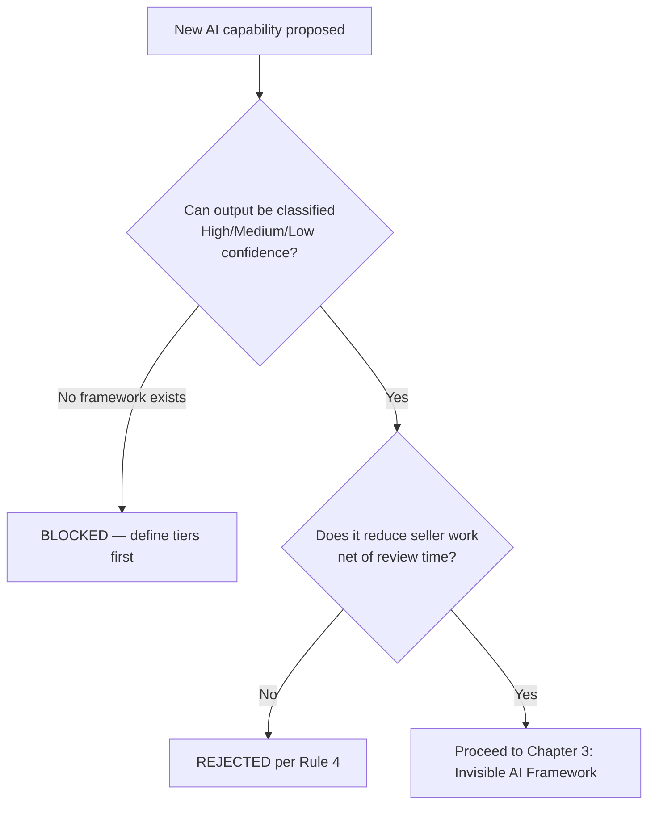
```mermaid
flowchart TD
  A[New AI capability proposed] --> B{Can output be classified<br/>High/Medium/Low confidence?}
  B -->|No framework exists| C[BLOCKED — define tiers first]
  B -->|Yes| D{Does it reduce seller work<br/>net of review time?}
  D -->|No| E[REJECTED per Rule 4]
  D -->|Yes| F[Proceed to Chapter 3: Invisible AI Framework]
```

**Examples**
Category inference during onboarding (Product Bible Chapter 6) is 100% invisible — a seller never sees "AI detected your category," they just see a pre-filled, editable chip. A price suggestion is 5%-branded — it surfaces explicitly with the Bell Mark because price is consequential enough to warrant a visible moment.

**Edge Cases**
A feature that seems to reduce work in aggregate but creates a small amount of *new*, unfamiliar work (e.g., learning to use a new confirmation UI) must weigh that novelty cost honestly — the first few uses of any new AI feature carry a learning tax that should be minimized by design (Chapter 4: AI UX Rules), not ignored.

**Anti-patterns**
- ❌ Building an AI feature and retrofitting a confidence tier onto it after the fact — tiers are decided at design time, not bolted on.
- ❌ Justifying an AI feature's existence by its technical novelty rather than its work-reduction proof (Rule 4).

**Implementation Notes**
This chapter is the literal first read for anyone (human or agent) building a new AI capability — before Chapter 10 (Prompt Architecture), before any code.

**Acceptance Criteria**
- [ ] Every AI feature spec states its answer to Rule 4 explicitly, with a stated net-time argument.
- [ ] Zero AI features ship without an assigned confidence-tier framework (Chapter 13).

**Future Expansion**
As AI capability grows (video, agents — Chapters 19, 36), this philosophy is the one thing that must never dilute — more powerful AI should make the 95% invisible tier *larger*, not shift the balance toward more branded surfacing "because now there's more to show off."

---

# 2. AI Principles

**Purpose**
Translate the Philosophy (Chapter 1) into specific, checkable engineering principles.

**Rules**
1. **Every AI action is attributable.** Every piece of AI-generated or AI-influenced content traces to a specific model call, prompt version (Chapter 10), and confidence score, logged in the AI Activity Log (Engineering Handbook Chapter 17) — nothing "just happens" untraceably.
2. **Every AI action is reversible or confirmable.** Per the confidence tiers (Chapter 13): High-tier invisible actions are always editable after the fact; Medium-tier actions require confirm before taking effect; nothing AI does is a one-way door without at least one of these two safety valves.
3. **AI never pretends to certainty it doesn't have.** A low-confidence inference is suppressed, not dressed up as a confident answer (Chapter 15: Hallucination Prevention).
4. **AI speaks as CowQ, not as itself.** No AI persona, no chatbot name, no "I think..." — AI-originated UI copy follows the exact same Brand Voice as the rest of the product (Design DNA §38), stated in CowQ's voice, never a separate AI character's voice.
5. **AI compounds with use, but never at the cost of a first-time seller's experience.** Personalization (Chapters 6, 7, 8) makes AI *better* the longer a seller uses CowQ — but a brand-new seller's first AI interaction must still be excellent on defaults alone, never degraded while "waiting to learn."

**Architecture**
These five principles map directly onto specific subsystems documented later in this Playbook: Principle 1 → AI Activity Log + Prompt Versioning (Chapters 10, 28); Principle 2 → Confidence System (Chapter 13); Principle 3 → Hallucination Prevention (Chapter 15); Principle 4 → Prompt Architecture voice constraints (Chapter 10); Principle 5 → Memory Architecture (Chapters 5–8).

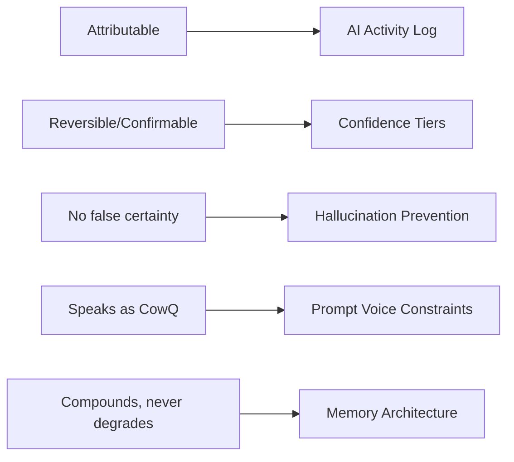
```mermaid
flowchart LR
  P1[Attributable] --> AAL[AI Activity Log]
  P2[Reversible/Confirmable] --> CT[Confidence Tiers]
  P3[No false certainty] --> HP[Hallucination Prevention]
  P4[Speaks as CowQ] --> PA[Prompt Voice Constraints]
  P5[Compounds, never degrades] --> MEM[Memory Architecture]
```

**Examples**
A seller's very first product photo generation uses CowQ's strong global defaults (no Brand Memory yet, Chapter 6) and still produces excellent, on-brand output — Principle 5 in action: personalization is additive, never a prerequisite for baseline quality.

**Edge Cases**
An AI action that's technically reversible in the database but whose real-world consequence isn't (e.g., an auto-posted social caption that's since been seen by real customers, even if later edited) needs to be treated with the caution of a non-reversible action in practice, even though the underlying data technically supports "undo" — the safety valve (Principle 2) must account for real-world, not just database-level, reversibility.

**Anti-patterns**
- ❌ An AI feature whose output quality depends entirely on Brand Memory being populated, with a poor cold-start experience for new sellers — violates Principle 5.
- ❌ Untraceable AI output — a generated listing with no record of which prompt version or model produced it, making a quality regression undiagnosable.

**Implementation Notes**
Principle 1 (attributability) should be a literal required field on every AI-generation database row (Chapter 5) — `prompt_version`, `model_id`, `confidence_score` — non-nullable.

**Acceptance Criteria**
- [ ] 100% of AI-generated content rows have non-null `prompt_version`, `model_id`, and `confidence_score` fields.
- [ ] Cold-start quality (no Brand Memory) is explicitly tested for every new generative feature before ship.

**Future Expansion**
As multi-model routing matures (Chapter 12), Principle 1's attributability becomes even more critical — knowing *which* model produced a given output is essential for debugging quality regressions across a growing model portfolio.

---

# 3. Invisible AI Framework

**Purpose**
Define the concrete, reusable technical framework that implements the 95% invisible tier — the machinery behind Chapter 1's central claim.

**Rules**
1. Every field, decision, or action that AI can plausibly handle starts its lifecycle attempting **silent, High-confidence inference** — this is the default assumption for any new input, not an opt-in.
2. An inference that clears the High-confidence threshold (Chapter 13) is applied directly to the underlying data, shown to the seller as an already-completed, editable state (a filled chip, a pre-populated field) — never as a question.
3. The framework is centrally implemented — a single `runInvisibleInference(actionType, context)` service — not reimplemented per feature, so tuning and auditing happen in one place.

**Architecture**
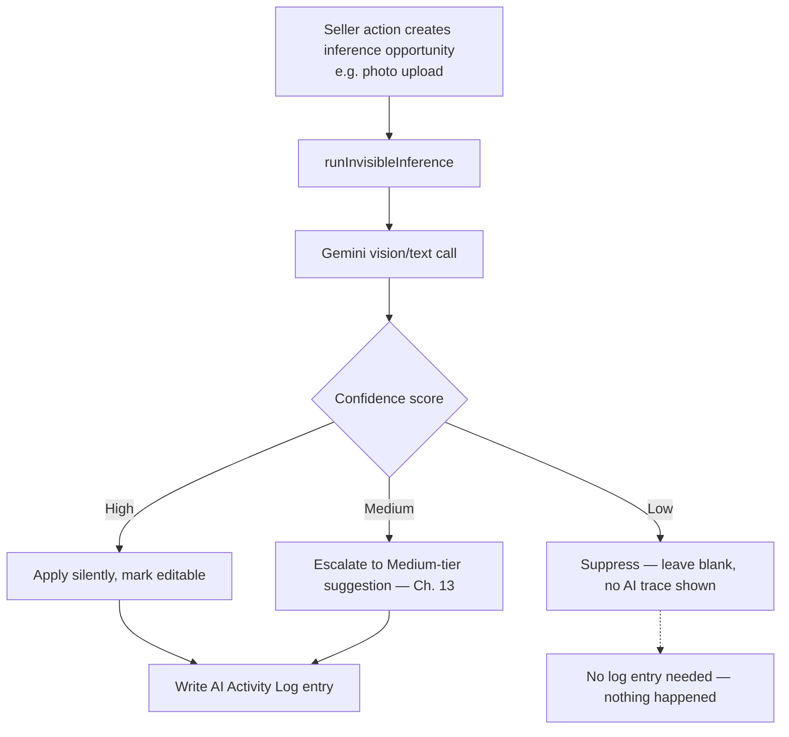
```mermaid
flowchart TD
  A[Seller action creates inference opportunity<br/>e.g. photo upload] --> B[runInvisibleInference]
  B --> C[Gemini vision/text call]
  C --> D{Confidence score}
  D -->|High| E[Apply silently, mark editable]
  D -->|Medium| F[Escalate to Medium-tier suggestion — Ch. 13]
  D -->|Low| G[Suppress — leave blank, no AI trace shown]
  E --> H[Write AI Activity Log entry]
  F --> H
  G -.-> I[No log entry needed — nothing happened]
```

**Examples**
Onboarding category detection (Product Bible Chapter 6): a shopfront photo triggers `runInvisibleInference('category_detection', { imageUrl })`; a 96% confidence result populates the category field silently as an editable chip; the seller never sees a loading spinner labeled "AI is thinking" for this specific action — it simply appears correct by the time the screen renders.

**Edge Cases**
A silent inference that's *wrong* but plausible-looking (e.g., a confidently-inferred but incorrect product category) is more dangerous than an obviously-wrong one, because a seller is less likely to notice and correct it — this is exactly why the High-confidence threshold (Chapter 13) must be tuned conservatively and monitored for real-world correction rates, not just raw model confidence scores.

**Anti-patterns**
- ❌ A feature that claims to be "invisible AI" but actually shows a brief loading state with AI-branded copy ("CowQ AI is analyzing...") — that's Medium/Branded tier dressed up as invisible; true invisible tier has zero AI-branded loading UI.
- ❌ Reimplementing inference-application logic per feature instead of using the shared `runInvisibleInference` service — creates inconsistent editability/logging behavior across features.

**Implementation Notes**
`runInvisibleInference` lives in the AI Architecture layer described in Engineering Handbook Chapter 17, extended here with the explicit rule that its Low-confidence path performs **zero** UI-visible action — not even a subtle placeholder hint that AI "tried."

**Acceptance Criteria**
- [ ] Zero AI-branded loading UI appears for any High-confidence-tier invisible inference.
- [ ] Every invisible inference is applied as an editable, not locked, field.

**Future Expansion**
As the confidence-threshold tuning system (Chapter 13) matures with more real correction-rate data, the invisible tier's *scope* should grow — more action types should graduate into eligibility for silent inference over time, not stay fixed at launch scope.

---

# 4. AI UX Rules

**Purpose**
Define exactly how AI presents itself in the UI when it does surface — the 5% Branded tier's concrete rules, cross-referencing but not duplicating the Design DNA's §54 (AI Experience DNA).

**Rules**
1. **One visual signature, always.** The Bell Mark (Design DNA §15, §21) is the *only* AI-branding element in the entire product — no sparkle icons, no "AI" badges, no chatbot avatars, ever.
2. **Two choices, never more.** Every Medium-tier AI suggestion offers exactly `primary accept` / `ghost dismiss` — never a third option, never an open-ended "customize" that turns a quick decision into a task (violates Chapter 1 Rule 4).
3. **One suggestion at a time, per screen.** AI suggestions queue silently and surface one at a time — never stacked, never competing for attention (Design DNA §35's calm mandate applied to AI specifically).
4. **State, don't ask.** AI suggestion copy is always a statement of what CowQ already did or found ("CowQ noticed X — do Y?") — never an open question the AI itself could have answered.

**Architecture**
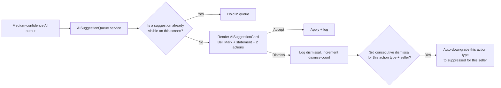
```mermaid
flowchart LR
  A[Medium-confidence AI output] --> B[AISuggestionQueue service]
  B --> C{Is a suggestion already<br/>visible on this screen?}
  C -->|Yes| D[Hold in queue]
  C -->|No| E[Render AISuggestionCard<br/>Bell Mark + statement + 2 actions]
  E -->|Accept| F[Apply + log]
  E -->|Dismiss| G[Log dismissal, increment dismiss-count]
  G --> H{3rd consecutive dismissal<br/>for this action type + seller?}
  H -->|Yes| I[Auto-downgrade this action type<br/>to suppressed for this seller]
```

**Examples**
"CowQ noticed 3 products haven't been updated in 60 days — refresh their photos with your latest style?" (Design DNA §54.5's exact example) is the canonical AI UX copy pattern: statement of finding, one clear yes/no action pair.

**Edge Cases**
A seller who dismisses the same suggestion type three times in a row (Design DNA §54.5 Rule 2) triggers the auto-downgrade — this must be tracked per seller, per action type, not globally, since one seller's disinterest in a suggestion type says nothing about another seller's preference.

**Anti-patterns**
- ❌ A suggestion card with three or more buttons ("Accept," "Edit first," "Not now," "Never show again") — cognitive overload that violates Rule 2.
- ❌ Two AI suggestion cards visible simultaneously on one screen — violates Rule 3 and the Design DNA's calm mandate.

**Implementation Notes**
The `AISuggestionQueue` service is a shared, cross-feature singleton (per active session/screen) — no individual feature manages its own suggestion visibility independently, which is what makes the one-at-a-time rule (Rule 3) actually enforceable system-wide rather than per-feature.

**Acceptance Criteria**
- [ ] Zero screens ever render two AI suggestion cards simultaneously, verified in QA.
- [ ] Every AI suggestion card has exactly two actions, verified via component audit.

**Future Expansion**
As more AI capability ships, the suggestion queue's prioritization logic (which suggestion surfaces first when multiple are pending) should become smarter — currently simple FIFO is sufficient; a priority-scoring system becomes worth building once suggestion volume per seller grows meaningfully.

---

# 5. AI Memory Architecture

**Purpose**
Define the overarching memory system architecture that Chapters 6–8 (Brand, Business, Customer Memory) each specialize.

**Rules**
1. CowQ's AI memory is **three distinct, purpose-scoped systems**, never one undifferentiated "AI memory" blob: **Brand Memory** (a seller's voice/style, Chapter 6), **Business Memory** (a seller's operational patterns — pricing philosophy, inventory behavior, Chapter 7), and **Customer Memory** (patterns about a seller's customer base, strictly scoped per Chapter 12 of the Product Bible's privacy rules, Chapter 8 here).
2. Every memory system is **visible and editable** by the seller (Design DNA §54.2 Rule 2) — no memory system at CowQ is a black box, structurally, ever.
3. Memory updates **incrementally, from real behavior**, never requiring an explicit "train me" step (Chapter 1's "infer first" applied to personalization itself).

**Architecture**
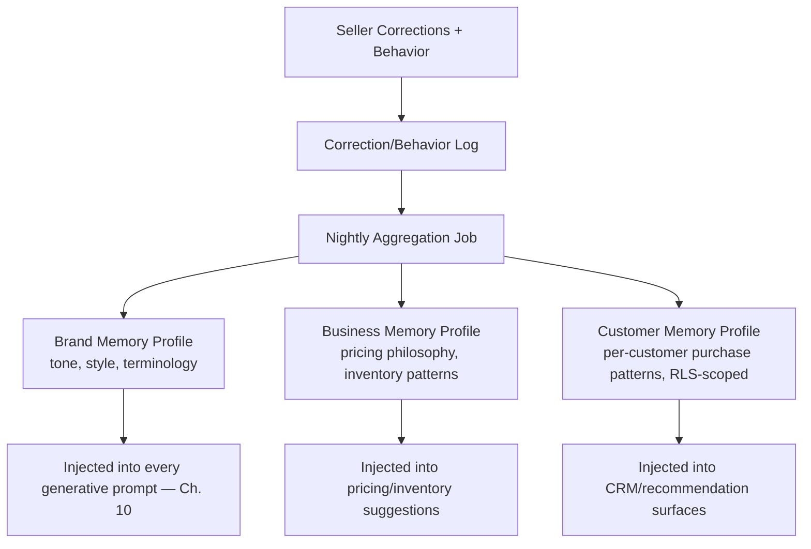
```mermaid
flowchart TD
  A[Seller Corrections + Behavior] --> B[Correction/Behavior Log]
  B --> C[Nightly Aggregation Job]
  C --> D1[Brand Memory Profile<br/>tone, style, terminology]
  C --> D2[Business Memory Profile<br/>pricing philosophy, inventory patterns]
  C --> D3[Customer Memory Profile<br/>per-customer purchase patterns, RLS-scoped]
  D1 --> E[Injected into every generative prompt — Ch. 10]
  D2 --> F[Injected into pricing/inventory suggestions]
  D3 --> G[Injected into CRM/recommendation surfaces]
```

**Examples**
See Chapters 6–8 for full detail per memory type — this chapter's job is establishing that they're architecturally siblings, not one system, because they have genuinely different privacy scoping (Customer Memory is RLS-bound per customer relationship, Brand/Business Memory are wholly seller-owned) and different consumption patterns (Brand Memory feeds text/image generation; Business Memory feeds pricing/inventory suggestions; Customer Memory feeds CRM).

**Edge Cases**
A seller's Brand Memory and Business Memory can, in principle, be in tension (e.g., Brand Memory says "warm, generous tone" while Business Memory's pricing philosophy is aggressively margin-protective) — when a generative prompt needs both, Brand Memory governs *voice*, Business Memory governs *substance*; they should never be merged into one undifferentiated context blob that risks producing contradictory output.

**Anti-patterns**
- ❌ Storing all three memory types in one generic `seller_memory` table with a `type` column and unstructured `jsonb` — loses the distinct RLS/privacy scoping Customer Memory specifically requires (Chapter 8), and makes each type harder to reason about independently.
- ❌ A memory system that only updates on an explicit seller action (e.g., filling out a "brand voice" form) — violates Rule 3.

**Implementation Notes**
Three distinct tables (`brand_memory_profiles`, `business_memory_profiles`, `customer_memory_profiles`), each with their own RLS policy (the third notably stricter, per Chapter 8), is the correct schema-level implementation of Rule 1.

**Acceptance Criteria**
- [ ] All three memory types exist as distinct, independently-schemad tables.
- [ ] Every memory field is visible in a corresponding seller-facing screen (Chapter 6's "What CowQ knows" pattern, extended to all three).

**Future Expansion**
As Business Memory (Chapter 7) matures, consider whether a fourth memory type — **Market Memory** (patterns aggregated *across* sellers, feeding Marketplace Intelligence, Chapter 34) — becomes warranted; this is explicitly not built today, since it requires careful cross-seller privacy design (never leaking one seller's specific data into another's suggestions) before it can exist safely.

---

# 6. Brand Memory

**Purpose**
Full specification of Brand Memory — the personalization layer governing tone, style, and terminology (Engineering Handbook Chapter 20, Design DNA §54.2), detailed here at full AI-behavioral depth.

**Rules**
1. Brand Memory tracks: `tone`, `preferredTerms[]`, `avoidedTerms[]`, `photoStyleNotes`, and is injected into **every** text-generation and image-generation prompt for that seller automatically (Chapter 10).
2. Updates come from real correction patterns — a seller editing 3+ similar AI outputs the same way (e.g., consistently removing exclamation points) triggers a proposed Brand Memory update.
3. Proposed updates below a significance threshold apply silently (High-confidence tier, Chapter 3); updates that would meaningfully change tone surface as a Medium-tier confirmation ("CowQ noticed you often use 'handcrafted' instead of 'handmade' — update your brand memory?").

**Architecture**
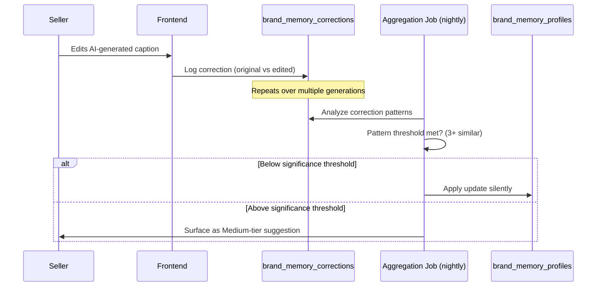
```mermaid
sequenceDiagram
  participant S as Seller
  participant UI as Frontend
  participant Log as brand_memory_corrections
  participant Job as Aggregation Job (nightly)
  participant BM as brand_memory_profiles
  S->>UI: Edits AI-generated caption
  UI->>Log: Log correction (original vs edited)
  Note over Log: Repeats over multiple generations
  Job->>Log: Analyze correction patterns
  Job->>Job: Pattern threshold met? (3+ similar)
  alt Below significance threshold
    Job->>BM: Apply update silently
  else Above significance threshold
    Job->>S: Surface as Medium-tier suggestion
  end
```

**Examples**
See Engineering Handbook Chapter 20's full code example — this chapter adds the AI-behavioral specification: the significance threshold that decides silent-apply vs. confirm-required is itself a tunable config value (Chapter 13's confidence-tuning discipline applied to memory updates specifically, not just generation confidence).

**Edge Cases**
A seller whose brand voice genuinely changes (rebrand, seasonal shift) needs Brand Memory correction to be *fast* — if the aggregation job only runs nightly and requires a 3+ pattern before updating, a seller actively trying to shift their voice today experiences a full day-plus lag; the seller-facing "What CowQ knows about your brand" screen's manual-edit capability (Design DNA §54.2) exists specifically to bypass this lag when the seller wants an immediate, deliberate change.

**Anti-patterns**
- ❌ Applying every single correction immediately as a Brand Memory update without any pattern threshold — overreacts to one-off edits that don't represent a real preference.
- ❌ A caption-generation prompt that doesn't inject Brand Memory "because it's a quick feature" — every generative text/image feature must justify an exemption explicitly (Chapter 10 Rule 2), not default to skipping it.

**Implementation Notes**
See Engineering Handbook Chapter 20 for the complete schema and code. This chapter's addition: the aggregation job's significance-threshold logic should log its own reasoning (which corrections triggered a proposed update, and why it crossed or didn't cross the silent/confirm line) to support debugging why Brand Memory did or didn't update as a seller might expect.

**Acceptance Criteria**
- [ ] Every generative text/image prompt for a seller with an existing Brand Memory profile demonstrably reflects it (spot-checked per release).
- [ ] The significance threshold is a versioned, tunable config value, not hardcoded inline in the aggregation job.

**Future Expansion**
Brand Memory should extend from text-tone into visual composition preferences (Engineering Handbook Chapter 20's future consideration) — e.g., a seller who consistently prefers bright, white-background photos over moody, dark ones, feeding directly into image-generation prompt construction (Chapter 18).

---

# 7. Business Memory

**Purpose**
Define Business Memory — the personalization layer governing a seller's operational patterns (pricing philosophy, inventory behavior, fulfillment preferences) — a genuinely new specification not yet detailed in prior sibling documents.

**Rules**
1. Business Memory tracks patterns distinct from brand *voice*: `pricingPhilosophy` (e.g., margin-protective vs. volume-driven, inferred from historical pricing decisions and corrections to AI price suggestions), `inventoryBehaviorNotes` (e.g., a seller who consistently restocks fast-movers vs. one who lets items go out of stock), and `fulfillmentPatternNotes`.
2. Business Memory feeds AI features in Chapters 33–35 (Recommendations, Marketplace Intelligence, Automation) — it is the substrate for "AI that understands how *this* seller runs their business," distinct from Brand Memory's "how this seller *sounds*."
3. Like Brand Memory, updates are incremental and inferred from behavior — never an explicit onboarding questionnaire.

**Architecture**
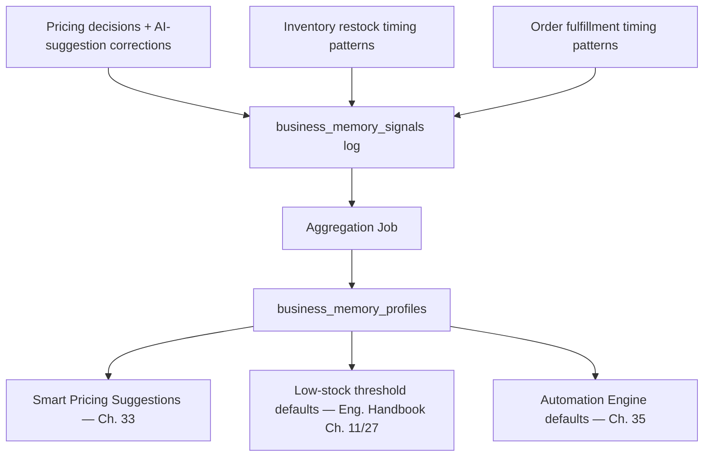
```mermaid
flowchart TD
  A[Pricing decisions + AI-suggestion corrections] --> B[business_memory_signals log]
  C[Inventory restock timing patterns] --> B
  D[Order fulfillment timing patterns] --> B
  B --> E[Aggregation Job]
  E --> F[business_memory_profiles]
  F --> G[Smart Pricing Suggestions — Ch. 33]
  F --> H[Low-stock threshold defaults — Eng. Handbook Ch. 11/27]
  F --> I[Automation Engine defaults — Ch. 35]
```

**Examples**
A seller who has consistently accepted AI price suggestions at or near the low end of a suggested range (rather than the high end) has their `pricingPhilosophy` inferred as volume-driven; future price suggestions for this seller are weighted accordingly, rather than defaulting to a generic "similar items nearby" midpoint every time.

**Edge Cases**
A seller whose product mix genuinely spans different pricing philosophies (e.g., loss-leader entry products alongside premium flagship items) shouldn't have Business Memory flatten this into one global "pricing philosophy" — per-category or per-product-tier nuance should be supported in the schema (Chapter 7's future expansion), even if the initial implementation starts with a single global profile per seller for simplicity.

**Anti-patterns**
- ❌ Conflating Business Memory with Brand Memory in one table (Chapter 5's explicit anti-pattern, restated here specifically) — pricing philosophy and brand tone genuinely need to be reasoned about, tuned, and potentially exposed to the seller separately.
- ❌ Inferring Business Memory patterns from too small a sample (e.g., one pricing decision) — requires a defined minimum signal count before any inference is drawn, mirroring Brand Memory's pattern-threshold discipline (Chapter 6).

**Implementation Notes**
```sql
create table business_memory_profiles (
  seller_id uuid primary key references sellers(id),
  pricing_philosophy text, -- 'margin_protective' | 'volume_driven' | 'mixed'
  inventory_behavior_notes text,
  fulfillment_pattern_notes text,
  updated_at timestamptz not null default now()
);
```

**Acceptance Criteria**
- [ ] Business Memory is visible and editable in a seller-facing screen, mirroring Brand Memory's transparency standard (Chapter 5 Rule 2).
- [ ] Minimum signal-count threshold is enforced before any Business Memory field is inferred from behavior.

**Future Expansion**
Per-category/per-product-tier Business Memory (this chapter's noted edge case) is the natural next evolution once the single-profile-per-seller version is proven — tracked explicitly as a planned schema extension, not an afterthought.

---

# 8. Customer Memory

**Purpose**
Define Customer Memory — AI-surfaced patterns about a seller's customer base — the most privacy-sensitive of the three memory types, requiring the strictest architectural discipline.

**Rules**
1. Customer Memory is **strictly scoped to the seller-customer order relationship** (Product Bible Chapter 47, Engineering Handbook Chapter 12) — a seller's Customer Memory contains insight only about customers who have actually transacted with *that specific seller*, never inferred or borrowed from a customer's activity on other CowQ sellers' shops.
2. Customer Memory feeds CRM synthesis (Product Bible Chapter 32: "who are my best customers," computed automatically) — it is explicitly not a tool for cross-seller customer profiling or ad targeting.
3. Customer Memory is never used to power any feature that could function as covert customer surveillance — every use of Customer Memory must be visible to and beneficial for the seller's own legitimate relationship management with their own customers, and by extension respectful of the customer's reasonable privacy expectations (Product Bible Chapter 47).

**Architecture**
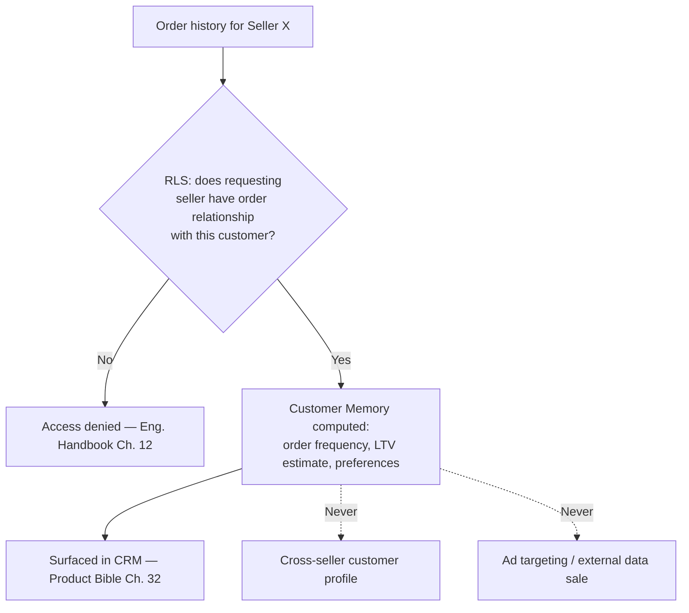
```mermaid
flowchart TD
  A[Order history for Seller X] --> B{RLS: does requesting<br/>seller have order relationship<br/>with this customer?}
  B -->|No| C[Access denied — Eng. Handbook Ch. 12]
  B -->|Yes| D[Customer Memory computed:<br/>order frequency, LTV estimate, preferences]
  D --> E[Surfaced in CRM — Product Bible Ch. 32]
  D -.->|Never| F[Cross-seller customer profile]
  D -.->|Never| G[Ad targeting / external data sale]
```

**Examples**
A repeat customer's estimated lifetime value and purchase pattern (Product Bible Chapter 32's example) is computed entirely from that customer's order history *with this one seller* — a customer who also shops at three other CowQ sellers has three entirely separate, non-cross-referenced Customer Memory computations, one per seller relationship.

**Edge Cases**
A seller exporting their customer list (Product Bible Chapter 47's edge case) uses data that includes Customer Memory-derived insights (e.g., "high LTV") — this export requires the same visible, logged consent trail already mandated for raw customer data export; Customer Memory-derived insights are not exempt from that consent requirement just because they're AI-computed rather than raw data.

**Anti-patterns**
- ❌ Any code path that joins Customer Memory data across sellers, even for an internal, well-intentioned purpose (e.g., "help identify high-value customers platform-wide for a promotion") — this is a permanent, non-negotiable guardrail, not a case-by-case judgment call.
- ❌ Using Customer Memory to power marketplace-wide personalization (Chapter 34) without explicit, separate architecture ensuring no seller-specific customer data leaks into a cross-seller-visible surface.

**Implementation Notes**
```sql
-- Customer Memory is a VIEW, not a separate stored table, computed on-read
-- from orders + customers, inheriting the exact RLS boundary already
-- established in Engineering Handbook Ch. 12 — this is a deliberate
-- architectural choice: no separate storage means no separate leak surface.
create view customer_memory as
  select
    o.seller_id,
    o.customer_id,
    count(*) as order_count,
    sum(o.total_cents) as lifetime_value_cents,
    max(o.created_at) as last_order_at
  from orders o
  group by o.seller_id, o.customer_id;
-- RLS on the underlying `orders` table (Ch. 12) automatically scopes this view.
```

**Acceptance Criteria**
- [ ] Customer Memory is implemented as a computed view over RLS-protected base tables, never a separately-stored, separately-secured table that could drift out of sync with the RLS boundary.
- [ ] Zero code paths exist that join Customer Memory across sellers, verified via codebase audit.

**Future Expansion**
As Marketplace Intelligence (Chapter 34) matures, any *aggregate*, anonymized, cross-seller customer-behavior insight (e.g., "customers in this category typically buy again within 45 days," useful platform-wide) must be built as a genuinely separate, explicitly-anonymized system — never a relaxation of Customer Memory's per-seller scoping.

---

# 9. Context Engine

**Purpose**
Define the system that assembles the *right* context (Brand Memory, Business Memory, recent activity, current screen state) for any given AI call — the connective infrastructure underlying Chapters 5–8's memory systems and Chapter 10's prompts.

**Rules**
1. Every AI call goes through a single `buildContext(sellerId, actionType)` function that assembles exactly the relevant memory and situational context for that specific action type — never a "dump everything we know" approach that bloats prompts and risks context confusion.
2. Context assembly is explicit and typed per action type — a `ContextRequirements` map states exactly which memory types and situational data a given `actionType` needs, so context-building is auditable and doesn't silently drift.
3. Context assembly happens server-side, inside the Edge Function (Engineering Handbook Chapter 18) — the client never assembles or transmits AI context directly, both for security (Chapter 39) and consistency.

**Architecture**
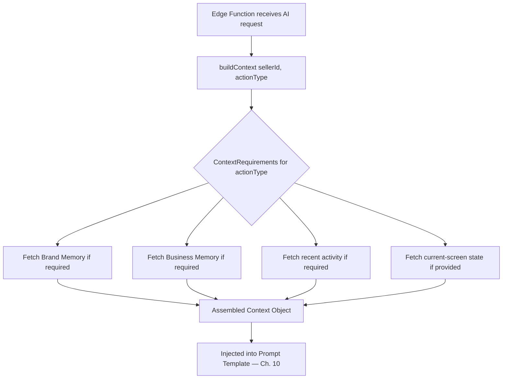
```mermaid
flowchart TD
  A[Edge Function receives AI request] --> B[buildContext sellerId, actionType]
  B --> C{ContextRequirements for actionType}
  C --> D1[Fetch Brand Memory if required]
  C --> D2[Fetch Business Memory if required]
  C --> D3[Fetch recent activity if required]
  C --> D4[Fetch current-screen state if provided]
  D1 --> E[Assembled Context Object]
  D2 --> E
  D3 --> E
  D4 --> E
  E --> F[Injected into Prompt Template — Ch. 10]
```

**Examples**
`generate-listing-copy`'s `ContextRequirements` specifies `{ brandMemory: true, businessMemory: false, recentActivity: false }` — it needs tone/terminology but not pricing philosophy or recent order patterns. `smart-pricing-suggestion`'s requirements are the inverse: `{ brandMemory: false, businessMemory: true, recentActivity: true }`.

**Edge Cases**
An action type whose context requirements change over time (e.g., a future version of listing-copy generation that also wants pricing context to write price-anchored copy) requires an explicit, reviewed update to its `ContextRequirements` entry — never an ad hoc addition of a new context fetch inline in the handler that bypasses the central, auditable requirements map.

**Anti-patterns**
- ❌ A prompt-construction function that independently decides what context to fetch, inconsistent with the central `ContextRequirements` map — creates silent drift between what's documented and what's actually happening.
- ❌ Passing the seller's *entire* memory profile (all fields, all types) into every single prompt regardless of relevance — bloats token usage (Chapter 23: cost optimization) and can dilute prompt focus.

**Implementation Notes**
```typescript
// supabase/functions/_shared/context/buildContext.ts
const CONTEXT_REQUIREMENTS: Record<AIActionType, ContextRequirements> = {
  generate_listing_copy: { brandMemory: true, businessMemory: false, recentActivity: false },
  smart_pricing_suggestion: { brandMemory: false, businessMemory: true, recentActivity: true },
  brand_model_portrait: { brandMemory: true, businessMemory: false, recentActivity: false },
};

export async function buildContext(sellerId: string, actionType: AIActionType): Promise<AIContext> {
  const requirements = CONTEXT_REQUIREMENTS[actionType];
  const [brandMemory, businessMemory, recentActivity] = await Promise.all([
    requirements.brandMemory ? getBrandMemory(sellerId) : null,
    requirements.businessMemory ? getBusinessMemory(sellerId) : null,
    requirements.recentActivity ? getRecentActivity(sellerId) : null,
  ]);
  return { brandMemory, businessMemory, recentActivity };
}
```

**Acceptance Criteria**
- [ ] Every AI action type has an explicit entry in `CONTEXT_REQUIREMENTS` — no action type fetches context outside this declared map.
- [ ] Context assembly is verified to happen exclusively server-side, never client-transmitted.

**Future Expansion**
As Customer Memory (Chapter 8) becomes relevant to more action types (e.g., a future customer-reply-drafting feature), it should be added to `ContextRequirements` as a fourth context dimension, with its own RLS-respecting fetch function, following the exact same pattern established here.

---

# 10. Prompt Architecture

**Purpose**
Define the structural rules for how every prompt at CowQ is built, versioned, and constrained — extending Engineering Handbook Chapter 19 with full AI-behavioral depth.

**Rules**
1. Prompts are never inline strings — every prompt lives in a dedicated, versioned template file (Engineering Handbook Chapter 19 Rule 1), consumed by the Context Engine (Chapter 9) and the shared model-calling client (Chapter 12).
2. Every prompt template has four mandatory sections, in this order: **Role/Context** (who is CowQ, who is the seller, what's the situation), **Task** (exactly what to produce), **Constraints** (voice, format, length, safety — Chapters 4, 15, 16), **Output Schema** (structured JSON where the result feeds a UI component, per Engineering Handbook Chapter 18).
3. Every prompt that produces seller- or customer-facing content injects Brand Memory (Chapter 6) unless explicitly, reviewedly exempted.

**Architecture**
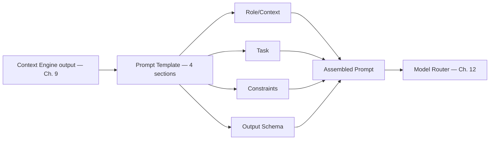
```mermaid
flowchart LR
  A[Context Engine output — Ch. 9] --> B[Prompt Template — 4 sections]
  B --> C[Role/Context]
  B --> D[Task]
  B --> E[Constraints]
  B --> F[Output Schema]
  C --> G[Assembled Prompt]
  D --> G
  E --> G
  F --> G
  G --> H[Model Router — Ch. 12]
```

**Examples**
```typescript
// The four-section structure, applied to listing copy generation
export const LISTING_COPY_PROMPT_V3 = (ctx: AIContext, analysis: ImageAnalysis) => `
[ROLE/CONTEXT]
You are generating a product listing for an Indian small-business seller on CowQ.
Product analysis: ${JSON.stringify(analysis)}

[TASK]
Write a title and description for this product, and suggest a price.

[CONSTRAINTS]
Tone: ${ctx.brandMemory?.tone ?? 'warm, plain, confident'}
Preferred terms: ${ctx.brandMemory?.preferredTerms?.join(', ') ?? 'none specified'}
Avoid: ${ctx.brandMemory?.avoidedTerms?.join(', ') ?? 'exclamation points, superlatives without basis'}
Sentence case. No emoji. Under 3 sentences for the description.

[OUTPUT SCHEMA]
Return JSON only: { "title": string, "description": string, "suggestedPriceCents": number }
`;
```

**Edge Cases**
A prompt whose Constraints section would exceed a reasonable token budget when Brand Memory is highly detailed (a long-tenured seller with a rich, many-field profile) needs a defined truncation/summarization strategy — Brand Memory injection should prioritize the highest-signal fields first if a token budget forces trimming, not be silently truncated arbitrarily.

**Anti-patterns**
- ❌ A prompt missing the Constraints section entirely, relying on the model's default behavior for tone/format — this is exactly how off-brand, generic-sounding AI output happens.
- ❌ Freeform text output for anything that feeds a typed UI component — always request structured JSON output (Engineering Handbook Chapter 18) for these cases.

**Implementation Notes**
Prompt files are named with an explicit version suffix (`_V3` above) and never edited in place once in production use — a meaningful prompt change is a new version, deployed alongside the old one during any transition period (mirroring Engineering Handbook Chapter 46's API versioning discipline).

**Acceptance Criteria**
- [ ] Every prompt template has all four sections present and clearly delineated.
- [ ] Every prompt template is version-suffixed; zero in-place edits to a production prompt file, verified via git history review.

**Future Expansion**
As regional-language generation ships (Design DNA §62), prompt templates need locale-specific variants that are genuinely composed in the target language within the Task/Constraints sections — not a single English template with a "respond in Hindi" instruction appended, per the explicit standard already set.

---

# 11. Prompt Templates

**Purpose**
Provide the canonical, reusable library of CowQ's core prompt templates — the concrete artifacts implementing Chapter 10's structure.

**Rules**
1. This chapter's templates are the *only* sanctioned starting points for their respective action types — a new feature needing similar functionality extends or references these, never reinvents from scratch.
2. Every template in this library is reviewed against Design DNA §38 (Brand Voice) and §39 (Microcopy) before being added here.

**Architecture**
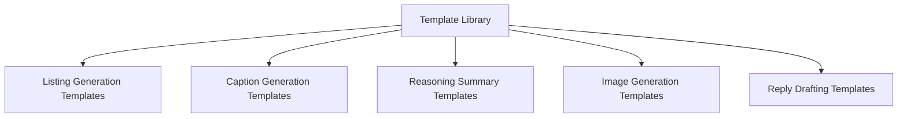
```mermaid
flowchart TD
  A[Template Library] --> B[Listing Generation Templates]
  A --> C[Caption Generation Templates]
  A --> D[Reasoning Summary Templates]
  A --> E[Image Generation Templates]
  A --> F[Reply Drafting Templates]
```

**Examples — The Core Template Library**

```typescript
// 1. Listing Copy (see Chapter 10 for full example)
export const LISTING_COPY_PROMPT_V3 = (ctx, analysis) => `...`;

// 2. Social Caption
export const SOCIAL_CAPTION_PROMPT_V2 = (ctx: AIContext, product: Product, platform: 'instagram' | 'whatsapp') => `
[ROLE/CONTEXT]
You are writing a social caption for a CowQ seller's product, for ${platform}.
Product: ${product.name} — ${product.description}

[TASK]
Write one caption, under 280 characters, that would make someone want to see this product.

[CONSTRAINTS]
Tone: ${ctx.brandMemory?.tone ?? 'warm, plain, confident'}
No hashtag spam (max 3 relevant hashtags). No emoji unless the seller's own brand voice uses them.

[OUTPUT SCHEMA]
Return JSON only: { "caption": string, "hashtags": string[] }
`;

// 3. Price Reasoning Summary (Design DNA §54.7 constrained-output standard)
export const PRICE_REASONING_PROMPT_V1 = (ctx: PricingContext) => `
[ROLE/CONTEXT]
You are explaining a price suggestion to a small-business owner in plain language.
Context: ${JSON.stringify(ctx)}

[TASK]
Explain why you're suggesting this price, in language a business owner would say to a friend.

[CONSTRAINTS]
Maximum 3 factors. No ML/technical jargon (no "embedding," "similarity score," etc). One short sentence per factor.

[OUTPUT SCHEMA]
Return JSON only: { "factors": string[] } (array length 1-3)
`;

// 4. Category/Attribute Inference (invisible tier, Ch. 3)
export const CATEGORY_INFERENCE_PROMPT_V2 = (imageAnalysis: ImageAnalysis) => `
[ROLE/CONTEXT]
You are classifying a small business's product/shop photo into CowQ's fixed taxonomy.
Analysis: ${JSON.stringify(imageAnalysis)}
Taxonomy: ${JSON.stringify(FIXED_CATEGORY_TAXONOMY)} -- Design DNA §51.7, never invent a new category

[TASK]
Select the single best-fit category and subcategory from the taxonomy above.

[OUTPUT SCHEMA]
Return JSON only: { "category": string, "subcategory": string | null, "confidence": number }
`;
```

**Edge Cases**
The `CATEGORY_INFERENCE_PROMPT` explicitly passes the fixed taxonomy into the prompt and instructs against inventing new categories — this is a direct, prompt-level enforcement of Design DNA §51.7's rule that sellers never create top-level categories; even AI-driven category assignment must respect that constraint, not just human-driven assignment.

**Anti-patterns**
- ❌ A new feature writing its own listing-copy-adjacent prompt from scratch instead of extending `LISTING_COPY_PROMPT_V3` — creates voice/quality drift between similar features.
- ❌ A template that requests unstructured text where the caller actually needs to parse specific fields out of it via regex — always use Output Schema instead.

**Implementation Notes**
This chapter's template library should be kept in exact sync with the actual `supabase/functions/_shared/prompts/` folder (Engineering Handbook Chapter 19) — any prompt used in production that isn't documented here is a documentation gap to close, not an acceptable permanent state.

**Acceptance Criteria**
- [ ] Every production prompt template has a corresponding entry in this chapter.
- [ ] Every new prompt is checked against this library first, for extension rather than duplication, at code review.

**Future Expansion**
As video (Chapter 19) and voice (Chapter 20) generation ship, this library extends with their respective template categories — following the identical four-section structure (Chapter 10) without exception.

---

# 12. Model Routing

**Purpose**
Define how CowQ decides which AI model handles a given request — currently a simple, mostly-single-vendor routing table, architected to extend cleanly as multi-model strategy (Chapter 38) matures.

**Rules**
1. Model selection is centralized in a single `ModelRouter` service — no Edge Function decides "which model to call" inline; it asks the router.
2. Today's routing table is simple and explicit: Gemini for vision analysis, text generation, and image generation; Kling 2.6 Pro via fal.ai for video generation (Product Bible Chapter 22's documented vendor rationale) — but the router's *interface* is designed to be provider-agnostic from day one, even while only one provider exists per capability.
3. Routing decisions are logged (action type → model/version used) as part of the AI Activity Log's attributability requirement (Chapter 2 Principle 1).

**Architecture**
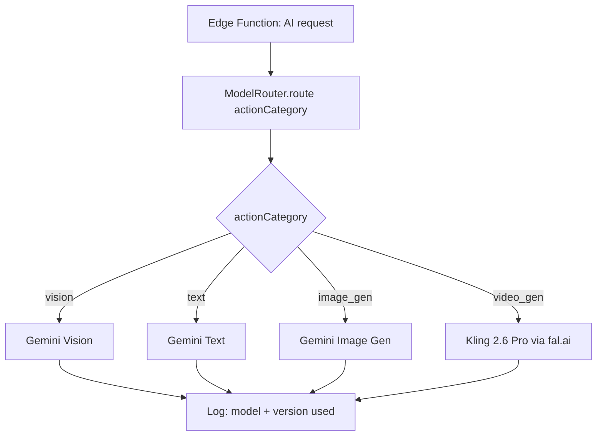
```mermaid
flowchart TD
  A[Edge Function: AI request] --> B[ModelRouter.route actionCategory]
  B --> C{actionCategory}
  C -->|vision| D[Gemini Vision]
  C -->|text| E[Gemini Text]
  C -->|image_gen| F[Gemini Image Gen]
  C -->|video_gen| G[Kling 2.6 Pro via fal.ai]
  D --> H[Log: model + version used]
  E --> H
  F --> H
  G --> H
```

**Examples**
```typescript
// supabase/functions/_shared/modelRouter.ts
type ActionCategory = 'vision' | 'text' | 'image_gen' | 'video_gen';

export class ModelRouter {
  async route<T>(category: ActionCategory, payload: unknown): Promise<T> {
    switch (category) {
      case 'vision':
      case 'text':
      case 'image_gen':
        return geminiClient.call(category, payload);
      case 'video_gen':
        return klingClient.call(payload);
    }
  }
}
```

**Edge Cases**
A single logical action (e.g., generating a full product listing) may span multiple `ActionCategory` calls (vision analysis, then text generation) — the router handles each call independently, and the calling Edge Function is responsible for sequencing them (Engineering Handbook Chapter 16's pipeline pattern), not the router itself.

**Anti-patterns**
- ❌ An Edge Function directly instantiating `geminiClient` or `klingClient` instead of going through `ModelRouter` — bypasses the centralized logging and future-routing-flexibility this chapter establishes.
- ❌ Hardcoding model version strings inline at call sites — model versions should be centrally configured, so an upgrade is a one-line router change, not a repo-wide find-and-replace.

**Implementation Notes**
Even at today's single-provider-per-category scale, this router abstraction is deliberately over-engineered relative to strict current need — it's the specific piece of architecture that makes Chapter 38's multi-model future non-disruptive.

**Acceptance Criteria**
- [ ] Zero direct AI-vendor client instantiation outside `ModelRouter`, verified via codebase audit.
- [ ] Every routing decision is logged with model/version, queryable from the AI Activity Log.

**Future Expansion**
As Chapter 38's multi-vendor redundancy consideration becomes real (e.g., a second vision/text provider for failover or cost optimization), `ModelRouter.route()` extends to accept a routing policy (cost-optimized, latency-optimized, quality-optimized) per call, still through this same single entry point.

---

# 13. AI Confidence System

**Purpose**
Fully specify the three-tier confidence system referenced throughout this Playbook — the mechanical heart of the Invisible AI Framework (Chapter 3).

**Rules**
1. Every AI output that isn't fully deterministic receives a confidence score (0–1) from the model call itself or a downstream scoring step.
2. Confidence is mapped to exactly three tiers via a **per-action-type, versioned threshold config** — never a single global threshold applied uniformly across unrelated action types.
3. Thresholds are tuned from real acceptance/correction data (Product Bible Chapter 51's AI Suggestion Acceptance Rate metric), reviewed at minimum quarterly, per action type.

**Architecture**
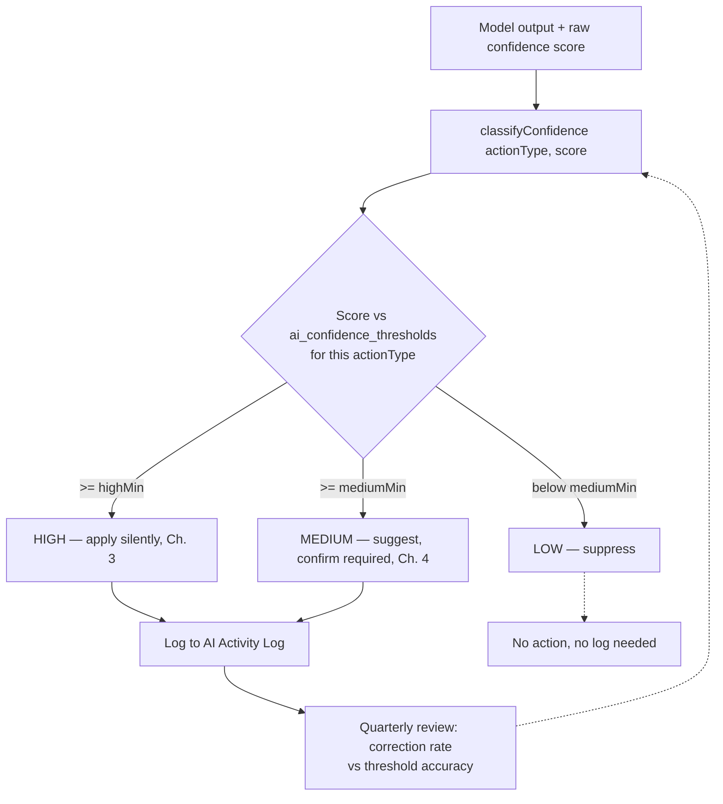
```mermaid
flowchart TD
  A[Model output + raw confidence score] --> B[classifyConfidence actionType, score]
  B --> C{Score vs ai_confidence_thresholds<br/>for this actionType}
  C -->|>= highMin| D[HIGH — apply silently, Ch. 3]
  C -->|>= mediumMin| E[MEDIUM — suggest, confirm required, Ch. 4]
  C -->|below mediumMin| F[LOW — suppress]
  D --> G[Log to AI Activity Log]
  E --> G
  F -.-> H[No action, no log needed]
  G --> I[Quarterly review: correction rate<br/>vs threshold accuracy]
  I -.-> B
```

**Examples**
```sql
create table ai_confidence_thresholds (
  action_type text primary key,
  high_min numeric not null,
  medium_min numeric not null,
  version integer not null default 1,
  updated_at timestamptz not null default now()
);

insert into ai_confidence_thresholds (action_type, high_min, medium_min) values
  ('category_detection', 0.90, 0.60),
  ('smart_pricing_suggestion', 0.85, 0.50),
  ('caption_generation', 0.80, 0.40);
```

**Edge Cases**
An action type whose real-world correction rate at the "High" tier exceeds 10% (Product Bible Chapter 54's stated recalibration trigger) must have its `high_min` threshold raised — this should ideally be flagged automatically by a scheduled analysis job comparing `ai_activity_log` outcomes against current thresholds, not rely on someone remembering to check quarterly.

**Anti-patterns**
- ❌ A single global `CONFIDENCE_THRESHOLD = 0.8` constant applied to every action type — different action types have genuinely different risk profiles (a wrong category guess is low-stakes; a wrong price suggestion is higher-stakes) and need independently-tuned thresholds.
- ❌ Displaying the raw numeric confidence score to the end user ("87% confident") — Design DNA §54.1 explicitly prohibits this; the three-tier *behavior* is the correct user-facing translation, never the raw number.

**Implementation Notes**
See Chapter 3's `runInvisibleInference` and Chapter 4's `AISuggestionQueue` for how each tier's classification result is consumed downstream.

**Acceptance Criteria**
- [ ] Every action type has its own threshold entry — zero action types fall back to an undefined global default.
- [ ] A scheduled job compares real correction rates against thresholds and flags recalibration candidates automatically.

**Future Expansion**
As personalization matures (Chapters 6–8), consider whether confidence thresholds should eventually be tunable *per seller*, not just per action type — a seller who has shown consistently high trust/low correction rates for a given action type might reasonably have a slightly more permissive threshold than a brand-new seller, though this is explicitly not built today given the added complexity.

---

# 14. AI Safety Rules

**Purpose**
Define the hard, non-negotiable safety boundaries every AI feature at CowQ must respect — distinct from quality/UX rules, these are the rules that exist to prevent genuine harm.

**Rules**
1. **AI never fabricates trust, urgency, or social-proof signals** (Design DNA §51.3, §53.6, Product Bible Chapter 45) — every AI-generated claim about stock levels, sales counts, or social proof must trace to real, verifiable data; this is a permanent, non-amendable guardrail enforced at the prompt level (constraints must reference only real data passed into context) and the output-validation level (any generated urgency claim is cross-checked against the actual underlying data before display).
2. **AI never impersonates a human in customer communication without disclosure appropriate to the context** — AI-drafted customer replies are reviewable/editable before sending by default (Medium-confidence tier, Chapter 13), and CowQ never claims a human wrote something an AI wrote in a context where that distinction matters to trust.
3. **AI never makes an irreversible financial or account-security decision autonomously** — refunds beyond a small, explicitly-configured threshold, payout detail changes, and account deletion are never in the High-confidence invisible tier, full stop, regardless of how confident the model is.
4. **AI content generation never produces content that violates CowQ's own platform trust rules** — no AI-generated listing copy or image may imply counterfeit goods, prohibited items, or claims CowQ can't stand behind; this is enforced via output-side content moderation (Chapter 16) in addition to prompt-level constraints.

**Architecture**
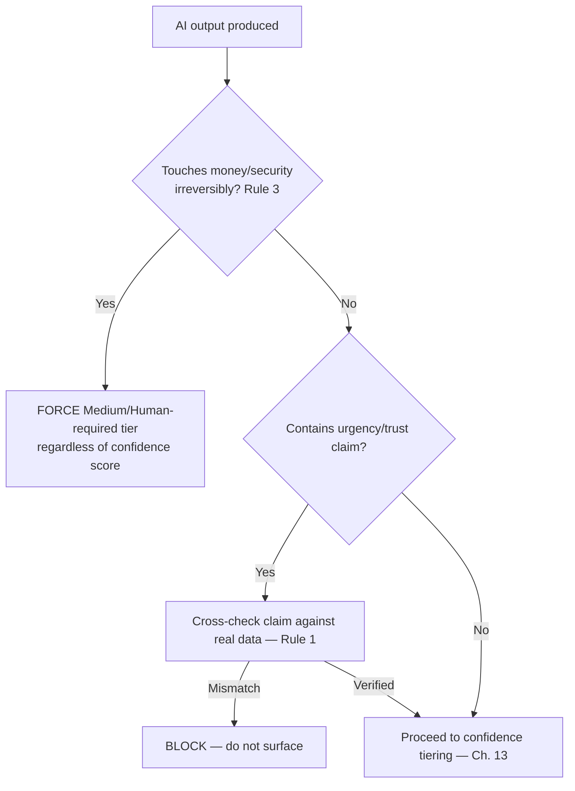
```mermaid
flowchart TD
  A[AI output produced] --> B{Touches money/security<br/>irreversibly? Rule 3}
  B -->|Yes| C[FORCE Medium/Human-required tier<br/>regardless of confidence score]
  B -->|No| D{Contains urgency/trust claim?}
  D -->|Yes| E[Cross-check claim against real data — Rule 1]
  E -->|Mismatch| F[BLOCK — do not surface]
  E -->|Verified| G[Proceed to confidence tiering — Ch. 13]
  D -->|No| G
```

**Examples**
A hypothetical future AI-driven "auto-refund small disputes" feature is explicitly, permanently barred from the invisible/High-confidence tier by Rule 3 — even if the model is 99% confident a refund is warranted, it surfaces as a Medium-tier (or stricter) confirmation, because the stakes (irreversible money movement) override raw model confidence.

**Edge Cases**
A genuinely low-value, clearly-policy-compliant refund (e.g., under a small threshold, matching an unambiguous policy like "damaged in transit with photo evidence") might reasonably be a candidate for a *more* automated path over time — but this requires an explicit, reviewed policy change to Rule 3's threshold, never a quiet confidence-score-driven exception.

**Anti-patterns**
- ❌ An AI feature that generates "Only 2 left!" urgency copy from a stale or unchecked stock figure — must always read the live stock count at generation time, not a cached or assumed value (Chapter 15 relatedly, and Design DNA §27's inventory trust rules).
- ❌ Treating Rule 3's list of irreversible actions as exhaustive and fixed forever — new consequential action types must be evaluated against Rule 3's spirit ("would getting this wrong genuinely harm the seller or customer in a hard-to-undo way?") as they're proposed, not assumed safe by default.

**Implementation Notes**
Rules 1 and 4 require an explicit output-validation step after generation and before display — this is architecturally distinct from Chapter 15's hallucination prevention (which concerns factual accuracy) and should be implemented as its own validation pass, even though the two often run together in practice.

**Acceptance Criteria**
- [ ] Zero AI-generated urgency/social-proof claims ship without a real-data cross-check, verified via automated test per feature.
- [ ] Rule 3's list of forced-non-invisible action types is documented, versioned, and reviewed at every new consequential-feature proposal.

**Future Expansion**
As CowQ's AI capability grows toward genuine automation/agents (Chapter 36), this chapter's rules — especially Rule 3 — become the single most important constraint on what an autonomous agent is ever allowed to do without human confirmation, and should be revisited with extra scrutiny before any agent capability ships.

---

# 15. Hallucination Prevention

**Purpose**
Define the specific technical measures preventing AI from generating confidently-stated but false information — a distinct, narrower concern than the broader Safety Rules (Chapter 14).

**Rules**
1. **Grounding over generation, wherever data exists.** Any AI output that could be computed or looked up from real data (stock counts, prices, order history) must be *grounded* — the prompt includes the real value and instructs the model to use it verbatim or reason from it, never asked to "recall" or estimate a fact CowQ already has.
2. **Structured output constrains hallucination surface area.** Requesting JSON-schema-constrained output (Chapter 10) inherently reduces the model's freedom to invent plausible-sounding but ungrounded prose — this is a deliberate secondary benefit of the structured-output-by-default rule, not just a parsing convenience.
3. **Low confidence suppresses rather than guesses** (Chapter 13's Low tier) — the single most important hallucination-prevention mechanism in the entire system: when the model genuinely doesn't have enough signal, CowQ shows nothing rather than a confident-sounding wrong answer.

**Architecture**
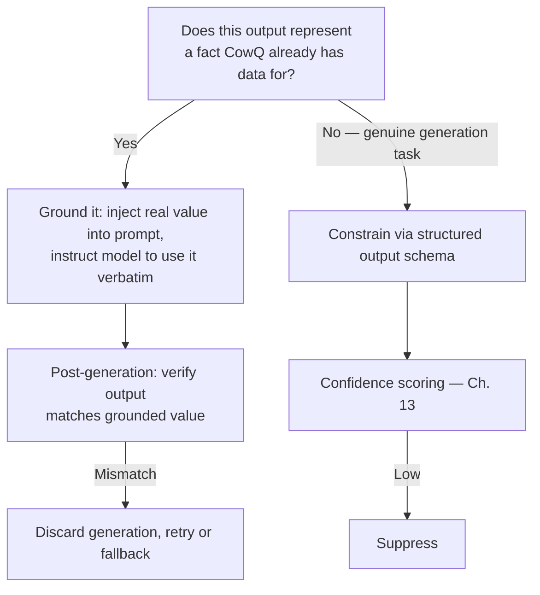
```mermaid
flowchart TD
  A[Does this output represent<br/>a fact CowQ already has data for?] -->|Yes| B[Ground it: inject real value into prompt,<br/>instruct model to use it verbatim]
  A -->|No — genuine generation task| C[Constrain via structured output schema]
  B --> D[Post-generation: verify output<br/>matches grounded value]
  D -->|Mismatch| E[Discard generation, retry or fallback]
  C --> F[Confidence scoring — Ch. 13]
  F -->|Low| G[Suppress]
```

**Examples**
A price-reasoning-summary prompt (Chapter 11) that mentions "similar items nearby sell for ₹400-500" must have that range genuinely computed from real comparable-listing data passed into the prompt's context, not left for the model to invent a plausible-sounding range — the prompt's `[ROLE/CONTEXT]` section carries the real computed range, and the `[TASK]` instructs the model to explain *from* that data, not to estimate independently.

**Edge Cases**
A generative task with no groundable "correct" answer (e.g., writing a caption's specific phrasing) is not a hallucination-prevention concern in the same sense — creative generation is expected to be genuinely generative; hallucination prevention specifically targets *factual* claims (stock levels, prices, comparisons, historical data) embedded within otherwise-creative output.

**Anti-patterns**
- ❌ A prompt asking the model to "estimate typical stock turnover for this product category" when CowQ has this seller's actual historical data available — always ground with real data when it exists.
- ❌ Accepting a Low-confidence-tier output and displaying it with hedging language ("This might be around ₹450...") instead of simply suppressing it — hedged hallucination is still hallucination; the correct behavior is silence, not softened confidence.

**Implementation Notes**
A post-generation verification step for grounded facts (Architecture diagram's "verify output matches grounded value") should use exact or near-exact string/number matching against the injected ground-truth value — a generation that paraphrases or subtly alters a grounded number should be treated as a generation error, not accepted as "close enough."

**Acceptance Criteria**
- [ ] Every prompt referencing a factual, CowQ-known value grounds it explicitly in the prompt rather than relying on model recall.
- [ ] Post-generation verification exists for every grounded-fact output type, with automated test coverage.

**Future Expansion**
As video generation (Chapter 19) introduces longer, more complex generated content, hallucination-prevention needs extend to ensuring generated video content doesn't misrepresent product attributes (color, size, material) — a genuinely harder verification problem than text/structured-data grounding, flagged here as a real, anticipated challenge for that roadmap phase.

---

# 16. AI Guardrails

**Purpose**
Define the content-moderation and policy-enforcement layer that sits between AI generation and what actually reaches a seller or customer.

**Rules**
1. Every piece of AI-generated content passes through a guardrail check before being shown or auto-applied — covering: prohibited-item/claim detection (Chapter 14 Rule 4), profanity/inappropriate-content filtering, and CowQ Brand Voice compliance (no exclamation points/emoji in system-adjacent copy, Design DNA §38, checked programmatically where feasible).
2. Guardrail failures result in the generation being discarded and either retried with adjusted constraints or gracefully suppressed (Low-confidence-tier-equivalent behavior) — never shown to the seller with a "this might not be quite right" disclaimer; a guardrail failure means the output doesn't ship, period.
3. Guardrail rules are centrally maintained and versioned, applied uniformly across all generative features — not implemented ad hoc per feature.

**Architecture**
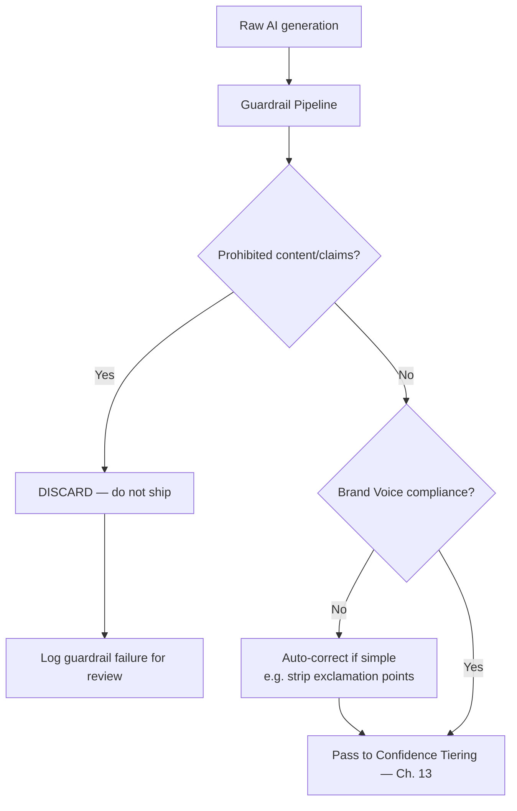
```mermaid
flowchart TD
  A[Raw AI generation] --> B[Guardrail Pipeline]
  B --> C{Prohibited content/claims?}
  C -->|Yes| D[DISCARD — do not ship]
  C -->|No| E{Brand Voice compliance?}
  E -->|No| F[Auto-correct if simple<br/>e.g. strip exclamation points]
  E -->|Yes| G[Pass to Confidence Tiering — Ch. 13]
  F --> G
  D --> H[Log guardrail failure for review]
```

**Examples**
A generated listing description that includes a superlative claim without basis ("the best quality in the market") is caught by a Brand Voice/claims-compliance guardrail check and either regenerated with a stricter constraint or discarded — never shipped as-is even if it's otherwise well-written.

**Edge Cases**
A guardrail check that produces a high false-positive rate (blocking genuinely fine content too aggressively) creates real seller friction and undermines the "reduce work, never create work" philosophy (Chapter 1) — guardrail precision/recall should be monitored (Chapter 28: AI Analytics) with the same rigor as confidence-threshold tuning (Chapter 13), not treated as a fire-and-forget safety measure.

**Anti-patterns**
- ❌ A feature-specific, one-off content check implemented inline instead of using the shared Guardrail Pipeline — creates inconsistent enforcement across features.
- ❌ Shipping flagged content with a disclaimer instead of discarding/retrying — Rule 2 is explicit: a guardrail failure is a hard stop, not a soft warning.

**Implementation Notes**
```typescript
// supabase/functions/_shared/guardrails/pipeline.ts
export async function runGuardrails(content: GeneratedContent): Promise<GuardrailResult> {
  const checks = [
    checkProhibitedClaims(content),
    checkBrandVoiceCompliance(content),
    checkPlatformPolicyCompliance(content),
  ];
  const results = await Promise.all(checks);
  const failures = results.filter((r) => !r.passed);
  return failures.length > 0
    ? { passed: false, failures, autoCorrectable: failures.every((f) => f.autoCorrectable) }
    : { passed: true };
}
```

**Acceptance Criteria**
- [ ] Every generative feature routes its output through the shared `runGuardrails` pipeline before display/application.
- [ ] Guardrail false-positive rate is tracked and reviewed alongside confidence-threshold tuning (Chapter 13).

**Future Expansion**
As multi-language generation ships (Design DNA §62), guardrail rules (particularly claims/policy compliance) need locale-aware implementations — a claims check tuned for English phrasing patterns won't automatically transfer to Tamil or Hindi content without dedicated work.

---

# 17. Content Generation

**Purpose**
Define the overarching architecture for text content generation (listings, captions, descriptions) — the umbrella chapter tying together Chapters 9–16's infrastructure into the concrete, shipped feature set.

**Rules**
1. Content generation always follows the full pipeline: Context Engine (Ch. 9) → Prompt Template (Ch. 10/11) → Model Router (Ch. 12) → Guardrails (Ch. 16) → Confidence Tiering (Ch. 13) → Display/Apply.
2. Every content-generation feature is independently addressable for partial regeneration (Chapter 21) from the moment it ships — never architected as monolithic-only with partial regeneration bolted on later.
3. Generated content is always immediately editable, streamed token-by-token where the UI supports it (Chapter 25), never delivered as a locked, read-only block requiring a separate "unlock to edit" action.

**Architecture**
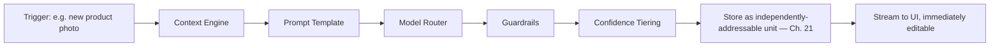
```mermaid
flowchart LR
  A[Trigger: e.g. new product photo] --> B[Context Engine]
  B --> C[Prompt Template]
  C --> D[Model Router]
  D --> E[Guardrails]
  E --> F[Confidence Tiering]
  F --> G[Store as independently-addressable unit — Ch. 21]
  G --> H[Stream to UI, immediately editable]
```

**Examples**
Listing generation (title, description, price suggestion) triggered by a new product photo runs this full pipeline three times in parallel where independent (title/description can generate concurrently; price suggestion may depend on the description's category classification) — each unit stored separately per Chapter 21's schema.

**Edge Cases**
A content-generation request that partially fails (e.g., title generates successfully but description generation hits a guardrail failure) should not block or discard the successful units — each unit's pipeline runs and fails independently, consistent with the independently-addressable-unit architecture (Chapter 21).

**Anti-patterns**
- ❌ A single "generate everything" call that succeeds or fails as one atomic unit — violates both the partial-regeneration requirement (Rule 2) and the independent-failure-handling this chapter's edge case describes.
- ❌ Displaying generated content as read-only until an explicit "Edit" button is pressed — violates Rule 3 and Design DNA §54.4's immediate-editability standard.

**Implementation Notes**
See Engineering Handbook Chapter 16 for the full technical pipeline implementation; this chapter's addition is the explicit requirement that every content type entering this pipeline is designed for independent addressability and immediate editability from its first version, not retrofitted.

**Acceptance Criteria**
- [ ] Every content-generation feature's output units are independently regeneratable (Chapter 21) from initial ship.
- [ ] Zero content-generation UI requires an explicit "unlock to edit" step.

**Future Expansion**
As voice generation (Chapter 20) and video (Chapter 19) mature, this same pipeline structure extends to them — the specific model calls and output types differ, but the Context → Prompt → Route → Guardrail → Tier → Display flow remains the constant architecture.

---

# 18. Image Generation

**Purpose**
Define the AI-behavioral specification for CowQ's image generation capability — building on Engineering Handbook Chapter 16's technical pipeline with the AI-specific quality and configuration rules.

**Rules**
1. Image generation prompts inject Brand Memory's `photoStyleNotes` (Chapter 6) as a first-class constraint, equally weighted with the product-analysis input — style consistency across a seller's catalog is a genuine quality bar, not a nice-to-have.
2. The AI model configurator (attire, regional appearance, cultural style, consistent-face-lock for brand model portraits — Product Bible Chapter 22's identified strongest differentiator) is treated as a first-class, carefully-tuned prompt-construction system, not a generic "add some options" feature.
3. Every generated image passes through Guardrails (Chapter 16) checking for policy-inappropriate content before storage, in addition to the technical quality checks (Engineering Handbook Chapter 16's blur/exposure logic, which applies to *input* photos, distinct from this *output* content check).

**Architecture**
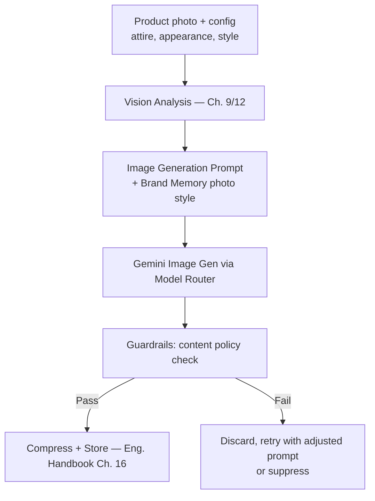
```mermaid
flowchart TD
  A[Product photo + config<br/>attire, appearance, style] --> B[Vision Analysis — Ch. 9/12]
  B --> C[Image Generation Prompt<br/>+ Brand Memory photo style]
  C --> D[Gemini Image Gen via Model Router]
  D --> E[Guardrails: content policy check]
  E -->|Pass| F[Compress + Store — Eng. Handbook Ch. 16]
  E -->|Fail| G[Discard, retry with adjusted prompt<br/>or suppress]
```

**Examples**
A brand-model-portrait generation request carrying `{ attire: 'traditional', regionalAppearance: 'south-indian', culturalStyle: 'festive', faceLock: true }` constructs a prompt where these four parameters are explicit, structured inputs to the Task/Constraints sections (Chapter 10) — never freeform natural-language descriptions the seller has to phrase correctly themselves; the configurator UI maps directly to structured prompt parameters.

**Edge Cases**
Consistent-face-lock across multiple generated images (e.g., a seller generating several product shots featuring the "same" brand model) requires the underlying generation calls to share a reference/seed consistently — this is a genuine technical constraint on the Model Router/prompt construction (Chapter 12) that must be explicitly tested, not assumed to work by default across independent generation calls.

**Anti-patterns**
- ❌ Treating the AI model configurator as a simple set of prompt-string concatenations without dedicated quality tuning — given this is Product Bible Chapter 22's identified strongest differentiator, it deserves proportionally more prompt-engineering investment than a generic feature.
- ❌ Skipping the output-side content-policy guardrail check for image generation "because it's just product photos" — image generation carries real content-policy risk (inappropriate content, misleading product representation) just as much as text generation.

**Implementation Notes**
Given this feature's strategic importance (Product Bible Chapter 22, currently under-surfaced in marketing per that chapter's noted gap), engineering investment here should be weighted accordingly — this is not a "commodity AI feature," it's the product's most differentiated AI capability and should receive matching prompt-engineering rigor and monitoring (Chapter 28).

**Acceptance Criteria**
- [ ] Consistent-face-lock is verified via automated test across a multi-image generation sequence.
- [ ] Every generated image passes the output-side content-policy guardrail before storage.

**Future Expansion**
As this configurator matures, consider exposing more granular Brand Memory-driven defaults (a seller's historically-preferred attire/style choices pre-selected, per Chapter 6's incremental-learning pattern) rather than requiring the seller to reconfigure from scratch on every generation.

---

# 19. Video Generation

**Purpose**
Define the AI-behavioral specification for CowQ's video generation capability, per the near-term roadmap (Product Bible Chapter 17: a deliberately small 5–10-seller test group before broader rollout).

**Rules**
1. Video generation follows the exact same pipeline architecture as image generation (Chapter 18) — Context → Prompt → Model Router (routing to Kling 2.6 Pro via fal.ai, Chapter 12) → Guardrails → Confidence Tiering → Display — with stage durations and status granularity adjusted for video's substantially longer generation time (Engineering Handbook Chapter 30's multi-stage loading pattern, tuned specifically for video).
2. Video generation is gated behind the `VIDEO_ENABLED` feature flag (Engineering Handbook Chapter 45), enabled per-seller for the test cohort only, until real-cost data (Product Bible Chapter 20) informs credit pricing.
3. Video, like image generation, always shows its work — no video is auto-posted or auto-applied without a Medium-confidence-tier-minimum review step, given the higher stakes (cost, brand representation, harder-to-quickly-verify content) relative to a static image.

**Architecture**
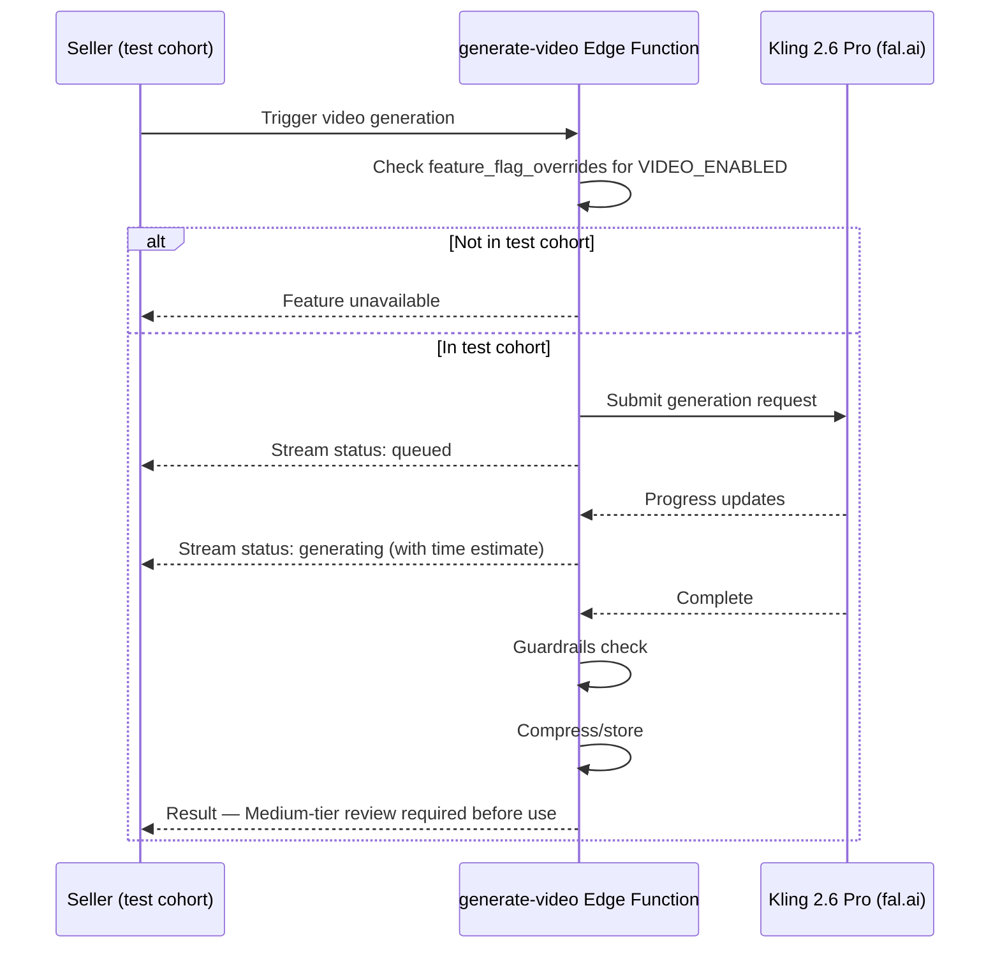
```mermaid
sequenceDiagram
  participant S as Seller (test cohort)
  participant EF as generate-video Edge Function
  participant K as Kling 2.6 Pro (fal.ai)
  S->>EF: Trigger video generation
  EF->>EF: Check feature_flag_overrides for VIDEO_ENABLED
  alt Not in test cohort
    EF-->>S: Feature unavailable
  else In test cohort
    EF->>K: Submit generation request
    EF-->>S: Stream status: queued
    K-->>EF: Progress updates
    EF-->>S: Stream status: generating (with time estimate)
    K-->>EF: Complete
    EF->>EF: Guardrails check
    EF->>EF: Compress/store
    EF-->>S: Result — Medium-tier review required before use
  end
```

**Examples**
The 20–30 real generations across the 5–10-seller test group (Product Bible Chapter 17) exist specifically to answer two questions this chapter depends on: (1) real generation cost, informing Chapter 22's credit pricing, and (2) real output quality/guardrail-failure rate, informing whether the Medium-confidence-tier-minimum review requirement (Rule 3) can eventually be relaxed for high-confidence cases, or should remain permanently stricter than image generation.

**Edge Cases**
A video generation that fails partway through (a genuinely more expensive failure mode than image generation, given cost and time invested) must not deduct credits (Chapter 22, Engineering Handbook Chapter 21's established pattern) — this is even more critical to get right for video than image, given the larger per-generation cost at stake.

**Anti-patterns**
- ❌ Enabling `VIDEO_ENABLED` broadly before the test cohort's cost data is in — violates the explicit, deliberate roadmap sequencing (Product Bible Chapter 17, 20).
- ❌ Treating video guardrail checks as equivalent in rigor to image guardrail checks "since it's basically the same pipeline" — video's longer, more complex content genuinely needs more thorough review before the guardrail bar can be trusted at the same confidence level as image generation.

**Implementation Notes**
Status-streaming stage granularity (Engineering Handbook Chapter 30) for video should include a genuine time estimate once real generation-time data exists from the test cohort — "Generating your video — usually takes about 90 seconds" is far better UX than an indefinite spinner, and this estimate should be derived from real, measured data, not guessed.

**Acceptance Criteria**
- [ ] `VIDEO_ENABLED` remains scoped to the test cohort until Product Bible Chapter 20's pricing sequencing criteria are met.
- [ ] Zero credit deduction occurs for failed/incomplete video generations, verified via the same three-part test pattern established for images (Engineering Handbook Chapter 21).

**Future Expansion**
Per Product Bible Chapter 17's later roadmap, "video for services" (an explicitly uncontested niche) should extend this architecture with service-specific prompt templates (Chapter 11) — e.g., a consultant introducing themselves — rather than reusing product-video templates with different framing bolted on.

---

# 20. Voice Generation

**Purpose**
Define the forward-looking specification for voice/audio generation — not yet on CowQ's near-term roadmap, but architected here so a future addition follows established patterns rather than inventing new ones ad hoc.

**Rules**
1. Voice generation, when built, follows the identical Context → Prompt → Model Router → Guardrails → Confidence Tiering pipeline established for image (Chapter 18) and video (Chapter 19) — no new architectural pattern invented specifically for audio.
2. Voice generation injects Brand Memory's `tone` field directly into voice-style parameters (pacing, warmth) where the underlying model supports style control — voice should sound as recognizably "this seller's brand" as generated text does.
3. Given voice's potential for identity-adjacent representation (a synthesized voice representing a seller or their business), voice generation is treated with at least the same Rule-3-of-Chapter-14 caution as financial actions — never fully invisible-tier, always requiring explicit review before any customer-facing use.

**Architecture**
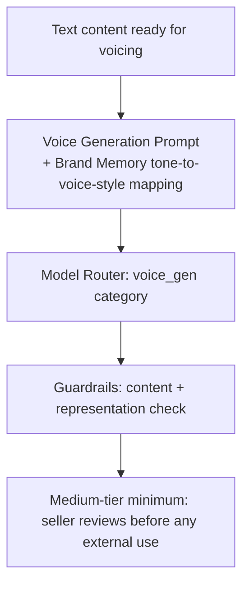
```mermaid
flowchart TD
  A[Text content ready for voicing] --> B[Voice Generation Prompt<br/>+ Brand Memory tone-to-voice-style mapping]
  B --> C[Model Router: voice_gen category]
  C --> D[Guardrails: content + representation check]
  D --> E[Medium-tier minimum: seller reviews before any external use]
```

**Examples**
A plausible future use case: narrating a product video (Chapter 19) with a synthesized voiceover matching the seller's Brand Memory tone — this chapter's rules would require the seller to review and approve the specific voice output before it's attached to any published video, never auto-applied.

**Edge Cases**
Voice generation that could be mistaken for a real recording of the seller's own voice (as opposed to a generic narrator voice) raises a genuine representation/consent question that should be resolved with an explicit policy decision *before* this capability is built — this is flagged here as a known open question, not a solved problem, precisely because it's not yet on the roadmap.

**Anti-patterns**
- ❌ Building voice generation as a bolt-on to the video pipeline without its own dedicated Context/Prompt/Guardrail treatment — voice has distinct representation and quality concerns (Rule 3) that a copy-pasted video pipeline wouldn't adequately address.

**Implementation Notes**
No implementation exists today — this chapter's value is purely architectural pre-planning, consistent with this Playbook's overall discipline (mirroring Product Bible Chapter 55's approach to speculative-horizon topics: thin, honest, and explicitly marked as not-yet-real).

**Acceptance Criteria**
- [ ] Not applicable — no acceptance criteria for an unbuilt feature; this chapter's "acceptance criteria" is that any future voice-generation proposal is evaluated against this chapter's rules before development begins.

**Future Expansion**
When voice generation moves onto the actual roadmap (Product Bible Chapter 17), this chapter should be substantially expanded with concrete model selection, prompt templates, and the representation/consent policy question explicitly resolved — not left as speculative.

---

# 21. Partial Regeneration

**Purpose**
Provide the full AI-behavioral specification for partial regeneration — CowQ's validated, explicit competitive differentiator (Product Bible Chapter 14), extending Engineering Handbook Chapter 22's technical schema with the AI-specific behavioral rules.

**Rules**
1. Every regeneratable unit (Engineering Handbook Chapter 22's `ai_generations` table) carries its own independent context, prompt, and confidence score — a regeneration of one photo angle is a full, independent pipeline run (Chapter 17), not a patch applied to a prior result.
2. A regeneration request may optionally pass **exclusion context** — what the seller *didn't* like about the previous version — improving the next attempt's prompt construction, distinct from a completely fresh, contextless regeneration.
3. Regeneration is priced lower than full generation (Product Bible Chapter 20's explicit pricing rationale) — reflected in `credit_costs` (Chapter 22) and enforced identically to any other credit-consuming action (Engineering Handbook Chapter 21's shared `spend_credits` discipline, no exception for this feature).

**Architecture**
```mermaid
flowchart TD
  A[Seller: Regenerate this unit] --> B{Exclusion context provided?<br/>e.g. 'didn't like the lighting'}
  B -->|Yes| C[Inject exclusion context into prompt Constraints]
  B -->|No| D[Standard regeneration — fresh attempt, same base context]
  C --> E[Full independent pipeline: Ch. 17]
  D --> E
  E --> F[New version stored, unit_key unchanged, version incremented]
  F --> G[Lower credit cost applied — Ch. 22]
```

**Examples**
A seller unhappy with a generated caption taps "Regenerate" and optionally types "make it shorter" — this becomes exclusion/adjustment context injected into the Constraints section of the regeneration's prompt (Chapter 10), producing a genuinely informed second attempt rather than a blind re-roll with identical inputs and just different random variation.

**Edge Cases**
A regeneration requested many times in a row for the same unit (a seller repeatedly dissatisfied) should be monitored — a pattern of 3+ consecutive regenerations for the same unit type, for a given seller, is itself a signal worth surfacing to Brand Memory's correction-aggregation logic (Chapter 6) or, at minimum, worth tracking as a quality signal (Chapter 29).

**Anti-patterns**
- ❌ A "regenerate" implementation that's actually just re-running the exact same prompt with no randomness/temperature variation — produces near-identical output and frustrates the seller who explicitly wanted something different.
- ❌ Charging the same credit cost for a partial regeneration as a full listing regeneration — undermines the entire strategic value of this differentiator (Product Bible Chapter 20).

**Implementation Notes**
See Engineering Handbook Chapter 22 for the full schema; this chapter's addition is the exclusion-context prompt-injection mechanism, which should be a first-class, typed parameter on the `regenerate-unit` Edge Function's input, not an ad hoc free-text field bolted on later.

**Acceptance Criteria**
- [ ] Regeneration credit cost is verified lower than full-generation cost for every applicable content type (Engineering Handbook Chapter 22's acceptance criterion, restated).
- [ ] Exclusion-context injection is verified to measurably change output (not just re-roll randomness) via a spot-check test.

**Future Expansion**
As video generation matures (Chapter 19), partial regeneration should extend to individual video segments/scenes where technically feasible — the same unit-addressable, exclusion-context-aware pattern applies, not a video-specific reinvention.

---

# 22. Credit System

**Purpose**
Define the AI-behavioral policy layer governing credits — how AI features determine and communicate their own cost — complementing Engineering Handbook Chapter 21's technical implementation.

**Rules**
1. Every AI action type's credit cost is set from **real, measured generation cost** (compute + vendor API cost) plus a defined margin — never set speculatively before real cost data exists (Product Bible Chapter 20's explicit video-pricing precedent, generalized as policy here for every future action type).
2. Credit cost is exposed to the frontend via a dedicated `get_credit_cost(action_type)` query — never hardcoded client-side, ensuring displayed cost and actually-charged cost can never drift (Design DNA §54.6, Engineering Handbook Chapter 21).
3. AI features that fail after partial compute investment (e.g., a video that gets 80% through generation before failing) still incur zero credit deduction — CowQ, not the seller, absorbs the cost risk of AI failures, full stop, regardless of how far generation progressed.

**Architecture**
```mermaid
flowchart TD
  A[New AI action type proposed] --> B[Run cost-measurement test batch<br/>e.g. 20-30 real generations]
  B --> C[Compute real avg cost + margin]
  C --> D[Set credit_costs entry]
  D --> E[Feature launches with data-backed pricing]
  F[Action executes] --> G{Success?}
  G -->|Yes| H[spend_credits — Eng. Handbook Ch. 21]
  G -->|No, any stage| I[Zero deduction, regardless of partial progress]
```

**Examples**
The video-generation test group (Chapter 19, Product Bible Chapter 17/20) is this rule's canonical, real, in-progress example: 20–30 generations across 5–10 sellers exist specifically to produce the real-cost data Rule 1 requires before `credit_costs` gets a video entry.

**Edge Cases**
A generation that fails at 80% completion (Rule 3's example) still consumed real, non-trivial vendor compute cost to CowQ even though the seller pays nothing — this is a deliberate, accepted business cost (protecting seller trust, per Chapter 14's safety philosophy) that should be monitored in aggregate (Chapter 23: cost optimization) to ensure failure rates stay within an acceptable margin-impact range, not ignored as a rounding error.

**Anti-patterns**
- ❌ Launching a new credit-consuming AI feature with a "reasonable guess" price before running a real-cost measurement batch — violates Rule 1 and repeats the exact planning mistake Product Bible Chapter 20 explicitly avoided for video.
- ❌ Any credit deduction logic living outside the single shared `spend_credits` RPC (Engineering Handbook Chapter 21) — this Playbook fully inherits that Handbook's permanent guardrail without exception for AI-specific reasoning.

**Implementation Notes**
The cost-measurement-batch process (Architecture diagram's first three steps) should itself be a documented, repeatable internal process/checklist — not an ad hoc one-off exercise reinvented each time a new AI capability nears launch.

**Acceptance Criteria**
- [ ] Every credit-consuming AI action type's price traces to a documented real-cost measurement, not a guess.
- [ ] Zero credit deduction for any generation failing at any pipeline stage, verified via the standard three-part test suite (Engineering Handbook Chapter 21).

**Future Expansion**
As multi-model routing (Chapter 38) introduces genuine cost-vs-quality tradeoffs between providers, credit pricing may need to account for which model actually served a given request if costs diverge meaningfully between routing options — not yet relevant at today's single-provider-per-category scale.

---

# 23. AI Cost Optimization

**Purpose**
Define how CowQ manages the real, ongoing infrastructure cost of running AI at scale — distinct from Chapter 22's seller-facing pricing policy, this chapter is about CowQ's own margin discipline.

**Rules**
1. Every AI feature's real per-generation cost is tracked and reviewed on the same cadence as Chapter 13's confidence-threshold review — cost and quality are reviewed together, since optimizing one without the other risks either overspending or degrading output.
2. Prompt token usage is actively minimized without sacrificing output quality — the Context Engine's (Chapter 9) discipline of injecting only action-type-relevant context, not "everything we know," is itself a cost-optimization measure as much as a quality one.
3. Caching (Chapter 24) is the first lever pulled before considering a cheaper-but-lower-quality model substitution — never degrade quality to save cost when a caching or deduplication opportunity exists instead.

**Architecture**
```mermaid
flowchart TD
  A[AI cost monitoring — Ch. 28] --> B{Cost per action type<br/>trending up or high?}
  B -->|Yes| C{Is this due to<br/>redundant/repeated calls?}
  C -->|Yes| D[Fix via Caching — Ch. 24]
  C -->|No, genuine unique demand| E{Context bloat?<br/>Ch. 9 discipline}
  E -->|Yes| F[Trim context injection]
  E -->|No| G{Consider model routing<br/>tradeoff — Ch. 12, 38}
```

**Examples**
A future scenario where marketplace search-result re-ranking (Chapter 34) considers calling an LLM per search query would be flagged immediately at design time as a cost-optimization concern — a much cheaper, cacheable, or non-LLM-based ranking approach should be the default assumption for any high-frequency, low-differentiation-value AI call, reserving genuine model calls for where they add real, differentiated value.

**Edge Cases**
A cost-optimization change that would measurably degrade output quality (e.g., switching to a cheaper model for brand-portrait generation, Product Bible Chapter 22's identified strongest differentiator) should be rejected even if it improves margin — Rule 3's "never degrade quality to save cost" applies with particular force to CowQ's most strategically important AI capability.

**Anti-patterns**
- ❌ Optimizing cost by silently lowering output quality on a feature without any seller-facing signal or internal review — cost and quality tradeoffs must be a deliberate, reviewed decision, never a quiet regression.
- ❌ Treating cost optimization as a one-time project rather than an ongoing review cadence tied to real usage growth.

**Implementation Notes**
Cost-per-action-type should be a first-class field in the AI Analytics dashboard (Chapter 28), computed from actual vendor billing data joined against `ai_activity_log` action counts, not estimated.

**Acceptance Criteria**
- [ ] Cost per AI action type is tracked and reviewed at least quarterly, alongside confidence-threshold review (Chapter 13).
- [ ] No cost-optimization change ships without an explicit quality-impact assessment.

**Future Expansion**
As Chapter 38's multi-model strategy matures, cost optimization becomes a genuine routing dimension — different providers offering different cost/quality tradeoffs for the same capability, with routing decisions informed by both this chapter's cost discipline and Chapter 29's quality scoring.

---

# 24. AI Caching

**Purpose**
Define what AI outputs can be safely cached/deduplicated versus what must always be freshly generated.

**Rules**
1. **Deterministic, non-personalized lookups are cacheable** — e.g., the fixed category taxonomy (Chapter 11's `CATEGORY_INFERENCE_PROMPT`'s reference data) is cached at the application layer, never re-fetched from a model call.
2. **Personalized, creative generation is never cached across sellers or requests** — a listing description, a caption, a price suggestion is generated fresh per request, since caching creative output would produce identical, non-differentiated content across sellers (directly undermining Brand Memory's entire value proposition, Chapter 6).
3. **Vision-analysis results for an unchanged input image may be cached** — if a seller re-triggers generation from the exact same, unmodified photo (e.g., after simply changing a text-only setting), the underlying image-analysis step's result can be reused rather than re-calling the vision model, saving cost (Chapter 23) without any quality impact since the input is identical.

**Architecture**
```mermaid
flowchart TD
  A[AI request] --> B{Type of call}
  B -->|Fixed reference data lookup| C[Cache — long TTL]
  B -->|Vision analysis of unchanged image| D[Cache — keyed by image hash]
  B -->|Creative/personalized generation| E[Never cache — always fresh call]
```

**Examples**
A seller regenerating just a product's price suggestion (Chapter 21's partial regeneration) after having already analyzed the product photo doesn't need to re-run vision analysis — the cached analysis (Rule 3, keyed by image hash) is reused, and only the pricing-generation step makes a fresh model call.

**Edge Cases**
A cached vision-analysis result must be invalidated if the underlying image is ever replaced (a seller uploads a new photo for the same product) — cache keys must be tied to the actual image content hash, not the product ID alone, to avoid serving stale analysis against a changed image.

**Anti-patterns**
- ❌ Caching a generated listing description keyed only by product category, intending to "save cost" by serving similar sellers similar copy — this is a direct, serious violation of Rule 2 and would produce generic, non-differentiated, off-brand content for every seller sharing that cache entry.
- ❌ An infinite or very long TTL on vision-analysis caching without considering that a seller might legitimately want to regenerate analysis after adjusting photo-quality settings — cache invalidation logic must be tied to genuine input identity, not assumed permanent.

**Implementation Notes**
```typescript
// Vision analysis caching, keyed by content hash
export async function analyzeImageCached(imageUrl: string): Promise<ImageAnalysis> {
  const imageHash = await hashImageContent(imageUrl);
  const cached = await getCachedAnalysis(imageHash);
  if (cached) return cached;
  const analysis = await geminiClient.analyzeImage(imageUrl);
  await setCachedAnalysis(imageHash, analysis, { ttl: '7d' });
  return analysis;
}
```

**Acceptance Criteria**
- [ ] Zero creative/personalized generation output is ever cached across requests, verified via codebase audit.
- [ ] Vision-analysis caching is verified to invalidate correctly on image replacement, via automated test.

**Future Expansion**
As video generation's cost (Chapter 19, 22) makes caching more financially significant, evaluate whether any video-generation sub-steps (e.g., a shared background/scene element across a seller's multiple video generations) offer legitimate, non-quality-degrading caching opportunities — not yet relevant at current scale.

---

# 25. AI Streaming

**Purpose**
Define the technical and behavioral standard for streaming AI-generated content — extending Design DNA §54.4 and Engineering Handbook Chapter 30 with the AI-specific streaming architecture.

**Rules**
1. Every text-generative feature streams token-by-token into its destination UI element — never a block-then-display pattern (Design DNA §54.4 Rule 1).
2. Streamed content is immediately editable mid-stream, with generation gracefully stopping at the point of manual edit rather than overwriting it (Design DNA §54.4 Rule 2) — implemented via a stream-position-vs-cursor-position diff check.
3. Multi-stage pipelines (Chapter 17) stream *stage* status (analyzing/generating/finalizing) in addition to token-level content streaming where applicable — these are two distinct streaming concerns (macro pipeline stage vs. micro token-level text) that both need to reach the UI.

**Architecture**
```mermaid
sequenceDiagram
  participant EF as Edge Function
  participant FE as Frontend
  EF->>FE: stage: analyzing
  EF->>FE: stage: generating
  loop Token stream
    EF->>FE: token
    FE->>FE: Append to buffer, render
    alt Seller starts typing (manual edit)
      FE->>FE: Detect cursor-position vs stream-position diff
      FE->>EF: Signal: stop streaming
      EF-->>FE: Stream halted, no overwrite
    end
  end
  EF->>FE: stage: complete
```

**Examples**
An AI-drafted product description streams word-by-word into the description textarea (Design DNA §54.4's exact example); if the seller starts editing the first sentence while the third is still streaming, the stream stops cleanly at that point — implemented by comparing the last-streamed-character position against the textarea's current cursor/selection position on every stream-interrupting user input event.

**Edge Cases**
A seller who deletes content *ahead* of the current stream position (e.g., clears the whole field while a stream is in progress) should immediately and fully halt the stream — this is a stronger interrupt signal than a simple mid-stream edit and should be handled as an explicit, distinct case, not just "any edit stops the stream at the current token."

**Anti-patterns**
- ❌ A generative feature that waits for the full response before rendering anything — directly violates Design DNA §54.4 Rule 1 and this chapter's Rule 1.
- ❌ A stream that continues writing over a seller's in-progress manual edit — violates Rule 2 and creates a genuinely frustrating, work-creating (not work-reducing, Chapter 1 Rule 4) experience.

**Implementation Notes**
Streaming is implemented via Supabase Realtime broadcast channels (as shown in Engineering Handbook Chapter 30's `useGenerationStatus` example) or server-sent events from the Edge Function — either is acceptable, but the interrupt-detection logic (Rule 2) must be implemented consistently regardless of transport mechanism.

**Acceptance Criteria**
- [ ] 100% of generative text features stream visibly, verified via component audit (Engineering Handbook Chapter 37's testing standard, AI-specific instance).
- [ ] Mid-stream manual edits are verified, via automated test, to never be overwritten by continuing generation.

**Future Expansion**
As video generation's status streaming (Chapter 19) matures with real duration data, this chapter's stage-status streaming pattern should incorporate genuine time-remaining estimates, not just stage labels.

---

# 26. AI Retry Strategy

**Purpose**
Define exactly when and how AI calls are retried — balancing resilience against cost (Chapter 23) and against creating a false sense of reliability for genuinely failed requests.

**Rules**
1. Only genuinely transient failures (rate limits — HTTP 429, server errors — HTTP 5xx, network timeouts) are automatically retried; content-policy rejections, invalid-input errors, and guardrail failures (Chapter 16) are never retried automatically with the same input — those require either a different approach or explicit seller action.
2. Automatic retries use exponential backoff with a hard cap (e.g., 3 attempts, doubling delay) — never an unbounded or tight-loop retry that could compound rate-limiting or cost issues.
3. A retry never re-deducts credits speculatively before success — credit deduction (Chapter 22) happens exactly once, only after the retry sequence's eventual success, consistent with the broader "deduct only after confirmed success" rule.

**Architecture**
```mermaid
flowchart TD
  A[AI call fails] --> B{Failure type}
  B -->|429/5xx/timeout — transient| C{Retry count < max?}
  C -->|Yes| D[Exponential backoff, retry]
  D --> A
  C -->|No| E[Surface retryable error to seller — Ch. 27]
  B -->|Guardrail/content-policy/invalid-input| F[Do NOT auto-retry —<br/>surface distinct error type]
```

**Examples**
Chapter 18's `GeminiApiError.isRetryable` getter (checking `statusCode >= 500 || statusCode === 429`) is the exact, canonical implementation of Rule 1's transient/non-transient distinction — this Playbook formalizes that Engineering Handbook pattern as mandatory AI behavior policy, not just a convenient error-class property.

**Edge Cases**
A guardrail failure (Chapter 16) that's specifically due to a borderline, ambiguous case (not a clear policy violation) might reasonably benefit from *one* retry with adjusted prompt constraints (a stricter instruction) — this is a deliberate, narrow exception to Rule 1's "never auto-retry guardrail failures with the same input," explicitly allowed only when the retry meaningfully changes the input/constraints, never a blind identical re-attempt.

**Anti-patterns**
- ❌ Retrying a content-policy-rejected generation with the exact same prompt, hoping for a different result — wastes cost and is unlikely to succeed differently without a genuine input change.
- ❌ An unbounded retry loop with no max-attempts cap — risks cascading cost and rate-limit issues during a genuine vendor outage.

**Implementation Notes**
```typescript
async function withRetry<T>(fn: () => Promise<T>, maxAttempts = 3): Promise<T> {
  let lastError: Error;
  for (let attempt = 0; attempt < maxAttempts; attempt++) {
    try {
      return await fn();
    } catch (error) {
      lastError = error as Error;
      if (!(error instanceof GeminiApiError && error.isRetryable)) throw error;
      await sleep(Math.pow(2, attempt) * 1000);
    }
  }
  throw lastError!;
}
```

**Acceptance Criteria**
- [ ] Zero automatic retries for guardrail/content-policy failures with unchanged input, verified via automated test.
- [ ] Every retryable AI call path has a defined, tested max-attempts cap.

**Future Expansion**
As multi-model routing (Chapter 38) matures, a failed request's retry strategy could eventually include falling back to a secondary provider after exhausting primary-provider retries — not built today given the single-provider-per-category architecture (Chapter 12), but the retry-wrapper's design should anticipate this extension.

---

# 27. AI Failure Handling

**Purpose**
Define how AI failures — after retries (Chapter 26) are exhausted — are surfaced to sellers, extending Engineering Handbook Chapter 29's general error-handling standard with AI-specific failure copy and behavior.

**Rules**
1. Every AI failure surfaces with honest, specific, non-blaming language (Engineering Handbook Chapter 29, Design DNA §34) and an explicit statement that no credits were used (Chapter 22 Rule 3) — this reassurance is a mandatory, not optional, part of AI failure copy specifically, given credits are real money to the seller.
2. AI failures always offer a concrete next step — retry, try a different photo/input, or (for guardrail failures) an explanation of what needs to change, never a dead-end.
3. Repeated failures for the same seller, same action type, within a short window trigger an internal alert (Chapter 44 of the Engineering Handbook's monitoring philosophy, applied specifically to AI failure-rate anomalies) — a pattern of failures for one seller might indicate an upstream issue (a corrupted image, a vendor-side problem) worth investigating proactively rather than waiting for a support complaint.

**Architecture**
```mermaid
flowchart TD
  A[AI call fails, retries exhausted — Ch. 26] --> B[Classify failure type]
  B --> C[Map to honest, specific user copy — no credits used]
  C --> D[Offer concrete next step]
  D --> E{Repeated failure,<br/>same seller/action, short window?}
  E -->|Yes| F[Internal alert — investigate proactively]
  E -->|No| G[Standard failure display]
```

**Examples**
"This didn't generate correctly — no credits were used. Try again, or use a different photo." (Chapter 29 of the Engineering Handbook's `GENERATION_FAILED` example) is the canonical AI-failure copy pattern this chapter formalizes as mandatory for every AI feature, not just the one example it originated from.

**Edge Cases**
A failure caused by a genuinely low-quality input (a blurry, unusable photo that somehow passed the client-side quality check, Engineering Handbook Chapter 16) should distinguish itself in copy from a failure caused by a CowQ/vendor-side issue — "This photo is too blurry to work with — try a clearer shot" is meaningfully different guidance from "Something went wrong on our end — try again," and conflating them wastes the seller's time on the wrong remedy.

**Anti-patterns**
- ❌ A generic "Generation failed" message with no distinction between input-quality issues, vendor issues, or guardrail issues — each needs different, specific next-step guidance per Rule 2.
- ❌ Omitting the "no credits were used" reassurance — for a credit-consuming feature, this omission creates genuine, unnecessary seller anxiety about whether they've just lost money on a failed attempt.

**Implementation Notes**
Failure-type classification should map cleanly onto the existing `ERROR_COPY` pattern (Engineering Handbook Chapter 29) — this chapter doesn't introduce a new error-handling mechanism, it specifies the AI-domain-specific entries that mechanism must contain.

**Acceptance Criteria**
- [ ] Every AI failure message explicitly states no credits were used, verified via copy audit across all credit-consuming features.
- [ ] Repeated-failure alerting is implemented and tested for at least one AI action type as the reference pattern for extending to others.

**Future Expansion**
As failure-pattern data accumulates (Chapter 28), consider whether certain failure types warrant proactive, AI-generated seller guidance (e.g., "Photos with this specific issue tend to fail — here's what works better") — a genuinely helpful extension, not built today but a natural next step once real failure-pattern data exists.

---

# 28. AI Analytics

**Purpose**
Define what CowQ measures about its own AI system's performance — the internal instrumentation layer feeding Chapters 13, 16, 23, and Product Bible Chapter 51's KPIs.

**Rules**
1. Every AI action logs, at minimum: action type, confidence tier and score, model/version used (Chapter 12), latency, cost, guardrail pass/fail, and eventual seller outcome (accepted/dismissed/corrected/unused) — this is the complete, non-negotiable event schema every AI feature must emit into.
2. AI Analytics is queried by three primary consumers, each with different needs: Chapter 13's confidence-threshold tuning (accuracy-focused), Chapter 23's cost optimization (cost-focused), and Chapter 29's quality scoring (output-quality-focused) — one shared event log, multiple specialized views/dashboards over it.
3. Analytics data is retained long enough to support meaningful trend analysis (minimum 12 months) but is subject to the same privacy scoping as any other seller/customer data (Chapter 39) — analytics about AI behavior is not exempt from CowQ's privacy commitments just because it's "internal metrics."

**Architecture**
```mermaid
flowchart TD
  A[Every AI action] --> B[ai_activity_log — Eng. Handbook Ch. 17, extended here]
  B --> C[Confidence Tuning Dashboard — Ch. 13]
  B --> D[Cost Dashboard — Ch. 23]
  B --> E[Quality Scoring Dashboard — Ch. 29]
  B --> F[Product Bible Ch. 51 KPI feed:<br/>AI Suggestion Acceptance Rate]
```

**Examples**
```sql
-- Extending Engineering Handbook Ch. 17's ai_activity_log with the full
-- analytics-required schema
alter table ai_activity_log add column model_id text;
alter table ai_activity_log add column model_version text;
alter table ai_activity_log add column latency_ms integer;
alter table ai_activity_log add column cost_estimate_cents integer;
alter table ai_activity_log add column guardrail_passed boolean;
alter table ai_activity_log add column outcome text; -- 'accepted' | 'dismissed' | 'corrected' | 'unused'
```

**Edge Cases**
An AI action whose "eventual seller outcome" isn't knowable immediately (e.g., an invisible High-tier inference that the seller might silently correct days later when editing the product) requires an outcome-tracking window, not an instant-only classification — the `outcome` field should be updatable for a defined period after the initial action, not locked immediately.

**Anti-patterns**
- ❌ Building Chapter 13's, Chapter 23's, and Chapter 29's dashboards as three separate, independently-instrumented data pipelines instead of one shared event log with multiple views — creates data drift and triples the instrumentation burden on every new feature.
- ❌ Treating AI analytics as exempt from the privacy scoping (Chapter 39) that governs the rest of CowQ's data — an analytics event referencing specific customer data (e.g., a customer-reply-drafting outcome) must respect the same RLS/access boundaries as the underlying feature.

**Implementation Notes**
This single, extended `ai_activity_log` schema is the foundational data asset this entire Playbook's tuning, cost, and quality chapters depend on — it should be treated with the same architectural care as any core business table (Engineering Handbook Chapter 11), not as a lightweight, disposable logging afterthought.

**Acceptance Criteria**
- [ ] Every AI feature emits the complete required event schema (Rule 1) on every action, verified at code review.
- [ ] Product Bible Chapter 51's AI Suggestion Acceptance Rate KPI is directly queryable from this log, with no separate parallel tracking system.

**Future Expansion**
As action-type count grows, consider a dedicated internal BI layer (mirroring Product Bible Chapter 27's suggestion for general analytics) specifically for AI Analytics, given its cross-cutting importance to nearly every other chapter in this Playbook.

---

# 29. AI Quality Scoring

**Purpose**
Define how CowQ measures whether AI output is actually *good*, distinct from whether it was merely accepted (which conflates genuine quality with a seller's tolerance for "good enough").

**Rules**
1. Quality scoring combines **implicit signals** (acceptance without immediate correction, time-to-edit if edited, regeneration frequency per Chapter 21) and, where feasible, **explicit signals** (an optional, low-friction "was this helpful?" micro-feedback, Chapter 30) — implicit signals are the primary, always-available source; explicit signals supplement but are never required for a quality score to exist.
2. Quality scores are computed per action type, per prompt version (Chapter 10) — enabling a direct, causal link between a specific prompt change and its measured quality impact, which is the entire point of prompt versioning existing in the first place.
3. A prompt version's quality score is reviewed *before* being fully rolled out to 100% of traffic — new prompt versions should ideally launch to a small percentage first (an A/B-style rollout), with quality-score comparison against the prior version informing full rollout.

**Architecture**
```mermaid
flowchart TD
  A[AI output delivered] --> B[Implicit signal capture:<br/>accepted/corrected/regenerated/time-to-edit]
  C[Optional explicit feedback — Ch. 30] --> D[Quality Score Computation]
  B --> D
  D --> E[Aggregated per action_type + prompt_version]
  E --> F{New prompt version being tested?}
  F -->|Yes| G[Compare quality score vs prior version]
  G -->|Better or equal| H[Roll out to 100%]
  G -->|Worse| I[Roll back / iterate]
```

**Examples**
A new listing-copy prompt version (`LISTING_COPY_PROMPT_V4`, hypothetically) launches to 10% of generation requests; its quality score (lower correction rate, lower regeneration frequency, faster time-to-accept than V3) is compared after a defined sample size before being promoted to 100% traffic — this is the concrete mechanism preventing an untested prompt change from silently degrading output quality for every seller at once.

**Edge Cases**
A quality score that looks good on implicit signals (high acceptance, low correction) but poor on explicit feedback (sellers who do bother to give feedback rate it low) should be investigated as a potential "acceptance without genuine satisfaction" pattern — sellers may accept mediocre AI output simply because editing it themselves feels like more work (a real risk this Playbook's Chapter 1 philosophy explicitly wants to avoid creating), and this discrepancy is exactly the kind of signal that should trigger deeper qualitative review, not be averaged away.

**Anti-patterns**
- ❌ Rolling out a new prompt version to 100% of traffic immediately without any staged quality comparison — risks a broad, hard-to-quickly-diagnose quality regression.
- ❌ Treating acceptance rate alone as a complete quality signal, ignoring time-to-edit and regeneration frequency — a seller who accepts then immediately heavily edits generated content is a different (worse) outcome than one who accepts and leaves it as-is, even though both count as "accepted."

**Implementation Notes**
This chapter's quality-scoring discipline directly parallels Chapter 13's confidence-threshold tuning discipline — both rely on the same underlying `ai_activity_log` (Chapter 28) and should be reviewed on a coordinated cadence, since prompt quality and confidence-threshold accuracy are related but distinct concerns that can mask or amplify each other if reviewed in isolation.

**Acceptance Criteria**
- [ ] Every new prompt version is staged-rolled-out with a quality-score comparison gate before reaching 100% traffic.
- [ ] Quality scoring incorporates both implicit and (where available) explicit signals, not implicit alone.

**Future Expansion**
As Chapter 31 (Learning System) matures, quality scoring should feed directly and automatically into prompt iteration suggestions — not yet built, but this chapter's per-prompt-version scoring discipline is the necessary foundation for that future capability.

---

# 30. AI Feedback Loop

**Purpose**
Define the concrete, low-friction mechanisms by which sellers can give explicit feedback on AI output — feeding Chapters 6–8 (Memory) and Chapter 29 (Quality Scoring).

**Rules**
1. Explicit feedback mechanisms are **always optional and always low-friction** — a single tap (thumbs-up/down equivalent, or simply the accept/dismiss/edit actions already inherent to the AI UX, Chapter 4) is the primary feedback channel; a dedicated, effortful feedback form is never required to use CowQ's AI features.
2. Every correction a seller makes to AI output (editing a generated caption, adjusting a suggested price) is *itself* feedback, captured automatically (Chapter 6's correction-logging pattern) — this is the dominant, highest-volume feedback channel, more valuable in aggregate than any explicit rating mechanism.
3. Feedback — implicit or explicit — is never used to publicly shame, rank, or expose a seller's editing behavior to anyone, including CowQ's own team in casual contexts — it exists purely to improve the system (Chapters 6–8, 13, 29), never as a seller-performance metric.

**Architecture**
```mermaid
flowchart TD
  A[Seller interacts with AI output] --> B{Interaction type}
  B -->|Accepts as-is| C[Implicit positive signal]
  B -->|Edits before use| D[Implicit correction signal — Ch. 6]
  B -->|Dismisses| E[Implicit negative signal — Ch. 4 auto-downgrade logic]
  B -->|Explicit thumbs feedback, optional| F[Explicit signal]
  C --> G[Feedback Loop Aggregator]
  D --> G
  E --> G
  F --> G
  G --> H[Chapters 6-8: Memory Updates]
  G --> I[Chapter 29: Quality Scoring]
  G --> J[Chapter 13: Confidence Tuning]
```

**Examples**
The Design DNA §54.5-established pattern of auto-downgrading a suggestion type after 3 consecutive dismissals (Chapter 4 here) is itself a feedback-loop mechanism — it doesn't require the seller to fill out a survey explaining *why* they dismissed; the dismissal pattern itself is sufficient, actionable feedback.

**Edge Cases**
A seller who provides *contradictory* implicit feedback over time (sometimes accepts a certain kind of suggestion, sometimes dismisses the same kind) shouldn't have the system flip-flop its behavior based on the most recent single data point — the feedback loop should weight patterns over a meaningful window, not react to individual, potentially-noisy signals (this connects directly to Chapter 6's pattern-threshold discipline for Brand Memory updates).

**Anti-patterns**
- ❌ A mandatory, effortful "rate this AI output 1-5 stars and explain why" prompt inserted into a seller's workflow — directly violates Chapter 1's "reduce work, never create work" and Rule 1's low-friction requirement.
- ❌ Surfacing individual sellers' correction/dismissal patterns in any internal tool in a way that could read as judging or ranking sellers — violates Rule 3.

**Implementation Notes**
The correction-logging mechanism already specified for Brand Memory (Chapter 6's `brand_memory_corrections` table) and Business Memory (Chapter 7's `business_memory_signals`) are the concrete implementations of Rule 2 for those two memory types specifically — this chapter establishes the *general* principle those two chapters' specific tables already instantiate.

**Acceptance Criteria**
- [ ] No AI feature requires explicit feedback to function or improve — implicit signals alone must be sufficient for the core feedback loop.
- [ ] Feedback data is verified, via access-control review, to never be exposed in a seller-ranking or seller-judgment context internally.

**Future Expansion**
As explicit feedback volume grows (if a lightweight thumbs mechanism is added to more surfaces), consider whether it provides genuinely additive signal over implicit correction data alone, or whether implicit signals remain sufficient — an empirical question to revisit with real data, not assumed in advance.

---

# 31. Learning System

**Purpose**
Define how CowQ's AI system improves over time in aggregate — distinct from per-seller personalization (Chapters 6–8, which improve *for one seller*), this chapter concerns platform-wide learning.

**Rules**
1. Platform-wide learning (improving prompts, confidence thresholds, and model routing for *all* sellers based on aggregate patterns) is architecturally and privacy-wise distinct from per-seller memory (Chapters 6–8) — aggregate learning must never leak individual seller/customer-specific data into a pattern that could re-identify or expose them (directly extending Chapter 8's Customer Memory guardrail to the platform-learning context).
2. Prompt iteration (Chapter 29's staged-rollout quality comparison) is CowQ's primary platform-learning mechanism today — a human-directed, data-informed process, not an automated, self-modifying system (Chapter 36's future AI Agents chapter is explicitly where more autonomous learning would eventually live, not here).
3. Confidence-threshold recalibration (Chapter 13) is the second primary platform-learning mechanism — both are reviewed on the same quarterly cadence, informed by the same underlying AI Analytics data (Chapter 28).

**Architecture**
```mermaid
flowchart TD
  A[Aggregate ai_activity_log across all sellers] --> B[Anonymized/aggregated pattern analysis]
  B --> C[Prompt iteration candidates — Ch. 29]
  B --> D[Confidence threshold recalibration candidates — Ch. 13]
  C --> E[Human review + staged rollout]
  D --> E
  E --> F[Platform-wide improvement,<br/>applied to ALL sellers' future generations]
```

**Examples**
If aggregate data shows `smart_pricing_suggestion`'s Medium-tier suggestions are being accepted at a notably higher rate than its current threshold would predict (Chapter 13's example metric), this is exactly the platform-wide learning signal that should prompt a threshold recalibration reviewed by a human, benefiting every seller using that feature going forward — not a per-seller adjustment, a platform-wide one.

**Edge Cases**
Aggregate pattern analysis that would require joining data across sellers (e.g., "which prompt phrasing works best across many sellers' corrections") must be built on genuinely anonymized/aggregated data — the underlying analysis can look at patterns *across* `brand_memory_corrections` rows from many sellers, but the resulting insight (a prompt improvement) must never itself encode or reveal any individual seller's specific corrections or data.

**Anti-patterns**
- ❌ An automated system that silently rewrites prompt templates based on aggregate performance data without human review — violates Rule 2's explicit "human-directed" constraint; this Playbook does not sanction autonomous self-modifying prompts at this stage of the company (Product Bible Chapter 5's solo-founder-appropriate caution applies directly here).
- ❌ Any platform-learning analysis that could re-identify a specific seller or customer from aggregate patterns — a serious privacy violation, extending Chapter 8's guardrail.

**Implementation Notes**
This chapter's two mechanisms (prompt iteration, threshold recalibration) are intentionally the *only* platform-learning mechanisms at this stage — resist the temptation to build more sophisticated, automated learning infrastructure before these two disciplined, human-reviewed processes are themselves mature and consistently exercised.

**Acceptance Criteria**
- [ ] Every platform-wide prompt or threshold change traces to a documented, human-reviewed analysis of aggregate `ai_activity_log` data.
- [ ] Zero aggregate-learning analysis outputs (prompt changes, threshold changes) encode or reveal individual seller/customer-specific data.

**Future Expansion**
As Chapter 36's AI Agents concept matures, a more automated, continuous learning loop becomes a legitimate future consideration — explicitly deferred until the human-directed version (this chapter) has a proven track record, mirroring Product Bible Chapter 19's phase-gating discipline generally.

---

# 32. Seller Personalization

**Purpose**
Consolidate how Brand Memory, Business Memory, and platform learning combine to produce a genuinely personalized AI experience per seller — the synthesis chapter tying Chapters 6, 7, and 31 together into one coherent seller-facing outcome.

**Rules**
1. Personalization is **additive on top of strong global defaults** (Chapter 2 Principle 5) — a seller with zero personalization history gets CowQ's best current platform-wide defaults (informed by Chapter 31's learning), never a degraded "waiting to learn about you" experience.
2. Personalization strength should be **legible to the seller** — the "What CowQ knows about your brand" (Chapter 6) and equivalent Business Memory screen (Chapter 7) together constitute the seller's complete, transparent view into how CowQ has personalized itself for them.
3. Personalization never contradicts platform-wide safety/guardrail rules (Chapter 14, 16) — a seller's Brand Memory preferring a more permissive tone, for instance, cannot override the hard content-policy and claims-accuracy guardrails.

**Architecture**
```mermaid
flowchart TD
  A[Platform-wide defaults — Ch. 31 learning] --> D[Effective Generation Context]
  B[Seller's Brand Memory — Ch. 6] --> D
  C[Seller's Business Memory — Ch. 7] --> D
  D --> E[Prompt Construction — Ch. 10]
  E --> F{Guardrails — Ch. 14, 16}
  F -->|Always enforced regardless of personalization| G[Final Output]
```

**Examples**
A long-tenured seller with a rich Brand Memory profile (many learned terminology preferences, a well-established tone) and a brand-new seller with none both use the exact same underlying `LISTING_COPY_PROMPT_V3` template (Chapter 10) — the difference in their output quality/voice comes entirely from the Context Engine's (Chapter 9) different memory-profile inputs into the same, consistently-structured prompt, not from a different code path or feature-flagged experience.

**Edge Cases**
A seller who wants to explicitly reset or "start fresh" with their personalization (e.g., after a genuine rebrand, Chapter 6's edge case) needs this to be a clean, complete, and fast operation across *all* memory types simultaneously (Brand and Business Memory together), not a piecemeal reset of just one — the seller-facing memory screens should support a unified reset action, not require navigating to three separate places.

**Anti-patterns**
- ❌ A new-seller cold-start experience that's noticeably worse than an established seller's — directly violates Rule 1 and the broader philosophy's Principle 5 (Chapter 2).
- ❌ A seller's Brand Memory preference somehow bypassing a hard content-policy guardrail (e.g., a "provocative" tone preference resulting in genuinely inappropriate generated content) — Rule 3 must be structurally enforced (guardrails run after prompt construction, unconditionally), not just documented as a hoped-for behavior.

**Implementation Notes**
This chapter has no new architecture of its own — it's the explicit statement that Chapters 6, 7, 9, 10, 14, 16, and 31 together *are* CowQ's personalization system, and that no additional "personalization engine" should be built as a separate, parallel system.

**Acceptance Criteria**
- [ ] Cold-start (zero-personalization) output quality is explicitly tested and monitored as its own quality baseline (extending Chapter 29's quality scoring to segment by personalization-richness).
- [ ] A unified "reset my personalization" action exists and is tested to correctly reset all memory types together.

**Future Expansion**
As Chapter 7's future per-category/per-tier Business Memory granularity ships, this chapter's synthesis model extends naturally — more granular memory inputs feed the same Effective Generation Context assembly, no architectural change required.

---

# 33. AI Recommendations

**Purpose**
Define the AI-driven recommendation surfaces beyond content generation — smart pricing, restock suggestions, and similar proactive, data-informed suggestions to sellers.

**Rules**
1. Every recommendation follows the standard confidence-tiered suggestion pattern (Chapters 3, 4, 13) — recommendations are never a separate, bespoke UX pattern; they're a specific *application* of the same AI Suggestion Card / invisible-inference machinery already established.
2. Recommendations are grounded in the seller's own real data (Business Memory, Chapter 7; order history) plus, where relevant and privacy-safe, aggregate marketplace patterns (Chapter 34) — never generic, context-free advice.
3. Every recommendation states its reasoning in plain language (Chapter 15's grounding discipline, Design DNA §54.7's constrained reasoning-summary format) — a recommendation without a "why" is not shippable.

**Architecture**
```mermaid
flowchart TD
  A[Trigger: e.g. scheduled review, or data threshold crossed] --> B[Context Engine: Business Memory + order data]
  C[Marketplace Intelligence — Ch. 34, privacy-safe aggregate] --> B
  B --> D[Recommendation Prompt — grounded, Ch. 15]
  D --> E[Confidence Tiering — Ch. 13]
  E --> F[AI Suggestion Card — Ch. 4]
```

**Examples**
A restock recommendation ("CowQ noticed your 'Blue Cotton Kurta' typically sells out within 5 days of restocking, and you're at low stock now — reorder?") combines the seller's own historical sales-velocity data (Business Memory, Chapter 7) with real, current stock data (Engineering Handbook Chapter 27), grounded per Chapter 15, surfaced as a standard Medium-tier suggestion card.

**Edge Cases**
A recommendation that would draw on genuinely thin data (a brand-new product with no sales history yet) should either be suppressed (Low-confidence tier, Chapter 13) or, if using aggregate marketplace data as a fallback (Chapter 34), explicitly note that the reasoning is based on similar products generally rather than this specific product's own history — never presented with false specificity it doesn't actually have.

**Anti-patterns**
- ❌ A recommendation feature built with its own bespoke suggestion-card UI instead of reusing the shared `<AISuggestionCard>` component (Design DNA §24.11) — creates visual/behavioral inconsistency this entire Playbook exists to prevent.
- ❌ A recommendation with no stated reasoning, or reasoning that's vague/unfalsifiable ("this might help your business") — violates Rule 3 and Chapter 15's grounding discipline.

**Implementation Notes**
Recommendations are, architecturally, just another `actionType` flowing through the exact same Context Engine → Prompt → Model Router → Guardrails → Confidence Tiering pipeline as content generation (Chapter 17) — this chapter's value is in defining the specific recommendation *use cases* and their grounding-data requirements, not a new pipeline.

**Acceptance Criteria**
- [ ] Every recommendation type has a documented grounding-data source and a tested reasoning-summary output.
- [ ] Zero recommendation features implement bespoke UI outside the shared AI Suggestion Card component.

**Future Expansion**
As Business Memory (Chapter 7) and Marketplace Intelligence (Chapter 34) both mature, the range of viable recommendation types grows substantially (seasonal restocking, pricing adjustments ahead of demand shifts, cross-sell suggestions) — each new type should be evaluated against Chapter 1's "reduce work, never create work" test before being added, exactly as any other AI feature.

---

# 34. Marketplace Intelligence

**Purpose**
Define how CowQ can safely and usefully draw on aggregate, cross-seller patterns to power marketplace-wide AI features (search ranking, discovery, category health) without violating any individual seller's or customer's privacy.

**Rules**
1. Marketplace Intelligence operates **exclusively on aggregated, anonymized data** — no feature in this chapter's scope ever surfaces or reasons about one specific, identifiable seller's or customer's individual data to another seller or customer (a direct, permanent extension of Chapter 8's Customer Memory guardrail to the marketplace-wide context).
2. Aggregation thresholds (a minimum number of contributing sellers/data points before a pattern is considered valid/surfaceable) are explicitly defined and enforced in code — never an aggregate insight computed from too small a sample that could effectively re-identify a specific seller's data.
3. Marketplace Intelligence informs, but never fully automates, ranking/discovery decisions that materially affect an individual seller's visibility — any such use remains subject to the same confidence-tiering and human-oversight discipline as any other consequential AI decision (Chapter 14 Rule 3's spirit, applied to marketplace fairness specifically).

**Architecture**
```mermaid
flowchart TD
  A[Raw cross-seller marketplace data] --> B{Aggregation threshold met?<br/>e.g. min 20 contributing sellers}
  B -->|No| C[Insight not surfaced — insufficient sample]
  B -->|Yes| D[Anonymized, aggregated pattern]
  D --> E[Search ranking signal]
  D --> F[Category health / System Collections — Design DNA §51.8]
  D --> G[Seller-facing recommendations — Ch. 33, as supplementary grounding]
```

**Examples**
A category-level insight like "customers in the Sarees category typically return to buy again within 45 days" (a plausible future Marketplace Intelligence output) is computed from many sellers' anonymized, aggregated order patterns — it never surfaces or implies any individual seller's or customer's specific data, and is only computed/surfaced once a minimum contributing-seller threshold (Rule 2) is met.

**Edge Cases**
A newly-created or very small category with too few contributing sellers to meet the aggregation threshold should simply not have Marketplace Intelligence-derived insights available for it yet — this is an accepted, honest limitation (consistent with Design DNA §51.8's "minimum 4 products before a collection publishes" pattern, applied here to intelligence rather than collections) rather than a gap to paper over with a low-confidence, small-sample insight.

**Anti-patterns**
- ❌ Any Marketplace Intelligence computation that could, even indirectly, allow one seller to infer specific performance data about a named competitor seller — a serious trust and fairness violation for the entire marketplace.
- ❌ Fully automating search ranking or discovery placement based purely on an opaque, unexplainable aggregate score, with no human-auditable reasoning — undermines both Chapter 15's grounding discipline and general marketplace trust/fairness expectations.

**Implementation Notes**
```sql
-- Aggregation threshold enforcement, conceptual
create or replace function get_category_insight(p_category text)
returns jsonb
language plpgsql
as $$
declare
  v_contributing_sellers integer;
begin
  select count(distinct seller_id) into v_contributing_sellers
    from orders o join catalog_items c on o.product_id = c.id
    where c.category = p_category;
  if v_contributing_sellers < 20 then
    return null; -- insufficient sample, do not surface
  end if;
  -- ... compute and return aggregated, anonymized insight
end;
$$;
```

**Acceptance Criteria**
- [ ] Every Marketplace Intelligence output is verified to derive from a sample meeting the defined minimum-contributor threshold.
- [ ] Zero code paths allow reconstruction of an individual seller's specific data from a Marketplace Intelligence output.

**Future Expansion**
As marketplace scale grows (Product Bible Chapter 23), Marketplace Intelligence becomes a genuine growth-loop asset (better search ranking, better system collections) — this chapter's privacy-first architecture is specifically designed so that growth in capability here never requires relaxing the aggregation-threshold and anonymization guardrails.

---

# 35. AI Automation Engine

**Purpose**
Define the architecture behind CowQ's broader automation capability (Product Bible Chapter 37) — the system that lets AI take multi-step, scheduled, or batch action on a seller's behalf, distinct from single-shot content generation.

**Rules**
1. Automation workflows are composed of the same underlying AI actions (content generation, recommendations) already governed by this Playbook's confidence-tiering (Chapter 13) and safety rules (Chapter 14) — automation is an orchestration layer *on top of* existing, individually-governed AI actions, never a new category of ungoverned AI behavior.
2. The default automation cadence is a **batch-review-then-schedule** pattern (Product Bible Chapter 37's explicit standard, e.g., weekly auto-posting review) — never fully autonomous, silent execution of consequential, externally-visible actions without a defined review checkpoint.
3. Automation trust escalates per seller, per action type, over time (Design DNA §30's explicit "gradually raises the automation level per user, per action type, as trust is earned" pattern) — never assumed at full autonomy from day one for any seller.

**Architecture**
```mermaid
flowchart TD
  A[Scheduled trigger: e.g. weekly] --> B[Automation Engine: gather candidate actions<br/>e.g. drafted posts for the week]
  B --> C[Each candidate action already ran through<br/>Ch. 13 confidence tiering individually]
  C --> D[Batch presented for review — per seller's<br/>current trust/automation level]
  D --> E{Seller reviews batch}
  E -->|Approves| F[Execute scheduled actions]
  E -->|Edits some| G[Execute edited + approved,<br/>log corrections — Ch. 30 feedback loop]
```

**Examples**
Weekly auto-posting (Product Bible Chapter 37's concrete example) gathers the week's AI-drafted social content (each individually generated and confidence-tiered per Chapter 17), presents them as one batch-review session, and only executes the actually-approved subset — the automation *engine* orchestrates timing and batching; it does not bypass the underlying per-action governance this Playbook already establishes.

**Edge Cases**
A seller who has earned a higher automation trust level for one action type (e.g., they've approved 20 consecutive weeks of auto-posting drafts with zero edits) might reasonably graduate toward a lighter-touch review (e.g., only reviewing flagged/lower-confidence items rather than the full batch) — but per Design DNA §30's rule, this escalation must be gradual, per-action-type, and never applied to a fundamentally different, higher-stakes action type (e.g., trust earned on posting cadence should never automatically extend to, say, automated refund approvals, per Chapter 14 Rule 3's permanent restriction).

**Anti-patterns**
- ❌ An automation workflow that bypasses individual-action confidence tiering "because it's already been reviewed as part of automation setup" — every individual action within an automation workflow still needs its own tiering; automation batches *review*, it doesn't replace *governance*.
- ❌ Silently escalating a seller to full autonomy for a consequential action type based on an internal metric the seller isn't aware of or didn't explicitly opt into — automation trust escalation should be visible and, at meaningful milestones, explicitly confirmed with the seller, not a silent backend state change.

**Implementation Notes**
The Automation Engine is best understood as a scheduling/batching orchestration layer that calls into the exact same content-generation and recommendation pipelines (Chapters 17, 33) already specified — it introduces no new AI-generation code path of its own.

**Acceptance Criteria**
- [ ] Every automated action, even at an escalated trust level, remains individually logged and attributable (Chapter 2 Principle 1).
- [ ] Automation trust-level escalation is visible to the seller and tested to never cross into Chapter 14 Rule 3's permanently-restricted action types.

**Future Expansion**
This chapter is the direct architectural predecessor to Chapter 36's AI Agents concept — a more autonomous automation engine, with genuinely dynamic (not just scheduled/batched) decision-making, is the next evolution once this batch-review pattern's trust-escalation model is well-proven.

---

# 36. AI Agents (Future)

**Purpose**
Define CowQ's forward-looking, explicitly speculative stance on more autonomous AI agents — genuinely different from Chapter 35's scheduled automation in that an agent might make dynamic, multi-step decisions without a predetermined batch/schedule structure.

**Rules**
1. No AI Agent capability is on CowQ's current roadmap — this chapter exists purely for architectural pre-planning, mirroring this Playbook's own Chapter 20 (Voice Generation) and the Product Bible's Chapter 55 (First 10,000 Users) approach to legitimately speculative topics: thin, honest, explicitly marked as not-yet-real.
2. Should an Agent capability ever be built, it inherits every rule in this Playbook without exception, with particular emphasis on Chapter 14's safety rules (especially Rule 3's irreversible-action restriction) and Chapter 31's "human-directed learning" principle — an agent is not exempt from any existing guardrail just because it's positioned as more autonomous.
3. Any future Agent's action space (what it's allowed to do without a human-in-the-loop checkpoint) must be explicitly, narrowly enumerated — never granted broad, general-purpose autonomy over a seller's account.

**Architecture**
```mermaid
flowchart TD
  A[Speculative future: AI Agent] --> B{Every proposed agent action}
  B --> C[Chapter 14 Safety Rules — full compliance required]
  B --> D[Chapter 13 Confidence Tiering — full compliance required]
  B --> E[Explicit, narrow action-space enumeration]
  C --> F[No exceptions for 'it's an agent']
  D --> F
  E --> F
```

**Examples**
A plausible, narrowly-scoped future agent concept: an agent that monitors a seller's inventory and *proposes* (never autonomously executes, per Chapter 14 Rule 3's spirit extended here) a reorder plan spanning multiple products, still requiring the same seller confirmation an individual restock recommendation (Chapter 33) would require today — the "agentic" part is the multi-step reasoning and proposal synthesis, not a relaxation of the human-confirmation requirement.

**Edge Cases**
Not applicable in detail — per Rule 1, this chapter deliberately avoids speculating about specific implementation edge cases for a capability with no current roadmap presence; doing so would risk the exact kind of false-precision Product Bible Chapter 55 explicitly warns against.

**Anti-patterns**
- ❌ Building any "agentic" capability that's granted broader autonomy than this Playbook's existing confidence-tiering and safety rules would allow for an equivalent, non-agentic AI action — "it's an agent" is never a justification for weaker governance.
- ❌ Treating this chapter as license to begin agent development — it is explicitly not a roadmap commitment.

**Implementation Notes**
None — no implementation exists or is planned near-term.

**Acceptance Criteria**
- [ ] Not applicable — this chapter's "acceptance criterion" is that any future agent proposal is evaluated against this chapter's rules (and the entire Playbook) before any development begins, exactly as Chapter 20 establishes for voice generation.

**Future Expansion**
When (and if) an Agent capability moves onto the actual roadmap, this chapter should be substantially rewritten with concrete architecture — informed by Chapter 35's proven batch-automation trust-escalation model as the most relevant existing precedent within CowQ's own system.

---

# 37. AI Workflows

**Purpose**
Define how multiple AI actions (individually governed per this Playbook) compose into coherent, multi-step seller-facing workflows — the practical, near-term complement to Chapter 36's speculative Agent concept.

**Rules**
1. A workflow (e.g., "photo upload → full listing generation → optional social caption → optional auto-post") is an explicit, documented sequence of individually-governed AI actions (Chapter 17's pipeline pattern, generalized) — never an opaque, undocumented chain a seller can't reason about.
2. Each step in a workflow can independently succeed, fail, or be skipped/declined by the seller without breaking the remaining steps (Chapter 17's edge case, generalized to multi-action workflows) — a workflow is a sequence of independent, resumable steps, not a single atomic transaction.
3. Workflow progress is always visible to the seller in real time (extending Chapter 25's streaming standard to the workflow/multi-step level, not just individual generation) — a seller should always be able to see which step a workflow is currently on and what's already complete.

**Architecture**
```mermaid
flowchart LR
  A[Photo Upload] --> B[Vision Analysis]
  B --> C[Listing Generation — Ch. 17]
  C --> D{Seller: continue to captions?}
  D -->|Yes| E[Caption Generation]
  D -->|Skip| F[Workflow ends here, listing saved]
  E --> G{Seller: schedule auto-post?<br/>if VIDEO/POSTING enabled}
  G -->|Yes| H[Hand off to Automation Engine — Ch. 35]
  G -->|No| I[Workflow complete]
```

**Examples**
The core "one photo in, full listing + marketing content out" workflow (Product Bible Chapter 1's central example) is exactly this chapter's canonical instance: a photo upload triggers a defined, visible, step-by-step sequence, where a seller declining to continue past listing generation (not wanting captions yet) doesn't lose or break anything already completed.

**Edge Cases**
A workflow interrupted mid-step by a seller closing the app/tab should resume cleanly from the last completed step on return, not restart from scratch or leave orphaned, half-generated content — this requires workflow state to be persisted server-side (tied to the `ai_generations` unit-addressable schema, Chapter 21), not held only in transient client-side state.

**Anti-patterns**
- ❌ A workflow implemented as one large, monolithic Edge Function call spanning all steps atomically — violates Rule 2 and makes partial-failure handling (Chapter 27) far harder to implement correctly.
- ❌ Hiding workflow progress behind a generic "processing..." state instead of showing which specific step is active — violates Rule 3 and the broader multi-stage status standard (Chapter 17, Design DNA §54.3).

**Implementation Notes**
Workflows are best modeled as a client-orchestrated sequence of the existing, independently-governed Edge Function calls already specified throughout this Playbook — no new "workflow engine" backend component is needed at current scale; the client (React/TypeScript) sequences calls, persists progress via the database, and displays step-level status.

**Acceptance Criteria**
- [ ] Every multi-step workflow is resumable from its last completed step after an interruption, verified via automated test.
- [ ] Workflow step status is visible to the seller at every point, verified via UX review against Chapter 25's streaming standard.

**Future Expansion**
As Chapter 35's Automation Engine and Chapter 36's speculative Agents mature, more complex, longer-running workflows (spanning days, not just one session) become relevant — this chapter's resumable, step-independent architecture is deliberately chosen to extend cleanly into that future without requiring a rearchitecture.

---

# 38. Multi-model Future Strategy

**Purpose**
Define CowQ's strategic approach to eventually operating with more than one AI model/vendor per capability — extending Product Bible Chapter 22's deferred multi-vendor-redundancy consideration into concrete engineering strategy.

**Rules**
1. Multi-model adoption is triggered by one of three conditions, not adopted preemptively: (a) a genuine reliability/redundancy need (Product Bible Chapter 22's vendor-outage risk), (b) a genuine cost-optimization opportunity where a second provider offers materially better cost for equivalent quality (Chapter 23), or (c) a genuine quality opportunity where a second provider outperforms the current one for a specific capability.
2. `ModelRouter` (Chapter 12) is the single integration point through which any multi-model strategy is implemented — no feature-specific, ad hoc multi-model logic anywhere else in the codebase.
3. Any multi-model routing decision must preserve every rule already established in this Playbook (confidence tiering, guardrails, attributability) regardless of which model actually served a given request — the router changes *which* model runs; it never changes *how* that model's output is governed afterward.

**Architecture**
```mermaid
flowchart TD
  A[ModelRouter.route action, policy] --> B{Routing policy}
  B -->|cost-optimized| C[Select cheapest provider<br/>meeting quality floor]
  B -->|quality-optimized| D[Select highest-quality-scored provider<br/>for this action type — Ch. 29]
  B -->|latency-optimized| E[Select fastest-responding provider]
  B -->|default: single provider, current state| F[Gemini / Kling — Ch. 12]
  C --> G[Standard pipeline continues:<br/>Guardrails, Confidence Tiering, Logging]
  D --> G
  E --> G
  F --> G
```

**Examples**
A hypothetical future scenario: if a second vision/text provider becomes available at meaningfully lower cost with equivalent quality-score performance (Chapter 29) for `category_detection` specifically (a lower-stakes, high-volume action type well-suited to cost optimization per Rule 1(b)), `ModelRouter` could route that specific action type to the alternate provider while `brand_model_portrait` (Product Bible Chapter 22's identified strongest differentiator) remains on the highest-quality provider regardless of cost, per Chapter 23's explicit "never degrade quality on the flagship differentiator" rule.

**Edge Cases**
A multi-model routing decision that would result in inconsistent output *style* across requests for the same action type (e.g., two providers producing subtly different caption "voices" even with identical Brand Memory input) needs to be evaluated for whether this inconsistency itself constitutes a quality regression (Chapter 29) — cost savings that come at the cost of consistent seller-facing quality/voice may not clear Rule 1(b)'s "equivalent quality" bar even if a naive quality score looks similar.

**Anti-patterns**
- ❌ Adopting a second AI vendor "for optionality" without a concrete, documented trigger from Rule 1 — repeats the exact premature-scaling mistake this Playbook (following Product Bible Chapter 5's Company Principle 4) explicitly guards against throughout.
- ❌ Any feature-level code that calls a second AI vendor directly, bypassing `ModelRouter` — this is the identical anti-pattern already established in Chapter 12, restated here because multi-model adoption is precisely the moment this discipline is most tempting to skip "just this once."

**Implementation Notes**
`ModelRouter`'s design (Chapter 12) already anticipates this chapter — no rearchitecture is needed when a genuine multi-model trigger is met, only an extension of the router's internal routing logic and the addition of a new provider client behind the same interface.

**Acceptance Criteria**
- [ ] No second AI vendor is adopted for any capability without a documented trigger condition from Rule 1.
- [ ] Any multi-model routing implementation is verified to preserve identical confidence-tiering, guardrail, and logging behavior regardless of which provider served a given request.

**Future Expansion**
As this strategy activates, Chapter 26's retry strategy should extend to include cross-provider fallback (a request that exhausts retries against its primary provider falling back to a secondary provider before failing entirely) — explicitly noted as a natural extension once multi-model routing itself is live.

---

# 39. Security & Privacy

**Purpose**
Consolidate and extend the AI-specific security and privacy rules already threaded through this Playbook (Chapters 8, 34) into one comprehensive reference chapter.

**Rules**
1. No AI vendor (Gemini, fal.ai/Kling, any future provider per Chapter 38) receives more data than the specific request requires — a listing-copy generation call sends the relevant product analysis and Brand Memory context, never a seller's full account data or unrelated customer information.
2. AI vendor API calls happen exclusively server-side (Engineering Handbook Chapter 18) — restated here as an AI-security principle, not just an engineering-implementation detail: no AI vendor credential or raw prompt content is ever exposed client-side in a way that could leak seller/customer data or CowQ's prompt engineering IP.
3. Customer Memory (Chapter 8) and Marketplace Intelligence (Chapter 34) both maintain their respective strict scoping/anonymization guardrails when used as AI context — no AI feature is exempt from these two chapters' privacy rules regardless of how compelling the feature's value proposition.
4. AI-generated content involving a real customer (e.g., a drafted reply referencing their order) must never be used to train, fine-tune, or improve any model in a way that could later surface that customer's specific data to a different seller or context.

**Architecture**
```mermaid
flowchart TD
  A[AI request context] --> B{Minimum necessary data check}
  B -->|Contains customer PII beyond what's needed| C[Strip/scope before sending to vendor]
  B -->|Scoped correctly| D[Send to AI vendor — server-side only]
  D --> E[Generation returned]
  E --> F{Would this ever be used for<br/>cross-seller model improvement?}
  F -->|Yes, and contains customer-specific data| G[BLOCKED — Rule 4]
  F -->|No, or properly anonymized| H[Proceed — Ch. 31 learning system]
```

**Examples**
A customer-reply-drafting feature (a plausible future capability referenced in Chapter 20/33's context) would need its prompt to include only the specific order/inquiry context needed to draft a relevant reply — never the customer's full order history with this seller (only the specific inquiry at hand) and never any data about that customer's activity with *other* CowQ sellers (Chapter 8's cross-seller guardrail, restated here specifically for the AI-vendor-data-minimization context).

**Edge Cases**
A vendor's own data-retention policy (how long Gemini or fal.ai might retain submitted prompt/image data on their end) is a real, ongoing due-diligence item — CowQ's own privacy commitments (Product Bible Chapter 47) require confirming vendor-side retention practices align with what CowQ tells sellers and customers about data handling, not just controlling what CowQ itself does with the data internally.

**Anti-patterns**
- ❌ Sending a seller's or customer's full account/order record to an AI vendor "for context" when only a specific, narrow subset is actually needed for the task at hand — violates Rule 1's data-minimization principle.
- ❌ Any AI feature or aggregate-learning process (Chapter 31) that could, even indirectly, result in one customer's specific interaction data becoming visible or inferable by a different seller or customer — a severe, permanent violation of Rules 3 and 4.

**Implementation Notes**
Every prompt template (Chapters 10, 11) should be reviewed at creation time for data-minimization compliance — the Context Engine's (Chapter 9) explicit, typed `ContextRequirements` map is the exact mechanism that makes this auditable: a reviewer can check precisely what data a given action type's context includes, rather than having to trace through ad hoc, undocumented data-gathering logic.

**Acceptance Criteria**
- [ ] Every prompt template is reviewed against the data-minimization principle (Rule 1) as part of its initial creation/review process.
- [ ] Vendor data-retention policies (Gemini, fal.ai) are documented and confirmed compatible with CowQ's own privacy commitments at least annually.

**Future Expansion**
As multi-model strategy (Chapter 38) introduces additional vendors, this chapter's data-minimization and vendor-due-diligence rules extend identically to every new vendor added — no new vendor is onboarded without this same review.

---

# 40. AI Roadmap

**Purpose**
Consolidate CowQ's AI-specific roadmap — synthesizing the AI-relevant items from Product Bible Chapter 17 with this Playbook's own forward-looking chapters (19, 20, 36, 38) into one coherent AI-capability sequencing view.

**Rules**
1. AI roadmap sequencing follows the same phase discipline as the Product Bible's overall Version Strategy (Chapter 19 there) — no AI capability is built ahead of its phase-appropriate trigger, mirroring this Playbook's own "no premature multi-model adoption" (Chapter 38) and "no premature agent development" (Chapter 36) discipline.
2. Every roadmap item's AI-specific readiness criteria (confidence-threshold validation, cost data, guardrail testing) must be met — not just general feature-completeness — before graduating from a test cohort/feature-flag state to full availability (Chapter 45 of the Engineering Handbook, applied here specifically to AI capabilities).

**Architecture**
```mermaid
flowchart TD
  A[Current: Text + Image Generation<br/>Chapters 17, 18 — proven] --> B[Near-term: Partial Regeneration<br/>Ch. 21 — roadmap item 3]
  B --> C[Near-term: Video Generation test group<br/>Ch. 19 — 5-10 sellers, 20-30 generations]
  C --> D[Near-term: Auto-posting / Automation Engine<br/>Ch. 35 — batch-review pattern]
  D --> E[Later: Video for services<br/>Ch. 19 future expansion]
  D --> F[Later: Regional language generation<br/>Ch. 10, 16 future expansion]
  F --> G[Speculative: Voice Generation — Ch. 20]
  G --> H[Speculative: AI Agents — Ch. 36]
```

**Examples**
The current, active near-term sequence — public shop page and Brand Memory shipping before video (Product Bible Chapter 17's stated rationale: lower build risk, strong Founder-Seller-Test and Invisible-AI-Test scores per Product Bible Chapter 16) — is directly reflected in this chapter's roadmap ordering: Brand Memory (this Playbook's Chapter 6) is foundational infrastructure other AI features depend on, and is sequenced accordingly ahead of higher-cost, higher-risk capabilities like video.

**Edge Cases**
A roadmap item that's ready from a pure AI-capability standpoint (e.g., a hypothetical regional-language generation prototype tests well) but whose broader product/business readiness (Product Bible Chapter 44's full India-first localization requirements — UI translation, not just AI generation) isn't yet met should not ship prematurely just because the AI piece is ready — AI readiness is necessary but not sufficient; full feature readiness requires alignment across this Playbook, the Design DNA, and the Product Bible.

**Anti-patterns**
- ❌ Sequencing AI roadmap items purely by "what's technically interesting to build next" rather than the Product Bible's actual phase-gated priority order (Chapter 17 there) — the AI roadmap serves the product roadmap, never the reverse.
- ❌ Graduating a feature-flagged AI capability (Chapter 45 of the Engineering Handbook) to full availability based on general enthusiasm rather than the specific, documented readiness criteria (Rule 2) — a repeat of the exact kind of premature-launch risk this entire Playbook's disciplined, staged-rollout philosophy (Chapters 13, 19, 29) exists to prevent.

**Implementation Notes**
This chapter should be reviewed and updated on the same cadence as the Product Bible's own Chapter 17 (Roadmap) — the two documents' AI-relevant sections should never drift out of sync; a change to one should trigger an explicit review of whether the other needs a corresponding update.

**Acceptance Criteria**
- [ ] This chapter's roadmap ordering is verified consistent with Product Bible Chapter 17 at every review.
- [ ] Every roadmap item's graduation from test-cohort to full availability is checked against its specific, documented AI-readiness criteria (confidence thresholds validated, real cost data gathered, guardrails tested) before wider rollout.

**Future Expansion**
As real usage data accumulates from each successive roadmap item, this chapter — like Product Bible Chapter 55's explicit treatment of long-horizon topics — should stay honestly calibrated: near-term items (video, automation) deserve concrete detail; speculative items (voice, agents) should remain deliberately thin until they have a genuine trigger to become real, exactly as Chapters 20 and 36 already establish.

---

## Version History

| Version | Date | Change | Author |
|---|---|---|---|
| 1.0 | 2026-07-28 | Initial complete AI Playbook — all 40 chapters established, fully grounded in CowQ's actual AI philosophy (95/5 Invisible/Branded), stack (Gemini, fal.ai/Kling, Supabase Edge Functions), and cross-referenced against the Product Bible, Design DNA, and Engineering Handbook. Formalizes the three-tier confidence system, the three-memory-type architecture (Brand/Business/Customer), and the permanent guardrails around credit deduction, hallucination prevention, and cross-seller privacy. | CowQ AI Office |

---

*End of The CowQ AI Playbook v1.0. Every AI feature CowQ ships should feel like it was built by the same mind, following the same values, because it was: 95% invisible, 5% branded, inferring first, asking only when necessary, reducing work — never creating it.*
