# The CowQ Database Blueprint
### Official Database Architecture Law
**Confidential · Internal Use Only · v1.0**

> Every table exists to make one thing true: **"CowQ runs my entire business."**

---

## Preface

This Blueprint is the fifth sibling document, alongside the Product Bible (business "why"), Design DNA (user-facing "how"), Engineering Handbook (implementation "how"), and AI Playbook (AI-specific "how"). This document owns the database: every table, relationship, constraint, index, and RLS policy in CowQ's PostgreSQL/Supabase schema traces back here.

Every chapter follows: **Purpose, Schema, SQL Examples, ER Diagrams, Relationships, Constraints, Indexes, RLS Policies, Edge Cases, Performance Considerations, Migration Notes, Acceptance Criteria.**

**Design commitments, stated once, binding everywhere in this document:**
- UUID primary keys everywhere (`gen_random_uuid()`), never auto-increment integers.
- Money as integer cents/paise, never floating point.
- Soft delete (`deleted_at`) for anything a seller might need to undo; hard delete only for genuinely non-recoverable, low-stakes data.
- RLS enabled on every table containing seller or customer data, with no exceptions.
- Every table has `created_at`/`updated_at`, auto-maintained via trigger.
- Foreign keys named `<referenced_table_singular>_id`.
- This schema is designed to scale to millions of businesses without a structural rewrite — every chapter's "Future Scaling" considerations are chosen with that horizon in mind, not just current scale.

---

# 1. Database Philosophy

**Purpose**
Establish the non-negotiable values every schema decision in this Blueprint derives from.

**Schema**
Not applicable at this chapter's level — this chapter is philosophy, not tables.

**SQL Examples**
```sql
-- The shared trigger every table uses for updated_at — defined once, referenced everywhere
create or replace function set_updated_at()
returns trigger language plpgsql as $$
begin
  new.updated_at = now();
  return new;
end;
$$;
```

**ER Diagrams**
```mermaid
flowchart TD
  A[Every schema decision] --> B{Does it serve<br/>"CowQ runs my entire business"?}
  B -->|No| C[Rejected]
  B -->|Yes| D{Does it scale to<br/>millions of businesses?}
  D -->|No| E[Redesign before merge]
  D -->|Yes| F{RLS-enforceable?}
  F -->|No| E
  F -->|Yes| G[Proceed]
```

**Relationships**
Not applicable.

**Constraints**
The five hard constraints every table must satisfy: UUID PK, RLS enabled (if seller/customer data), `created_at`/`updated_at` present, money as integer, soft-delete where undo matters.

**Indexes**
Not applicable at this chapter's level.

**RLS Policies**
The philosophy: RLS is the *only* real access-control boundary (Engineering Handbook Chapter 12) — this Blueprint never designs a table assuming application-code enforcement is sufficient.

**Edge Cases**
A table that seems to have no seller/customer data today but might acquire it later (e.g., a reference/lookup table that later gains a seller-specific override) should be designed with RLS-readiness in mind from day one — adding RLS retroactively to a table already in wide use is riskier than building it in from the start.

**Performance Considerations**
Philosophy-level performance commitment: every table anticipates millions of rows, not thousands — index strategy (Chapter 44) and query patterns (Chapter 45) are designed against that assumption from the first migration, not retrofitted after a slowdown.

**Migration Notes**
Every schema change follows Engineering Handbook Chapter 47's migration discipline: append-only, timestamped, safe multi-step patterns for anything touching a populated table.

**Acceptance Criteria**
- [ ] Every table in this Blueprint satisfies the five hard constraints stated above.
- [ ] Every chapter's schema is reviewed against the millions-of-businesses scale assumption before merge.

---

# 2. Database Design Principles

**Purpose**
Translate Chapter 1's philosophy into concrete, checkable design rules.

**Schema**
```sql
-- The canonical table skeleton every table in this Blueprint follows
create table example_table (
  id uuid primary key default gen_random_uuid(),
  seller_id uuid not null references sellers(id),
  -- ... domain columns ...
  deleted_at timestamptz,
  created_at timestamptz not null default now(),
  updated_at timestamptz not null default now()
);
create trigger trg_example_table_updated_at
  before update on example_table
  for each row execute function set_updated_at();
alter table example_table enable row level security;
```

**SQL Examples**
See above — this is the literal template.

**ER Diagrams**
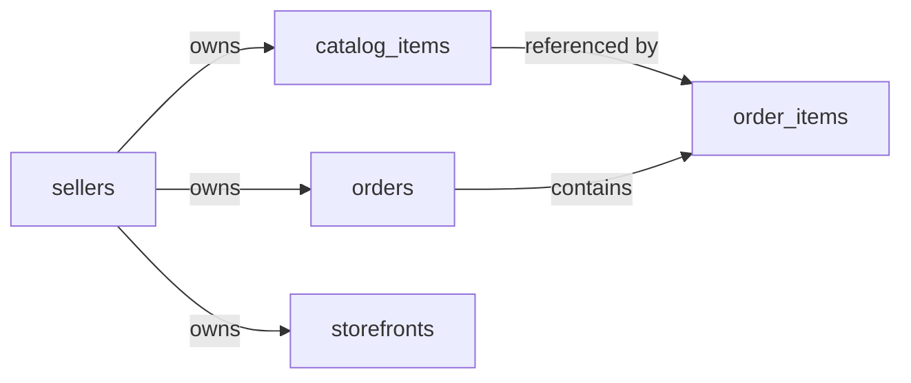

**Relationships**
Every domain table relates back to `sellers` (directly or transitively) — this is the spine of the entire schema, mirroring the product's own "seller owns everything" principle (Design DNA Principle 7) at the data-model level.

**Constraints**
1. **Normalize by default; denormalize only with a documented performance justification.** A computed/duplicated value (e.g., a cached `order_count` on `sellers`) is only acceptable when backed by a measured query-performance problem, never as a default convenience.
2. **No nullable foreign key unless the relationship is genuinely optional** — a nullable FK should represent "this genuinely might not exist," never "we didn't bother making it required."
3. **Enum-like fields use `check` constraints with explicit allowed values** (Engineering Handbook Chapter 11), not free text, unless the value set must grow dynamically without a migration (in which case, a proper lookup table).

**Indexes**
Every foreign key column gets an index by default — Postgres does not auto-index foreign keys, and every join in this schema is expected to use one.

**RLS Policies**
See Chapter 43 for the complete policy library — this chapter establishes that every table's RLS policy is written and reviewed in the *same* PR as the table's creation migration, never as follow-up work.

**Edge Cases**
A table needing both a seller-scoped view and a public (unauthenticated) view (e.g., `catalog_items` — seller sees drafts, public sees only published) requires two distinct RLS policies on one table (Chapter 15's Public Shop pattern), not two separate tables.

**Performance Considerations**
Normalization vs. denormalization tradeoffs are revisited whenever a specific table's read pattern is measured to be a bottleneck (Chapter 45) — never speculatively denormalized in advance.

**Migration Notes**
The canonical table skeleton (this chapter's SQL Example) should be the literal starting point copy-pasted for every new table's migration, ensuring consistency isn't an accident of habit but a template.

**Acceptance Criteria**
- [ ] Every new table's migration includes the `updated_at` trigger and RLS enablement in the same file as table creation.
- [ ] Every foreign key column has a corresponding index, verified via a schema audit script.

---

# 3. Complete ER Diagram

**Purpose**
Provide the single, authoritative, whole-schema entity relationship view — every subsequent chapter is a zoomed-in detail of this diagram.

**Schema**
Not applicable — this chapter is diagrammatic, not a new table definition.

**SQL Examples**
Not applicable.

**ER Diagrams**
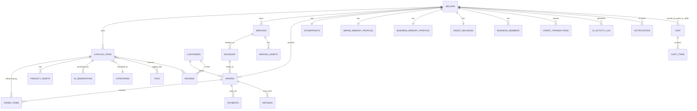

**Relationships**
`sellers` is the gravitational center of the schema — nearly every table either directly references `seller_id` or transitively reaches a seller through an intermediate table (e.g., `order_items` → `orders` → `sellers`). `customers` is the second center, scoped strictly per-seller-relationship (Chapter 7, AI Playbook Chapter 8).

**Constraints**
No table in this schema is an orphaned island — every table in this diagram has a documented path back to either `sellers` or `auth.users`.

**Indexes**
Not applicable at this whole-schema level — see Chapter 44 for the complete index strategy.

**RLS Policies**
Not applicable at this whole-schema level — see Chapter 43.

**Edge Cases**
As multi-tenant/agency support (Chapter 50) is added, this diagram's center of gravity shifts from `sellers` alone to `sellers` sitting beneath a `businesses`/`business_members` layer — the diagram is drawn today assuming that layer exists structurally (Chapter 5) even though only the `owner` role is populated currently.

**Performance Considerations**
This diagram is a useful mental model for query-planning discussions — any query touching more than 3 hops across this graph should be reviewed for a potential denormalization or materialized-view opportunity (Chapter 45).

**Migration Notes**
This diagram should be regenerated/reviewed at every major schema milestone — treat drift between this diagram and the actual schema as a documentation bug (Engineering Handbook Chapter 43).

**Acceptance Criteria**
- [ ] This diagram is reviewed and updated at every chapter's schema addition throughout this document.
- [ ] Every table introduced in Chapters 4–50 appears in this diagram or an explicitly justified exception is noted.

---

# 4. Schema Architecture

**Purpose**
Define how the schema is organized at the Postgres-schema (namespace) level and how migrations are structured to reflect this organization.

**Schema**
```sql
-- Postgres schema namespaces used across CowQ
create schema if not exists public;      -- primary application schema (default, most tables)
create schema if not exists analytics;   -- Chapter 26/27 — internal analytics, separated for access-control clarity
create schema if not exists audit;       -- Chapter 38 — audit logs, append-only, separated for retention/access clarity
-- auth.* and storage.* are Supabase-managed, never modified directly except via RLS policies
```

**SQL Examples**
```sql
-- Example of schema-qualified table creation
create table analytics.product_events (
  id uuid primary key default gen_random_uuid(),
  seller_id uuid not null,
  event_name text not null,
  properties jsonb,
  occurred_at timestamptz not null default now()
);
```

**ER Diagrams**
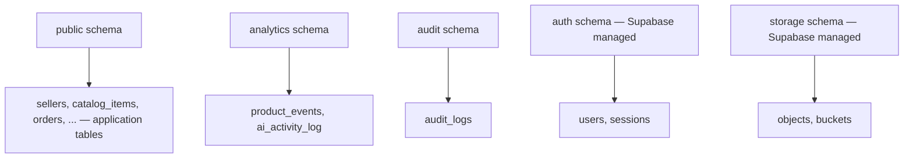

**Relationships**
Cross-schema foreign keys (e.g., `analytics.product_events.seller_id` referencing `public.sellers.id`) are permitted and expected — schema separation is about access-control and organizational clarity, not data isolation.

**Constraints**
Tables in `analytics` and `audit` schemas are never directly seller-writable via the Supabase client's anon/authenticated roles — writes happen exclusively through Edge Functions using the service role, consistent with Engineering Handbook Chapter 34's authorization discipline.

**Indexes**
Cross-schema foreign key columns are indexed identically to same-schema foreign keys (Chapter 2's default rule) — schema boundary doesn't change indexing discipline.

**RLS Policies**
`analytics.*` and `audit.*` tables have RLS enabled but with intentionally restrictive default policies (deny-by-default for direct client access) — these schemas are consumed by internal tooling and Edge Functions, not general application read paths.

**Edge Cases**
A table that starts in `public` but grows into a pattern better suited to `analytics` (e.g., a table that becomes purely internal-metrics-focused over time) can be moved via a documented migration — schema reassignment is a deliberate, reviewed action, not done casually given RLS/access implications.

**Performance Considerations**
Separating `analytics` into its own schema allows for future infrastructure separation (e.g., a dedicated read replica serving only analytics queries, Chapter 50) without touching the primary `public` schema's connection pool pressure.

**Migration Notes**
Schema creation (`create schema if not exists`) happens once, early, in the migration history — subsequent migrations reference the schema explicitly in every `create table` statement.

**Acceptance Criteria**
- [ ] Every table's schema-namespace placement (`public`/`analytics`/`audit`) is intentional and documented, not accidental.
- [ ] Zero direct client-side write access to `analytics.*` or `audit.*` tables, verified via RLS policy audit.

---

# 5. User System

**Purpose**
Define the foundational identity layer — how CowQ represents "a person" before they're specifically a seller or a customer.

**Schema**
```sql
-- auth.users is Supabase-managed (id, email, phone, encrypted_password, etc.)
-- CowQ extends it with a public profile table for data not natively in auth.users

create table user_profiles (
  id uuid primary key references auth.users(id) on delete cascade,
  display_name text,
  avatar_url text,
  phone_verified boolean not null default false,
  preferred_locale text not null default 'en-IN',
  deleted_at timestamptz,
  created_at timestamptz not null default now(),
  updated_at timestamptz not null default now()
);
```

**SQL Examples**
```sql
-- Auto-create a profile row whenever a new auth.users row is created
create or replace function handle_new_user()
returns trigger language plpgsql security definer as $$
begin
  insert into user_profiles (id, display_name) values (new.id, new.raw_user_meta_data->>'full_name');
  return new;
end;
$$;
create trigger trg_on_auth_user_created
  after insert on auth.users
  for each row execute function handle_new_user();
```

**ER Diagrams**
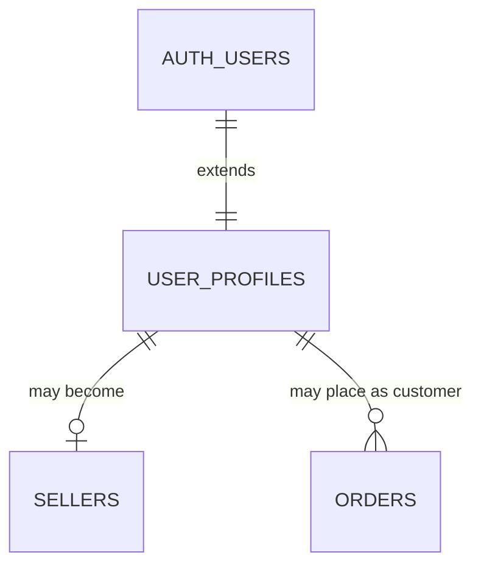

**Relationships**
`user_profiles.id` is a 1:1 extension of `auth.users.id` — every authenticated identity in CowQ has exactly one profile row. A given `user_profiles` row may *also* have a corresponding `sellers` row (Chapter 6) if that person runs a business, and/or place orders as a customer (Chapter 7) — these are not mutually exclusive roles.

**Constraints**
`user_profiles.id` has `on delete cascade` from `auth.users` — deleting an auth user removes their profile, but this cascades carefully (Edge Cases below) rather than cascading destructively through owned business data.

**Indexes**
```sql
create index idx_user_profiles_phone_verified on user_profiles(phone_verified) where deleted_at is null;
```

**RLS Policies**
```sql
alter table user_profiles enable row level security;

create policy "Users can view their own profile"
  on user_profiles for select using (id = auth.uid());

create policy "Users can update their own profile"
  on user_profiles for update using (id = auth.uid()) with check (id = auth.uid());

-- Public can view minimal profile fields for storefront attribution (e.g., seller display name)
-- implemented via a restricted view, not a broad table-level public policy
create view public_seller_display as
  select id, display_name, avatar_url from user_profiles where deleted_at is null;
```

**Edge Cases**
A user who deletes their auth account while owning an active seller business (Chapter 6) must not have their `sellers` row silently cascade-deleted — `sellers.owner_user_id` should use `on delete restrict` or trigger a business-continuity workflow (transfer/deactivation), never a silent cascade that could orphan live customer orders.

**Performance Considerations**
`user_profiles` is a small, frequently-read table (every authenticated request touches it indirectly via RLS `auth.uid()` checks) — kept intentionally lean, with heavier seller-specific or customer-specific data living in their respective specialized tables (Chapters 6, 7), not bloating this base table.

**Migration Notes**
The `handle_new_user()` trigger must be deployed before any user signup occurs in a given environment — this is a day-one migration, never retrofitted after real users exist without a backfill script for pre-existing `auth.users` rows.

**Acceptance Criteria**
- [ ] Every `auth.users` row has a corresponding `user_profiles` row, verified via a periodic consistency check.
- [ ] Account deletion never cascades into orphaning a live business's data without an explicit business-continuity step.

---

# 6. Seller System

**Purpose**
Define the core `sellers` table and its supporting business-membership structure — the anchor entity for nearly the entire schema.

**Schema**
```sql
create table sellers (
  id uuid primary key default gen_random_uuid(),
  owner_user_id uuid not null references auth.users(id) on delete restrict,
  business_name text not null,
  slug text not null unique,
  business_type text not null check (business_type in ('product', 'service', 'mixed')),
  verification_tier text not null default 'unverified'
    check (verification_tier in ('unverified', 'identity_verified', 'cowq_established')),
  onboarding_completed_at timestamptz,
  deleted_at timestamptz,
  created_at timestamptz not null default now(),
  updated_at timestamptz not null default now()
);

create table business_members (
  id uuid primary key default gen_random_uuid(),
  business_id uuid not null references sellers(id) on delete cascade,
  user_id uuid not null references auth.users(id) on delete cascade,
  role text not null default 'owner' check (role in ('owner', 'staff', 'agency_manager')),
  created_at timestamptz not null default now(),
  unique (business_id, user_id)
);
```

**SQL Examples**
```sql
-- Ensure a sellers row's owner is always also a business_members row (owner role)
create or replace function ensure_owner_membership()
returns trigger language plpgsql as $$
begin
  insert into business_members (business_id, user_id, role)
  values (new.id, new.owner_user_id, 'owner')
  on conflict (business_id, user_id) do nothing;
  return new;
end;
$$;
create trigger trg_seller_created_ensure_membership
  after insert on sellers
  for each row execute function ensure_owner_membership();
```

**ER Diagrams**
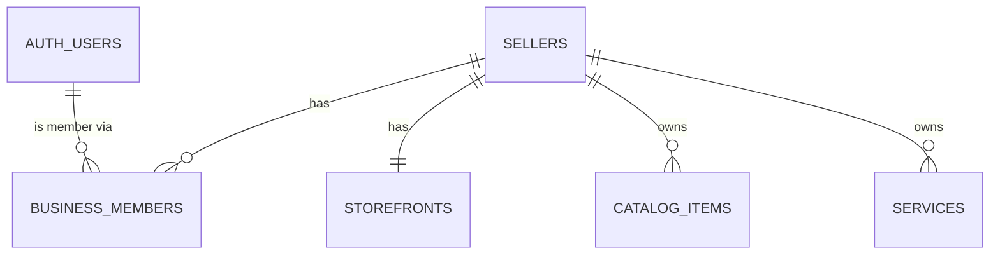

**Relationships**
`sellers` is referenced, directly or transitively, by nearly every other domain table in this Blueprint (Chapter 3's diagram). `business_members` is the future-ready authorization layer (Engineering Handbook Chapter 14) — populated with `owner` role today, ready for `staff`/`agency_manager` without a schema change when that need arrives (Product Bible Chapter 8's future personas).

**Constraints**
`sellers.slug` is globally unique (backs the public shop URL, Chapter 15) — enforced at the database level, never relying on application-code uniqueness checks alone.

**Indexes**
```sql
create unique index idx_sellers_slug on sellers(slug) where deleted_at is null;
create index idx_sellers_owner_user_id on sellers(owner_user_id);
create index idx_business_members_user_id on business_members(user_id);
```

**RLS Policies**
```sql
alter table sellers enable row level security;
alter table business_members enable row level security;

create policy "Business members can view their business"
  on sellers for select
  using (exists (select 1 from business_members where business_id = sellers.id and user_id = auth.uid()));

create policy "Owners can update their business"
  on sellers for update
  using (exists (select 1 from business_members where business_id = sellers.id and user_id = auth.uid() and role = 'owner'));

create policy "Members can view their own memberships"
  on business_members for select using (user_id = auth.uid());
```

**Edge Cases**
A `sellers.slug` change (a rebrand) must not break existing shared links/marketing materials referencing the old slug — a `seller_slug_history` table (redirect table) should be considered once this becomes a real, requested scenario (not built at launch, but the slug-uniqueness design anticipates needing this).

**Performance Considerations**
The `business_members` join is on the hot path for nearly every RLS-protected query in the system — its index on `(business_id, user_id)` (implicit via the unique constraint) and `user_id` alone must both be present and healthy; this is one of the most performance-critical index pairs in the entire schema.

**Migration Notes**
`business_members` is populated from day one (Engineering Handbook Chapter 14's explicit rule) even though only `owner` role exists in practice — this avoids a painful later migration to retrofit an authorization layer onto a schema that assumed 1:1 seller:user.

**Acceptance Criteria**
- [ ] Every `sellers` row has exactly one `business_members` row with `role = 'owner'` matching `owner_user_id`, verified via consistency check.
- [ ] `sellers.slug` uniqueness is enforced at the database constraint level.

---

# 7. Customer System

**Purpose**
Define the `customers` table — representing a person's relationship with a *specific* seller, strictly scoped per Product Bible Chapter 47's privacy commitments.

**Schema**
```sql
create table customers (
  id uuid primary key default gen_random_uuid(),
  seller_id uuid not null references sellers(id) on delete cascade,
  user_id uuid references auth.users(id), -- null for guest checkout customers
  name text not null,
  phone text,
  email text,
  delivery_addresses jsonb not null default '[]',
  deleted_at timestamptz,
  created_at timestamptz not null default now(),
  updated_at timestamptz not null default now()
);
```

**SQL Examples**
```sql
-- A customer row is per-seller by design — the SAME real person shopping
-- from two different CowQ sellers produces TWO separate customers rows,
-- never one shared row, per the strict privacy scoping this table enforces.
insert into customers (seller_id, user_id, name, phone)
values ('<seller-uuid>', '<auth-user-uuid-or-null>', 'Priya Sharma', '+919876543210');
```

**ER Diagrams**
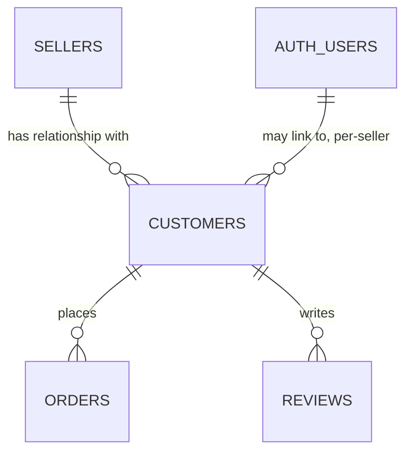

**Relationships**
This is a deliberately **denormalized-by-design** relationship: a real person with an `auth.users` account shopping at 3 different CowQ sellers produces 3 separate `customers` rows, each scoped to one `seller_id`, intentionally never joined or merged — this is the literal database implementation of AI Playbook Chapter 8's Customer Memory scoping rule.

**Constraints**
`customers.user_id` is nullable specifically to support guest checkout (Engineering Handbook Chapter 13) — a guest customer has a `customers` row with `user_id = null`, later linkable if they create an account.

**Indexes**
```sql
create index idx_customers_seller_id on customers(seller_id) where deleted_at is null;
create index idx_customers_user_id on customers(user_id) where user_id is not null;
create index idx_customers_phone on customers(seller_id, phone) where deleted_at is null;
```

**RLS Policies**
```sql
alter table customers enable row level security;

create policy "Sellers can view their own customers"
  on customers for select
  using (exists (select 1 from business_members where business_id = customers.seller_id and user_id = auth.uid()));

-- A customer (authenticated) can view their OWN customer rows across sellers —
-- this is the one legitimate cross-seller read, and it's scoped to "rows about me," never "rows visible to another seller"
create policy "Customers can view their own customer records"
  on customers for select using (user_id = auth.uid());
```

**Edge Cases**
A guest customer (`user_id = null`) who later creates a CowQ account with the same email/phone used at checkout should have their historical guest `customers` rows linkable to their new `user_id` — this requires an explicit, consent-based linking flow (Engineering Handbook Chapter 13's guest-cart-merge pattern, extended to historical order linking), never an automatic silent merge based on email/phone matching alone (which would risk incorrectly linking two different people who happen to share a contact detail).

**Performance Considerations**
Because `customers` is intentionally per-seller (not globally deduplicated), a very active shopper across many CowQ sellers accumulates many `customers` rows — this is an accepted, deliberate tradeoff (privacy over storage efficiency) and should never be "optimized" toward a shared/global customer table without a full privacy-architecture review.

**Migration Notes**
Any future migration proposing to merge or globally deduplicate `customers` rows across sellers must be treated as a privacy-architecture change requiring the same review rigor as an RLS policy change (Chapter 43), not a routine schema optimization.

**Acceptance Criteria**
- [ ] Zero database queries join `customers` rows across two different `seller_id` values for the same real person without an explicit, separate, privacy-reviewed mechanism.
- [ ] Guest-to-account linking requires explicit consent, never automatic silent matching.

---

# 8. Brand Memory Tables

**Purpose**
Full schema for Brand Memory (AI Playbook Chapter 6, Engineering Handbook Chapter 20) — a seller's tone, style, and terminology personalization profile.

**Schema**
```sql
create table brand_memory_profiles (
  seller_id uuid primary key references sellers(id) on delete cascade,
  tone text,
  preferred_terms text[] not null default '{}',
  avoided_terms text[] not null default '{}',
  photo_style_notes text,
  updated_at timestamptz not null default now()
);

create table brand_memory_corrections (
  id uuid primary key default gen_random_uuid(),
  seller_id uuid not null references sellers(id) on delete cascade,
  original_output text not null,
  corrected_output text not null,
  correction_type text not null check (correction_type in ('terminology', 'tone', 'length', 'other')),
  created_at timestamptz not null default now()
);
```

**SQL Examples**
```sql
-- Aggregation query informing the nightly job (AI Playbook Ch. 6)
select correction_type, count(*) as occurrences
from brand_memory_corrections
where seller_id = '<seller-uuid>' and created_at > now() - interval '30 days'
group by correction_type
having count(*) >= 3;  -- pattern threshold
```

**ER Diagrams**
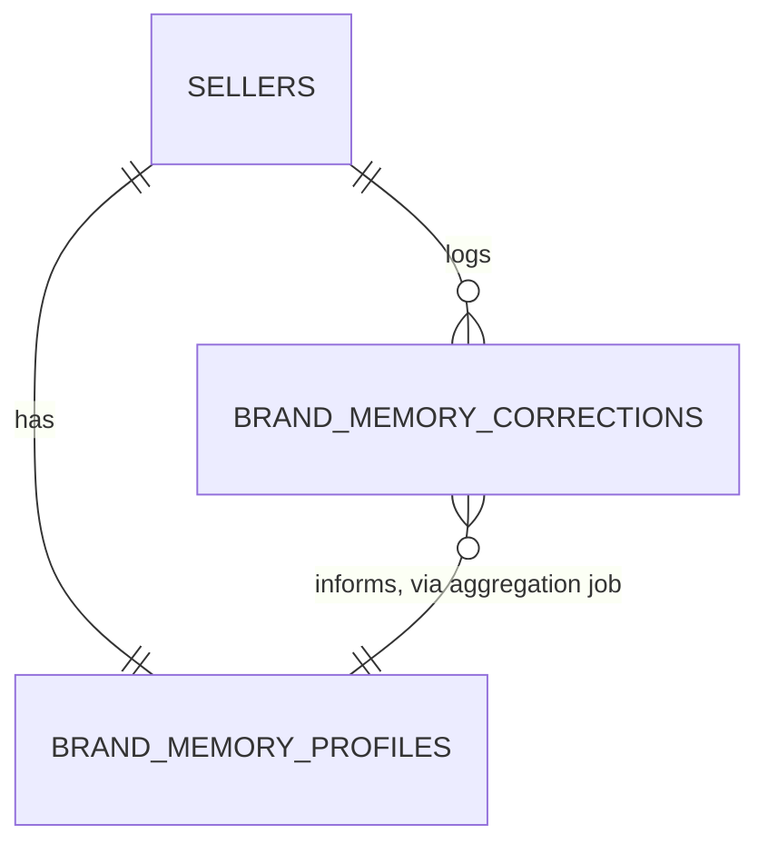

**Relationships**
`brand_memory_profiles` is 1:1 with `sellers` (every seller has exactly one profile, created at seller-creation time with sensible empty defaults). `brand_memory_corrections` is 1:many, an append-only log feeding the aggregation job.

**Constraints**
`preferred_terms`/`avoided_terms` are Postgres arrays, not a separate join table — chosen deliberately since these are small, seller-owned, frequently-read-together lists with no independent identity of their own (no "term" entity is ever queried across sellers).

**Indexes**
```sql
create index idx_brand_memory_corrections_seller_id on brand_memory_corrections(seller_id, created_at desc);
```

**RLS Policies**
```sql
alter table brand_memory_profiles enable row level security;
alter table brand_memory_corrections enable row level security;

create policy "Sellers manage their own brand memory"
  on brand_memory_profiles for all
  using (exists (select 1 from business_members where business_id = brand_memory_profiles.seller_id and user_id = auth.uid()));

create policy "Sellers view their own corrections log"
  on brand_memory_corrections for select
  using (exists (select 1 from business_members where business_id = brand_memory_corrections.seller_id and user_id = auth.uid()));
-- Inserts to corrections happen via Edge Function (service role) only — not directly client-writable
```

**Edge Cases**
`brand_memory_corrections` grows unboundedly over a seller's lifetime — a data-retention policy (e.g., archiving corrections older than 12 months to cold storage once the aggregation job has already incorporated their signal) should be planned before this table becomes a performance concern (Chapter 48).

**Performance Considerations**
The aggregation job's query pattern (grouping recent corrections by type) is well-served by the `(seller_id, created_at desc)` index — this is a write-heavy, append-only table with a narrow, predictable read pattern, ideal for this simple indexing strategy.

**Migration Notes**
`brand_memory_profiles` row creation should be triggered automatically at `sellers` row creation (mirroring Chapter 5's `handle_new_user` pattern), never left to be lazily created on first AI generation.

**Acceptance Criteria**
- [ ] Every `sellers` row has a corresponding `brand_memory_profiles` row from creation, verified via consistency check.
- [ ] Direct client writes to `brand_memory_corrections` are blocked at the RLS level — only Edge Functions (service role) may insert.

---

# 9. Business Memory Tables

**Purpose**
Full schema for Business Memory (AI Playbook Chapter 7) — a seller's operational pattern personalization: pricing philosophy, inventory behavior, fulfillment patterns.

**Schema**
```sql
create table business_memory_profiles (
  seller_id uuid primary key references sellers(id) on delete cascade,
  pricing_philosophy text check (pricing_philosophy in ('margin_protective', 'volume_driven', 'mixed', null)),
  inventory_behavior_notes text,
  fulfillment_pattern_notes text,
  updated_at timestamptz not null default now()
);

create table business_memory_signals (
  id uuid primary key default gen_random_uuid(),
  seller_id uuid not null references sellers(id) on delete cascade,
  signal_type text not null check (signal_type in ('pricing_decision', 'restock_timing', 'fulfillment_timing')),
  signal_data jsonb not null,
  created_at timestamptz not null default now()
);
```

**SQL Examples**
```sql
-- Recording a pricing-decision signal when a seller accepts/adjusts an AI price suggestion
insert into business_memory_signals (seller_id, signal_type, signal_data)
values (
  '<seller-uuid>',
  'pricing_decision',
  jsonb_build_object('suggested_cents', 45000, 'accepted_cents', 42000, 'product_id', '<product-uuid>')
);
```

**ER Diagrams**
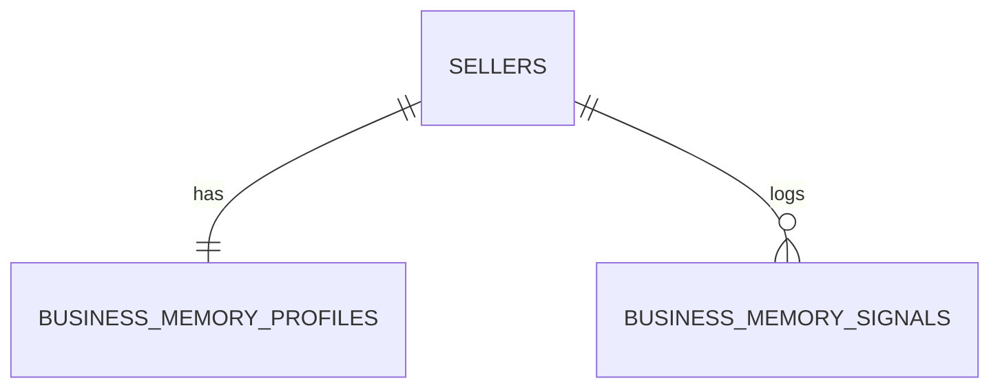

**Relationships**
Structurally identical in shape to Chapter 8's Brand Memory pair (a 1:1 profile plus a 1:many signal log) — deliberately mirrored so both memory systems are equally learnable/navigable by engineers and AI agents alike.

**Constraints**
`signal_data` is `jsonb` (heterogeneous by `signal_type`) rather than a rigid column set, since the three signal types genuinely have different shapes — this is one of the few justified `jsonb` uses in this Blueprint (Chapter 2's normalization-by-default principle notes this as an accepted exception for heterogeneous, append-only signal logs specifically).

**Indexes**
```sql
create index idx_business_memory_signals_seller_type on business_memory_signals(seller_id, signal_type, created_at desc);
```

**RLS Policies**
```sql
alter table business_memory_profiles enable row level security;
alter table business_memory_signals enable row level security;

create policy "Sellers manage their own business memory"
  on business_memory_profiles for all
  using (exists (select 1 from business_members where business_id = business_memory_profiles.seller_id and user_id = auth.uid()));

create policy "Sellers view their own business memory signals"
  on business_memory_signals for select
  using (exists (select 1 from business_members where business_id = business_memory_signals.seller_id and user_id = auth.uid()));
```

**Edge Cases**
A seller whose product mix spans genuinely different pricing philosophies (AI Playbook Chapter 7's edge case) is not yet supported by this single-profile-per-seller schema — the `business_memory_signals` log retains enough per-product-category granularity in its `signal_data` to support a future per-category profile extension without needing to re-collect historical signal data.

**Anti-patterns / Anti-conflation note**
Conflating Business Memory with Brand Memory in one table (Chapter 5's explicit anti-pattern, restated here specifically) is avoided — pricing philosophy and brand tone genuinely need to be reasoned about, tuned, and potentially exposed to the seller separately.

**Performance Considerations**
Identical to Chapter 8's Brand Memory considerations — append-only, narrow read pattern, well-served by its composite index.

**Migration Notes**
Deployed alongside `brand_memory_profiles` at the same schema milestone, given their structural symmetry and shared consumption pattern (both injected into the Context Engine, AI Playbook Chapter 9).

**Acceptance Criteria**
- [ ] Every `sellers` row has a corresponding `business_memory_profiles` row from creation.
- [ ] `signal_data` shape is validated per `signal_type` at the application/Edge-Function layer even though the column itself is `jsonb`.

---

# 10. AI Memory Tables

**Purpose**
Define Customer Memory (AI Playbook Chapter 8) and the shared AI confidence/activity infrastructure (AI Playbook Chapters 13, 17) at the schema level — the third memory type plus the cross-cutting AI governance tables.

**Schema**
```sql
-- Customer Memory: a VIEW, not a stored table (AI Playbook Ch. 8's explicit architecture)
create view customer_memory as
  select
    o.seller_id,
    o.customer_id,
    count(*) as order_count,
    sum(o.total_cents) as lifetime_value_cents,
    max(o.created_at) as last_order_at
  from orders o
  where o.status != 'cancelled'
  group by o.seller_id, o.customer_id;

create table ai_confidence_thresholds (
  action_type text primary key,
  high_min numeric not null check (high_min between 0 and 1),
  medium_min numeric not null check (medium_min between 0 and 1),
  version integer not null default 1,
  updated_at timestamptz not null default now()
);

create table ai_activity_log (
  id uuid primary key default gen_random_uuid(),
  seller_id uuid not null references sellers(id) on delete cascade,
  action_type text not null,
  confidence_tier text not null check (confidence_tier in ('high', 'medium', 'low')),
  confidence_score numeric,
  model_id text,
  model_version text,
  prompt_version text,
  latency_ms integer,
  cost_estimate_cents integer,
  guardrail_passed boolean,
  input_summary jsonb,
  output_summary jsonb,
  status text not null default 'applied' check (status in ('applied', 'suggested', 'accepted', 'dismissed', 'reverted')),
  outcome text check (outcome in ('accepted', 'dismissed', 'corrected', 'unused', null)),
  reversible boolean not null default true,
  created_at timestamptz not null default now()
);
```

**SQL Examples**
```sql
-- The exact query behind AI Playbook Ch. 13's quarterly threshold recalibration
select
  action_type,
  count(*) filter (where outcome = 'corrected') * 1.0 / nullif(count(*) filter (where confidence_tier = 'high'), 0) as high_tier_correction_rate
from ai_activity_log
where created_at > now() - interval '90 days'
group by action_type
having count(*) filter (where confidence_tier = 'high') > 50; -- minimum sample size
```

**ER Diagrams**
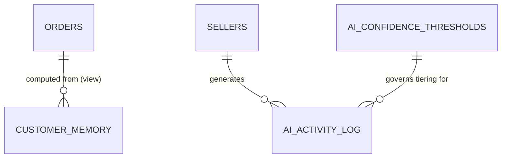

**Relationships**
`customer_memory` has no independent storage or relationships of its own — it's a live computation over `orders` (Chapter 16), inheriting that table's RLS boundary automatically, exactly as AI Playbook Chapter 8 mandates. `ai_activity_log` is the single, shared event log referenced by AI Playbook Chapters 13, 23, 28, 29 for confidence tuning, cost tracking, and quality scoring respectively.

**Constraints**
`ai_activity_log.confidence_tier` and `.outcome` use `check` constraints with the exact enum values this Blueprint's sibling documents (AI Playbook Chapters 13, 28) already specify — kept in lockstep, never independently redefined.

**Indexes**
```sql
create index idx_ai_activity_log_seller_action on ai_activity_log(seller_id, action_type, created_at desc);
create index idx_ai_activity_log_action_tier on ai_activity_log(action_type, confidence_tier, created_at desc);
```

**RLS Policies**
```sql
alter table ai_activity_log enable row level security;
alter table ai_confidence_thresholds enable row level security;

create policy "Sellers view their own AI activity log"
  on ai_activity_log for select
  using (exists (select 1 from business_members where business_id = ai_activity_log.seller_id and user_id = auth.uid()));
-- Inserts happen exclusively via Edge Functions (service role)

create policy "Confidence thresholds are internal-only, no public/seller access"
  on ai_confidence_thresholds for select using (false); -- deny by default; internal tooling uses service role
```

**Edge Cases**
`customer_memory`'s view definition excludes cancelled orders from lifetime-value computation — this is a deliberate business-logic choice embedded in the view (a cancelled order shouldn't count toward a customer's positive value signal), documented here so a future schema reader doesn't mistake the `where` clause for an oversight.

**Performance Considerations**
As a `view` (not materialized), `customer_memory` recomputes on every query — acceptable at current scale given `orders` is well-indexed by `(seller_id, customer_id)` (Chapter 16), but should be reconsidered as a materialized view refreshed on a schedule once query volume against it grows meaningfully (Chapter 50).

**Migration Notes**
`ai_activity_log`'s extended schema (model/version/cost/outcome fields) should be deployed as a single, complete migration rather than incrementally bolted on — AI Playbook Chapter 28 depends on the complete schema being present from the start of any dashboard built against it.

**Acceptance Criteria**
- [ ] `customer_memory` is verified, via query plan review, to correctly inherit `orders`' RLS scoping with no separate access path.
- [ ] Every field required by AI Playbook Chapter 28's analytics dashboards exists in `ai_activity_log` from initial deployment.

---

# 11. Products Schema

**Purpose**
Define `catalog_items` — the core products table, the single most important commerce entity for product-selling sellers.

**Schema**
```sql
create table catalog_items (
  id uuid primary key default gen_random_uuid(),
  seller_id uuid not null references sellers(id) on delete cascade,
  category_id uuid references categories(id),
  name text not null,
  description text,
  price_cents integer not null check (price_cents >= 0),
  compare_at_price_cents integer check (compare_at_price_cents is null or compare_at_price_cents > price_cents),
  stock_count integer,
  low_stock_threshold integer,
  suggested_stock_count integer,
  status text not null default 'draft' check (status in ('draft', 'published', 'archived')),
  deleted_at timestamptz,
  created_at timestamptz not null default now(),
  updated_at timestamptz not null default now()
);
```

**SQL Examples**
```sql
-- Active, published catalog view (Engineering Handbook Ch. 11's soft-delete pattern)
create view catalog_items_active as
  select * from catalog_items where deleted_at is null;

create view catalog_items_published as
  select * from catalog_items_active where status = 'published';
```

**ER Diagrams**
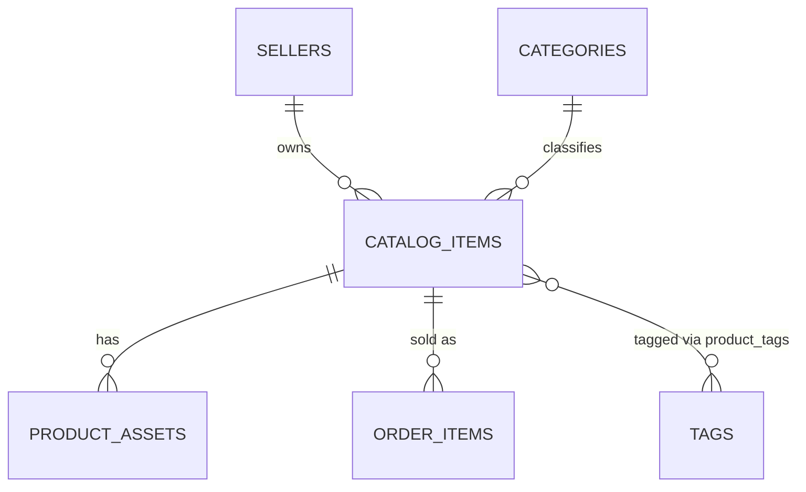

**Relationships**
`catalog_items.category_id` references the centrally-managed `categories` table (Chapter 34) — never a free-text category field, per Design DNA §51.7's fixed-taxonomy rule enforced at the schema level.

**Constraints**
`price_cents >= 0`, `compare_at_price_cents > price_cents` when present (enforces the "always show real discount" rule, Design DNA §52.7 — a discount price without a genuinely higher original is a constraint violation, not just a UI guideline).

**Indexes**
```sql
create index idx_catalog_items_seller_id on catalog_items(seller_id) where deleted_at is null;
create index idx_catalog_items_category_id on catalog_items(category_id) where deleted_at is null;
create index idx_catalog_items_status on catalog_items(seller_id, status) where deleted_at is null;
create index idx_catalog_items_low_stock on catalog_items(seller_id) where stock_count <= low_stock_threshold and deleted_at is null;
```

**RLS Policies**
```sql
alter table catalog_items enable row level security;

create policy "Sellers manage their own catalog items"
  on catalog_items for all
  using (exists (select 1 from business_members where business_id = catalog_items.seller_id and user_id = auth.uid()));

create policy "Public can view published catalog items"
  on catalog_items for select
  using (status = 'published' and deleted_at is null);
```

**Edge Cases**
`suggested_stock_count` (distinct from `stock_count`) is the exact schema-level enforcement of Engineering Handbook Chapter 11's rule that AI stock suggestions never silently overwrite seller-entered counts — this is repeated here as the canonical, load-bearing example of that principle at the products-table level specifically.

**Performance Considerations**
`catalog_items` is the highest-cardinality table for high-SKU sellers (the founder's own 1,400+-product shop is the reference scale) — the `(seller_id, status)` composite index is critical for the seller's own catalog-management screens, and `catalog_items_published` (filtered on `status`) is the hot path for public shop pages (Chapter 15).

**Migration Notes**
Adding new product attributes (e.g., a future `weight_grams` for shipping calculations) should follow the safe multi-step pattern (Engineering Handbook Chapter 47) given this table's expected high row count in production.

**Acceptance Criteria**
- [ ] `compare_at_price_cents` constraint is verified to reject any attempt to set a "discount" price that isn't genuinely lower than a real original price.
- [ ] Query plans against `catalog_items_published` for a public shop page confirm index usage (no sequential scan) at realistic catalog sizes.

---

# 12. Services Schema

**Purpose**
Define `services` — the parallel entity to `catalog_items` for service-based sellers (Product Bible Chapter 30), reflecting the availability-first model rather than the stock-first model.

**Schema**
```sql
create table services (
  id uuid primary key default gen_random_uuid(),
  seller_id uuid not null references sellers(id) on delete cascade,
  category_id uuid references categories(id),
  name text not null,
  description text,
  starting_price_cents integer not null check (starting_price_cents >= 0),
  pricing_type text not null default 'fixed' check (pricing_type in ('fixed', 'from', 'quote_required')),
  bookable boolean not null default true,
  duration_minutes integer,
  status text not null default 'draft' check (status in ('draft', 'published', 'archived')),
  deleted_at timestamptz,
  created_at timestamptz not null default now(),
  updated_at timestamptz not null default now()
);
```

**SQL Examples**
```sql
-- A non-bookable, quote-required service (Design DNA §51.4's "Get a quote" card variant)
insert into services (seller_id, name, starting_price_cents, pricing_type, bookable)
values ('<seller-uuid>', 'Custom Tailoring Consultation', 0, 'quote_required', false);
```

**ER Diagrams**
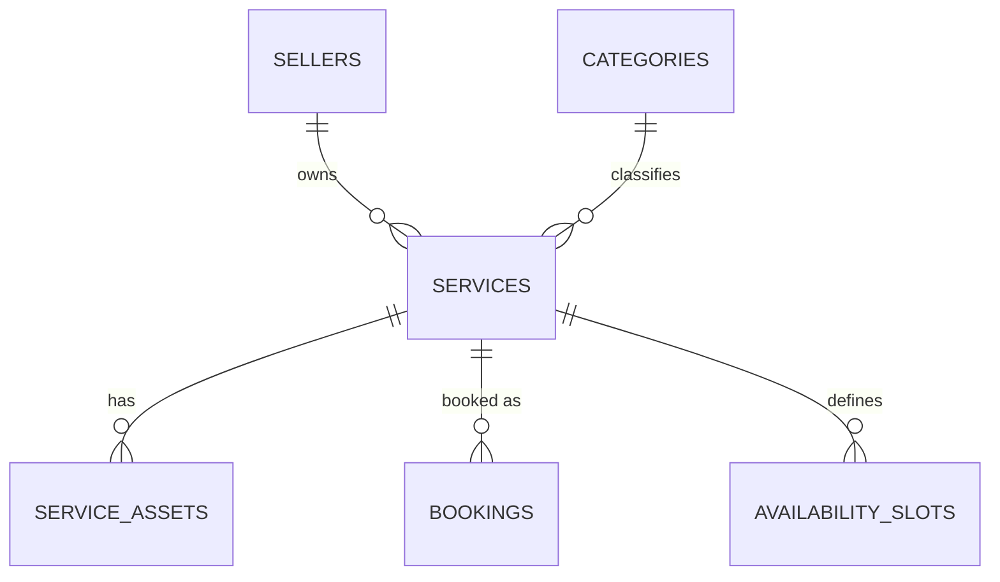

**Relationships**
`services` mirrors `catalog_items`' shape closely (same seller/category/status pattern) but diverges meaningfully on pricing (`pricing_type` enum, since services often can't have one fixed price) and adds `bookable`/`duration_minutes` for the booking system (Chapter 32).

**Constraints**
`quote_required` services have `starting_price_cents = 0` and `bookable = false` by convention — enforced at the application layer (a service with `pricing_type = 'quote_required'` shouldn't display a price or a booking flow), documented here since the database doesn't (and shouldn't) enforce this specific cross-field business rule via a rigid constraint, given it's a display/UX convention more than a data-integrity one.

**Indexes**
```sql
create index idx_services_seller_id on services(seller_id) where deleted_at is null;
create index idx_services_status on services(seller_id, status) where deleted_at is null;
```

**RLS Policies**
```sql
alter table services enable row level security;

create policy "Sellers manage their own services"
  on services for all
  using (exists (select 1 from business_members where business_id = services.seller_id and user_id = auth.uid()));

create policy "Public can view published services"
  on services for select
  using (status = 'published' and deleted_at is null);
```

**Edge Cases**
A seller who spans both products and services (Product Bible Chapter 30's home-baker example) has both `catalog_items` and `services` rows under the same `seller_id` — this is fully supported by the schema (both tables independently reference `sellers`), even though the checkout-flow integration between the two (Chapter 16's order model) remains a known, documented product gap per the Product Bible.

**Performance Considerations**
`services` is typically lower-cardinality per seller than `catalog_items` (most service businesses offer far fewer distinct services than a retailer offers products) — index strategy is correspondingly lighter-weight, with less concern about high-row-count query performance at this table specifically.

**Migration Notes**
Deployed alongside `catalog_items` given their structural similarity and shared consumption patterns (both feed the public shop, Chapter 15, and both are AI-generation targets, Chapter 24).

**Acceptance Criteria**
- [ ] A seller with both `catalog_items` and `services` rows is verified, via integration test, to have both surface correctly on their public shop page.

---

# 13. Product Assets

**Purpose**
Define how product photos (original and AI-generated) are represented in the database, linking `catalog_items` to actual stored files (Chapter 36).

**Schema**
```sql
create table product_assets (
  id uuid primary key default gen_random_uuid(),
  product_id uuid not null references catalog_items(id) on delete cascade,
  asset_type text not null check (asset_type in ('original', 'ai_generated')),
  storage_path text not null,
  unit_key text, -- e.g. 'angle_front', 'angle_side' — for partial regeneration (AI Playbook Ch. 21)
  version integer not null default 1,
  is_primary boolean not null default false,
  display_order integer not null default 0,
  deleted_at timestamptz,
  created_at timestamptz not null default now()
);
```

**SQL Examples**
```sql
-- Only one primary image per product, enforced via a partial unique index
create unique index idx_product_assets_one_primary
  on product_assets(product_id) where is_primary = true and deleted_at is null;

-- Current (latest-version) generated asset per unit_key
create unique index idx_product_assets_current_generated
  on product_assets(product_id, unit_key)
  where asset_type = 'ai_generated' and deleted_at is null;
```

**ER Diagrams**
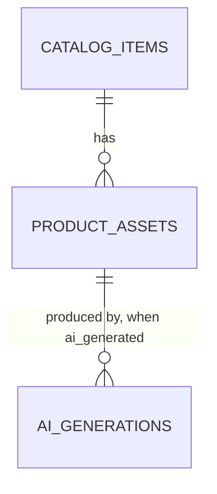

**Relationships**
`product_assets.storage_path` references a path within the `praan` Supabase Storage bucket (Chapter 36) — the database row is metadata; the actual file bytes live in Storage, linked by path convention.

**Constraints**
An `asset_type = 'original'` row's `storage_path` always sits under `.../original/` and is **never deleted or overwritten** by any AI process (Engineering Handbook Chapter 15's explicit rule) — enforced by convention and by the fact that AI-generation Edge Functions only ever `insert` new `ai_generated` rows, never `update`/`delete` `original` rows.

**Indexes**
```sql
create index idx_product_assets_product_id on product_assets(product_id) where deleted_at is null;
```

**RLS Policies**
```sql
alter table product_assets enable row level security;

create policy "Sellers manage their own product assets"
  on product_assets for all
  using (exists (
    select 1 from catalog_items c
    join business_members bm on bm.business_id = c.seller_id
    where c.id = product_assets.product_id and bm.user_id = auth.uid()
  ));

create policy "Public can view assets of published products"
  on product_assets for select
  using (exists (select 1 from catalog_items c where c.id = product_assets.product_id and c.status = 'published'));
```

**Edge Cases**
A product with zero assets (a seller who hasn't uploaded a photo yet) is a valid, expected state — the public shop page (Chapter 15) and catalog UI must handle this gracefully (an empty-state placeholder, Design DNA §32), never assuming at least one asset always exists.

**Performance Considerations**
The RLS policy's join through `catalog_items` → `business_members` (two hops) is more expensive than a direct `seller_id` check — an acceptable tradeoff here since `product_assets` doesn't carry its own `seller_id` (avoiding data duplication, Chapter 2's normalization principle), but this join pattern should be monitored under load and reconsidered (a denormalized `seller_id` column purely for RLS performance) if it becomes measurably slow (Chapter 45).

**Migration Notes**
The `unit_key` column (supporting partial regeneration, AI Playbook Chapter 21) should be present from this table's initial creation — retrofitting it after partial regeneration ships would require backfilling historical assets with inferred unit keys, a much harder migration than including it upfront.

**Acceptance Criteria**
- [ ] Zero code paths ever `update` or `delete` an `asset_type = 'original'` row — verified via codebase audit (Engineering Handbook Chapter 15's acceptance criterion, restated at the schema level).
- [ ] At most one `is_primary = true` row exists per product, enforced by the partial unique index.

---

# 14. Service Assets

**Purpose**
Define the parallel asset structure for services — photos, and eventually video, representing a service business rather than a physical product.

**Schema**
```sql
create table service_assets (
  id uuid primary key default gen_random_uuid(),
  service_id uuid not null references services(id) on delete cascade,
  asset_type text not null check (asset_type in ('original', 'ai_generated')),
  media_type text not null default 'image' check (media_type in ('image', 'video')),
  storage_path text not null,
  is_primary boolean not null default false,
  display_order integer not null default 0,
  deleted_at timestamptz,
  created_at timestamptz not null default now()
);
```

**SQL Examples**
```sql
create unique index idx_service_assets_one_primary
  on service_assets(service_id) where is_primary = true and deleted_at is null;
```

**ER Diagrams**
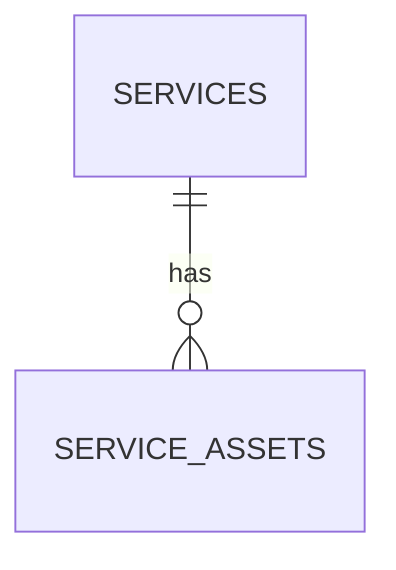

**Relationships**
Structurally identical to `product_assets` (Chapter 13), with the addition of `media_type` since service assets are more likely to include video (Product Bible Chapter 30's "video for services" roadmap item) from an earlier point than product assets currently do.

**Constraints**
Same original-never-overwritten rule as `product_assets`, applied identically.

**Indexes**
```sql
create index idx_service_assets_service_id on service_assets(service_id) where deleted_at is null;
```

**RLS Policies**
```sql
alter table service_assets enable row level security;

create policy "Sellers manage their own service assets"
  on service_assets for all
  using (exists (
    select 1 from services s
    join business_members bm on bm.business_id = s.seller_id
    where s.id = service_assets.service_id and bm.user_id = auth.uid()
  ));

create policy "Public can view assets of published services"
  on service_assets for select
  using (exists (select 1 from services s where s.id = service_assets.service_id and s.status = 'published'));
```

**Edge Cases**
A service asset that's a video (once video-for-services ships, AI Playbook Chapter 19's future expansion) needs a larger `storage_path`-adjacent metadata set (duration, thumbnail path) — this chapter's schema should be extended with a `duration_seconds` and `thumbnail_storage_path` column at that point, added via a safe, additive migration (Chapter 49), not a breaking change to this table's current shape.

**Performance Considerations**
Identical to `product_assets` — lower row count expected per seller than product assets (fewer services than products, typically), so RLS join-performance concerns are correspondingly lower priority here.

**Migration Notes**
Deployed alongside `services` (Chapter 12).

**Acceptance Criteria**
- [ ] Structurally verified to mirror `product_assets`' constraints and RLS pattern exactly, for consistency.

---

# 15. Public Shop Tables

**Purpose**
Define `storefronts` and its supporting section/collection tables — the public shop page's data model (Design DNA §51.1, Engineering Handbook Chapter 23).

**Schema**
```sql
create table storefronts (
  id uuid primary key default gen_random_uuid(),
  seller_id uuid not null unique references sellers(id) on delete cascade,
  hero_image_storage_path text,
  tagline text,
  sections jsonb not null default '[]',
  published boolean not null default false,
  updated_at timestamptz not null default now()
);

create table collections (
  id uuid primary key default gen_random_uuid(),
  seller_id uuid not null references sellers(id) on delete cascade,
  name text not null,
  collection_type text not null default 'seller_curated'
    check (collection_type in ('seller_curated', 'system_new', 'system_bestsellers')),
  display_order integer not null default 0,
  deleted_at timestamptz,
  created_at timestamptz not null default now()
);

create table collection_items (
  collection_id uuid not null references collections(id) on delete cascade,
  product_id uuid not null references catalog_items(id) on delete cascade,
  display_order integer not null default 0,
  primary key (collection_id, product_id)
);
```

**SQL Examples**
```sql
-- Collections require a minimum of 4 products to publish (Design DNA §51.8)
create or replace function collection_meets_minimum(p_collection_id uuid)
returns boolean language sql as $$
  select count(*) >= 4 from collection_items where collection_id = p_collection_id;
$$;
```

**ER Diagrams**
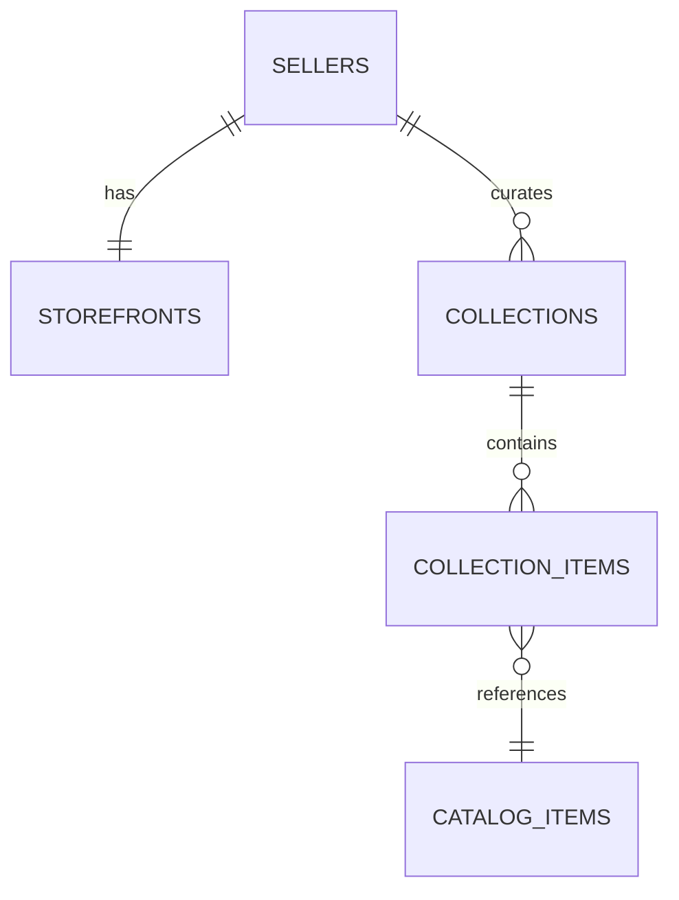

**Relationships**
`storefronts.sections` is a `jsonb` array whose `type` field must validate against the fixed enum (`hero`, `featured`, `grid`, `about`, `trust_strip`) at the application layer (Engineering Handbook Chapter 23's explicit rule — this is the second justified `jsonb` exception in this Blueprint, alongside Chapter 9's signal log, both cases of ordered, heterogeneous-but-bounded structure that doesn't warrant a full relational breakdown).

**Constraints**
`storefronts.seller_id` is `unique` (1:1 with sellers) — every seller has exactly one storefront row, created at seller-creation time.

**Indexes**
```sql
create index idx_collections_seller_id on collections(seller_id) where deleted_at is null;
create index idx_collection_items_product_id on collection_items(product_id);
```

**RLS Policies**
```sql
alter table storefronts enable row level security;
alter table collections enable row level security;
alter table collection_items enable row level security;

create policy "Sellers manage their own storefront"
  on storefronts for all
  using (exists (select 1 from business_members where business_id = storefronts.seller_id and user_id = auth.uid()));

create policy "Public can view published storefronts"
  on storefronts for select using (published = true);

create policy "Sellers manage their own collections"
  on collections for all
  using (exists (select 1 from business_members where business_id = collections.seller_id and user_id = auth.uid()));

create policy "Public can view collections of published storefronts"
  on collections for select
  using (exists (select 1 from storefronts sf where sf.seller_id = collections.seller_id and sf.published = true));
```

**Edge Cases**
A system-generated collection (`collection_type = 'system_new'`/`'system_bestsellers'`) that drops below the 4-product minimum (e.g., products get unpublished) should be automatically excluded from public display by the query layer checking `collection_meets_minimum()`, rather than requiring an explicit row deletion/recreation cycle every time membership fluctuates near the threshold.

**Performance Considerations**
System collections (Engineering Handbook Chapter 24) are computed by a scheduled job that writes into `collection_items`, not queried live/aggregated on every storefront page load — this table is read-optimized by design, with write cost absorbed by the background job.

**Migration Notes**
`storefronts` row creation should be triggered automatically at `sellers` creation (mirroring Chapters 5, 8, 9's auto-creation pattern) with `published = false` as the safe default until the seller explicitly publishes.

**Acceptance Criteria**
- [ ] Every `sellers` row has exactly one `storefronts` row, verified via consistency check.
- [ ] Zero system collections with fewer than 4 items are ever served on a public storefront query, verified via integration test.

---

# 16. Orders

**Purpose**
Define the `orders` table — the central commerce entity implementing the five-state order lifecycle (Design DNA §52.4, Engineering Handbook Chapter 26).

**Schema**
```sql
create table orders (
  id uuid primary key default gen_random_uuid(),
  seller_id uuid not null references sellers(id) on delete restrict,
  customer_id uuid not null references customers(id) on delete restrict,
  status text not null default 'placed'
    check (status in ('placed', 'confirmed', 'preparing', 'out_for_delivery', 'completed', 'cancelled', 'refunded')),
  order_type text not null default 'product' check (order_type in ('product', 'service', 'mixed')),
  subtotal_cents integer not null check (subtotal_cents >= 0),
  delivery_fee_cents integer not null default 0,
  total_cents integer not null check (total_cents >= 0),
  delivery_address jsonb,
  deleted_at timestamptz,
  created_at timestamptz not null default now(),
  updated_at timestamptz not null default now()
);

create table order_status_history (
  id uuid primary key default gen_random_uuid(),
  order_id uuid not null references orders(id) on delete cascade,
  status text not null,
  occurred_at timestamptz not null default now()
);
```

**SQL Examples**
```sql
-- Status change trigger: every update to orders.status appends to history (append-only, Engineering Handbook Ch. 26)
create or replace function log_order_status_change()
returns trigger language plpgsql as $$
begin
  if new.status is distinct from old.status then
    insert into order_status_history (order_id, status) values (new.id, new.status);
  end if;
  return new;
end;
$$;
create trigger trg_orders_status_history
  after update on orders
  for each row execute function log_order_status_change();
```

**ER Diagrams**
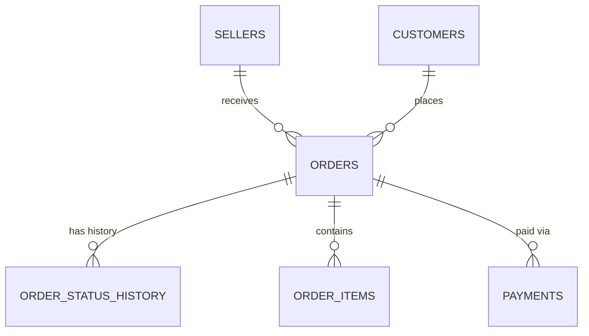

**Relationships**
`orders.customer_id` uses `on delete restrict`, not `cascade` — an order is a permanent financial/legal record and must never be silently deleted as a side effect of a `customers` row change (a genuinely important distinction from most other `on delete cascade` relationships in this Blueprint).

**Constraints**
`status` uses the exact five-state-plus-two-branches enum established across CowQ's sibling documents (Design DNA §52.4) — this enum must never diverge between this table's `check` constraint and the application-layer `OrderStatus` type (Engineering Handbook Chapter 4's naming-consistency rule).

**Indexes**
```sql
create index idx_orders_seller_id on orders(seller_id, created_at desc) where deleted_at is null;
create index idx_orders_customer_id on orders(customer_id, created_at desc);
create index idx_orders_status on orders(seller_id, status) where deleted_at is null;
create index idx_order_status_history_order_id on order_status_history(order_id, occurred_at);
```

**RLS Policies**
```sql
alter table orders enable row level security;
alter table order_status_history enable row level security;

create policy "Sellers view and manage their own orders"
  on orders for all
  using (exists (select 1 from business_members where business_id = orders.seller_id and user_id = auth.uid()));

create policy "Customers view their own orders"
  on orders for select
  using (exists (select 1 from customers c where c.id = orders.customer_id and c.user_id = auth.uid()));

create policy "Order status history visible to order participants"
  on order_status_history for select
  using (exists (
    select 1 from orders o
    where o.id = order_status_history.order_id
    and (
      exists (select 1 from business_members where business_id = o.seller_id and user_id = auth.uid())
      or exists (select 1 from customers c where c.id = o.customer_id and c.user_id = auth.uid())
    )
  ));
```

**Edge Cases**
`order_type = 'mixed'` (a single order spanning both a product and a service, Engineering Handbook Chapter 25's noted edge case) is schema-supported by this table's design (order_items, Chapter 17, can reference either a `catalog_items` or `services` row) even though the checkout-flow UI integration for this case remains an acknowledged, unresolved product gap per the Product Bible.

**Performance Considerations**
`orders` is a high-write, high-read table at scale — the `(seller_id, created_at desc)` index serves the seller's order-list screen (the most frequent query pattern), while `(seller_id, status)` serves status-filtered views; both are essential, not redundant, given genuinely different query shapes.

**Migration Notes**
The `status` check constraint's enum values must be updated via a reviewed migration in exact lockstep with any change to the application-layer `OrderStatus` type — never let these drift, since an application status value not covered by the constraint would cause writes to fail unexpectedly in production.

**Acceptance Criteria**
- [ ] 100% of orders have a complete, append-only status history from creation (Design DNA §52.4's acceptance criterion, restated).
- [ ] `orders.customer_id`'s `on delete restrict` is verified via test to actually block customer-row deletion when orders exist.

---

# 17. Order Items

**Purpose**
Define `order_items` — the line-item detail within an order, supporting both product and service line items.

**Schema**
```sql
create table order_items (
  id uuid primary key default gen_random_uuid(),
  order_id uuid not null references orders(id) on delete cascade,
  item_type text not null check (item_type in ('product', 'service')),
  product_id uuid references catalog_items(id),
  service_id uuid references services(id),
  booking_id uuid references bookings(id),
  name_snapshot text not null,
  unit_price_cents integer not null check (unit_price_cents >= 0),
  quantity integer not null default 1 check (quantity > 0),
  line_total_cents integer not null check (line_total_cents >= 0),
  created_at timestamptz not null default now(),
  constraint chk_item_type_reference check (
    (item_type = 'product' and product_id is not null and service_id is null) or
    (item_type = 'service' and service_id is not null and product_id is null)
  )
);
```

**SQL Examples**
```sql
-- name_snapshot exists so a later product-name edit never retroactively
-- alters a historical order's display — a genuine "snapshot at time of sale" field.
insert into order_items (order_id, item_type, product_id, name_snapshot, unit_price_cents, quantity, line_total_cents)
values ('<order-uuid>', 'product', '<product-uuid>', 'Blue Cotton Kurta', 89900, 1, 89900);
```

**ER Diagrams**
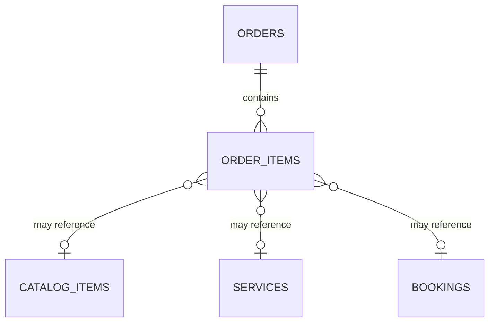

**Relationships**
The `chk_item_type_reference` constraint enforces exactly-one-of `product_id`/`service_id` at the database level — a much stronger guarantee than an application-layer-only check, directly preventing the kind of data inconsistency that would otherwise require defensive coding in every consumer of this table.

**Constraints**
`name_snapshot` and `unit_price_cents` are deliberately duplicated from the source `catalog_items`/`services` row at order-creation time (a justified denormalization, Chapter 2's exception) — an order's historical record must never change retroactively because a seller later edits their product name or price.

**Indexes**
```sql
create index idx_order_items_order_id on order_items(order_id);
create index idx_order_items_product_id on order_items(product_id) where product_id is not null;
create index idx_order_items_service_id on order_items(service_id) where service_id is not null;
```

**RLS Policies**
```sql
alter table order_items enable row level security;

create policy "Order items visible to order participants"
  on order_items for select
  using (exists (
    select 1 from orders o
    where o.id = order_items.order_id
    and (
      exists (select 1 from business_members where business_id = o.seller_id and user_id = auth.uid())
      or exists (select 1 from customers c where c.id = o.customer_id and c.user_id = auth.uid())
    )
  ));
```

**Edge Cases**
A product deleted (soft-deleted, Chapter 11) after being ordered must not break historical `order_items` display — since `name_snapshot`/`unit_price_cents` are already captured independently, the order_item row remains fully displayable even if `product_id` points to a now-soft-deleted `catalog_items` row; the `product_id` FK is retained purely for potential "buy again" linking, not as the source of truth for historical display.

**Performance Considerations**
`order_items` is read alongside `orders` in nearly every order-detail query — a single joined query (`orders` + `order_items`) is the standard access pattern, well-served by the `order_id` index.

**Migration Notes**
The `chk_item_type_reference` constraint should be included from this table's initial migration — retrofitting a check constraint onto a populated table requires validating all existing rows against it, a nontrivial migration step best avoided by getting it right from the start.

**Acceptance Criteria**
- [ ] Every `order_items` row satisfies the exactly-one-of product/service constraint, verified at the database level (not just application code).
- [ ] Historical order display is verified, via test, to remain correct after the referenced product is soft-deleted or price-edited.

---

# 18. Cart

**Purpose**
Define `cart` and `cart_items` — the pre-order, per-shop cart structure (Design DNA §52.1, Engineering Handbook Chapter 13's guest-cart-merge pattern).

**Schema**
```sql
create table cart (
  id uuid primary key default gen_random_uuid(),
  seller_id uuid not null references sellers(id) on delete cascade,
  user_id uuid references auth.users(id), -- null for guest (session-based) carts
  session_id text, -- for guest carts, client-generated, stable across the session
  created_at timestamptz not null default now(),
  updated_at timestamptz not null default now()
);

create table cart_items (
  id uuid primary key default gen_random_uuid(),
  cart_id uuid not null references cart(id) on delete cascade,
  product_id uuid not null references catalog_items(id) on delete cascade,
  quantity integer not null default 1 check (quantity > 0),
  created_at timestamptz not null default now(),
  unique (cart_id, product_id)
);
```

**SQL Examples**
```sql
-- Guest cart merge on login (Engineering Handbook Ch. 13)
create or replace function merge_guest_cart_to_user(p_session_id text, p_user_id uuid, p_seller_id uuid)
returns void language plpgsql as $$
declare
  v_guest_cart_id uuid;
  v_user_cart_id uuid;
begin
  select id into v_guest_cart_id from cart where session_id = p_session_id and seller_id = p_seller_id and user_id is null;
  select id into v_user_cart_id from cart where user_id = p_user_id and seller_id = p_seller_id;
  if v_user_cart_id is null then
    update cart set user_id = p_user_id, session_id = null where id = v_guest_cart_id;
  else
    -- merge items, summing quantities on conflict, then discard the guest cart
    insert into cart_items (cart_id, product_id, quantity)
      select v_user_cart_id, product_id, quantity from cart_items where cart_id = v_guest_cart_id
      on conflict (cart_id, product_id) do update set quantity = cart_items.quantity + excluded.quantity;
    delete from cart where id = v_guest_cart_id;
  end if;
end;
$$;
```

**ER Diagrams**
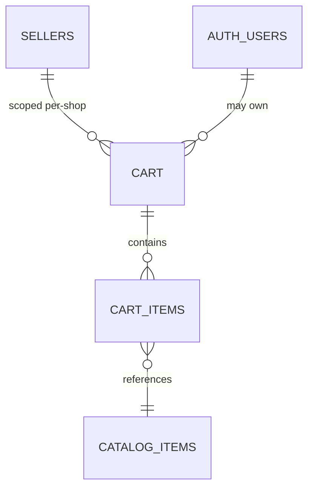

**Relationships**
`cart` is strictly per-`seller_id` (Design DNA §52.1 Rule 1 — never a cross-seller cart) — a customer shopping at two different sellers has two entirely separate `cart` rows, mirroring the same per-seller scoping philosophy already established for `customers` (Chapter 7).

**Constraints**
Exactly one of `user_id`/`session_id` is populated at any time (a cart is either guest or user-owned, transitioning via the merge function, never both simultaneously) — enforced at the application layer given the transitional nature of this state, rather than a rigid database constraint that would complicate the merge operation itself.

**Indexes**
```sql
create unique index idx_cart_user_seller on cart(user_id, seller_id) where user_id is not null;
create unique index idx_cart_session_seller on cart(session_id, seller_id) where session_id is not null;
create index idx_cart_items_cart_id on cart_items(cart_id);
```

**RLS Policies**
```sql
alter table cart enable row level security;
alter table cart_items enable row level security;

create policy "Users manage their own cart"
  on cart for all using (user_id = auth.uid());
-- Guest cart access is via a signed session token verified in an Edge Function,
-- not a direct RLS policy (guest sessions have no auth.uid()) — guest cart
-- mutations route through a dedicated Edge Function using the service role.

create policy "Cart items follow cart ownership"
  on cart_items for all
  using (exists (select 1 from cart where cart.id = cart_items.cart_id and cart.user_id = auth.uid()));
```

**Edge Cases**
A guest cart abandoned for an extended period (never converted to a purchase or merged into an account) should be subject to a defined cleanup/expiry policy (e.g., deleted after 30 days of inactivity) — carts are not permanent records like orders, and unbounded guest-cart accumulation is a real, if minor, storage-growth concern at scale (Chapter 50).

**Performance Considerations**
Cart reads/writes are high-frequency, low-latency-sensitive operations (every quantity change, Design DNA §52.1's optimistic-update UX) — this table should remain lean and fast, with no heavy joins required for the common "get my cart for this seller" query, served directly by the `(user_id, seller_id)` unique index.

**Migration Notes**
The guest-to-user merge function (SQL Example above) should be thoroughly tested before the guest-checkout feature (Engineering Handbook Chapter 13) ships, given its correctness is directly load-bearing for a core, trust-sensitive commerce flow.

**Acceptance Criteria**
- [ ] Zero cross-seller carts are possible in the data model, enforced by `cart.seller_id` being required and the unique indexes being seller-scoped.
- [ ] Guest cart merge is verified, via automated test, to correctly sum quantities rather than duplicate or overwrite on conflict.

---

# 19. Payments (Future-Ready)

**Purpose**
Define `payments` as its own domain, distinct from order status, per Engineering Handbook Chapter 25's future-ready architecture rationale.

**Schema**
```sql
create table payments (
  id uuid primary key default gen_random_uuid(),
  order_id uuid not null references orders(id) on delete restrict,
  gateway text not null,
  gateway_payment_id text,
  method text check (method in ('upi', 'card', 'netbanking', null)),
  amount_cents integer not null check (amount_cents >= 0),
  status text not null check (status in ('pending', 'processing', 'succeeded', 'failed', 'refunded')),
  failure_reason text,
  created_at timestamptz not null default now(),
  updated_at timestamptz not null default now()
);
```

**SQL Examples**
```sql
-- Idempotent webhook status update (Engineering Handbook Ch. 25's monotonic-transition rule)
create or replace function apply_payment_status_update(p_gateway_payment_id text, p_new_status text)
returns void language plpgsql as $$
declare
  v_current_status text;
  v_status_rank constant jsonb := '{"pending": 0, "processing": 1, "succeeded": 2, "failed": 2, "refunded": 3}';
begin
  select status into v_current_status from payments where gateway_payment_id = p_gateway_payment_id;
  if (v_status_rank->>p_new_status)::int > (v_status_rank->>v_current_status)::int then
    update payments set status = p_new_status, updated_at = now() where gateway_payment_id = p_gateway_payment_id;
  end if; -- else: out-of-order webhook, silently ignored, per Ch. 25's idempotency rule
end;
$$;
```

**ER Diagrams**
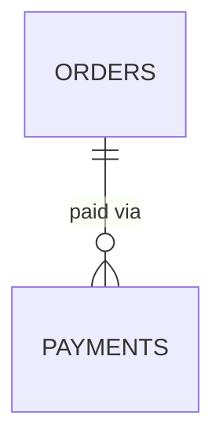

**Relationships**
`payments.order_id` uses `on delete restrict` — same financial-record-permanence rule as `orders.customer_id` (Chapter 16). `payments` is deliberately NOT merged into `orders` (Engineering Handbook Chapter 25's explicit anti-pattern warning) — kept separate specifically so CowQ's future own payment-processing product surface (Product Bible Chapter 4) can extend this table without touching the `orders` table's shape at all.

**Constraints**
`status` transitions are application-enforced as monotonic (via `apply_payment_status_update`, never a raw `UPDATE`) — the database doesn't use a trigger-level constraint for this specific rule since the "monotonic" ordering is business logic, not a structural invariant expressible cleanly in a `check` constraint.

**Indexes**
```sql
create index idx_payments_order_id on payments(order_id);
create unique index idx_payments_gateway_payment_id on payments(gateway_payment_id) where gateway_payment_id is not null;
```

**RLS Policies**
```sql
alter table payments enable row level security;

create policy "Sellers view payments for their own orders"
  on payments for select
  using (exists (select 1 from orders o join business_members bm on bm.business_id = o.seller_id where o.id = payments.order_id and bm.user_id = auth.uid()));
-- All writes happen via the payment-webhook Edge Function (service role) only —
-- no direct client insert/update policy exists for this table.
```

**Edge Cases**
A payment webhook that arrives for an `order_id` that doesn't exist yet (a genuine race condition between order creation and an unexpectedly fast webhook) should be handled by the Edge Function with a short retry/wait, not a hard failure — this is an integration-timing edge case worth explicit handling given webhook delivery ordering isn't guaranteed.

**Performance Considerations**
`payments` is a relatively low-cardinality table per order (typically one row, occasionally two or three for retried payment attempts) — indexing needs are modest; the `gateway_payment_id` unique index is the critical one, serving webhook lookups.

**Migration Notes**
This table's schema is deliberately built now, ahead of CowQ's own payment-processing product ambitions (Product Bible Chapter 4), specifically so that future expansion is additive (new columns, new related tables) rather than a breaking rearchitecture of a table already carrying live financial data.

**Acceptance Criteria**
- [ ] Payment status updates are verified, via test, to never regress backward on an out-of-order webhook (Engineering Handbook Chapter 25's acceptance criterion).
- [ ] Zero direct client-side write access to `payments`, verified via RLS policy audit.

---

# 20. Transactions

**Purpose**
Define a unifying `financial_transactions` ledger view/table that ties together payments, refunds, and (future) payouts into one auditable financial trail — distinct from `payments` (gateway-facing) and `credit_transactions` (Chapter 22, CowQ's internal credit economy).

**Schema**
```sql
create table refunds (
  id uuid primary key default gen_random_uuid(),
  order_id uuid not null references orders(id) on delete restrict,
  payment_id uuid not null references payments(id) on delete restrict,
  amount_cents integer not null check (amount_cents > 0),
  reason text not null,
  line_items jsonb, -- itemized: which order_items, what amount each (Engineering Handbook Ch. 25/52.5)
  status text not null default 'pending' check (status in ('pending', 'processing', 'succeeded', 'failed')),
  created_at timestamptz not null default now(),
  updated_at timestamptz not null default now()
);
```

**SQL Examples**
```sql
-- A unifying financial view for reporting/audit purposes (Chapter 26/38)
create view financial_transactions as
  select id, order_id, 'payment' as transaction_type, amount_cents, status, created_at from payments
  union all
  select id, order_id, 'refund' as transaction_type, -amount_cents as amount_cents, status, created_at from refunds;
```

**ER Diagrams**
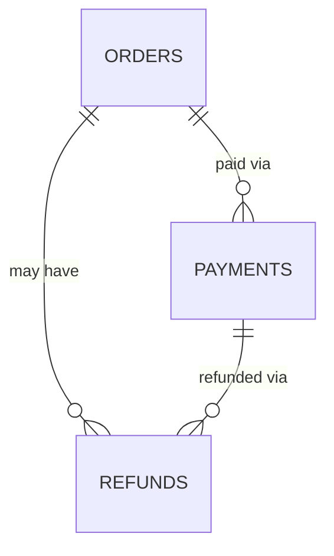

**Relationships**
`refunds.payment_id` ties a refund back to the specific payment it's reversing — necessary for reconciliation with the gateway, since a refund is processed against a specific original payment transaction, not against the order in the abstract.

**Constraints**
`refunds.line_items` (itemized cause, Design DNA §52.5's requirement that partial refunds show exactly which items/amounts) is `jsonb` here as another justified heterogeneous-structure exception, though a fully normalized `refund_line_items` table (mirroring `order_items`) should be considered once refund-reporting needs grow beyond simple display (Future Scaling, Chapter 50).

**Indexes**
```sql
create index idx_refunds_order_id on refunds(order_id);
create index idx_refunds_payment_id on refunds(payment_id);
```

**RLS Policies**
```sql
alter table refunds enable row level security;

create policy "Sellers view refunds for their own orders"
  on refunds for select
  using (exists (select 1 from orders o join business_members bm on bm.business_id = o.seller_id where o.id = refunds.order_id and bm.user_id = auth.uid()));

create policy "Customers view refunds for their own orders"
  on refunds for select
  using (exists (select 1 from orders o join customers c on c.id = o.customer_id where o.id = refunds.order_id and c.user_id = auth.uid()));
```

**Edge Cases**
A refund exceeding the original payment amount (a data-integrity error, never a legitimate business case) should be rejected by an application-layer check before insert — a database-level `check` constraint comparing `refunds.amount_cents` against the referenced `payments.amount_cents` (minus any prior refunds) is a stronger guarantee worth adding via a trigger once refund volume justifies the added complexity.

**Performance Considerations**
The `financial_transactions` view is primarily a reporting/audit convenience — not expected to be a high-frequency query path; if it becomes one (e.g., a seller-facing "all my transactions" screen), consider materializing it on a schedule rather than computing the `union all` live on every request.

**Migration Notes**
`refunds` is deployed alongside `payments` (Chapter 19) given their tight coupling.

**Acceptance Criteria**
- [ ] Every refund is verified to itemize its cause and amount before being shippable to the seller/customer, per Design DNA §52.5's acceptance criterion.
- [ ] `financial_transactions` view is verified to sum correctly (payments minus refunds equals net revenue) for a sample order set.

---

# 21. Credits System

**Purpose**
Define the core credit-balance schema — CowQ's AI-usage economy — with the exact, bug-history-informed discipline established in Engineering Handbook Chapter 21.

**Schema**
```sql
create table credit_balances (
  seller_id uuid primary key references sellers(id) on delete cascade,
  balance integer not null default 0 check (balance >= 0),
  updated_at timestamptz not null default now()
);

create table credit_costs (
  action_type text primary key,
  cost integer not null check (cost > 0),
  effective_from timestamptz not null default now(),
  version integer not null default 1
);
```

**SQL Examples**
```sql
-- THE single sanctioned credit-deduction function — see Chapter 22 for the full implementation
create or replace function spend_credits(p_user_id uuid, p_amount integer, p_action_type text)
returns credit_transactions
language plpgsql security definer as $$
declare
  v_balance integer;
  v_transaction credit_transactions;
begin
  select balance into v_balance from credit_balances where seller_id = p_user_id for update;
  if v_balance is null or v_balance < p_amount then
    raise exception 'INSUFFICIENT_CREDITS';
  end if;
  update credit_balances set balance = balance - p_amount, updated_at = now() where seller_id = p_user_id;
  insert into credit_transactions (seller_id, amount, action_type)
    values (p_user_id, -p_amount, p_action_type) returning * into v_transaction;
  return v_transaction;
end;
$$;
```

**ER Diagrams**
```mermaid
erDiagram
  SELLERS ||--|| CREDIT_BALANCES : has
  SELLERS ||--o{ CREDIT_TRANSACTIONS : "spends via"
  CREDIT_COSTS ||--o{ CREDIT_TRANSACTIONS : "prices"
```

**Relationships**
`credit_balances` is 1:1 with `sellers`. `credit_costs` is the versioned, centrally-managed pricing table both the frontend cost-display UI and the `spend_credits` deduction logic read from (Design DNA §54.6, Engineering Handbook Chapter 21) — never hardcoded independently in either location.

**Constraints**
`credit_balances.balance >= 0` is a hard database constraint — the `for update` row lock inside `spend_credits` combined with this check constraint together prevent any race-condition double-spend from ever driving a balance negative, even under concurrent requests.

**Indexes**
Not applicable beyond the primary keys — both tables are small, low-cardinality (one row per seller, one row per action type).

**RLS Policies**
```sql
alter table credit_balances enable row level security;
alter table credit_costs enable row level security;

create policy "Sellers view their own credit balance"
  on credit_balances for select
  using (exists (select 1 from business_members where business_id = credit_balances.seller_id and user_id = auth.uid()));
-- Updates happen exclusively via spend_credits() and a separate add_credits() function (top-ups), never direct UPDATE

create policy "Credit costs are publicly readable"
  on credit_costs for select using (true); -- needed for frontend cost-display, Design DNA §54.6
```

**Edge Cases**
`spend_credits` raising `INSUFFICIENT_CREDITS` must happen *before* any AI generation work begins (Chapter 23's cost-optimization principle) — this function is called as a pre-flight check in some flows and as a post-success deduction in others (Engineering Handbook Chapter 16's pipeline: deduct only after success), meaning the calling Edge Function is responsible for correct sequencing; the function itself is agnostic to when it's called, only enforcing the balance invariant.

**Performance Considerations**
The `for update` row lock in `spend_credits` serializes concurrent spend attempts for the same seller — this is intentional and necessary for correctness (preventing double-spend), and at CowQ's realistic per-seller request concurrency (a single seller rarely triggers many simultaneous AI generations), this lock contention is a non-issue in practice.

**Migration Notes**
This exact function signature and logic is the literal fix for the historical `spendOrThrow`/`spend_credits` mismatch bug (Engineering Handbook Chapter 10, 21) — any future migration touching this function requires the same elevated review rigor as any other change to this codebase's single most bug-sensitive code path.

**Acceptance Criteria**
- [ ] `credit_balances.balance` is verified, via automated test, to never go negative under concurrent `spend_credits` calls.
- [ ] `credit_costs` values are verified to always match what the frontend displays before an action executes.

---

# 22. Credit Ledger

**Purpose**
Define `credit_transactions` — the complete, append-only, auditable ledger of every credit movement (spends and top-ups).

**Schema**
```sql
create table credit_transactions (
  id uuid primary key default gen_random_uuid(),
  seller_id uuid not null references sellers(id) on delete cascade,
  amount integer not null, -- negative for spends, positive for top-ups/refunds
  action_type text not null,
  ai_activity_log_id uuid references ai_activity_log(id),
  created_at timestamptz not null default now()
);
```

**SQL Examples**
```sql
-- The three-part test pattern from Engineering Handbook Ch. 21, verified against this ledger
select
  sum(amount) filter (where action_type = 'brand_model_portrait') as total_spent,
  count(*) filter (where action_type = 'brand_model_portrait') as transaction_count
from credit_transactions
where seller_id = '<seller-uuid>';
-- Every successful generation should have exactly one matching transaction row;
-- zero transaction rows should exist for failed generations.
```

**ER Diagrams**
```mermaid
erDiagram
  SELLERS ||--o{ CREDIT_TRANSACTIONS : logs
  AI_ACTIVITY_LOG ||--o| CREDIT_TRANSACTIONS : "linked to, when credit-consuming"
```

**Relationships**
`credit_transactions.ai_activity_log_id` links a credit spend back to the specific AI action that caused it (AI Playbook Chapter 2 Principle 1's attributability requirement) — every credit-consuming AI action's log entry and ledger entry are mutually traceable, closing the loop between "what happened" and "what it cost."

**Constraints**
This table is genuinely append-only — no `UPDATE` or `DELETE` grants exist for any role except potentially a rare, audited correction process; a mistaken transaction is corrected with a new, offsetting entry, never an edit to history (mirroring this Blueprint's broader migration philosophy, Chapter 49).

**Indexes**
```sql
create index idx_credit_transactions_seller_id on credit_transactions(seller_id, created_at desc);
create index idx_credit_transactions_action_type on credit_transactions(action_type, created_at desc);
```

**RLS Policies**
```sql
alter table credit_transactions enable row level security;

create policy "Sellers view their own credit transactions"
  on credit_transactions for select
  using (exists (select 1 from business_members where business_id = credit_transactions.seller_id and user_id = auth.uid()));
-- Inserts happen exclusively via spend_credits()/add_credits() (security definer functions), never direct client insert
```

**Edge Cases**
A dispute or support inquiry about "why was I charged for this" is answered entirely from this table joined against `ai_activity_log` (Chapter 10) — this join is the canonical, sanctioned way to investigate any credit-related question, never requiring a support engineer to guess or reconstruct history from application logs alone.

**Performance Considerations**
This table grows unboundedly and is queried primarily by `seller_id` (a seller's own transaction history) or `action_type` (aggregate analysis, Chapter 23's cost tracking) — both covered by the two indexes above; no additional indexing is needed at current or medium-term scale.

**Migration Notes**
The audit script referenced in Engineering Handbook Chapter 38 (`audit-credit-deduction-paths.js`) effectively treats this table's insert path as sacred — any migration touching `credit_transactions` must preserve the guarantee that the *only* insert path is through `spend_credits`/`add_credits`.

**Acceptance Criteria**
- [ ] This table is verified, via a periodic reconciliation job, to have `sum(credit_transactions.amount) = credit_balances.balance - initial_balance` for every seller — any drift indicates a serious bug requiring immediate investigation.
- [ ] Zero `UPDATE`/`DELETE` grants exist on this table for any non-emergency role.

---

# 23. AI Jobs

**Purpose**
Define how long-running, asynchronous AI generation requests (particularly video, AI Playbook Chapter 19) are tracked as discrete, pollable/streamable jobs.

**Schema**
```sql
create table ai_jobs (
  id uuid primary key default gen_random_uuid(),
  seller_id uuid not null references sellers(id) on delete cascade,
  job_type text not null check (job_type in ('image_generation', 'video_generation', 'listing_generation')),
  status text not null default 'queued' check (status in ('queued', 'analyzing', 'generating', 'finalizing', 'complete', 'failed')),
  input_ref jsonb not null, -- e.g. { productId, imageUrl }
  result_ref jsonb, -- populated on completion: { assetIds, urls }
  error_code text,
  started_at timestamptz,
  completed_at timestamptz,
  created_at timestamptz not null default now()
);
```

**SQL Examples**
```sql
-- Status-stream query, backing Engineering Handbook Ch. 30's useGenerationStatus hook
select status, error_code, completed_at from ai_jobs where id = '<job-uuid>';

-- Realtime broadcast trigger (Chapter 47)
create or replace function broadcast_ai_job_status()
returns trigger language plpgsql as $$
begin
  perform pg_notify('ai_job_status_' || new.id::text, new.status);
  return new;
end;
$$;
create trigger trg_ai_jobs_status_broadcast
  after update of status on ai_jobs
  for each row execute function broadcast_ai_job_status();
```

**ER Diagrams**
```mermaid
erDiagram
  SELLERS ||--o{ AI_JOBS : triggers
  AI_JOBS ||--o| AI_GENERATIONS : "produces, on success"
  AI_JOBS ||--o| AI_ACTIVITY_LOG : "logged as"
```

**Relationships**
`ai_jobs` is the tracking/status layer; `ai_generations` (Chapter 24) is the resulting *content* once a job completes successfully — these are distinct concerns (job lifecycle vs. generated artifact) deliberately kept in separate tables.

**Constraints**
`status` progression is expected to be monotonic through the defined stages (mirroring `payments`' status discipline, Chapter 19) — enforced at the application layer (the Edge Function pipeline, AI Playbook Chapter 17) rather than a database trigger, since the specific stage sequence can legitimately vary slightly by `job_type`.

**Indexes**
```sql
create index idx_ai_jobs_seller_id on ai_jobs(seller_id, created_at desc);
create index idx_ai_jobs_status on ai_jobs(status) where status not in ('complete', 'failed');
```

**RLS Policies**
```sql
alter table ai_jobs enable row level security;

create policy "Sellers view their own AI jobs"
  on ai_jobs for select
  using (exists (select 1 from business_members where business_id = ai_jobs.seller_id and user_id = auth.uid()));
-- Inserts/updates via Edge Functions (service role) only
```

**Edge Cases**
A job stuck in a non-terminal status (`analyzing`/`generating`/`finalizing`) for far longer than expected (a genuine failure mode — e.g., the Edge Function crashed mid-pipeline without reaching a `failed` status update) should be caught by a scheduled reconciliation job that marks any job older than a defined timeout threshold as `failed` — this prevents a seller's UI from showing an indefinite, silently-stuck loading state.

**Performance Considerations**
The partial index on non-terminal statuses (`idx_ai_jobs_status`) keeps the "find stuck jobs" reconciliation query fast even as the historical `ai_jobs` table grows large, since the vast majority of rows (completed/failed jobs) are excluded from that index entirely.

**Migration Notes**
Deployed ahead of video generation's rollout (AI Playbook Chapter 19), since video's longer duration is exactly the scenario this table's async-job tracking exists to support well — image generation, being much faster, can optionally skip this table and use a simpler synchronous Edge Function response, but video should not.

**Acceptance Criteria**
- [ ] A scheduled reconciliation job exists and is tested to correctly mark timed-out jobs as `failed`.
- [ ] Realtime status broadcast is verified to reach the frontend within an acceptable latency for the streaming UX (Engineering Handbook Chapter 30).

---

# 24. AI Generation History

**Purpose**
Define `ai_generations` — the independently-addressable, unit-level storage of generated content, the exact schema underlying partial regeneration (AI Playbook Chapter 21, Engineering Handbook Chapter 22).

**Schema**
```sql
create table ai_generations (
  id uuid primary key default gen_random_uuid(),
  seller_id uuid not null references sellers(id) on delete cascade,
  product_id uuid references catalog_items(id),
  service_id uuid references services(id),
  generation_type text not null, -- 'listing_title', 'listing_description', 'photo_angle', 'caption', 'hashtag'
  unit_key text not null,
  content jsonb not null,
  prompt_version text not null,
  model_id text not null,
  confidence_score numeric,
  version integer not null default 1,
  created_at timestamptz not null default now()
);
```

**SQL Examples**
```sql
-- Current (latest) version per unit — the query every "display generated content" call uses
create unique index idx_ai_generations_current
  on ai_generations(coalesce(product_id, service_id), generation_type, unit_key)
  where version = (
    select max(g2.version) from ai_generations g2
    where coalesce(g2.product_id, g2.service_id) = coalesce(ai_generations.product_id, ai_generations.service_id)
    and g2.generation_type = ai_generations.generation_type
    and g2.unit_key = ai_generations.unit_key
  );
```

**ER Diagrams**
```mermaid
erDiagram
  CATALOG_ITEMS ||--o{ AI_GENERATIONS : "has generated content"
  SERVICES ||--o{ AI_GENERATIONS : "has generated content"
  AI_GENERATIONS ||--o{ AI_GENERATIONS : "versioned — see Ch. 25"
```

**Relationships**
Exactly one of `product_id`/`service_id` is populated per row (an application-enforced pattern mirroring `order_items`' `chk_item_type_reference`, Chapter 17 — a `check` constraint could be added here identically for the same database-level guarantee).

**Constraints**
`prompt_version` and `model_id` are non-nullable — AI Playbook Chapter 2 Principle 1's attributability requirement enforced at the schema level: every piece of generated content traces to exactly which prompt version and model produced it.

**Indexes**
See the SQL Example above for the "current version" index; additionally:
```sql
create index idx_ai_generations_seller_id on ai_generations(seller_id, created_at desc);
```

**RLS Policies**
```sql
alter table ai_generations enable row level security;

create policy "Sellers view their own AI generations"
  on ai_generations for select
  using (exists (select 1 from business_members where business_id = ai_generations.seller_id and user_id = auth.uid()));
-- Inserts via Edge Functions (service role) only
```

**Edge Cases**
A `unit_key` regenerated many times (Chapter 21's "3+ consecutive regenerations" quality signal) accumulates many historical versions — this table's full history is valuable for quality analysis (AI Playbook Chapter 29) and should not be pruned casually, but very old, superseded versions could be archived to cold storage once storage cost becomes a real consideration (Chapter 50), keeping only the *current* version readily queryable in the hot path.

**Performance Considerations**
The "current version" partial/computed index is the single most important index in this table — nearly every read of generated content wants "the latest version of this specific unit," and this index makes that lookup O(1)-equivalent rather than requiring a `max(version)` subquery on every read.

**Migration Notes**
This table's unit-addressable design (`generation_type` + `unit_key` as the addressing scheme) must be present from the very first migration that introduces AI content generation — retrofitting partial-regeneration addressability onto a monolithic "one blob per product" schema would be a substantially harder migration than building it in from day one.

**Acceptance Criteria**
- [ ] Every generation type used in production has a stable, documented `unit_key` convention.
- [ ] The "current version" lookup is verified, via query-plan review, to use the index rather than a runtime aggregate computation.

---

# 25. AI Regeneration History

**Purpose**
Extend Chapter 24's versioning with the specific regeneration-request metadata — exclusion context, credit cost applied, and regeneration-pattern tracking (AI Playbook Chapter 21).

**Schema**
```sql
create table ai_regeneration_requests (
  id uuid primary key default gen_random_uuid(),
  ai_generation_id uuid not null references ai_generations(id),
  seller_id uuid not null references sellers(id) on delete cascade,
  exclusion_context text, -- e.g. "didn't like the lighting"
  credit_cost integer not null,
  resulted_in_generation_id uuid references ai_generations(id), -- the NEW version produced
  created_at timestamptz not null default now()
);
```

**SQL Examples**
```sql
-- Detecting the "3+ consecutive regenerations" quality signal (AI Playbook Ch. 21's edge case)
select seller_id, ai_generation_id, count(*) as regeneration_count
from ai_regeneration_requests
where created_at > now() - interval '1 hour'
group by seller_id, ai_generation_id
having count(*) >= 3;
```

**ER Diagrams**
```mermaid
erDiagram
  AI_GENERATIONS ||--o{ AI_REGENERATION_REQUESTS : "requested against"
  AI_REGENERATION_REQUESTS ||--o| AI_GENERATIONS : "resulted in new version"
```

**Relationships**
`ai_regeneration_requests` is a request-log layer sitting alongside `ai_generations`' version history — the version history (Chapter 24) shows *what* was produced; this table shows *why* a regeneration was requested and *what it cost*, information not naturally captured by the versioned-content table alone.

**Constraints**
`credit_cost` here should always be lower than the equivalent full-generation cost (`credit_costs` table, Chapter 21) — verified via application-layer test (AI Playbook Chapter 21's acceptance criterion), not a database constraint, since the comparison requires cross-referencing `credit_costs` by generation type.

**Indexes**
```sql
create index idx_ai_regeneration_requests_generation_id on ai_regeneration_requests(ai_generation_id);
create index idx_ai_regeneration_requests_seller_pattern on ai_regeneration_requests(seller_id, ai_generation_id, created_at);
```

**RLS Policies**
```sql
alter table ai_regeneration_requests enable row level security;

create policy "Sellers view their own regeneration requests"
  on ai_regeneration_requests for select
  using (exists (select 1 from business_members where business_id = ai_regeneration_requests.seller_id and user_id = auth.uid()));
```

**Edge Cases**
The "3+ consecutive regenerations" pattern-detection query (SQL Example above) should feed into Brand Memory's correction-aggregation job (Chapter 8) as an additional signal source — a seller who repeatedly regenerates a certain content type might be expressing an unstated brand preference worth capturing, not just a quality-monitoring signal (AI Playbook Chapter 21's cross-reference to Chapter 6).

**Performance Considerations**
Lower write volume than `ai_generations` itself (not every generation is regenerated) — indexing needs are correspondingly lighter; the pattern-detection query's time-window filter (`created_at > now() - interval '1 hour'`) keeps it cheap even at scale.

**Migration Notes**
Deployed alongside `ai_generations` (Chapter 24) given their tight coupling, though this table could technically be added slightly later without disrupting the core generation pipeline, unlike `ai_generations` itself which is foundational.

**Acceptance Criteria**
- [ ] Regeneration credit cost is verified, via query against `credit_costs`, to be lower than full-generation cost for every generation type that supports partial regeneration.
- [ ] The 3+-consecutive-regeneration pattern query is verified to correctly identify a seeded test case.

---

# 26. Analytics Tables

**Purpose**
Define the internal, seller-facing Insights-pillar data model (Product Bible Chapter 36) — distinct from the AI-specific `ai_activity_log` (Chapter 10) and the general `product_events` (Chapter 27).

**Schema**
```sql
-- Insights are primarily computed via functions/views over existing operational
-- tables (orders, catalog_items) rather than a separate stored analytics table —
-- this chapter defines the computation layer, not new base tables.

create or replace function get_revenue_trend(p_seller_id uuid, p_window_days integer default 7)
returns jsonb language plpgsql as $$
declare
  v_current numeric;
  v_previous numeric;
  v_percent_change numeric;
begin
  select coalesce(sum(total_cents), 0) into v_current from orders
    where seller_id = p_seller_id and status != 'cancelled'
    and created_at > now() - (p_window_days || ' days')::interval;
  select coalesce(sum(total_cents), 0) into v_previous from orders
    where seller_id = p_seller_id and status != 'cancelled'
    and created_at between now() - (p_window_days * 2 || ' days')::interval and now() - (p_window_days || ' days')::interval;
  v_percent_change := case when v_previous = 0 then null else round(((v_current - v_previous) / v_previous) * 100, 1) end;
  return jsonb_build_object('current_cents', v_current, 'percent_change', v_percent_change, 'window_label', format('vs last %s days', p_window_days));
end;
$$;
```

**SQL Examples**
See above — this is the exact function backing Design DNA §24.7's "leading plain-language summary" chart standard (Engineering Handbook Chapter 27).

**ER Diagrams**
```mermaid
erDiagram
  ORDERS ||--o{ ANALYTICS_FUNCTIONS : "computed from"
  CATALOG_ITEMS ||--o{ ANALYTICS_FUNCTIONS : "computed from"
  AI_ACTIVITY_LOG ||--o{ ANALYTICS_FUNCTIONS : "computed from"
```

**Relationships**
Seller-facing analytics deliberately has no dedicated storage table of its own for most metrics (revenue trend, order counts) — these are computed live via `security definer` functions over `orders`/`catalog_items`, inheriting RLS scoping automatically and avoiding any risk of a separately-stored analytics table drifting out of sync with the underlying operational data.

**Constraints**
Analytics functions are `security definer` but still take an explicit `p_seller_id` parameter checked against the caller's `business_members` membership at the Edge-Function-calling layer (never trusting a client-passed seller ID without that check) — this pattern mirrors Engineering Handbook Chapter 34's defense-in-depth authorization discipline.

**Indexes**
Analytics query performance depends entirely on the underlying tables' own indexes (`orders`' `(seller_id, created_at desc)`, Chapter 16) — no separate analytics-specific indexes are needed while these remain live-computed functions rather than a materialized/stored table.

**RLS Policies**
Not applicable directly (these are functions, not RLS-protected tables) — but the functions themselves must only ever be called with a `p_seller_id` the caller is authorized for, verified at the Edge Function layer.

**Edge Cases**
A seller with insufficient historical data for a meaningful trend comparison (Product Bible Chapter 36's edge case — a brand-new storefront) results in `v_percent_change = null` from the function above, which the frontend must render as an honest "not enough data yet" state (Design DNA §32), never a misleading "0%".

**Performance Considerations**
As query volume against these live-computed functions grows, consider migrating the highest-traffic ones (revenue trend, likely the single most-viewed Insights metric) to a scheduled, materialized computation (a nightly-refreshed summary table) rather than computing on every dashboard load — not needed at current scale, but the first candidate for this optimization once it is (Chapter 50).

**Migration Notes**
New analytics functions are added incrementally as new Insights-pillar UI ships — each is its own small, reviewable migration, never a large batch of speculative, unused functions added preemptively.

**Acceptance Criteria**
- [ ] Every analytics function correctly excludes cancelled orders from revenue/count computations, verified via test.
- [ ] Zero analytics function is callable without an authorization check against the caller's actual business membership.

---

# 27. Events

**Purpose**
Define `product_events` — the internal, cross-cutting event-tracking pipeline feeding Product Bible Chapter 51's KPIs, distinct from both AI Analytics (Chapter 10) and seller-facing Insights (Chapter 26).

**Schema**
```sql
create table analytics.product_events (
  id uuid primary key default gen_random_uuid(),
  event_name text not null,
  seller_id uuid references sellers(id),
  user_id uuid references auth.users(id),
  properties jsonb,
  occurred_at timestamptz not null default now()
);
```

**SQL Examples**
```sql
-- Journey-stage transition event (Product Bible Ch. 10) — the exact instrumentation call
insert into analytics.product_events (event_name, seller_id, properties)
values ('storefront_published', '<seller-uuid>', jsonb_build_object('ttfv_seconds', 420));
```

**ER Diagrams**
```mermaid
erDiagram
  SELLERS ||--o{ PRODUCT_EVENTS : generates
  AUTH_USERS ||--o{ PRODUCT_EVENTS : generates
```

**Relationships**
`product_events` is intentionally loosely coupled (`seller_id`/`user_id` are both nullable, since some events — e.g., a prospect's pre-signup landing-page interaction — have neither) — this table trades referential strictness for the flexibility an internal event pipeline genuinely needs.

**Constraints**
`event_name` is free text but governed by an application-layer enum/registry (mirroring `AIActionType`'s discipline, AI Playbook Chapter 12) to prevent typo-driven event-name fragmentation (`'storefront_published'` vs `'storefront_Published'` silently creating two different metrics) — a `check` constraint against a fixed list is deliberately *not* used here, since new event types are added frequently enough that a database migration per new event would create unwanted friction; discipline is enforced via a shared TypeScript constant instead.

**Indexes**
```sql
create index idx_product_events_seller_event on analytics.product_events(seller_id, event_name, occurred_at desc);
create index idx_product_events_event_name on analytics.product_events(event_name, occurred_at desc);
```

**RLS Policies**
```sql
alter table analytics.product_events enable row level security;
-- Deny-by-default for direct client access — this table is written via a
-- shared trackEvent() client helper calling an Edge Function, and read
-- exclusively by internal BI tooling using the service role.
create policy "No direct client access to product_events"
  on analytics.product_events for all using (false);
```

**Edge Cases**
An event fired for a since-deleted seller (`seller_id` pointing to a soft-deleted or even hard-deleted `sellers` row) should remain in this table for historical trend analysis — this is exactly why `seller_id` has no `on delete cascade`/`restrict` behavior specified (it simply becomes an orphaned reference, acceptable for an append-only analytics log where historical accuracy matters more than referential tidiness).

**Performance Considerations**
This is a high-write-volume, append-only table — write performance is prioritized over read-query sophistication; complex cross-event funnel analysis (Product Bible Chapter 10's journey-stage transitions) is expected to be done via a separate BI tool/read-replica (Engineering Handbook Chapter 27's future consideration) rather than complex live queries against this table directly at scale.

**Migration Notes**
This table lives in the `analytics` schema (Chapter 4) specifically so its access-control and eventual infrastructure separation (a dedicated analytics read replica) can be managed independently of the primary `public` schema's operational tables.

**Acceptance Criteria**
- [ ] Every journey-stage transition point (Product Bible Chapter 10) has a corresponding, tested `trackEvent` call.
- [ ] Zero direct client-side read/write access to this table, verified via RLS policy audit.

---

# 28. Notifications

**Purpose**
Define `notifications` — the three-tier notification system's storage layer (Design DNA §35, Engineering Handbook Chapter 26).

**Schema**
```sql
create table notifications (
  id uuid primary key default gen_random_uuid(),
  seller_id uuid not null references sellers(id) on delete cascade,
  tier text not null check (tier in ('needs_you_now', 'worth_knowing', 'ai_did_this')),
  title text not null,
  body text not null,
  action_url text,
  read_at timestamptz,
  created_at timestamptz not null default now()
);

create table push_log (
  id uuid primary key default gen_random_uuid(),
  seller_id uuid not null references sellers(id) on delete cascade,
  notification_id uuid references notifications(id),
  sent_at timestamptz not null default now()
);
```

**SQL Examples**
```sql
-- Daily push cap check (Engineering Handbook Ch. 26)
select count(*) < 3 as can_send_push
from push_log
where seller_id = '<seller-uuid>' and sent_at >= date_trunc('day', now());
```

**ER Diagrams**
```mermaid
erDiagram
  SELLERS ||--o{ NOTIFICATIONS : receives
  NOTIFICATIONS ||--o| PUSH_LOG : "may trigger push"
```

**Relationships**
`push_log` is a separate table from `notifications` specifically because not every notification results in a push (only `needs_you_now` tier is push-eligible, Engineering Handbook Chapter 26 Rule 2) — keeping them separate makes the push-cap-check query (a hot path on every notification dispatch) fast and simple, without needing to filter `notifications` by tier on every check.

**Constraints**
`tier` uses the exact three-value enum established across sibling documents — kept in lockstep with the application-layer `NotificationTier` type.

**Indexes**
```sql
create index idx_notifications_seller_id on notifications(seller_id, created_at desc) where read_at is null;
create index idx_push_log_seller_sent_at on push_log(seller_id, sent_at);
```

**RLS Policies**
```sql
alter table notifications enable row level security;
alter table push_log enable row level security;

create policy "Sellers view their own notifications"
  on notifications for select
  using (exists (select 1 from business_members where business_id = notifications.seller_id and user_id = auth.uid()));

create policy "Sellers can mark their own notifications read"
  on notifications for update
  using (exists (select 1 from business_members where business_id = notifications.seller_id and user_id = auth.uid()))
  with check (exists (select 1 from business_members where business_id = notifications.seller_id and user_id = auth.uid()));
```

**Edge Cases**
The `ai_did_this` tier's overnight-batch-summary pattern (Design DNA's example: 20 individual AI actions surfaced as one morning summary) means the *notification* row itself is created once, by an aggregation job, referencing the underlying `ai_activity_log` entries in its `body`/properties — never 20 individual `notifications` rows that would then need client-side deduplication.

**Performance Considerations**
The partial index (`where read_at is null`) keeps the "get my unread notifications" query — the single most common notification-related query — fast regardless of how large a seller's total historical notification count grows.

**Migration Notes**
Deployed alongside the AI Activity Log (Chapter 10) and the automation engine's batch-summary job (Product Bible Chapter 37), given the `ai_did_this` tier's dependency on both.

**Acceptance Criteria**
- [ ] Daily push cap enforcement is verified, via test, to correctly block the (N+1)th non-critical push in a day.
- [ ] Zero `ai_did_this`-tier notification ever appears in `push_log`, verified via database constraint or automated test.

---

# 29. Messages

**Purpose**
Define the schema for seller-customer messaging — a capability referenced across sibling documents (e.g., AI Playbook's customer-reply-drafting context) but not yet fully specified at the database level until now.

**Schema**
```sql
create table conversations (
  id uuid primary key default gen_random_uuid(),
  seller_id uuid not null references sellers(id) on delete cascade,
  customer_id uuid not null references customers(id) on delete cascade,
  last_message_at timestamptz,
  created_at timestamptz not null default now(),
  unique (seller_id, customer_id)
);

create table messages (
  id uuid primary key default gen_random_uuid(),
  conversation_id uuid not null references conversations(id) on delete cascade,
  sender_type text not null check (sender_type in ('seller', 'customer', 'ai_drafted')),
  body text not null,
  ai_drafted boolean not null default false,
  sent_at timestamptz,
  created_at timestamptz not null default now()
);
```

**SQL Examples**
```sql
-- An AI-drafted reply awaiting seller review (AI Playbook's confidence-tiering
-- applied to customer communication — never auto-sent, per AI Playbook Ch. 14 Rule 2)
insert into messages (conversation_id, sender_type, body, ai_drafted, sent_at)
values ('<conversation-uuid>', 'ai_drafted', 'Thanks for reaching out! ...', true, null);
-- sent_at remains NULL until the seller explicitly approves and sends
```

**ER Diagrams**
```mermaid
erDiagram
  SELLERS ||--o{ CONVERSATIONS : has
  CUSTOMERS ||--o{ CONVERSATIONS : has
  CONVERSATIONS ||--o{ MESSAGES : contains
```

**Relationships**
One `conversations` row per seller-customer pair (enforced via the `unique (seller_id, customer_id)` constraint) — all messages between that pair thread into the same conversation, never fragmented across multiple conversation rows.

**Constraints**
`sent_at is null` represents an AI-drafted, not-yet-sent message (Rule above) — a message with `sender_type = 'ai_drafted'` and `sent_at is not null` represents one that was drafted by AI and then explicitly approved/sent by the seller (this specific convention should be finalized before this feature ships, flagged here as an open implementation decision).

**Indexes**
```sql
create index idx_conversations_seller_id on conversations(seller_id, last_message_at desc nulls last);
create index idx_messages_conversation_id on messages(conversation_id, created_at);
```

**RLS Policies**
```sql
alter table conversations enable row level security;
alter table messages enable row level security;

create policy "Sellers view their own conversations"
  on conversations for select
  using (exists (select 1 from business_members where business_id = conversations.seller_id and user_id = auth.uid()));

create policy "Customers view their own conversations"
  on conversations for select
  using (exists (select 1 from customers c where c.id = conversations.customer_id and c.user_id = auth.uid()));

create policy "Messages visible to conversation participants"
  on messages for select
  using (exists (
    select 1 from conversations c
    where c.id = messages.conversation_id
    and (
      exists (select 1 from business_members where business_id = c.seller_id and user_id = auth.uid())
      or exists (select 1 from customers cu where cu.id = c.customer_id and cu.user_id = auth.uid())
    )
  ));
```

**Edge Cases**
An unsent, AI-drafted message that's never reviewed by the seller (left pending indefinitely) should be subject to a defined expiry/cleanup policy — a stale draft reply sitting unsent for weeks is no longer useful context and shouldn't accumulate indefinitely (mirroring Chapter 18's guest-cart-expiry consideration).

**Performance Considerations**
`conversations.last_message_at` is a deliberately denormalized field (Chapter 2's justified exception) updated via trigger whenever a new message is inserted — this makes the seller's "conversation list sorted by recency" query fast without needing a correlated subquery against `messages` on every load.

**Migration Notes**
This table is newly formalized in this Blueprint — deployed ahead of any customer-reply-drafting AI feature (AI Playbook's forward-looking reference) shipping, since the messaging data model must exist before that AI feature can be built against it.

**Acceptance Criteria**
- [ ] `conversations` uniqueness is verified to prevent duplicate conversation threads for the same seller-customer pair.
- [ ] AI-drafted messages are verified, via test, to never be marked `sent_at` without an explicit seller action (AI Playbook Chapter 14 Rule 2's database-level enforcement).

---

# 30. Reviews

**Purpose**
Define `reviews` — the marketplace trust-signal table, with the permanent guardrail (Product Bible Chapter 45, Design DNA §53.6) that reviews can never be hidden or filtered by sellers.

**Schema**
```sql
create table reviews (
  id uuid primary key default gen_random_uuid(),
  seller_id uuid not null references sellers(id) on delete cascade,
  customer_id uuid not null references customers(id) on delete restrict,
  product_id uuid references catalog_items(id),
  order_id uuid not null references orders(id),
  rating integer not null check (rating between 1 and 5),
  body text,
  seller_response text,
  seller_response_at timestamptz,
  created_at timestamptz not null default now()
);
```

**SQL Examples**
```sql
-- A review can only be left for a genuinely completed order — enforced at the application layer
-- (checked before insert) since it requires cross-referencing orders.status, not a static constraint.

-- Aggregate rating computation, backing the Trust Strip (Design DNA §53.6)
create or replace function get_seller_rating(p_seller_id uuid)
returns jsonb language sql as $$
  select jsonb_build_object('average', round(avg(rating), 1), 'count', count(*))
  from reviews where seller_id = p_seller_id;
$$;
```

**ER Diagrams**
```mermaid
erDiagram
  SELLERS ||--o{ REVIEWS : receives
  CUSTOMERS ||--o{ REVIEWS : writes
  CATALOG_ITEMS ||--o{ REVIEWS : "may be about"
  ORDERS ||--o{ REVIEWS : "tied to"
```

**Relationships**
`reviews.order_id` ties every review to a specific, real transaction — CowQ never supports reviews unconnected to a verified purchase, a structural anti-fake-review measure enforced by this foreign key being `not null`.

**Constraints**
There is **no `hidden`, `deleted_at` (seller-controllable), or `status` column on this table that a seller could set to suppress a review** — this is a deliberate, structural implementation of the permanent guardrail; the *absence* of such a column is itself the enforcement mechanism, not just an RLS policy that could theoretically be changed later.

**Indexes**
```sql
create index idx_reviews_seller_id on reviews(seller_id, created_at desc);
create index idx_reviews_product_id on reviews(product_id, created_at desc) where product_id is not null;
create unique index idx_reviews_one_per_order on reviews(order_id);
```

**RLS Policies**
```sql
alter table reviews enable row level security;

create policy "Public can view all reviews" -- no seller-filtering possible, by design
  on reviews for select using (true);

create policy "Customers can create reviews for their own completed orders"
  on reviews for insert
  with check (exists (
    select 1 from orders o join customers c on c.id = o.customer_id
    where o.id = reviews.order_id and c.user_id = auth.uid() and o.status = 'completed'
  ));

create policy "Sellers can respond to reviews (not hide/delete them)"
  on reviews for update
  using (exists (select 1 from business_members where business_id = reviews.seller_id and user_id = auth.uid()))
  with check (exists (select 1 from business_members where business_id = reviews.seller_id and user_id = auth.uid()));
  -- Note: this UPDATE policy allows editing seller_response fields only,
  -- enforced at the application/Edge-Function layer by restricting which
  -- columns a seller-authenticated request is permitted to modify.
```

**Edge Cases**
A seller's `UPDATE` access to this table (for `seller_response`) must be scoped, at the application layer, to *only* the response fields — a naive RLS `UPDATE` policy as shown above technically permits updating any column including `rating`/`body`, which would violate the entire point of this table's design; this must be enforced via a dedicated Edge Function or a column-level grant restriction, flagged here as a critical implementation detail, not an oversight of the policy itself.

**Performance Considerations**
`get_seller_rating()` is called on nearly every Trust Strip render (Design DNA §53.6) across the marketplace — as review volume grows, consider caching this aggregate (a `seller_rating_cache` materialized view refreshed periodically) rather than computing `avg()`/`count()` live on every storefront page load.

**Migration Notes**
The absence of a hide/suppress mechanism is a permanent architectural decision — any future migration proposal to add such a column should be treated with the same scrutiny as a proposal to weaken RLS on a sensitive table, requiring explicit, documented, high-level review before proceeding.

**Acceptance Criteria**
- [ ] Zero seller ability to hide, remove, or filter reviews, verified structurally (no such column exists) and via RLS/Edge-Function audit (Design DNA §53.6's acceptance criterion).
- [ ] Every review is verified to link to a genuinely completed order via the required, non-nullable `order_id`.

---

# 31. Testimonials

**Purpose**
Define `testimonials` — distinct from `reviews` (a marketplace-wide, structural trust signal), testimonials are seller-curated, seller-controlled endorsements used for the seller's own marketing (e.g., on their public shop page's About section).

**Schema**
```sql
create table testimonials (
  id uuid primary key default gen_random_uuid(),
  seller_id uuid not null references sellers(id) on delete cascade,
  source_review_id uuid references reviews(id), -- optional: promoted from a real review
  customer_name text not null,
  body text not null,
  featured boolean not null default false,
  deleted_at timestamptz,
  created_at timestamptz not null default now()
);
```

**SQL Examples**
```sql
-- Promoting a real review into a featured testimonial (a seller-curated highlight,
-- distinct from the review itself which remains unmodifiable/unhidable, Ch. 30)
insert into testimonials (seller_id, source_review_id, customer_name, body, featured)
select r.seller_id, r.id, c.name, r.body, true
from reviews r join customers c on c.id = r.customer_id
where r.id = '<review-uuid>';
```

**ER Diagrams**
```mermaid
erDiagram
  SELLERS ||--o{ TESTIMONIALS : curates
  REVIEWS ||--o| TESTIMONIALS : "may be promoted to"
```

**Relationships**
`testimonials.source_review_id` is nullable — a testimonial doesn't have to originate from a formal in-platform review (a seller might add a testimonial from an external source, e.g., a WhatsApp message quote, with appropriate consent), but when it *does* originate from a review, this link preserves provenance.

**Constraints**
Crucially, promoting a review into a testimonial (copying its `body`) does **not** give the seller any ability to edit or suppress the *original* review row (Chapter 30's guardrail remains fully intact) — `testimonials` is an entirely separate, seller-owned, seller-editable table; the two are related by reference, never merged.

**Indexes**
```sql
create index idx_testimonials_seller_featured on testimonials(seller_id) where featured = true and deleted_at is null;
```

**RLS Policies**
```sql
alter table testimonials enable row level security;

create policy "Sellers manage their own testimonials"
  on testimonials for all
  using (exists (select 1 from business_members where business_id = testimonials.seller_id and user_id = auth.uid()));

create policy "Public can view featured testimonials"
  on testimonials for select using (featured = true and deleted_at is null);
```

**Edge Cases**
A testimonial promoted from a review whose original review is later legitimately removed (e.g., a customer requests deletion under a data-subject-access-request scenario, distinct from a seller "hiding" it) should have a defined cascade behavior — likely `on delete set null` on `source_review_id` (retaining the testimonial's copied text, since it was consensually promoted, while the traceability link is severed) rather than cascading the testimonial's deletion.

**Performance Considerations**
Low-volume, low-complexity table — no significant performance considerations beyond the standard `seller_id`-scoped index pattern.

**Migration Notes**
Deployed after `reviews` (Chapter 30), given the optional promotion relationship.

**Acceptance Criteria**
- [ ] Promoting a review to a testimonial is verified, via test, to never modify or affect the original `reviews` row.
- [ ] `testimonials` and `reviews` are verified to have fully independent access-control policies — a seller's testimonial-management permissions never grant review-editing permissions.

---

# 32. Bookings

**Purpose**
Define `bookings` and `availability_slots` — the scheduling system underlying service-based commerce (Product Bible Chapter 31, Design DNA §51.4).

**Schema**
```sql
create table availability_slots (
  id uuid primary key default gen_random_uuid(),
  service_id uuid not null references services(id) on delete cascade,
  starts_at timestamptz not null,
  ends_at timestamptz not null,
  capacity integer not null default 1,
  booked_count integer not null default 0 check (booked_count <= capacity),
  created_at timestamptz not null default now(),
  check (ends_at > starts_at)
);

create table bookings (
  id uuid primary key default gen_random_uuid(),
  seller_id uuid not null references sellers(id) on delete cascade,
  customer_id uuid not null references customers(id) on delete restrict,
  service_id uuid not null references services(id),
  availability_slot_id uuid not null references availability_slots(id),
  status text not null default 'confirmed' check (status in ('confirmed', 'cancelled', 'completed', 'no_show')),
  created_at timestamptz not null default now()
);
```

**SQL Examples**
```sql
-- Atomic booking confirmation with final server-side availability check
-- (Engineering Handbook Ch. 24's explicit double-booking-prevention requirement)
create or replace function confirm_booking(p_slot_id uuid, p_customer_id uuid, p_service_id uuid)
returns bookings language plpgsql as $$
declare
  v_booking bookings;
begin
  update availability_slots
    set booked_count = booked_count + 1
    where id = p_slot_id and booked_count < capacity;
  if not found then
    raise exception 'SLOT_UNAVAILABLE';
  end if;
  insert into bookings (seller_id, customer_id, service_id, availability_slot_id)
    select s.seller_id, p_customer_id, p_service_id, p_slot_id from services s where s.id = p_service_id
    returning * into v_booking;
  return v_booking;
end;
$$;
```

**ER Diagrams**
```mermaid
erDiagram
  SERVICES ||--o{ AVAILABILITY_SLOTS : defines
  AVAILABILITY_SLOTS ||--o{ BOOKINGS : "booked as"
  CUSTOMERS ||--o{ BOOKINGS : makes
  BOOKINGS ||--o| ORDERS : "may link to"
```

**Relationships**
The `confirm_booking()` function's atomic `update ... where booked_count < capacity` (combined with `not found` check) is the exact database-level implementation of Engineering Handbook Chapter 24's double-booking-prevention edge case — this pattern makes a race condition between two simultaneous booking attempts for the last available slot structurally impossible, not just unlikely.

**Constraints**
`availability_slots.booked_count <= capacity` is a hard check constraint, providing defense-in-depth alongside the atomic update function above.

**Indexes**
```sql
create index idx_availability_slots_service_time on availability_slots(service_id, starts_at) where booked_count < capacity;
create index idx_bookings_seller_id on bookings(seller_id, created_at desc);
create index idx_bookings_customer_id on bookings(customer_id, created_at desc);
```

**RLS Policies**
```sql
alter table availability_slots enable row level security;
alter table bookings enable row level security;

create policy "Public can view available slots for published services"
  on availability_slots for select
  using (exists (select 1 from services s where s.id = availability_slots.service_id and s.status = 'published'));

create policy "Sellers manage their own availability"
  on availability_slots for all
  using (exists (select 1 from services s join business_members bm on bm.business_id = s.seller_id where s.id = availability_slots.service_id and bm.user_id = auth.uid()));

create policy "Sellers view their own bookings"
  on bookings for select
  using (exists (select 1 from business_members where business_id = bookings.seller_id and user_id = auth.uid()));

create policy "Customers view their own bookings"
  on bookings for select
  using (exists (select 1 from customers c where c.id = bookings.customer_id and c.user_id = auth.uid()));
```

**Edge Cases**
The 60-second availability-cache TTL (Design DNA §51.4, Engineering Handbook Chapter 31) is a *client-side/query-caching* concern layered on top of this always-accurate, always-atomic database structure — the database itself has no staleness; the cache exists purely to reduce read load, with `confirm_booking()`'s atomic check as the ultimate source of truth regardless of what any cached view showed the customer moments earlier.

**Performance Considerations**
The partial index on `availability_slots` (`where booked_count < capacity`) keeps the "find available slots" query fast by excluding fully-booked slots from the index entirely — directly serving the availability-lookup hot path.

**Migration Notes**
`confirm_booking()`'s atomicity must be verified via a concurrency test (two simultaneous calls for the same, last-available slot) before this feature ships — this is the single most important correctness test in this chapter, mirroring the rigor applied to `spend_credits` (Chapter 21).

**Acceptance Criteria**
- [ ] `confirm_booking()` is verified, via concurrency test, to never allow `booked_count` to exceed `capacity` under simultaneous requests.
- [ ] Availability queries are verified to exclude fully-booked slots via the partial index.

---

# 33. Inventory

**Purpose**
Consolidate the inventory-tracking model — extending Chapter 11's `catalog_items` stock fields with a dedicated movement/history log for auditability.

**Schema**
```sql
create table inventory_movements (
  id uuid primary key default gen_random_uuid(),
  product_id uuid not null references catalog_items(id) on delete cascade,
  seller_id uuid not null references sellers(id),
  change_amount integer not null, -- positive for restock, negative for sale/adjustment
  reason text not null check (reason in ('order_placed', 'order_cancelled', 'manual_adjustment', 'ai_recount_confirmed', 'restock')),
  order_id uuid references orders(id),
  resulting_stock_count integer not null,
  created_at timestamptz not null default now()
);
```

**SQL Examples**
```sql
-- Stock decrement on order placement, logged for full auditability
create or replace function decrement_stock_on_order(p_product_id uuid, p_quantity integer, p_order_id uuid)
returns void language plpgsql as $$
declare
  v_new_count integer;
begin
  update catalog_items set stock_count = stock_count - p_quantity
    where id = p_product_id and stock_count >= p_quantity
    returning stock_count into v_new_count;
  if not found then raise exception 'INSUFFICIENT_STOCK'; end if;
  insert into inventory_movements (product_id, seller_id, change_amount, reason, order_id, resulting_stock_count)
    select p_product_id, seller_id, -p_quantity, 'order_placed', p_order_id, v_new_count
    from catalog_items where id = p_product_id;
end;
$$;
```

**ER Diagrams**
```mermaid
erDiagram
  CATALOG_ITEMS ||--o{ INVENTORY_MOVEMENTS : "tracked via"
  ORDERS ||--o{ INVENTORY_MOVEMENTS : "may cause"
```

**Relationships**
`inventory_movements` is an append-only audit trail sitting alongside `catalog_items.stock_count` (the current-state field) — mirroring the `orders`/`order_status_history` pattern (Chapter 16): one table for current state, one table for the full history of how it got there.

**Constraints**
`decrement_stock_on_order`'s atomic `update ... where stock_count >= p_quantity` prevents overselling under concurrent order placement — the same race-condition-safe pattern as `confirm_booking()` (Chapter 32) and `spend_credits()` (Chapter 21), a consistent architectural pattern across every quantity-limited resource in this Blueprint.

**Indexes**
```sql
create index idx_inventory_movements_product_id on inventory_movements(product_id, created_at desc);
```

**RLS Policies**
```sql
alter table inventory_movements enable row level security;

create policy "Sellers view their own inventory movements"
  on inventory_movements for select
  using (exists (select 1 from business_members where business_id = inventory_movements.seller_id and user_id = auth.uid()));
```

**Edge Cases**
The `ai_recount_confirmed` reason type is the exact audit-trail record of Engineering Handbook Chapter 11's AI-suggested-stock-confirmation flow — every time a seller confirms an AI photo-based recount, this movement log captures both the change and its cause, distinct from a manual seller-entered adjustment, useful for later analyzing how much AI-assisted recounting is actually being trusted/used.

**Performance Considerations**
Write-heavy on high-order-volume sellers — the `(product_id, created_at desc)` index serves the "stock history for this product" view; no additional indexing needed at current scale.

**Migration Notes**
`decrement_stock_on_order` should be called from within the same transaction as order creation (Chapter 16) — both succeed or both fail together, never a partial state where an order exists but stock wasn't decremented (or vice versa).

**Acceptance Criteria**
- [ ] `decrement_stock_on_order` is verified, via concurrency test, to never allow `stock_count` to go negative under simultaneous order placement.
- [ ] Every stock change (of any reason type) is verified to produce a corresponding `inventory_movements` row — no silent stock changes.

---

# 34. Categories

**Purpose**
Define the centrally-managed, fixed taxonomy table (Design DNA §51.7) that both `catalog_items` and `services` classify against.

**Schema**
```sql
create table categories (
  id uuid primary key default gen_random_uuid(),
  parent_id uuid references categories(id),
  name text not null,
  slug text not null unique,
  depth integer not null default 0 check (depth <= 1), -- max 2 levels: Category -> Subcategory (Design DNA §51.7)
  created_at timestamptz not null default now()
);
```

**SQL Examples**
```sql
-- Enforce max-depth-2 at insert time
create or replace function check_category_depth()
returns trigger language plpgsql as $$
begin
  if new.parent_id is not null then
    select depth + 1 into new.depth from categories where id = new.parent_id;
    if new.depth > 1 then raise exception 'CATEGORY_DEPTH_EXCEEDED'; end if;
  end if;
  return new;
end;
$$;
create trigger trg_categories_check_depth before insert on categories
  for each row execute function check_category_depth();
```

**ER Diagrams**
```mermaid
erDiagram
  CATEGORIES ||--o{ CATEGORIES : "parent of (subcategory)"
  CATEGORIES ||--o{ CATALOG_ITEMS : classifies
  CATEGORIES ||--o{ SERVICES : classifies
```

**Relationships**
Self-referencing via `parent_id`, capped at depth 1 (Category → Subcategory, never a third level) — enforced by the trigger above, a direct database-level implementation of Design DNA §51.7 Rule 3.

**Constraints**
`categories` is **never seller-writable** — this table is managed centrally (a content-ops process, per Product Bible Chapter 51's own note that taxonomy changes are content-ops, not code deploys, but still require review) — sellers select from it, never create entries in it.

**Indexes**
```sql
create index idx_categories_parent_id on categories(parent_id);
create unique index idx_categories_slug on categories(slug);
```

**RLS Policies**
```sql
alter table categories enable row level security;

create policy "Categories are publicly readable"
  on categories for select using (true);
-- No insert/update/delete policy for authenticated/anon roles —
-- only the service role (internal content-ops tooling) can modify this table.
```

**Edge Cases**
An AI-suggested new taxonomy entry (Design DNA §51.7's "AI flags under-populated 'Other' clusters for review") is never auto-inserted directly into this table — it's surfaced to an internal review queue (a separate, simple `category_suggestions` table, not detailed here as it's internal tooling rather than core product schema) for human/content-ops approval before potentially becoming a real `categories` row.

**Performance Considerations**
Small, essentially-static table (a few hundred rows at most even at full taxonomy maturity) — no meaningful performance concern; read constantly (every product/service classification, every marketplace browse) but trivially cacheable at the application layer given its low mutation rate.

**Migration Notes**
Initial taxonomy is seeded via a dedicated `seed.sql` script (Engineering Handbook Chapter 2's repo structure), not built up ad hoc through the application.

**Acceptance Criteria**
- [ ] Zero seller-created top-level categories exist in production data, verified via periodic audit (Design DNA §51.7's acceptance criterion).
- [ ] Category depth never exceeds 1 (2 levels total), enforced by the trigger and verified via test.

---

# 35. Tags

**Purpose**
Define `tags` and the `product_tags` join table — the free-form, seller-flexible complement to the rigid `categories` taxonomy (Chapter 34), supporting filter facets like "Handmade" (Design DNA §51.6).

**Schema**
```sql
create table tags (
  id uuid primary key default gen_random_uuid(),
  name text not null unique,
  created_at timestamptz not null default now()
);

create table product_tags (
  product_id uuid not null references catalog_items(id) on delete cascade,
  tag_id uuid not null references tags(id) on delete cascade,
  primary key (product_id, tag_id)
);
```

**SQL Examples**
```sql
-- Get-or-create a tag (tags are globally shared, not per-seller — "Handmade" means the same thing across sellers)
create or replace function get_or_create_tag(p_name text)
returns uuid language plpgsql as $$
declare v_id uuid;
begin
  select id into v_id from tags where name = p_name;
  if v_id is null then
    insert into tags (name) values (p_name) returning id into v_id;
  end if;
  return v_id;
end;
$$;
```

**ER Diagrams**
```mermaid
erDiagram
  CATALOG_ITEMS }o--o{ TAGS : "tagged via product_tags"
```

**Relationships**
Unlike `categories`, `tags` **are** seller-creatable (via `get_or_create_tag`) — the distinction between the two systems is deliberate: categories need central coherence for cross-shop browsing structure (Design DNA §51.7), while tags are lighter-weight, more organic filter facets where some seller-driven flexibility doesn't break the overall marketplace coherence the way free-text categories would.

**Constraints**
`tags.name` is globally unique — a tag is a shared, marketplace-wide concept (Design DNA §51.6's "Handmade" example filters across all sellers using that tag identically), not a per-seller private label.

**Indexes**
```sql
create index idx_product_tags_tag_id on product_tags(tag_id); -- for "all products with this tag" queries
```

**RLS Policies**
```sql
alter table tags enable row level security;
alter table product_tags enable row level security;

create policy "Tags are publicly readable" on tags for select using (true);
create policy "Authenticated sellers can create new tags" on tags for insert
  with check (auth.uid() is not null);

create policy "Product tags are publicly readable"
  on product_tags for select using (true);
create policy "Sellers manage their own product's tags"
  on product_tags for all
  using (exists (select 1 from catalog_items c join business_members bm on bm.business_id = c.seller_id where c.id = product_tags.product_id and bm.user_id = auth.uid()));
```

**Edge Cases**
An unmoderated, seller-creatable `tags` table risks tag proliferation/duplication (e.g., "handmade," "hand-made," "Hand Made" as three separate tags) — a lightweight normalization step (lowercase, trim, and a fuzzy-match check against existing tags before creating a new one) should be applied in `get_or_create_tag`'s implementation, flagged here as a real, worth-solving data-quality concern rather than left unaddressed.

**Performance Considerations**
`product_tags`' composite primary key `(product_id, tag_id)` naturally serves "get all tags for this product" queries; the separate `tag_id` index serves the inverse "get all products with this tag" query needed for marketplace filtering (Design DNA §51.6).

**Migration Notes**
Deployed alongside `catalog_items` (Chapter 11) and the marketplace search infrastructure (Chapter 24's search sync), since tags are a core filtering facet from the marketplace's initial launch.

**Acceptance Criteria**
- [ ] Tag creation is verified, via test, to normalize casing/whitespace before checking for an existing match, reducing near-duplicate tag proliferation.

---

# 36. Media Storage

**Purpose**
Define how CowQ's Supabase Storage buckets are structured and governed, tying together every `*_assets` table's `storage_path` references (Chapters 13, 14) into one coherent storage architecture.

**Schema**
```sql
-- Storage buckets are configured via Supabase's storage.buckets table, not
-- a custom application table — this chapter documents the bucket structure
-- and its governing RLS policies on storage.objects.

-- The existing bucket retains its legacy name (Engineering Handbook Ch. 15)
-- insert into storage.buckets (id, name, public) values ('praan', 'praan', false);
```

**SQL Examples**
```sql
-- Storage RLS: sellers can only write within their own seller_id-prefixed folder
create policy "Sellers can upload to their own folder"
  on storage.objects for insert
  with check (
    bucket_id = 'praan'
    and (storage.foldername(name))[1] in (
      select business_id::text from business_members where user_id = auth.uid()
    )
  );

create policy "Public can view published-product asset paths"
  on storage.objects for select
  using (
    bucket_id = 'praan'
    and exists (
      select 1 from product_assets pa
      join catalog_items c on c.id = pa.product_id
      where pa.storage_path = storage.objects.name and c.status = 'published'
    )
  );
```

**ER Diagrams**
```mermaid
flowchart TD
  A[storage.objects — praan bucket] --> B["{seller_id}/products/{product_id}/original/"]
  A --> C["{seller_id}/products/{product_id}/generated/"]
  A --> D["{seller_id}/brand-models/{model_id}/"]
  A --> E["{seller_id}/storefront/hero/"]
  A --> F["{seller_id}/services/{service_id}/"]
  B -.referenced by.-> G[product_assets.storage_path]
  C -.referenced by.-> G
```

**Relationships**
Every `*_assets` table (Chapters 13, 14) stores a `storage_path` string that must correspond exactly to a real object in the `praan` bucket following this chapter's folder convention (Engineering Handbook Chapter 15) — there is no formal database foreign key between `product_assets.storage_path` and `storage.objects.name` (Supabase Storage isn't natively foreign-key-joinable with application tables), so this relationship is enforced by convention and application-layer discipline, not a database constraint.

**Constraints**
The folder convention (`{seller_id}/{category}/{entity_id}/{original|generated}/{file_id}.{ext}`) is the single source of truth for path structure — any code writing to Storage must construct paths via a single shared helper function, never ad hoc string concatenation, to guarantee this convention never drifts.

**Indexes**
Not applicable — Supabase Storage manages its own internal indexing on `storage.objects`.

**RLS Policies**
See SQL Example above — this is the canonical, complete storage RLS pair (write-scoped-to-own-folder, read-scoped-to-published-content) that every bucket policy in CowQ follows.

**Edge Cases**
A file uploaded to Storage that never gets a corresponding `product_assets`/`service_assets` row (an orphaned upload, e.g., from an interrupted upload flow) should be cleaned up by a scheduled job — orphaned storage objects are a real, if minor, cost/hygiene concern at scale (Chapter 50).

**Performance Considerations**
Storage bandwidth/CDN performance is governed by Supabase's own infrastructure and CDN configuration, not by database schema — this Blueprint's responsibility is ensuring the *metadata* (asset tables) stays correctly synced with actual storage contents, not the storage layer's own serving performance.

**Migration Notes**
Storage bucket RLS policies are deployed as their own migration, separate from but coordinated with the `product_assets`/`service_assets` table migrations (Chapters 13, 14), since they govern two different Postgres systems (`public` schema tables vs. `storage` schema) that must stay conceptually in sync.

**Acceptance Criteria**
- [ ] Every write to the `praan` bucket is verified, via RLS policy test, to be scoped to the uploading seller's own folder prefix.
- [ ] A scheduled orphaned-object cleanup job exists and is tested.

---

# 37. File Structure

**Purpose**
Consolidate the complete, canonical storage path convention referenced throughout this Blueprint into one authoritative reference chapter.

**Schema**
Not applicable — this chapter is a reference specification, not a new table.

**SQL Examples**
```typescript
// The single shared path-construction helper every upload/generation Edge
// Function must use — never ad hoc string concatenation (Chapter 36's rule)
export function buildStoragePath(params: {
  sellerId: string;
  category: 'products' | 'services' | 'brand-models' | 'storefront';
  entityId?: string;
  variant: 'original' | 'generated' | 'hero';
  fileId: string;
  extension: string;
}): string {
  const segments = [params.sellerId, params.category];
  if (params.entityId) segments.push(params.entityId);
  segments.push(params.variant, `${params.fileId}.${params.extension}`);
  return segments.join('/');
}
```

**ER Diagrams**
```mermaid
flowchart TD
  A["{seller_id}"] --> B[products]
  A --> C[services]
  A --> D[brand-models]
  A --> E[storefront]
  B --> B1["{product_id}/original/{file_id}.jpg"]
  B --> B2["{product_id}/generated/{file_id}.jpg"]
  C --> C1["{service_id}/original|generated/{file_id}.jpg"]
  D --> D1["{model_id}/{file_id}.jpg"]
  E --> E1["hero/{file_id}.jpg"]
```

**Relationships**
This convention is consumed by Chapters 13, 14, and 36 identically — this chapter exists purely to give it one canonical, cross-referenced home rather than being redefined slightly differently in each consuming chapter.

**Constraints**
`fileId` is always a UUID (never a seller-controllable filename) — prevents path-traversal risks and naming collisions, and decouples the stored file's identity from any user-editable display name.

**Indexes**
Not applicable.

**RLS Policies**
See Chapter 36 for the enforcing policies.

**Edge Cases**
A future native-app upload flow (Engineering Handbook Chapter 48) must use this exact same `buildStoragePath` convention — no platform-specific path structure divergence, ensuring storage remains coherently organized regardless of upload source.

**Performance Considerations**
Not applicable at this chapter's reference-documentation level.

**Migration Notes**
Not applicable — this is a code/convention specification, not a schema migration.

**Acceptance Criteria**
- [ ] `buildStoragePath` (or its equivalent) is verified, via codebase audit, to be the sole path-construction mechanism used anywhere uploads or generated assets are stored.

---

# 38. Audit Logs

**Purpose**
Define `audit.audit_logs` — a general-purpose, append-only record of sensitive/consequential actions across the system, distinct from the domain-specific history tables already established (`order_status_history` Chapter 16, `inventory_movements` Chapter 33, `ai_activity_log` Chapter 10).

**Schema**
```sql
create table audit.audit_logs (
  id uuid primary key default gen_random_uuid(),
  actor_user_id uuid references auth.users(id),
  actor_type text not null check (actor_type in ('user', 'system', 'edge_function')),
  action text not null, -- e.g. 'payout_bank_details_changed', 'account_deleted', 'refund_issued'
  target_table text,
  target_id uuid,
  metadata jsonb,
  occurred_at timestamptz not null default now()
);
```

**SQL Examples**
```sql
-- Logging a sensitive account-security action (Engineering Handbook Ch. 34/46)
insert into audit.audit_logs (actor_user_id, actor_type, action, target_table, target_id, metadata)
values ('<user-uuid>', 'user', 'payout_bank_details_changed', 'sellers', '<seller-uuid>', jsonb_build_object('re_auth_verified', true));
```

**ER Diagrams**
```mermaid
erDiagram
  AUTH_USERS ||--o{ AUDIT_LOGS : "may be actor of"
```

**Relationships**
Deliberately loosely coupled (`target_table`/`target_id` as free reference fields rather than formal foreign keys) — an audit log must remain queryable and complete even if the referenced entity is later deleted, mirroring `product_events`' (Chapter 27) same design rationale.

**Constraints**
This table is genuinely, permanently append-only — no `UPDATE`/`DELETE` grant exists for any application role; even a "correction" is a new audit entry noting the correction, never an edit to history.

**Indexes**
```sql
create index idx_audit_logs_actor on audit.audit_logs(actor_user_id, occurred_at desc);
create index idx_audit_logs_target on audit.audit_logs(target_table, target_id, occurred_at desc);
create index idx_audit_logs_action on audit.audit_logs(action, occurred_at desc);
```

**RLS Policies**
```sql
alter table audit.audit_logs enable row level security;
create policy "No direct access to audit logs — internal tooling only"
  on audit.audit_logs for all using (false);
```

**Edge Cases**
This table specifically logs the sensitive-action category already defined in Engineering Handbook Chapter 34 (payout changes, account deletion, refund issuance beyond a threshold) — it is not a general-purpose replacement for `product_events` (Chapter 27, business-metrics-focused) or `ai_activity_log` (Chapter 10, AI-specific) — each of these three logging systems has a distinct purpose and audience, and conflating them would blur their access-control and retention requirements.

**Performance Considerations**
Write-light relative to `product_events`/`ai_activity_log` (only genuinely sensitive actions log here, not every routine event) — indexing needs are correspondingly modest.

**Migration Notes**
Lives in the `audit` schema (Chapter 4) specifically for its distinct, more restrictive access-control and longer mandatory retention period compared to `analytics.product_events`.

**Acceptance Criteria**
- [ ] Every sensitive action enumerated in Engineering Handbook Chapter 34/46 (payout changes, account deletion, threshold-exceeding refunds) is verified to produce a corresponding audit log entry.
- [ ] Zero `UPDATE`/`DELETE` capability exists on this table for any standard application role.

---

# 39. Feature Flags

**Purpose**
Define `feature_flag_overrides` — the per-seller feature-gating table backing Engineering Handbook Chapter 45's `VIDEO_ENABLED`-style rollout mechanism.

**Schema**
```sql
create table feature_flag_overrides (
  id uuid primary key default gen_random_uuid(),
  flag_name text not null,
  seller_id uuid not null references sellers(id) on delete cascade,
  enabled boolean not null default true,
  created_at timestamptz not null default now(),
  unique (flag_name, seller_id)
);
```

**SQL Examples**
```sql
-- Enabling the video-generation test cohort (AI Playbook Ch. 19, Product Bible Ch. 17)
insert into feature_flag_overrides (flag_name, seller_id, enabled)
select 'VIDEO_ENABLED', id, true from sellers where id in ('<seller-uuid-1>', '<seller-uuid-2>');
```

**ER Diagrams**
```mermaid
erDiagram
  SELLERS ||--o{ FEATURE_FLAG_OVERRIDES : "has overrides for"
```

**Relationships**
This table's only relationship is to `sellers` — flags are always evaluated per-seller (never per-user independent of their business), consistent with CowQ's account model.

**Constraints**
`(flag_name, seller_id)` uniqueness prevents duplicate/conflicting override rows for the same flag-seller pair.

**Indexes**
The unique constraint above serves as the primary lookup index (`flag_name` + `seller_id` is the exact query pattern used on every flag check).

**RLS Policies**
```sql
alter table feature_flag_overrides enable row level security;

create policy "Sellers can view their own feature flag status"
  on feature_flag_overrides for select
  using (exists (select 1 from business_members where business_id = feature_flag_overrides.seller_id and user_id = auth.uid()));
-- Writes are internal-only (service role), never seller-self-service
```

**Edge Cases**
A flag with no override row for a given seller falls back to the application-layer `FEATURE_FLAGS` registry's documented default (Engineering Handbook Chapter 45) — this table only needs rows for *exceptions* to the default, not a row for every seller × every flag combination, keeping this table's size proportional to active experiments rather than growing with total seller count.

**Performance Considerations**
Small, low-cardinality table relative to total seller count (only sellers actually in an active test cohort have rows) — trivially fast lookups, no special performance consideration needed.

**Migration Notes**
Deployed once, early, as foundational rollout infrastructure — ahead of any feature that needs staged rollout (video generation being the first real consumer, per the roadmap).

**Acceptance Criteria**
- [ ] Every roadmap capability not yet at full rollout has its override rows correctly scoped to only its intended test cohort, verified per release.

---

# 40. Settings

**Purpose**
Define `seller_settings` — the seller-configurable preferences table (notification thresholds, checkout preferences, and similar seller-controlled options referenced across sibling documents).

**Schema**
```sql
create table seller_settings (
  seller_id uuid primary key references sellers(id) on delete cascade,
  notification_preferences jsonb not null default '{"push_enabled": true, "daily_push_cap_override": null}',
  default_low_stock_threshold integer not null default 5,
  auto_posting_review_cadence text not null default 'weekly' check (auto_posting_review_cadence in ('daily', 'weekly')),
  updated_at timestamptz not null default now()
);
```

**SQL Examples**
```sql
-- Reading a seller's push-cap override (Design DNA §35's "seller override respected" rule)
select coalesce(
  (notification_preferences->>'daily_push_cap_override')::integer,
  3 -- system default
) as effective_daily_push_cap
from seller_settings where seller_id = '<seller-uuid>';
```

**ER Diagrams**
```mermaid
erDiagram
  SELLERS ||--|| SELLER_SETTINGS : has
```

**Relationships**
1:1 with `sellers`, created automatically at seller-creation time (mirroring the auto-creation pattern established for `brand_memory_profiles`, `business_memory_profiles`, and `storefronts`, Chapters 8, 9, 15).

**Constraints**
`notification_preferences` is `jsonb` (Chapter 2's justified exception for a genuinely evolving, loosely-structured preference bag) — new preference keys can be added without a schema migration, appropriate for a table expected to grow its option set over time as new configurable behaviors are added across the product.

**Indexes**
Primary key lookup only — no additional indexes needed for a table this narrow in query pattern.

**RLS Policies**
```sql
alter table seller_settings enable row level security;

create policy "Sellers manage their own settings"
  on seller_settings for all
  using (exists (select 1 from business_members where business_id = seller_settings.seller_id and user_id = auth.uid()));
```

**Edge Cases**
A settings key referenced by application code that doesn't yet exist in an older seller's `notification_preferences` jsonb (added after that seller's row was created) must resolve to the documented application-layer default via `coalesce` (as shown in the SQL Example) — never a null-reference error; every new preference key's rollout must include this fallback handling.

**Performance Considerations**
Tiny table, read frequently (every notification dispatch, Chapter 28) but trivially fast given the primary-key-only access pattern.

**Migration Notes**
New settings keys are added by updating the `jsonb` default and documenting the new key/its fallback — no migration needed for existing rows unless a key needs to be backfilled with a non-default value for existing sellers specifically.

**Acceptance Criteria**
- [ ] Every `sellers` row has a corresponding `seller_settings` row from creation.
- [ ] Every new settings key added to the application has a documented, tested fallback for pre-existing seller rows.

---

# 41. Localization

**Purpose**
Define the schema supporting regional-language content generation and UI localization (Design DNA §62, Product Bible Chapter 44).

**Schema**
```sql
create table locales (
  code text primary key, -- 'en-IN', 'hi-IN', 'ta-IN', 'te-IN', ...
  name text not null,
  script text not null, -- 'Latin', 'Devanagari', 'Tamil', 'Telugu'
  active boolean not null default true
);

create table catalog_item_translations (
  product_id uuid not null references catalog_items(id) on delete cascade,
  locale_code text not null references locales(code),
  name text not null,
  description text,
  generated_natively boolean not null default true, -- vs machine-translated, Design DNA §62's standard
  created_at timestamptz not null default now(),
  primary key (product_id, locale_code)
);
```

**SQL Examples**
```sql
-- Fetching a product's display content in a customer's preferred locale, with English fallback
select coalesce(t.name, c.name) as display_name, coalesce(t.description, c.description) as display_description
from catalog_items c
left join catalog_item_translations t on t.product_id = c.id and t.locale_code = '<requested-locale>'
where c.id = '<product-uuid>';
```

**ER Diagrams**
```mermaid
erDiagram
  LOCALES ||--o{ CATALOG_ITEM_TRANSLATIONS : "content available in"
  CATALOG_ITEMS ||--o{ CATALOG_ITEM_TRANSLATIONS : "translated as"
```

**Relationships**
`catalog_item_translations` is a genuinely separate table, not additional columns on `catalog_items` — because the number of supported locales grows over time (Product Bible Chapter 44's Hindi/Tamil/Telugu roadmap), a per-locale-column approach would require a schema migration for every new language; this normalized structure scales without migration.

**Constraints**
`generated_natively` distinguishes genuinely-native-language AI generation from machine-translated fallback content — a direct, schema-level enforcement point for Design DNA §62's explicit "never machine-translated-only" standard; content flagged `generated_natively = false` should be treated as a temporary/lower-quality state, tracked and reduced over time, not a permanent acceptable state.

**Indexes**
The composite primary key `(product_id, locale_code)` serves the primary lookup pattern directly.

**RLS Policies**
```sql
alter table locales enable row level security;
alter table catalog_item_translations enable row level security;

create policy "Locales are publicly readable" on locales for select using (true);

create policy "Public can view translations of published products"
  on catalog_item_translations for select
  using (exists (select 1 from catalog_items c where c.id = catalog_item_translations.product_id and c.status = 'published'));

create policy "Sellers manage their own product translations"
  on catalog_item_translations for all
  using (exists (select 1 from catalog_items c join business_members bm on bm.business_id = c.seller_id where c.id = catalog_item_translations.product_id and bm.user_id = auth.uid()));
```

**Edge Cases**
A product with no translation row for a requested locale falls back to the base `catalog_items.name`/`.description` (assumed English/default-locale content) via the `coalesce` pattern shown above — this fallback must never silently show a mix of two different languages within one rendered UI screen (e.g., product name in Tamil but description falling back to English) without explicit, intentional handling of that mixed-language edge case at the UI layer.

**Performance Considerations**
Marketplace search (Chapter 24's search-service sync) needs to index translated content per-locale for proper multi-script matching (Design DNA §51.5) — this is a search-infrastructure concern layered on top of this table's role as the source-of-truth storage, not solved by the database schema alone.

**Migration Notes**
`locales` is seeded with `en-IN` as the only active row initially; new locale rows are added as each regional language graduates from roadmap to shipped (Product Bible Chapter 17), each addition being a simple, additive migration with zero impact on existing data.

**Acceptance Criteria**
- [ ] Zero machine-translated-only content (`generated_natively = false`) is used as the sole displayed content for a supported locale beyond an explicitly time-boxed transitional period (Design DNA §62's acceptance criterion).
- [ ] Locale fallback is verified, via test, to never silently mix two languages within one rendered content block without explicit handling.

---

# 42. Security

**Purpose**
Consolidate the database-level security posture — authentication integration, encryption-at-rest expectations, and the general security philosophy governing every table in this Blueprint.

**Schema**
Not applicable — this chapter is a security-posture reference, not a new table (see Chapter 43 for the RLS policy library).

**SQL Examples**
```sql
-- Verifying no table lacks RLS — the single most important security query in this entire Blueprint
select schemaname, tablename
from pg_tables
where schemaname in ('public', 'analytics', 'audit')
and tablename not in (
  select tablename from pg_tables t
  join pg_class c on c.relname = t.tablename
  where c.relrowsecurity = true
);
-- This query should ALWAYS return zero rows in every environment.
```

**ER Diagrams**
```mermaid
flowchart TD
  A[Every table] --> B{Contains seller/customer data?}
  B -->|Yes| C[RLS mandatory, no exceptions]
  B -->|No — pure reference data e.g. categories| D[RLS still enabled,<br/>with deny-by-default write policy]
  C --> E[Reviewed policy per Chapter 43]
  D --> E
```

**Relationships**
Not applicable at this chapter's philosophical level.

**Constraints**
Supabase's default encryption-at-rest (Postgres-level, managed by the platform) and encryption-in-transit (TLS, enforced by Supabase's connection requirements) are relied upon as the infrastructure-layer security baseline — this Blueprint's own responsibility is the *access-control* layer (RLS) on top of that baseline, not reimplementing encryption.

**Indexes**
Not applicable.

**RLS Policies**
The verification query above is the literal, runnable acceptance test for this entire Blueprint's central security commitment — it should be run in CI (Engineering Handbook Chapter 38) against every schema migration.

**Edge Cases**
A genuinely public, non-sensitive reference table (e.g., `categories`, `locales`) still has RLS *enabled* (per this chapter's diagram) even though its read policy is `using (true)` — the distinction is that RLS is always on, with the *policy* deciding openness, never RLS being selectively disabled as a shortcut.

**Performance Considerations**
RLS policies add query-planning overhead proportional to their complexity (a multi-join `exists` subquery, as used throughout this Blueprint's `business_members` checks, costs more than a direct column comparison) — Chapter 45 addresses specific optimization strategies for the more expensive policy patterns.

**Migration Notes**
Every migration that creates a new table must include its RLS-enablement and policy statements in the same file — this is enforced as a required CI check (Engineering Handbook Chapter 38), not just a documented convention.

**Acceptance Criteria**
- [ ] The zero-RLS-gap verification query returns zero rows in every environment, checked in CI on every migration.
- [ ] Every table's RLS policy is reviewed with the same rigor as application code (Engineering Handbook Chapter 41).

---

# 43. Row Level Security Policies

**Purpose**
Consolidate the complete, canonical RLS policy library — every reusable policy *pattern* used throughout this Blueprint, collected here as the single reference any new table's policy should be modeled on.

**Schema**
Not applicable — this chapter is the policy library, cross-referencing tables defined throughout Chapters 4–41.

**SQL Examples**
```sql
-- PATTERN 1: Seller-owned resource (direct seller_id column)
create policy "seller_owns_direct" on {table} for all
  using (exists (select 1 from business_members where business_id = {table}.seller_id and user_id = auth.uid()));

-- PATTERN 2: Seller-owned resource (via one join hop, e.g. product_assets -> catalog_items)
create policy "seller_owns_via_join" on {table} for all
  using (exists (
    select 1 from {parent_table} p join business_members bm on bm.business_id = p.seller_id
    where p.id = {table}.{parent_id_column} and bm.user_id = auth.uid()
  ));

-- PATTERN 3: Public read of published/public content
create policy "public_read_published" on {table} for select
  using (status = 'published' and deleted_at is null);

-- PATTERN 4: Customer-owned resource (via customers.user_id)
create policy "customer_owns" on {table} for select
  using (exists (select 1 from customers c where c.id = {table}.customer_id and c.user_id = auth.uid()));

-- PATTERN 5: Deny-by-default (internal-only tables)
create policy "deny_all_client_access" on {table} for all using (false);
```

**ER Diagrams**
```mermaid
flowchart TD
  A[New table created] --> B{Who should read/write it?}
  B -->|Seller, direct seller_id| C[Pattern 1]
  B -->|Seller, via parent table| D[Pattern 2]
  B -->|Public, published content| E[Pattern 3]
  B -->|Customer, own records| F[Pattern 4]
  B -->|Internal/service-role only| G[Pattern 5]
  C --> H[Applied + tested — Ch. 37 Eng. Handbook]
  D --> H
  E --> H
  F --> H
  G --> H
```

**Relationships**
Every table in Chapters 4–41 uses one or a combination of these five patterns — this chapter's value is making that pattern-reuse explicit and auditable, rather than each chapter's policy looking like a bespoke, independently-reasoned decision.

**Constraints**
No table's RLS policy should be a genuinely novel sixth pattern without a documented reason — if a new table seems to need one, that's a signal worth double-checking against this library first, since most access-control shapes in a seller/customer marketplace product reduce to these five.

**Indexes**
Every pattern's `exists (...)` subquery depends on the referenced join column being indexed (Chapter 44) — Pattern 2 in particular (the two-hop join) is the most index-sensitive and most worth monitoring under load.

**RLS Policies**
This entire chapter *is* the RLS policy chapter — see above.

**Edge Cases**
A table needing genuinely different policies for `select` vs `insert`/`update`/`delete` (e.g., `reviews`' public-read-but-restricted-write shape, Chapter 30) combines multiple patterns on one table rather than forcing a single `for all` policy — this is expected and correct, not a deviation from the pattern library.

**Performance Considerations**
Pattern 2 (two-hop join) is measurably more expensive than Pattern 1 — tables expected to be on a genuinely hot query path (e.g., `product_assets` on every storefront page load, Chapter 13) should be monitored, with Pattern 1 (a denormalized, RLS-only `seller_id` column purely for policy performance) considered as an explicit optimization if query performance data warrants it (Chapter 45).

**Migration Notes**
This chapter should be updated whenever a genuinely new policy pattern is introduced anywhere in the schema — keeping the library complete and current is what makes it useful as a design-time reference rather than stale documentation.

**Acceptance Criteria**
- [ ] Every table's RLS policy is verified to match one of this chapter's five documented patterns, or has an explicitly reviewed and documented exception.
- [ ] Every policy pattern has both an allow-case and deny-case automated test (Engineering Handbook Chapter 37), using this chapter as the test-writing template.

---

# 44. Index Strategy

**Purpose**
Consolidate the complete indexing philosophy and the full list of indexes established throughout this Blueprint into one queryable reference.

**Schema**
Not applicable — reference chapter.

**SQL Examples**
```sql
-- The standard index-health check every DBA/engineer should run periodically
select
  schemaname, tablename, indexname,
  idx_scan as times_used,
  pg_size_pretty(pg_relation_size(indexrelid)) as index_size
from pg_stat_user_indexes
where idx_scan = 0 and schemaname = 'public'
order by pg_relation_size(indexrelid) desc;
-- Zero-scan indexes on large tables are candidates for removal (wasted write overhead).
```

**ER Diagrams**
```mermaid
flowchart TD
  A[Every foreign key column] --> B[Indexed by default — Ch. 2 Rule]
  C[Every RLS policy's joined column] --> B
  D[Every high-frequency filter column<br/>e.g. status, seller_id+created_at] --> E[Composite index,<br/>ordered by selectivity]
  F[Every partial-predicate query<br/>e.g. WHERE deleted_at IS NULL] --> G[Partial index]
```

**Relationships**
This chapter's index list is fully derivable from Chapters 4–41's individual "Indexes" sections — nothing new is introduced here beyond consolidation and the health-check methodology.

**Constraints**
Every index in this Blueprint is either: (a) a foreign-key-backing index (default, Chapter 2), (b) a uniqueness constraint (business rule enforcement), or (c) a demonstrated hot-query-path composite/partial index — no speculative indexing "just in case," since every index has a real write-cost tradeoff.

**Indexes**
The complete index inventory spans every chapter above — key highlights worth restating for emphasis: `orders(seller_id, created_at desc)` (Chapter 16, the single highest-traffic seller-facing query), `ai_generations`' current-version computed index (Chapter 24, critical for partial regeneration performance), `availability_slots`' partial index excluding full slots (Chapter 32), and `catalog_items_published`'s underlying `(seller_id, status)` index (Chapter 11, the public-shop-page hot path).

**RLS Policies**
Not applicable directly, though Chapter 43's note about Pattern 2's join-column indexing is directly relevant here.

**Edge Cases**
An index that was genuinely useful at low data volume but becomes a write-performance liability at high volume (Chapter 50's scale horizon) should be revisited — the health-check query above (zero-scan indexes) catches the opposite problem (unused indexes); a *symmetric* review for over-indexed-but-rarely-selective indexes should also be part of the periodic review, not just the unused-index case.

**Performance Considerations**
This entire chapter *is* the performance-considerations chapter for indexing specifically — see Chapter 45 for query-level optimization beyond indexing alone.

**Migration Notes**
New indexes on already-populated, large tables should use `create index concurrently` (outside a transaction block) to avoid locking the table during index creation — a standard Postgres operational practice worth stating explicitly here given this Blueprint's scale ambitions (millions of businesses).

**Acceptance Criteria**
- [ ] The zero-scan-index health check is run at least quarterly, with findings reviewed and acted on.
- [ ] Every new index on a populated production table uses `create index concurrently`.

---

# 45. Query Optimization

**Purpose**
Define the specific query-writing discipline that keeps this schema performant at scale, beyond indexing alone.

**Schema**
Not applicable — reference chapter.

**SQL Examples**
```sql
-- ❌ Anti-pattern: N+1 query for a seller's order list with item counts
-- (one query per order to count items, run in application code loop)

-- ✅ Correct: single query with aggregation
select o.*, count(oi.id) as item_count
from orders o
left join order_items oi on oi.order_id = o.id
where o.seller_id = '<seller-uuid>' and o.deleted_at is null
group by o.id
order by o.created_at desc
limit 20;
```

**ER Diagrams**
```mermaid
flowchart TD
  A[Every seller-facing list screen] --> B{Query pattern}
  B -->|Single query with joins/aggregation| C[Preferred]
  B -->|N+1 loop in application code| D[Anti-pattern — flagged at review]
  C --> E[EXPLAIN ANALYZE reviewed before merge<br/>for any new list/dashboard query]
```

**Relationships**
Not applicable directly.

**Constraints**
Every new list-view or dashboard query introduced in a PR must include its `EXPLAIN ANALYZE` output in the PR description (extending Engineering Handbook Chapter 40's PR standards) when the query touches a table expected to have significant row counts (`orders`, `catalog_items`, `ai_activity_log`) — this makes query-performance review a standard, checkable part of code review rather than an afterthought discovered in production.

**Indexes**
See Chapter 44 — query optimization and index strategy are two sides of the same discipline; a well-indexed schema still needs well-written queries to actually use those indexes.

**RLS Policies**
RLS policies are themselves part of every query's execution plan (Chapter 43) — `EXPLAIN ANALYZE` review should be done as the actual authenticated role the query will run as, not as a superuser bypassing RLS, since RLS-inclusive performance is what actually matters in production.

**Edge Cases**
A query that performs well with a small seed dataset but poorly at realistic scale (millions of rows) is a genuine, easy-to-miss risk during development — every performance-sensitive query should be tested against a realistically-sized synthetic dataset (not just a handful of seed rows) before shipping, a discipline worth calling out explicitly given how easy it is to overlook during fast-paced feature development.

**Performance Considerations**
This entire chapter is performance considerations — the core discipline: prefer set-based SQL (joins, aggregations, window functions) over application-code loops issuing multiple queries; always paginate list queries (`limit`/`offset` or cursor-based, never fetch-all); and always test against realistic data volume.

**Migration Notes**
Not applicable directly — this is a query-writing discipline, not a schema-migration concern.

**Acceptance Criteria**
- [ ] Every new list/dashboard query performing against a high-row-count table includes `EXPLAIN ANALYZE` review in its PR.
- [ ] Zero N+1 query patterns exist in production code paths serving list/dashboard screens, verified via code review checklist.

---

# 46. Caching Strategy

**Purpose**
Define the database-adjacent caching layer — extending Engineering Handbook Chapter 31's TanStack Query client-side caching with the database/infrastructure-level caching considerations.

**Schema**
Not applicable — reference chapter, though see the `collections` (Chapter 15) precomputation pattern as a schema-level caching example.

**SQL Examples**
```sql
-- A materialized-view caching candidate, once seller_rating (Chapter 30) query
-- volume justifies it (not built by default — this is the pattern to reach for when it does)
create materialized view seller_rating_cache as
  select seller_id, round(avg(rating), 1) as average_rating, count(*) as review_count
  from reviews group by seller_id;

create unique index on seller_rating_cache(seller_id);

-- Refreshed on a schedule (e.g., every 15 minutes via pg_cron or a scheduled Edge Function)
refresh materialized view concurrently seller_rating_cache;
```

**ER Diagrams**
```mermaid
flowchart TD
  A[Live-computed function/view<br/>e.g. get_seller_rating] --> B{Query volume<br/>becomes a bottleneck?}
  B -->|No| C[Keep live-computed — simplest, always-fresh]
  B -->|Yes| D[Convert to materialized view,<br/>scheduled refresh]
  D --> E[Accept bounded staleness<br/>e.g. up to 15 min]
```

**Relationships**
This chapter's materialization pattern is the database-level analog to Engineering Handbook Chapter 31's client-side `staleTime` discipline — both encode the same principle (bounded, deliberate staleness where genuinely safe) at different layers of the stack.

**Constraints**
Trust-sensitive, fast-changing data (stock counts, booking availability, Chapter 32/33's atomic-update patterns) is **never** materialized/cached at the database level with any staleness window — those remain live-computed, always-current, exactly as their respective chapters mandate; materialization is reserved for genuinely tolerant-of-staleness aggregate data (ratings, revenue trends) where a several-minute lag is imperceptible and harmless.

**Indexes**
Materialized views get their own indexes, independent of their source tables' indexes — `seller_rating_cache`'s unique index on `seller_id` above is what makes point-lookups against the cache fast.

**RLS Policies**
Materialized views don't support RLS directly in the same way regular tables do — access control for a materialized view is typically handled by wrapping it in a `security invoker` function or view that re-applies the equivalent access logic, or by ensuring the materialized view only contains data that's safe to expose broadly (as `seller_rating_cache` is, being an aggregate with no sensitive underlying detail).

**Edge Cases**
A materialized view refresh that fails (e.g., a transient database issue) should not silently leave the cache stale indefinitely — the scheduled refresh job needs its own monitoring/alerting (Engineering Handbook Chapter 44), consistent with this Blueprint's broader discipline that every automated process has an observable failure mode, not a silent one.

**Performance Considerations**
`refresh materialized view concurrently` (rather than the non-concurrent version) avoids locking readers out during refresh — always preferred, at the cost of requiring a unique index on the materialized view (as shown above), a worthwhile tradeoff at CowQ's scale ambitions.

**Migration Notes**
No materialized views exist in this Blueprint's baseline schema — they are introduced only when a specific, measured query-performance need justifies the added complexity (bounded staleness, refresh-job maintenance), per this chapter's explicit "keep live-computed until proven otherwise" default.

**Acceptance Criteria**
- [ ] Zero trust-sensitive data (stock, availability, credit balance) is ever served from a staleness-tolerant cache/materialized view.
- [ ] Any future materialized view's refresh job has monitoring/alerting from the moment it's introduced.

---

# 47. Realtime Strategy

**Purpose**
Define how Supabase Realtime is used across this schema — extending the AI-job status streaming pattern (Chapter 23) to its general, reusable principles.

**Schema**
```sql
-- Enabling Realtime on a table (Supabase-specific configuration, run once per table needing it)
alter publication supabase_realtime add table ai_jobs;
alter publication supabase_realtime add table notifications;
```

**SQL Examples**
See Chapter 23's `broadcast_ai_job_status()` trigger — the canonical pattern for Realtime usage in this schema: a `pg_notify`-based broadcast triggered by a state change, rather than clients polling or subscribing to raw table-level Realtime change events for high-frequency, narrow-purpose updates.

**ER Diagrams**
```mermaid
flowchart TD
  A[Table state change] --> B{Genuinely needs<br/>live client updates?}
  B -->|No| C[Standard TanStack Query<br/>polling/refetch — Eng. Handbook Ch. 31]
  B -->|Yes, narrow/high-frequency e.g. AI job status| D[pg_notify broadcast channel,<br/>Ch. 23 pattern]
  B -->|Yes, broader e.g. new notification arrived| E[Supabase Realtime table<br/>subscription, RLS-scoped]
```

**Relationships**
Realtime is deliberately used sparingly (Design DNA §23 Rule 2's general guidance, applied at the schema level) — most of this Blueprint's tables never need Realtime enabled at all; only `ai_jobs` (Chapter 23, for generation status streaming) and `notifications` (Chapter 28, for live notification arrival) are current, justified consumers.

**Constraints**
Any table with Realtime enabled must have its RLS policies double-checked for Realtime-specific correctness — Supabase Realtime respects RLS for table-subscription-based Realtime, but broadcast-channel-based Realtime (the `pg_notify` pattern, Chapter 23) has no automatic RLS enforcement and must be manually scoped (e.g., channel names including the `seller_id`/`job_id`, with the client only subscribing to channels for jobs it's authorized to see, verified via the initial job-fetch's RLS check).

**Indexes**
Not directly applicable — Realtime doesn't have its own indexing concern beyond the underlying table's normal indexing.

**RLS Policies**
See Constraints above — this is the one area of this Blueprint where RLS enforcement requires extra manual verification rather than being automatically guaranteed by the standard policy patterns (Chapter 43).

**Edge Cases**
A Realtime subscription left open by a client that navigates away without properly unsubscribing is a real resource-leak risk at scale — client-side cleanup (unsubscribing in a `useEffect` cleanup function, Engineering Handbook Chapter 30's pattern) is essential and should be verified in code review for every new Realtime consumer.

**Performance Considerations**
Realtime table-subscriptions (as opposed to targeted broadcast channels) scale with the number of concurrent subscribers and the write-frequency of the subscribed table — reserved for genuinely justified cases (Chapter 28's notifications) rather than used as a general-purpose "make everything live" default, which would create unnecessary infrastructure load at millions-of-businesses scale.

**Migration Notes**
Adding a table to the `supabase_realtime` publication is a lightweight, low-risk migration — but should still be a deliberate, reviewed decision given the ongoing infrastructure cost/scaling implication, not added casually "in case it's useful."

**Acceptance Criteria**
- [ ] Every Realtime-enabled table's access pattern (subscription-based or broadcast-based) has its RLS/authorization correctness explicitly verified, not assumed.
- [ ] Every client-side Realtime subscription is verified to properly clean up on component unmount.

---

# 48. Backup & Recovery

**Purpose**
Define CowQ's data durability and disaster-recovery posture at the database level.

**Schema**
Not applicable — this chapter is operational policy, not new tables.

**SQL Examples**
```sql
-- Point-in-time recovery verification query (run periodically against a restored
-- test environment, not production) — confirms critical tables restore correctly
select count(*) from orders;
select count(*) from credit_transactions;
select sum(balance) from credit_balances;
```

**ER Diagrams**
```mermaid
flowchart TD
  A[Supabase automated daily backups] --> B[Point-in-time recovery<br/>window per plan tier]
  C[Quarterly restore drill] --> D[Restore to isolated test environment]
  D --> E[Run verification queries]
  E -->|Pass| F[Confidence maintained]
  E -->|Fail| G[Investigate + fix backup/restore process immediately]
```

**Relationships**
Not applicable.

**Constraints**
The most financially/legally critical tables (`orders`, `payments`, `refunds`, `credit_transactions`, `credit_balances`) are the explicit priority verification targets in every restore drill — a backup strategy that "probably works" for these specific tables is not acceptable; it must be *proven* to work via periodic, real restore drills, not assumed from general Supabase platform reliability alone.

**Indexes**
Not applicable.

**RLS Policies**
Backups/restores operate outside the RLS layer entirely (they're full-database-level operations) — RLS is a live-query access-control mechanism, not a backup/recovery concern; this distinction is worth stating explicitly so it's never confused as a backup safeguard.

**Edge Cases**
A restore drill that reveals data inconsistency (e.g., `credit_transactions` sum not matching `credit_balances`, Chapter 22's own reconciliation check) after a restore should be treated as a genuine, serious finding requiring root-cause investigation — not dismissed as a drill artifact.

**Performance Considerations**
Not directly applicable — backup/recovery is a durability concern, not a performance one, though restore-drill frequency should be balanced against the operational cost of running them (quarterly is a reasonable starting cadence at CowQ's current scale, per this chapter's diagram).

**Migration Notes**
Every schema migration should be considered in light of backup/recovery implications — a migration that would make a restored-but-slightly-stale backup meaningfully harder to reconcile with current state (e.g., a non-idempotent data transformation) should be flagged and reviewed with this in mind.

**Acceptance Criteria**
- [ ] A quarterly restore drill is performed and its verification queries (Chapter 48's example) pass, with results documented.
- [ ] Supabase's backup/PITR configuration is verified to match CowQ's actual data-durability requirements (checked against the current plan tier's retention window) at least annually.

---

# 49. Migration Strategy

**Purpose**
Define the schema-change discipline for this Blueprint — fully consistent with, and extending, Engineering Handbook Chapter 47's migration rules.

**Schema**
Not applicable — this chapter is process, not new tables.

**SQL Examples**
```sql
-- The canonical safe-migration pattern for adding a NOT NULL column to a
-- populated table (Engineering Handbook Ch. 47, restated here as the
-- Blueprint's own binding standard)

-- Migration A: add nullable column
alter table catalog_items add column weight_grams integer;

-- (Backfill script runs between migrations, outside a single migration transaction)

-- Migration B (separate, later deploy): enforce not-null once backfilled
alter table catalog_items alter column weight_grams set not null;
```

**ER Diagrams**
```mermaid
flowchart TD
  A[Schema change needed] --> B{Touches a populated,<br/>high-traffic table?}
  B -->|No| C[Standard single migration]
  B -->|Yes| D[Safe multi-step pattern:<br/>nullable add -> backfill -> constrain]
  D --> E[Each step reviewed + deployed separately]
  C --> F[Reviewed, appended to migration history — never edited after apply]
  E --> F
```

**Relationships**
Not applicable.

**Constraints**
Every migration in this Blueprint's actual implementation must be append-only and timestamped, exactly per Engineering Handbook Chapter 47 — this chapter adds no new rule, only restates and applies that discipline specifically to the 49 chapters' worth of schema defined throughout this document.

**Indexes**
New indexes on populated, high-traffic tables use `create index concurrently` (Chapter 44's rule, restated here in the migration-discipline context).

**RLS Policies**
Every table-creation migration includes its RLS enablement and initial policies in the same file (Chapter 2's rule) — never split across separate migrations that could leave a window where a table exists without RLS protection.

**Edge Cases**
A migration that needs to run against a table with genuinely enormous row count (a future-scale scenario, Chapter 50) may need to be broken into batched updates (e.g., updating 10,000 rows at a time in a loop) rather than a single `UPDATE` statement, to avoid excessive lock duration — not needed at CowQ's current scale but worth anticipating in this chapter given the millions-of-businesses design horizon.

**Performance Considerations**
Migration execution time itself is a deployment-pipeline concern (Engineering Handbook Chapter 38's CI/CD) — long-running migrations should be flagged and potentially scheduled during low-traffic windows once CowQ's traffic patterns justify that level of operational care.

**Migration Notes**
This chapter is, itself, meta — it's the migration-strategy chapter for a document that has spent 48 prior chapters generating the actual migrations it governs; every SQL example throughout Chapters 5–41 should, in practice, become its own individual, reviewed migration file, not one enormous initial migration.

**Acceptance Criteria**
- [ ] `supabase db diff` shows zero drift between migration history and any live environment's actual schema (Engineering Handbook Chapter 47's acceptance criterion, restated as this Blueprint's own binding standard).
- [ ] Every migration touching a populated, high-traffic table follows the safe multi-step pattern.

---

# 50. Future Scaling Strategy

**Purpose**
Define the concrete, trigger-based scaling plan for this schema as CowQ grows toward its "millions of businesses" design horizon — mirroring Engineering Handbook Chapter 50's trigger-table discipline, applied specifically to the database layer.

**Schema**
Not applicable — this chapter is strategic planning, not new tables (though it references future schema evolution paths).

**SQL Examples**
```sql
-- Example of a future partitioning strategy for orders, once row count justifies it
-- (NOT implemented today — documented here as the planned response to a met trigger)
-- create table orders_2027 partition of orders for values from ('2027-01-01') to ('2028-01-01');
```

**ER Diagrams**
```mermaid
flowchart TD
  A[Current: single Postgres instance,<br/>unpartitioned tables] --> B{Trigger met?}
  B -->|orders/ai_activity_log exceed<br/>tens of millions of rows| C[Time-based table partitioning]
  B -->|Read load impacts write performance| D[Read replica for analytics/Insights queries]
  B -->|Single-region latency becomes<br/>a real international-expansion issue| E[Multi-region read replicas]
  B -->|Multi-tenant/agency scale<br/>requires stronger isolation| F[Consider schema-per-large-tenant<br/>for the largest few accounts only]
```

**Relationships**
Not applicable directly — this chapter is about infrastructure evolution, not new table relationships, though every trigger response here should be evaluated against whether it requires any schema change at all (many, like read replicas, require zero schema change).

**Constraints**
Exactly mirroring Engineering Handbook Chapter 50's discipline: **no scaling response in this table is implemented preemptively** — every row requires its trigger to be genuinely met and measured (via monitoring, Chapter 44 of this Blueprint / Engineering Handbook Chapter 44) before action is taken.

**Indexes**
Table partitioning (the `orders`/`ai_activity_log` trigger response) fundamentally changes indexing strategy — partitioned tables need indexes defined per-partition or globally depending on the partitioning scheme chosen at that future point; not designed in detail now, since the specific approach should be chosen based on real query patterns observed at that scale, not guessed today.

**RLS Policies**
RLS policies continue to function correctly under table partitioning and read replicas (both are transparent to RLS, which operates at the query-execution layer regardless of underlying storage/replication topology) — this is one of the reasons RLS was chosen as CowQ's access-control mechanism from the start (Chapter 1) rather than a less infrastructure-portable alternative.

**Edge Cases**
The `business_members`/`sellers` structure (Chapter 6), already built to support multi-tenant/agency accounts from day one even at current single-owner-per-business scale, means the "future multi-tenant support" requirement from this Blueprint's original brief is substantially already satisfied architecturally — the remaining scaling question is operational (how large accounts are isolated/served), not structural (the data model already supports the relationship).

**Performance Considerations**
This entire chapter is a performance/scaling reference — the core discipline: monitor real metrics (Chapter 44 of the Engineering Handbook), define clear triggers, and respond deliberately, never speculatively pre-architecting for a scale that hasn't arrived, consistent with Product Bible Chapter 5's Company Principle 4 and Engineering Handbook Chapter 50's identical discipline applied at the application-architecture level.

**Migration Notes**
Every scaling response in this chapter, when its trigger is eventually met, should be planned as its own dedicated, carefully-reviewed migration project — not squeezed into a routine feature-development migration, given the operational stakes of changes like partitioning a live, high-traffic table.

**Acceptance Criteria**
- [ ] This trigger table is reviewed at the same cadence as Engineering Handbook Chapter 50's own scaling-trigger review (tied to Product Bible Chapter 19's phase transitions).
- [ ] No scaling response (partitioning, read replicas, multi-region) is implemented without its corresponding trigger being measured and documented as met.

---

## Version History

| Version | Date | Change | Author |
|---|---|---|---|
| 1.0 | 2026-07-28 | Initial complete Database Blueprint — all 50 chapters established, defining CowQ's full PostgreSQL/Supabase schema: user/seller/customer systems, three-type AI memory architecture, products/services/assets, public shop, orders/cart/payments/credits (with the historical credit-deduction bug formalized into `spend_credits` as the single sanctioned deduction path), AI jobs/generation/regeneration history, bookings with atomic double-booking prevention, reviews with a structurally-enforced no-hide guardrail, categories/tags, localization, and a complete RLS policy library, index strategy, and trigger-based future-scaling plan. Designed throughout for millions of businesses, future marketplace/payments/multi-tenant/mobile support. | CowQ Database Office |

---

*End of The CowQ Database Blueprint v1.0. Every table exists to make "CowQ runs my entire business" more true — normalized where it matters, denormalized only where measured, secured by RLS with no exceptions, and built from day one for a scale CowQ hasn't reached yet.*
