# The CowQ UI/UX Design System
### Screen Pattern Library — Single Source of Truth for Screen Construction
**Confidential · Internal Use Only · v1.0**

> Every screen is an assembly of the same parts, in the same order, for the same reasons.

---

## Preface — What This Document Is, and Isn't

CowQ now has five canonical documents. This is the sixth, and it sits in a specific place among them:

- **Product Bible** — business "why." Personas, journey stages, feature philosophy.
- **Design DNA v1.1** — the foundational visual and interaction language. Tokens, typography, motion, the full component library (§24), accessibility, AI experience rules. **This document does not repeat that content.** If you need to know what `bell-gold-500` is, or how a `<Card>` is built, go there.
- **Engineering Handbook** — implementation "how." Folder structure, state management, API standards.
- **AI Playbook** — AI-specific behavior, confidence tiers, memory architecture.
- **Database Blueprint** — the schema every screen ultimately reads from and writes to.
- **This document — the UI/UX Design System** — the missing layer between "here are the tokens and components" and "here is the actual screen a customer sees." It answers a question none of the other five fully answer: *given a new feature, what screen pattern do I reach for, how is it composed from Design DNA's parts, and which Database Blueprint tables does it read and write?*

**A known gap, stated honestly:** this document was requested to also draw on a "Shipping Rules" document. No such document exists yet anywhere in CowQ's canon — I don't have it, and I'm not going to invent one and present it as real. Where release/QA-gating rules are relevant here, I've drawn only from what already exists (Design DNA §44's Design QA Checklist, Engineering Handbook §40–41's PR and review standards). Chapter 27 of this document flags this gap explicitly as something to close.

Every pattern chapter in Part II follows: **Purpose, When to Use, Composition, Content Rules, Data Mapping, Example, Anti-patterns, Acceptance Criteria.**

---

# Part I — Foundations

# 1. How to Use This Document

**Purpose**
Orient any designer, engineer, or AI agent building a new screen toward the right starting point in under a minute.

**The decision path for building any new screen:**
1. **Classify it.** Which of the twelve patterns in Part II does this screen belong to? (Chapter 4 gives the classification table.)
2. **Compose it.** Use that pattern's chapter to assemble the screen from Design DNA §8 (Layout System) and §24 (Component Library) — never freehand.
3. **Map its data.** Cross-reference the pattern's Data Mapping section against the Database Blueprint table(s) it reads/writes.
4. **Write its content.** Follow Chapter 22's microcopy patterns for that screen type.
5. **Gate it.** Run it through Chapter 26's New Screen Checklist before it ships.

**Acceptance Criteria**
- [ ] Every new screen's PR cites which pattern (Part II chapter) it implements.
- [ ] No screen is built by copying a similar-but-not-identical existing screen's code — it's built from the pattern, referencing shared components (Design DNA §24) directly.

---

# 2. Design Token Quick Reference

**Purpose**
A condensed lookup table so pattern chapters can be read without constantly flipping to Design DNA — not a replacement for it, a index into it.

| Token category | Where it's fully specified | What to remember here |
|---|---|---|
| Color | Design DNA §11–12 | Night Pasture / Milk / Bell Gold (actions only) / Clover (success/AI) / Rust (error) / Amber (warning) |
| Typography | Design DNA §13 | Fraunces (display, rare) / Inter (UI) / JetBrains Mono (every money and ID value, always) |
| Spacing | Design DNA §10 | 4px base unit, `space-1`–`space-10` |
| Radius | Design DNA §17 | `sm` 6px inputs/tags, `md` 10px buttons/cards, `lg` 16px modals, `full` pills/avatars only |
| Motion | Design DNA §18–20, §56 | `ease-settle` default; named sequences from the Motion Library, never ad hoc |
| Elevation/Shadow | Design DNA §14, §16 | Tone-shift primary in dark mode, shadow secondary |
| Components | Design DNA §24, §60 | The only legal UI building blocks — see Chapter 3 below for how they compose |

**Acceptance Criteria**
- [ ] No pattern chapter in this document introduces a token value not already defined in Design DNA.

---

# 3. The Screen Anatomy Model

**Purpose**
Restate, as a working reference, the one structural shape every CowQ screen shares (Design DNA §8), since every pattern in Part II is a variation on it.

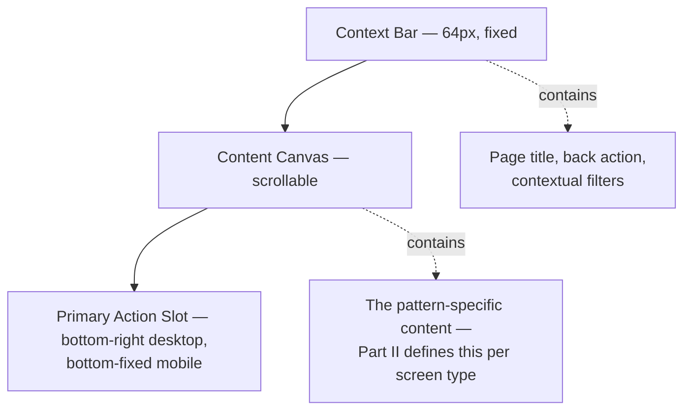

**Composition rule:** every pattern chapter in Part II describes what goes in the Content Canvas. The Context Bar and Primary Action Slot are shared shell components (`ContextBar`, `Canvas`, `PrimaryActionSlot`, Engineering Handbook §6) — never rebuilt per screen.

**Acceptance Criteria**
- [ ] Every screen uses the three shared layout primitives, zero exceptions (restated from Design DNA §8, Engineering Handbook §6).

---

# 4. Screen Classification System

**Purpose**
Give every new feature request a fast, unambiguous answer to "which pattern is this."

| If the screen... | Use pattern | Chapter |
|---|---|---|
| Shows an overview with several independent metrics/cards | Dashboard | 5 |
| Shows many rows of the same entity type | List | 6 |
| Shows one entity in full | Detail | 7 |
| Collects structured input to create/edit one entity | Form | 8 |
| Walks a seller through a multi-step first-time setup | Onboarding/Wizard | 9 |
| Lets a seller configure account-level preferences | Settings | 10 |
| Surfaces an AI-generated suggestion requiring a decision | AI Suggestion Surface | 12 |
| Is a customer-facing shop page | Public Storefront | 13 |
| Lets a customer browse across sellers | Marketplace Browse | 14 |
| Takes a customer from cart to paid order | Checkout | 15 |
| Lets a customer pick a time with a service seller | Booking/Scheduling | 16 |
| Is a threaded seller-customer exchange | Messaging | 17 |
| Lists a seller's notifications | Notification Center | 18 |
| Shows trends and computed metrics | Analytics/Insights | 19 |

**Edge case:** a screen that seems to span two patterns (e.g., a dashboard with an embedded list) is composed by nesting one pattern's content inside another's Canvas — never by inventing a hybrid pattern.

**Acceptance Criteria**
- [ ] Every screen in the product maps to exactly one primary pattern from this table, with any secondary pattern explicitly nested, not blended ambiguously.

---

# Part II — Screen Pattern Library

# 5. Dashboard Pattern

**Purpose**
The template for any screen whose job is "give the seller a fast, calm read on how things are going" — the canonical instance is Home/Insights (Design DNA §48 Example A).

**When to Use**
Any landing screen for a pillar (Product Bible Chapter 6's five pillars) or sub-area where the seller needs an at-a-glance status read before drilling into detail.

**Composition**
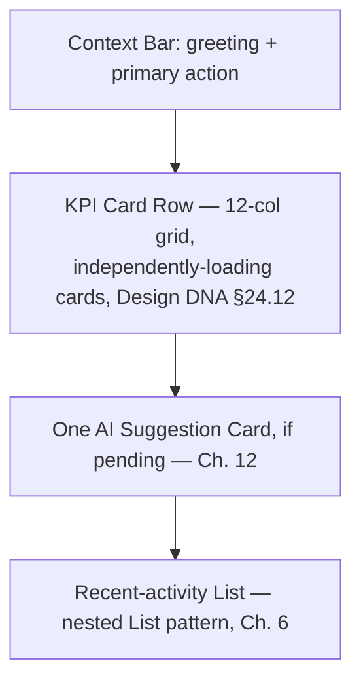

Each KPI card is its **own independent query** (Engineering Handbook §8, §30) — never one blocking fetch for the whole dashboard. Charts inside cards use the Design DNA §24.7 leading-sentence pattern, never a bare chart.

**Content Rules**
Greeting copy follows Brand Voice (Design DNA §38) — plain, no exclamation points. KPI labels are nouns the seller already uses (Design DNA §39).

**Data Mapping**
KPI cards read from Database Blueprint §26 (Analytics functions — `get_revenue_trend` and siblings), never from a dedicated stored analytics table. The AI Suggestion Card, if present, reads from `ai_activity_log` (Blueprint §10) via the standard confidence-tiered surfacing logic (AI Playbook §13, §17).

**Example**
Insights Home: revenue, orders-today, AI-actions-taken, customers-reached as four cards; one AI suggestion beneath; a Recent Orders list (nested List pattern) below that.

**Anti-patterns**
- ❌ A single query powering all KPI cards, so the slowest card blocks the whole dashboard's first paint.
- ❌ More than one AI Suggestion Card visible at once (Design DNA §54.5 Rule 3).

**Acceptance Criteria**
- [ ] Every dashboard's KPI cards load and render independently, verified via network-tab inspection.
- [ ] Zero dashboards render two AI Suggestion Cards simultaneously.

---

# 6. List Pattern

**Purpose**
The template for any screen showing many rows of one entity type — orders, catalog items, customers, bookings.

**When to Use**
The seller-facing management view for any Database Blueprint table with `seller_id` scoping and meaningful row count (Catalog, Orders, Customers, Bookings, Reviews).

**Composition**
```mermaid
flowchart TD
  A[Context Bar: title + filters + primary action e.g. "Add Product"] --> B{Row count and density}
  B -->|Dense, operational, e.g. Orders/Catalog| C[Table — Design DNA §24.6]
  B -->|Emotionally scannable, e.g. Customers| D[Card Grid — Design DNA §24.2]
  C --> E[Sticky header, right-aligned mono numeric columns]
  D --> E
  E --> F[Pagination or infinite scroll,<br/>never fetch-all — Blueprint §45]
```

**Content Rules**
Column/field headers use `label` token (Design DNA §13), monetary and ID columns always JetBrains Mono, right-aligned (Design DNA §24.6, Blueprint §11).

**Data Mapping**
Every list query is `seller_id`-scoped, RLS-enforced (Blueprint §43 Pattern 1), paginated with `limit`/cursor (Blueprint §45's explicit anti-N+1, anti-fetch-all rule), sorted `created_at desc` by default using the table's dedicated composite index (e.g., `idx_orders_seller_id`, Blueprint §16).

**Example**
Orders List: Table density, columns Order ID (mono) / Customer / Status (badge) / Total (mono, right-aligned) / Date; Context Bar filter chips for status (Design DNA §51.6 pattern reused seller-side).

**Anti-patterns**
- ❌ An unpaginated query that fetches a high-SKU seller's entire 1,400-product catalog in one request (Blueprint §11's stated reference scale).
- ❌ Center-aligned monetary columns (Blueprint §11, Design DNA §24.6's explicit rule).

**Acceptance Criteria**
- [ ] Every list screen's query is verified paginated and index-served (`EXPLAIN ANALYZE`, Blueprint §45) before merge.

---

# 7. Detail Pattern

**Purpose**
The template for viewing one entity in full — an order, a product, a customer, a booking.

**When to Use**
Any screen reached by tapping a row from a List pattern screen.

**Composition**
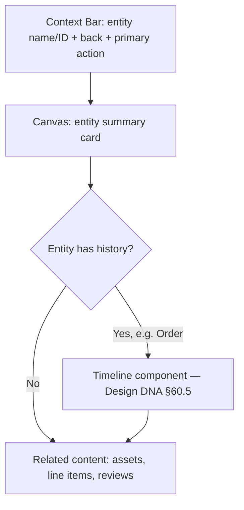

**Content Rules**
The entity's identifying name/title is the largest text on the page (`heading-lg`); status is shown as a badge with text, never color alone (Design DNA §25).

**Data Mapping**
A Detail screen typically joins its primary table with 1–2 related tables in a single query (Blueprint §45's join-not-N+1 rule) — e.g., Order Detail joins `orders` + `order_items` + `order_status_history` (Blueprint §16–17) in one round trip.

**Example**
Order Detail: header with order ID (mono) and status badge; Canvas contains the order timeline (Design DNA §52.4/§60.5) and itemized line items (mono totals); primary action is the next valid status transition.

**Anti-patterns**
- ❌ Fetching the entity, then separately fetching each related piece in sequence (N+1, Blueprint §45).
- ❌ A status shown only as a colored dot with no text label.

**Acceptance Criteria**
- [ ] Every Detail screen's primary query is a single joined fetch, not sequential round trips.

---

# 8. Form Pattern

**Purpose**
The template for creating or editing one entity — a product, a service, a booking's details.

**When to Use**
Any screen whose job is structured data entry feeding an `insert`/`update` against a Database Blueprint table.

**Composition**
```mermaid
flowchart TD
  A[Context Bar: "New X" / "Edit X" + Save action] --> B[Fields grouped under<br/>heading-md section labels]
  B --> C{Field inferable by AI?}
  C -->|Yes| D[Pre-filled, editable chip —<br/>Invisible AI, AI Playbook §3]
  C -->|No| E[Empty, labeled input]
  D --> F[Autosave every 5s — Design DNA §24.4]
  E --> F
```

**Content Rules**
Required fields are unmarked (the default); optional fields explicitly labeled "(optional)" (Design DNA §24.4's inverted convention). Every field has a persistent visible label, never placeholder-only (Design DNA §24.3).

**Data Mapping**
Every form field maps 1:1 to a Database Blueprint column. Before adding any field, check: is this inferable (AI Playbook §3's "infer first" test)? If yes, the field defaults to AI-filled with an editable chip, not a blank required input.

**Example**
Add Product form: photo upload (triggers AI Playbook §17 pipeline) → name/description (AI-pre-filled, editable) → price (mono-prefixed ₹ input) → category (AI-inferred chip, Blueprint §34's fixed taxonomy) → stock count (manual, since this is deliberately never AI-inferred without confirmation, Blueprint §33).

**Anti-patterns**
- ❌ A required field for data CowQ could infer from an already-uploaded photo.
- ❌ Asterisks marking required fields (Design DNA §24.4's inverted rule).

**Acceptance Criteria**
- [ ] Every new form field is checked against AI Playbook §3's inference test before being added as a manual input.
- [ ] Every multi-field form autosaves.

---

# 9. Onboarding / Wizard Pattern

**Purpose**
The template for a multi-step, first-time, sequential setup flow.

**When to Use**
Seller onboarding (photo to first storefront publish, Product Bible Chapter 3's TTFV-critical path) and any future multi-step setup (e.g., payment method configuration).

**Composition**
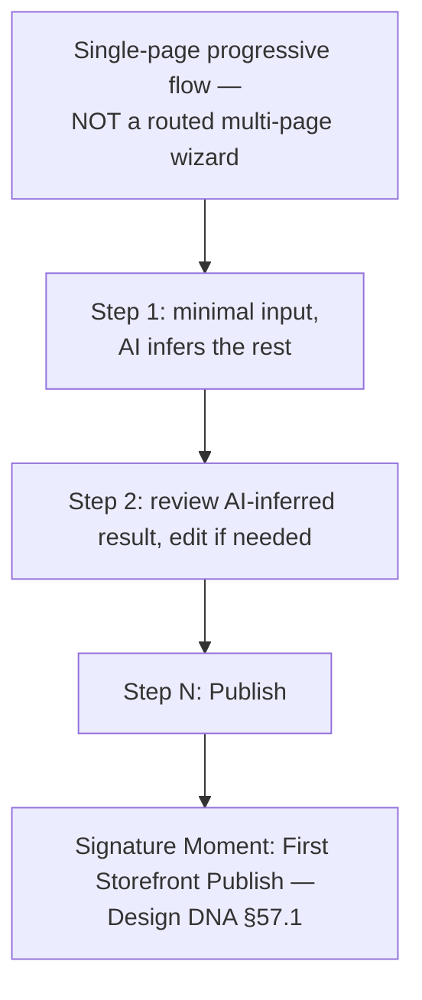

Progressive, single-URL disclosure (Design DNA §52.2's checkout precedent, applied to onboarding too) — never a hard page-navigation-based wizard.

**Content Rules**
Every step's copy states the *value* of the next input, not just the input itself (Product Bible Chapter 3: "CowQ uses your camera to snap product photos instantly" pattern, Design DNA §53.5).

**Data Mapping**
Onboarding writes progressively to `sellers`, `storefronts`, `catalog_items` (Blueprint §6, §15, §11) as each step completes — never one giant transaction held until the final step, so a seller who abandons mid-flow doesn't lose earlier progress.

**Example**
Seller onboarding: (1) business name + one shopfront/product photo → AI infers category and drafts a storefront hero, (2) review/edit the inferred storefront, (3) Publish → First Storefront Publish signature moment.

**Anti-patterns**
- ❌ More than 8 required manual inputs in onboarding (Product Bible Chapter 3's explicit TTFV ceiling).
- ❌ A routed, multi-page wizard where back-navigation loses in-progress state.

**Acceptance Criteria**
- [ ] Onboarding is measured for TTFV and required-input count every release (Product Bible Chapter 3).
- [ ] Abandoning onboarding mid-flow never loses already-completed steps' data.

---

# 10. Settings Pattern

**Purpose**
The template for account-level configuration — always one, single destination, per the five-pillar IA (Design DNA §6 Rule 3).

**When to Use**
Any seller preference that isn't specific to one product/order/customer — notification thresholds, payout details, team members.

**Composition**
```mermaid
flowchart TD
  A[Context Bar: "Settings"] --> B[Left nav rail: sections —<br/>Business, Payments, Team, Notifications]
  B --> C[Right panel: form pattern per section]
  C --> D{Sensitive field? e.g. payout bank details}
  D -->|Yes| E[Require re-authentication —<br/>Engineering Handbook §34]
  D -->|No| F[Standard autosave]
```

**Content Rules**
Settings never live inside a feature-specific pillar screen (Design DNA §6 Rule 3) — always reachable from the one Settings destination.

**Data Mapping**
Reads/writes `seller_settings` (Blueprint §40) for preferences, `sellers`/`business_members` (Blueprint §6) for business/team info, `payments`-adjacent tables for payout config (Blueprint §19, future-ready).

**Example**
Notification settings: push toggle, daily cap override (falling back to system default of 3 per Blueprint §40's `coalesce` pattern) — no re-auth required. Payout bank details: re-auth-gated per Engineering Handbook §34.

**Anti-patterns**
- ❌ A "Payment settings" screen reachable only from inside the Orders pillar (violates Design DNA §6 Rule 3).
- ❌ A sensitive field change (payout details) that doesn't require re-authentication.

**Acceptance Criteria**
- [ ] 100% of settings are reachable from the single Settings destination.
- [ ] Every sensitive-field change is verified to require re-auth.

---

# 11. Universal State Pattern (Loading / Empty / Error / Success)

**Purpose**
Every pattern above needs all four states — this chapter is the shared reference so they're implemented consistently rather than reinvented per screen.

**When to Use**
Every screen, every pattern, without exception (Design DNA §29 in the Engineering Handbook: "a PR without all four is incomplete").

**Composition**
| State | Rule | Source |
|---|---|---|
| Loading | Skeleton matching final shape; nothing under 400ms; status label past 3s | Design DNA §31, Eng. Handbook §30 |
| Empty | Bespoke illustration + opportunity-framed headline + one primary action | Design DNA §32 |
| Error | Specific, honest, non-blaming, states next step | Design DNA §34, Eng. Handbook §29 |
| Success | Inline for routine saves; toast for milestones; Signature Moment only for the 5 enumerated events | Design DNA §33, §57 |

**Content Rules**
Never "No X found" (Design DNA §32's banned phrase). Never a raw vendor error string (Engineering Handbook §29).

**Data Mapping**
Not applicable — this is a UI-state chapter, not a data chapter.

**Example**
Empty Orders: "Your first order will land here" + shop-page illustration + "View my storefront" button — not "No orders found."

**Anti-patterns**
- ❌ A screen shipped without all four states designed.
- ❌ A full-page spinner for a screen with partially-available content.

**Acceptance Criteria**
- [ ] Every screen's PR checklist (Chapter 26) confirms all four states exist before merge.

---

# 12. AI Suggestion Surface Pattern

**Purpose**
The template for the 5%-branded AI moment — a suggestion requiring seller confirmation.

**When to Use**
Any Medium-confidence-tier AI output (AI Playbook §13) — price suggestions, restock recommendations, content refresh nudges.

**Composition**
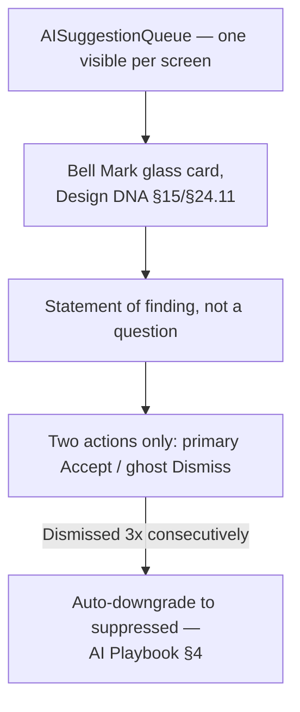

**Content Rules**
"CowQ noticed X — do Y?" statement form, never open-ended (AI Playbook §4 Rule 4). Reasoning shown inline, ≤3 plain-language factors (AI Playbook §15, Design DNA §54.7).

**Data Mapping**
Reads `ai_activity_log` (confidence tier, reasoning) and writes back `status`/`outcome` on accept/dismiss (Blueprint §10).

**Example**
"CowQ noticed 3 products haven't been updated in 60 days — refresh their photos with your latest style?" — Bell Mark card on the Catalog dashboard.

**Anti-patterns**
- ❌ Three or more action buttons on a suggestion card.
- ❌ A suggestion phrased as an open question the AI could have answered itself.

**Acceptance Criteria**
- [ ] Never more than one suggestion card visible per screen, verified in QA (Design DNA §54.5).

---

# 13. Public Storefront Pattern

**Purpose**
The template for a seller's public shop page — CowQ's highest-stakes first-impression surface for strangers.

**When to Use**
Exactly one screen type: `cowq.app/shop/[slug]`.

**Composition**
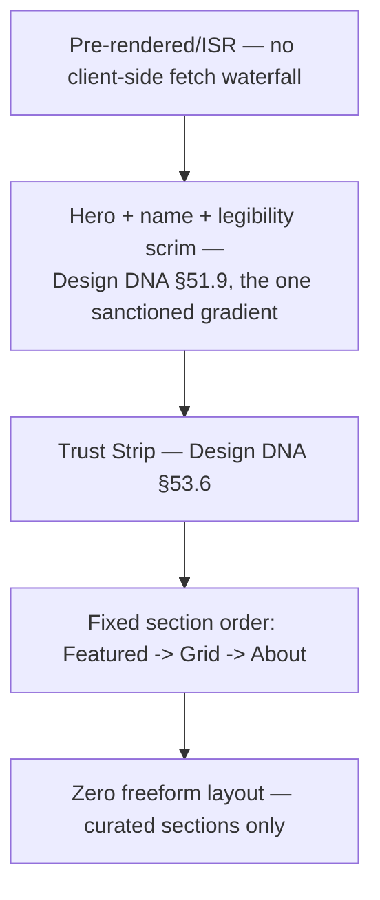

**Content Rules**
Must render name + hero + Trust Strip within first paint (Design DNA §51.1, Blueprint §15 acceptance criterion).

**Data Mapping**
`storefronts` (hero, sections jsonb validated against fixed enum) + `catalog_items_published` view + `collections`/`collection_items` (Blueprint §11, §15).

**Example**
See Design DNA §48 Example A for the full rendered description.

**Anti-patterns**
- ❌ A freeform page-builder canvas (permanently closed door, Design DNA §51.1 Rule 3).
- ❌ Client-side-only rendering that delays hero/Trust Strip paint.

**Acceptance Criteria**
- [ ] Storefront LCP element verified via Lighthouse per release (Blueprint §15).

---

# 14. Marketplace Browse Pattern

**Purpose**
The template for cross-seller discovery — search, category browse, collection shelves.

**When to Use**
Any screen where a customer discovers sellers/products beyond one shop.

**Composition**
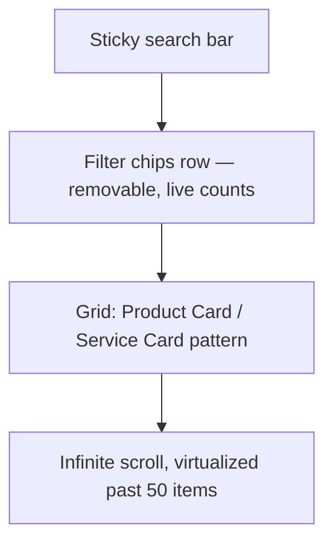

**Content Rules**
One micro-signal per card max (Design DNA §51.3). Zero-result states show adjacent categories, never a dead end.

**Data Mapping**
Search-service-backed (typo-tolerant, per Design DNA §51.5) rather than raw SQL `LIKE`; filter facet counts computed in the same query as results (Blueprint §24).

**Example**
Category browse for "Sarees": sticky category bar past hero scroll, 2/3/4-up grid toggle, infinite scroll with skeleton batches.

**Anti-patterns**
- ❌ Pagination instead of infinite scroll for catalog browse (Design DNA §51.2 Rule 2).
- ❌ A filter option shown as clickable that would yield zero results.

**Acceptance Criteria**
- [ ] Zero login wall before cart-add anywhere in this pattern.

---

# 15. Checkout Pattern

**Purpose**
The calmest, most stripped-down pattern in the entire system — the single highest-trust moment.

**When to Use**
Exactly cart → payment → order confirmation.

**Composition**
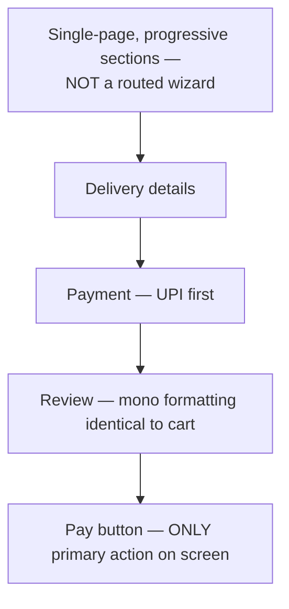

No navigation chrome, no AI surfaces, no upsells anywhere in this pattern (Design DNA §24.16, §52's permanent guardrail).

**Content Rules**
Every fee itemized before payment entry, never revealed at the last step (Design DNA §52.1 Rule 3).

**Data Mapping**
`cart`/`cart_items` → `orders`/`order_items` (Blueprint §16–18), `payments` webhook-driven status (Blueprint §19), stock decremented atomically (Blueprint §33's `decrement_stock_on_order`).

**Example**
See Design DNA §48 Example D.

**Anti-patterns**
- ❌ Any AI suggestion card, navigation sidebar, or promotional content anywhere in checkout.
- ❌ A fee that appears for the first time at the payment step.

**Acceptance Criteria**
- [ ] Checkout screen contains zero navigation chrome and zero AI surfaces, verified every release.

---

# 16. Booking / Scheduling Pattern

**Purpose**
The template for service-based availability selection and confirmation.

**When to Use**
Any service (Blueprint §12) with `bookable = true`.

**Composition**
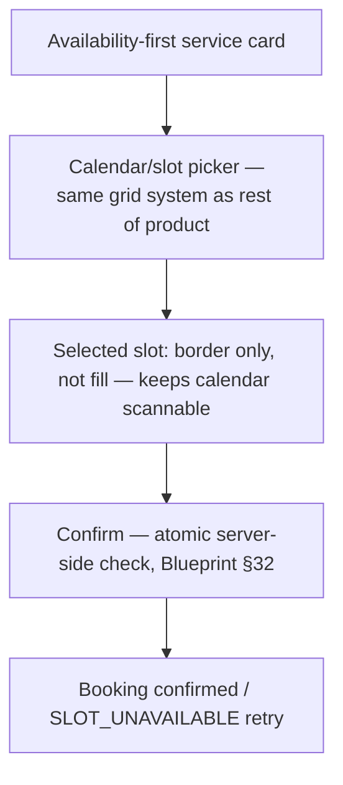

**Content Rules**
Availability-first hierarchy (next slot → starting price → rating), never price-first like a product card (Design DNA §51.4, distinct from Chapter 6/List's product pattern).

**Data Mapping**
`availability_slots` (60s client cache, always-atomic server confirm via `confirm_booking()`, Blueprint §32) → `bookings` → optionally `orders`/`order_items` (Blueprint §17's `booking_id` reference).

**Example**
Tailoring service: "Next: Today, 4:00 PM" / "from ₹500" / rating — tap opens slot picker, confirm triggers atomic booking.

**Anti-patterns**
- ❌ Trusting client-cached availability at confirmation time instead of the atomic server check.
- ❌ A product-card-style, price-first layout applied to a service.

**Acceptance Criteria**
- [ ] `confirm_booking()` verified via concurrency test to never double-book (Blueprint §32).

---

# 17. Messaging Pattern

**Purpose**
The template for threaded seller-customer conversation, including AI-drafted-but-unsent replies.

**When to Use**
Any conversation surface between a seller and one of their customers.

**Composition**
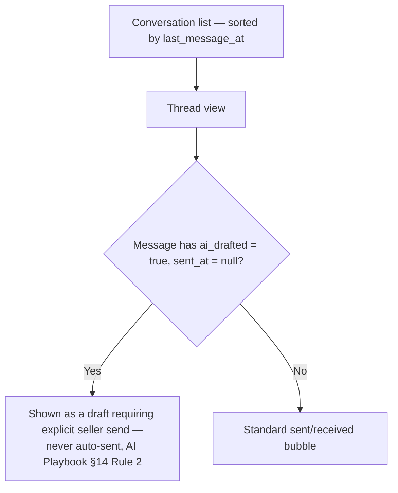

**Content Rules**
AI-drafted replies are visually distinguished as drafts (Bell Mark-adjacent treatment) until explicitly sent.

**Data Mapping**
`conversations` (one per seller-customer pair, Blueprint §29) + `messages`, with `sent_at is null` as the literal database representation of an unreviewed AI draft.

**Example**
An AI-drafted reply to a customer inquiry sits in the thread, clearly marked, with Accept/Edit-then-send actions — never sent without seller action.

**Anti-patterns**
- ❌ An AI-drafted message ever reaching `sent_at is not null` without an explicit seller action (Blueprint §29's acceptance criterion).

**Acceptance Criteria**
- [ ] Verified via test that AI-drafted messages never auto-send.

---

# 18. Notification Center Pattern

**Purpose**
The template for the seller's notification list, honoring the three-tier discipline.

**When to Use**
The single notification-list screen, plus the toast/banner instances elsewhere.

**Composition**
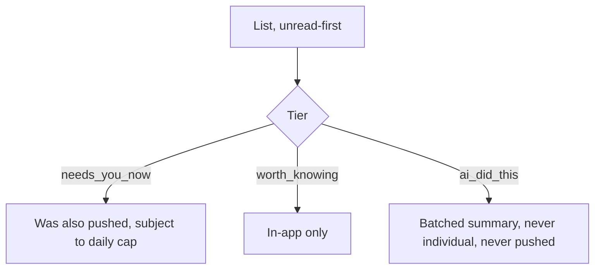

**Content Rules**
Every notification is actionable — tapping goes to relevant context, never a generic inbox (Design DNA §35 Rule 3).

**Data Mapping**
`notifications` filtered `read_at is null` first (indexed partial index, Blueprint §28); push eligibility checked against `push_log` daily-cap query.

**Example**
Morning summary: "CowQ drafted 4 replies while you were away" — one `ai_did_this` notification, not four.

**Anti-patterns**
- ❌ Any `ai_did_this`-tier notification appearing in `push_log`.

**Acceptance Criteria**
- [ ] Daily push cap enforcement verified server-side (Blueprint §28).

---

# 19. Analytics / Insights Pattern

**Purpose**
The template for trend/metric display beyond the Dashboard's summary cards — deeper Insights-pillar screens.

**When to Use**
Any screen whose primary content is a chart or computed trend.

**Composition**
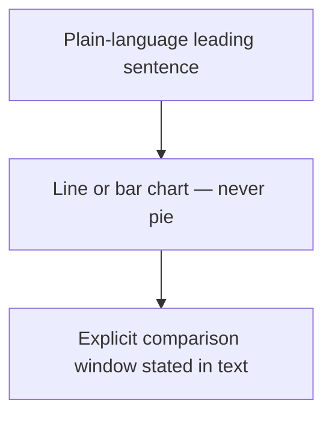

**Content Rules**
"Revenue is up 12% from last week" leads; the chart supports the sentence (Design DNA §24.7).

**Data Mapping**
Live-computed functions over `orders`/`catalog_items` (Blueprint §26) until proven a performance bottleneck, then materialized (Blueprint §46).

**Example**
Revenue trend screen: leading sentence, line chart, "vs last 7 days" label — honest "not enough data yet" state for new storefronts (Blueprint §26 edge case).

**Anti-patterns**
- ❌ Any pie chart anywhere in the product (permanent guardrail, Design DNA §24.7).
- ❌ A trend showing "0%" when the real state is "insufficient historical data."

**Acceptance Criteria**
- [ ] Zero pie charts, audited every release.

---

# 20. Mobile-Specific Adaptations

**Purpose**
The single reference for how every pattern above adapts below the `mobile` breakpoint — not a separate pattern, a transformation rule applied to all twelve.

**When to Use**
Every pattern, automatically, below 768px.

**Composition**
| Desktop element | Mobile adaptation | Source |
|---|---|---|
| Filters (List/Marketplace) | Bottom sheet, not inline panel | Design DNA §55.7 |
| Primary action | Fixed bottom bar, thumb-zone | Design DNA §55.1, §29 |
| Table (List pattern) | Card-per-row, never horizontal scroll | Design DNA §26 |
| Photo capture (Form pattern) | Native camera launch, gallery secondary | Design DNA §55.3 |
| Sidebar nav | Bottom navigation, 5 items max | Design DNA §7, §24.9 |

**Content Rules**
Not applicable beyond the table above — content itself doesn't change, only layout.

**Data Mapping**
Not applicable — mobile adaptation is presentation-layer only.

**Example**
Order List on mobile: table becomes a stack of order cards (customer, total in mono, status badge) — tap opens Detail pattern.

**Anti-patterns**
- ❌ A horizontally-scrolling table on mobile in any pattern.
- ❌ A centered desktop-style modal used for mobile filters instead of a bottom sheet.

**Acceptance Criteria**
- [ ] Every pattern verified against this table's transformations before mobile ship.

---

# Part III — Cross-Cutting Reference

# 21. Component-to-Table Mapping

**Purpose**
A direct lookup from Design DNA shared component to the Database Blueprint table(s) it typically binds to — closing the loop between the visual system and the data system.

| Component (Design DNA §24/§60) | Primary table(s) (Blueprint) |
|---|---|
| ProductCard | `catalog_items`, `product_assets` |
| ServiceCard | `services`, `service_assets`, `availability_slots` |
| Order Timeline | `orders`, `order_status_history` |
| Trust Strip | `sellers` (verification_tier), `reviews` (via `get_seller_rating`) |
| AI Suggestion Card | `ai_activity_log` |
| Credit Cost Label | `credit_costs` |
| Filter Chip | Search-service facets (Blueprint §24), not a direct table |
| Bottom Sheet | Not data-bound — pure layout primitive |
| Streaming Text Field | `ai_generations` (Blueprint §24) |

**Acceptance Criteria**
- [ ] Every new shared component's spec, when added to Design DNA §24, gets a corresponding row added here.

---

# 22. Content & Microcopy Patterns by Screen Type

**Purpose**
Extend Design DNA §39 with per-pattern copy templates so voice stays consistent screen to screen.

| Pattern | Empty-state headline formula | Primary button formula |
|---|---|---|
| List | "Your first [entity] will appear here" | "Add [entity]" |
| Dashboard | "Nothing needs your attention today" | (contextual, varies) |
| Form | N/A | "Save" / "Publish" (verb + object, Engineering Handbook §4) |
| Checkout | N/A | "Pay ₹[amount]" — amount always shown on the button itself |
| AI Suggestion | N/A | "CowQ [did/found/suggests] X" statement + Accept/Dismiss |

**Acceptance Criteria**
- [ ] Every new pattern instance's copy is checked against this table before ship.

---

# 23. Navigation & IA Map

**Purpose**
Restate the five-pillar route map (Design DNA §6–7) as a single lookup so every screen's place in the hierarchy is unambiguous.

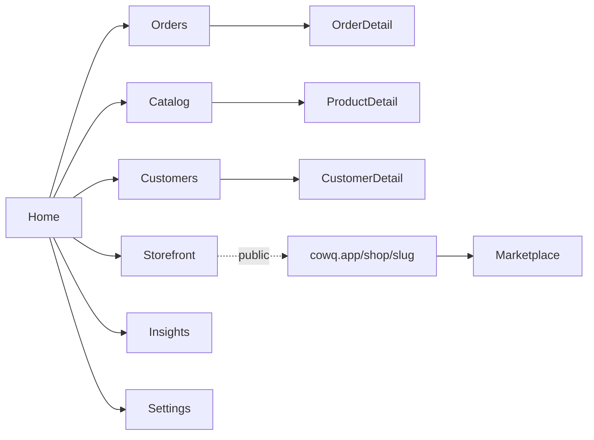

**Acceptance Criteria**
- [ ] No screen exists outside this map without a documented, reviewed exception (Design DNA §6).

---

# 24. Design System Versioning

**Purpose**
Define how this document itself evolves, mirroring the amendment discipline already established in Design DNA §47 and Product Bible §57.

**Rule:** any new pattern, or any change to an existing pattern, is proposed as an amendment citing which Design DNA component/token it composes and which Blueprint table it maps to — never added silently.

**Acceptance Criteria**
- [ ] Every amendment to this document includes a Version History entry (Chapter 28).

---

# 25. Design-to-Engineering Handoff

**Purpose**
Define what a designer/PM hands an engineer (human or Lovable agent) when a new screen is ready to build.

**The handoff package, always:**
1. Which pattern (Part II chapter) this screen implements.
2. Which Design DNA components it composes (by name, not description).
3. Which Blueprint table(s)/RLS pattern (Blueprint §43) it reads/writes.
4. All four states (Chapter 11) either designed or explicitly deferred with a ticket.
5. The Lovable prompt preamble (Design DNA §46, Engineering Handbook §49) referencing this pattern by chapter number.

**Acceptance Criteria**
- [ ] No screen begins implementation without this five-item handoff package complete.

---

# 26. New Screen Checklist

**Purpose**
The single, composite pre-merge gate — pulling the relevant checks from all five sibling documents into one list so nothing is checked in five different places.

- [ ] Classified against Chapter 4's pattern table.
- [ ] Uses only Design DNA §24/§60 components — zero one-off styled elements.
- [ ] All four states present (Chapter 11).
- [ ] Data queries verified paginated/indexed where applicable (Blueprint §44–45).
- [ ] RLS policy reviewed for any new table touched (Blueprint §43).
- [ ] Copy checked against Chapter 22 and Design DNA §38–39.
- [ ] Mobile adaptation checked against Chapter 20.
- [ ] Accessibility: axe-core pass, keyboard nav (Design DNA §25, Engineering Handbook §33).
- [ ] Performance budget respected (Design DNA §58, Engineering Handbook §32).
- [ ] If AI-touching: confidence tier declared, credit deduction (if any) routes through `spend_credits` only (AI Playbook §13, §22).

**Acceptance Criteria**
- [ ] This checklist is a required, completed field in every screen-shipping PR.

---

# 27. Known Gaps & Open Questions

**Purpose**
Honest, tracked list of what this document does *not* yet resolve — better stated plainly than papered over.

1. **No "Shipping Rules" document exists yet.** This was referenced as a source for this document but doesn't exist in CowQ's canon. If it's meant to formalize release/QA gating beyond what Design DNA §44 and Engineering Handbook §38–41 already cover, it should be created as its own document, not backfilled speculatively here.
2. **Mixed product+service order checkout** (a seller spanning both, Product Bible Chapter 25's edge case) has no resolved UI pattern yet — Chapter 15 (Checkout) doesn't yet handle a cart containing both a `catalog_items` and a `services` line item cleanly.
3. **Multi-account/agency screens** (Product Bible Chapter 8's future persona) have no pattern yet — Chapter 6 (Detail) and Chapter 10 (Settings) will likely need an account-switcher extension once `business_members` roles beyond `owner` are activated (Blueprint §6).

**Acceptance Criteria**
- [ ] Each gap above is either resolved with a new chapter or explicitly re-confirmed as still-open at each quarterly review.

---

# 28. Version History

| Version | Date | Change | Author |
|---|---|---|---|
| 1.0 | 2026-07-30 | Initial UI/UX Design System — 12 screen patterns (Part II), component-to-table mapping, content patterns, IA map, handoff process, and composite New Screen Checklist. Built as a synthesis layer over Product Bible, Design DNA v1.1, Engineering Handbook, and Database Blueprint — no content duplicated from those documents, only cross-referenced. "Shipping Rules" cited in the original request does not yet exist and is flagged in §27 rather than fabricated. | CowQ Design Office |

---

*End of The CowQ UI/UX Design System v1.0. Every screen is one of twelve patterns, composed from Design DNA's parts, bound to Blueprint's tables. If a new screen doesn't fit a pattern here, that's a signal to propose an amendment — not to build something bespoke.*
