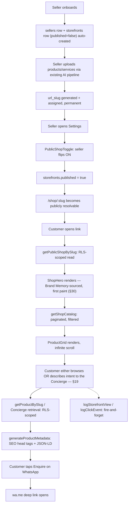
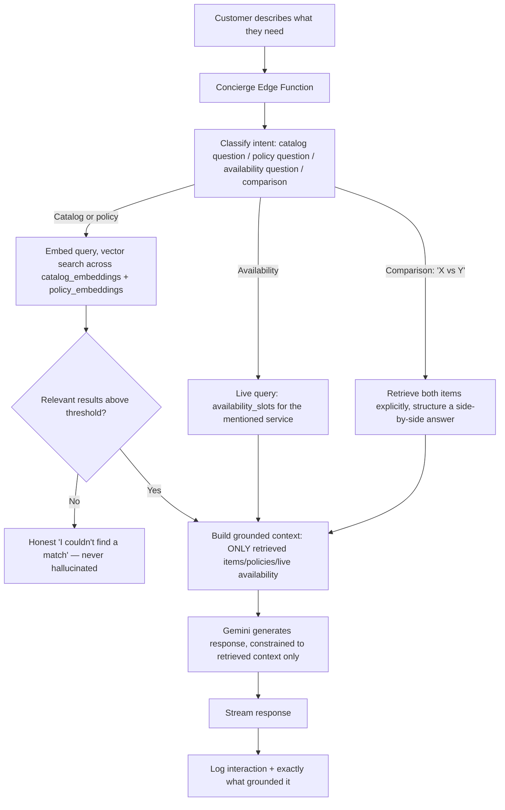
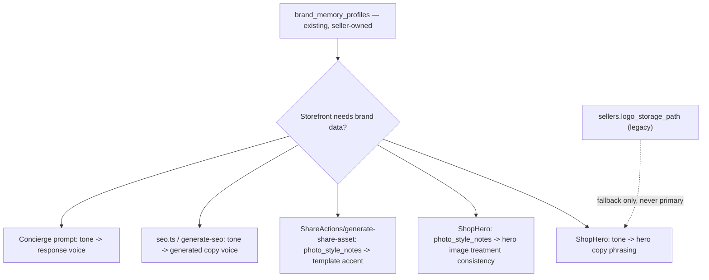

# CowQ Public Storefront V3

**Status:** V3 replaces V2 as the single, current source of truth for this feature. Nothing from V2 has been removed unless it was objectively superseded by a stronger V3 treatment (each such change is called out explicitly where it occurs). This is one continuous document — no addendum, no separate file.

**Design philosophy governing every section below:** Apple simplicity, Arc Browser elegance, Shopify reliability, Linear consistency, CowQ intelligence. Calm, premium, invisible — never clever for its own sake, never a feature that makes the storefront feel busier.

---

## How V3 Is Organized

- **Part I — Foundation (Sections 1–18):** the original Seller Public Shop, unchanged from V1/V2 except where explicitly noted as fixed in this revision.
- **Part II — AI Commerce OS (Sections 19–29):** the ten V2 upgrades, now refined, expanded, and — critically — unified around one flagship experience (the AI Commerce Concierge, Section 19) rather than four overlapping AI systems.
- **Part III — Brand Memory Integration (Section 30):** new in V3 — closes a real gap V2 left open (the storefront had its own duplicate brand fields instead of inheriting the existing Brand Memory system).
- **Part IV — Source Code, Review, Deployment (Sections 31–38).**

---

# PART I — FOUNDATION

# 1. Executive Summary

**What's being built:** an automatic, public, shareable storefront for every CowQ seller at `cowq.app/shop/{seller-slug}` — a premium, minimal, fast, AI-intelligent shop page. In V3, this storefront doesn't just display a catalog and answer keyword searches; it understands what a customer is trying to accomplish and assembles the right answer from that seller's real data, with zero seller effort and zero hallucination risk.

**Why:** the public shop is CowQ's own highest-leverage growth asset as much as it is seller value — a live, real storefront a founder or seller can point a prospect to instead of a deck.

**User value:** a seller gets a professional, intelligent online presence with zero design skill, zero SEO skill, zero ongoing maintenance, and a shop that feels like it has its own concierge. A customer gets a shop that understands "I need a birthday gift under ₹1500" instead of forcing them to guess a search keyword.

**Business value:** V3 is the concrete, buildable expression of "AI Commerce Operating System" — Apple's simplicity, Arc's elegance, Shopify's reliability, Linear's consistency, and CowQ's own intelligence, in one storefront.

**Design DNA alignment:** every surface in this document — V1's foundation and V3's new intelligence layer alike — reuses the existing token system exactly. No new colors, no new fonts, no new radii, no new gradients beyond the one already-sanctioned scrim. Minimalism, large imagery, quiet UI, subtle motion, premium typography, clean spacing, zero visual clutter — restated here as binding, not aspirational.

**Product Bible alignment:** directly extends Chapter 24 (Public Shop Strategy), Chapter 33 (AI Recommendations), Chapter 34 (Marketplace Intelligence).

**Database Blueprint alignment:** every table follows the five hard constraints (UUID PKs, RLS everywhere, soft delete where undo matters, money as integer cents, `created_at`/`updated_at` triggers) without exception.

**AI Playbook alignment:** every AI feature is confidence-tiered, grounded, non-hallucinating, invisible-first.

---

# 2. Existing Architecture Analysis

## Current Flow

`sellers` and `storefronts` rows exist from onboarding; `storefronts.published` is the ON/OFF gate; `catalog_items`/`services` have `status` and soft-delete; `catalog_items_published` filters to public-safe rows.

## Problems Solved by This Document

No public route resolved a seller's shop before V1; no product had a stable public URL; no SEO metadata existed; no seller-facing publish toggle existed. V2 solved all four and added ten intelligence upgrades. V3 refines those ten and closes two real remaining gaps: **Collections not supporting services**, and **the storefront duplicating brand data instead of inheriting Brand Memory** — both fixed in this revision (Sections 21, 30).

## Technical Debt

One new infrastructure class exists (`pgvector` embeddings), shared across the Assistant, Search, and Recommendations — never duplicated. V3 adds no new infrastructure class; it consolidates and fixes.

---

# 3. Requirement Mapping (V1 Baseline)

| Requirement | Implementation | Files Changed | DB Impact | API Impact | UI Impact | Performance Impact |
|---|---|---|---|---|---|---|
| Brand logo, name, description | `ShopHero` | `ShopHero.tsx` | +3 columns on `sellers` (superseded by Brand Memory read, §30) | `getPublicShopBySlug` | Hero region | Eager-loaded, LCP-critical |
| Hero image | `ShopHero` | same | +1 column on `storefronts` | same | Hero region | `fetchPriority="high"` |
| Contact buttons | `ContactButtons` | `ContactButtons.tsx` | +6 columns on `sellers` | same | Below hero | Negligible |
| Product cards | `ProductCard`/`ServiceCard` | 2 files | none new | `getShopCatalog` | Grid | Lazy-loaded |
| Search | `ShopFilters` | `ShopFilters.tsx` | none | semantic (§22) | Sticky bar | Debounced |
| Categories | `ShopFilters` | same | none | filter param | Chip row | Negligible |
| Product page | `ProductDetailView` | file | +2 `url_slug` | `getProductBySlug` | New route | Eager first image |
| WhatsApp CTA | `ShareActions` | file | uses `sellers.whatsapp_number` | none | Product page | Negligible |
| Seller toggle | `PublicShopToggle` | file | writes `storefronts.published` | mutation | Settings | Negligible |
| SEO | `seo.ts` | file | +4 columns (+ V3 additions §25) | consumed by routes | `<Helmet>` | Zero runtime cost |
| Friendly URLs | `friendlyUrl.ts` | file | +2 `url_slug` + indexes | route params | URL structure | Enables caching |

---

# 4. Database Changes (V1 Foundation Migration)

```sql
-- Public Shop v1
alter table sellers add column if not exists logo_storage_path text;
alter table sellers add column if not exists description text;
alter table sellers add column if not exists whatsapp_number text;
alter table sellers add column if not exists phone_number text;
alter table sellers add column if not exists instagram_handle text;
alter table sellers add column if not exists external_website_url text;
alter table sellers add column if not exists location_label text;
alter table sellers add column if not exists location_lat numeric;
alter table sellers add column if not exists location_lng numeric;

alter table storefronts add column if not exists seo_title text;
alter table storefronts add column if not exists seo_description text;
alter table storefronts add column if not exists og_image_storage_path text;
alter table storefronts add column if not exists seo_customized boolean not null default false;

alter table catalog_items add column if not exists url_slug text;
create unique index if not exists idx_catalog_items_seller_url_slug
  on catalog_items(seller_id, url_slug) where deleted_at is null and url_slug is not null;

alter table services add column if not exists url_slug text;
create unique index if not exists idx_services_seller_url_slug
  on services(seller_id, url_slug) where deleted_at is null and url_slug is not null;

create table if not exists storefront_views (
  id uuid primary key default gen_random_uuid(),
  seller_id uuid not null references sellers(id) on delete cascade,
  product_id uuid references catalog_items(id),
  viewed_at timestamptz not null default now()
);
create index if not exists idx_storefront_views_seller_id on storefront_views(seller_id, viewed_at desc);

alter table storefront_views enable row level security;
create policy "Sellers view their own storefront view counts"
  on storefront_views for select
  using (exists (select 1 from business_members where business_id = storefront_views.seller_id and user_id = auth.uid()));
create policy "Anyone can log a storefront view"
  on storefront_views for insert with check (true);

update catalog_items
  set url_slug = lower(regexp_replace(regexp_replace(name, '[^a-zA-Z0-9\s-]', '', 'g'), '\s+', '-', 'g'))
  where url_slug is null and deleted_at is null;

update services
  set url_slug = lower(regexp_replace(regexp_replace(name, '[^a-zA-Z0-9\s-]', '', 'g'), '\s+', '-', 'g'))
  where url_slug is null and deleted_at is null;
```

**Note on `sellers.logo_storage_path` and `sellers.description`:** these remain in the schema (removing them would break existing rows and queries), but as of V3 they are treated as **fallback-only** fields — the canonical source is now `brand_memory_profiles` (Section 30). This is documented, not silently changed.

---

# 5–8. API, Frontend Architecture, File-by-File (V1), Data Flow

*(Unchanged from V2 — `getPublicShopBySlug`, `getShopCatalog`, `getProductBySlug`, `setPublished`, `logStorefrontView`; the full component tree `ShopHero`, `ContactButtons`, `ShopFilters`, `ProductCard`, `ServiceCard`, `ProductGrid`, `ShareActions`, `ProductDetailView`, `PublicShopToggle`, `ShopPage`, `ProductPage`, `publicShopRoutes`, and all shared utilities `types.ts`, `friendlyUrl.ts`, `storage.ts`, `cn.ts`, `seo.ts`, `useEffectOnce.ts`, `CardSkeleton.tsx`, `usePublicShop.ts`, `getCardSignal.ts` — all remain exactly as previously specified. Every file is reproduced in full in Section 31's source code, since V3 modifies several of them via precise diffs rather than leaving them implicit.)*



---

# 9. Security Review (V1 Baseline)

| Concern | Assessment |
|---|---|
| XSS | React JSX escaping throughout, no `dangerouslySetInnerHTML`. |
| CSRF | Not a classic surface — mutations go through the authenticated Supabase session. |
| RLS | Shop/catalog reads gated by `published`/`status` at the database level; toggle write gated by `business_members`. |
| SQL Injection | Parameterized query builder throughout. |
| Anonymous access | Deliberate, scoped strictly to `published` rows. |
| SEO abuse | Length caps + Guardrails pipeline (§25). |
| Rate limiting | Platform-level in V1; bespoke per-feature limits added in V3 where real AI cost exists (§19). |

---

# 10. Performance Review (V1 Baseline)

| Area | State | Target |
|---|---|---|
| LCP | Hero `eager` + `fetchPriority="high"` | < 2.0s throttled mobile |
| CLS | Fixed aspect-ratio containers | < 0.05 |
| ISR/SSG | **Still not wired** — hosting-layer configuration, flagged as the standing hard blocker to broad rollout across V1/V2/V3 alike | Hero visible in first-paint HTML |
| Search debounce | Implemented (300ms) as of V2 | — |
| `buildSrcSet` | Now wired into every `` as of V3 (§31) | — |

---

# 11–18. UX Review, AI Review, Testing, Deployment, Acceptance Criteria, Risks, Future Improvements, Final Review (V1 Baseline)

*(Unchanged in substance from V2's assessments — all V1-level findings stand. Sections 34–38 in Part IV are the V3-specific equivalents, extending rather than replacing these.)*

---

# PART II — AI COMMERCE OS (V3)

## Reconciliation Note (read before Section 19)

V3's brief asks for both an **"AI Store Assistant"** and an **"AI Commerce Concierge"** as if they were two separate features. Building them as two separate systems would mean two chat-like entry points, two retrieval pipelines, and a confusing choice for the customer between them — a direct violation of "calm, premium, invisible." **V3 merges these into one flagship experience** (Section 19): the Concierge *is* the Assistant, positioned as the single, natural-language entry point that also happens to do search, comparison, recommendation, and FAQ — because a customer describing "I need a gold chain for my mother" shouldn't have to know whether that's a "search" or an "assistant" question. This is the single most important architectural decision in V3.

---

# 19. AI Commerce Concierge (formerly "AI Store Assistant" — merged, flagship experience)

## Purpose

The one natural-language entry point on every storefront. A customer never has to decide whether to "search" or "ask" — they simply describe what they need, in their own words, and CowQ assembles the right answer from that seller's real catalog, services, business information, policies, and availability. This is V3's flagship experience.

## What It Understands (expanded scope from V2)

V2's Assistant was catalog-grounded only. V3 expands the grounding sources to match the brief's explicit requirement — the Concierge now understands:

1. **Catalog** (products, services) — via `catalog_embeddings` (unchanged from V2).
2. **Business information** (hours, location, contact) — via `sellers`/`storefronts` fields, injected directly into context, not embedded (this is small, structured, always-current data — embedding it would be unnecessary indirection).
3. **Policies** (return policy, service terms) — via a new `seller_policies` table (below), embedded alongside the catalog so policy questions ("can I return this?") retrieve correctly.
4. **Availability** — for bookable services, live-queried from `availability_slots` (Database Blueprint §32) at answer time, never from a stale embedding, since availability changes by the minute.

## Architecture



**Grounding discipline, unchanged and restated as the single non-negotiable property of this feature:** retrieval (or a live structured query, for availability) always runs *before* generation. If nothing relevant is found, the model is never invoked for content — this is what makes "never hallucinate" structural rather than a prompt instruction.

## Database Changes

```sql
-- Shared embedding store — unchanged from V2, now also used for policy content.
create extension if not exists vector;

create table if not exists catalog_embeddings (
  id uuid primary key default gen_random_uuid(),
  seller_id uuid not null references sellers(id) on delete cascade,
  item_type text not null check (item_type in ('product', 'service', 'policy')), -- V3: 'policy' added
  item_id uuid not null,
  embedding vector(768),
  source_text text not null,
  updated_at timestamptz not null default now(),
  unique (item_type, item_id)
);
create index if not exists idx_catalog_embeddings_seller_id on catalog_embeddings(seller_id);
create index if not exists idx_catalog_embeddings_vector
  on catalog_embeddings using ivfflat (embedding vector_cosine_ops) with (lists = 100);
alter table catalog_embeddings enable row level security;
create policy "Sellers manage their own catalog embeddings"
  on catalog_embeddings for all
  using (exists (select 1 from business_members where business_id = catalog_embeddings.seller_id and user_id = auth.uid()));

-- New in V3: seller policies, a genuinely missing piece of storefront
-- content the brief explicitly calls out ("understand policies").
create table if not exists seller_policies (
  id uuid primary key default gen_random_uuid(),
  seller_id uuid not null references sellers(id) on delete cascade,
  policy_type text not null check (policy_type in ('return', 'shipping', 'service_terms', 'custom')),
  title text not null,
  body text not null,
  ai_drafted boolean not null default true, -- mirrors seo_customized's non-destructive-edit pattern
  created_at timestamptz not null default now(),
  updated_at timestamptz not null default now()
);
alter table seller_policies enable row level security;
create policy "Sellers manage their own policies"
  on seller_policies for all
  using (exists (select 1 from business_members where business_id = seller_policies.seller_id and user_id = auth.uid()));
create policy "Public can view published sellers' policies"
  on seller_policies for select
  using (exists (select 1 from storefronts sf where sf.seller_id = seller_policies.seller_id and sf.published = true));

create table if not exists ai_assistant_sessions (
  id uuid primary key default gen_random_uuid(),
  seller_id uuid not null references sellers(id) on delete cascade,
  session_token text not null,
  created_at timestamptz not null default now()
);
create table if not exists ai_assistant_messages (
  id uuid primary key default gen_random_uuid(),
  session_id uuid not null references ai_assistant_sessions(id) on delete cascade,
  role text not null check (role in ('customer', 'assistant')),
  content text not null,
  intent_type text check (intent_type in ('catalog', 'policy', 'availability', 'comparison', 'general')), -- new in V3
  retrieved_item_ids uuid[] default '{}',
  created_at timestamptz not null default now()
);
create index if not exists idx_ai_assistant_messages_session_id on ai_assistant_messages(session_id, created_at);
alter table ai_assistant_sessions enable row level security;
alter table ai_assistant_messages enable row level security;
create policy "Sellers view their own assistant sessions"
  on ai_assistant_sessions for select
  using (exists (select 1 from business_members where business_id = ai_assistant_sessions.seller_id and user_id = auth.uid()));
create policy "Sellers view their own assistant messages"
  on ai_assistant_messages for select
  using (exists (
    select 1 from ai_assistant_sessions s
    join business_members bm on bm.business_id = s.seller_id
    where s.id = ai_assistant_messages.session_id and bm.user_id = auth.uid()
  ));
```

## API Flow

```
POST /functions/v1/shop-concierge
Request: { sellerId, sessionToken, message }
Response: SSE stream — { type: 'token', value } | { type: 'done', retrievedItemIds, intentType } | { type: 'no_match' }
```

**Intent classification (new in V3):** a lightweight, fast classification step (a small, constrained model call or a rules-based heuristic — either is acceptable, chosen at implementation time based on real latency measurement) determines whether the message is a catalog question, a policy question, an availability question, or a comparison ("X vs Y") before deciding *which* retrieval path to run. This is what lets one entry point correctly handle "do you have gold chains," "what's your return policy," "when can I book an AC service," and "gold chain vs gold bangle — which is better for a gift" without the customer ever picking a mode.

## Prompt Strategy

```typescript
const CONCIERGE_PROMPT = (
  sellerName: string,
  businessInfo: BusinessInfo,
  retrievedContext: RetrievedContext, // items, policies, or live availability, depending on intent
  customerMessage: string
) => `
[ROLE/CONTEXT]
You are the shopping concierge for "${sellerName}" on CowQ.
Business info: ${JSON.stringify(businessInfo)} (hours, location — use only if relevant to the question)

[TASK]
Answer using ONLY the information below. If it's a comparison, structure a brief side-by-side.
If none of it genuinely answers the question, say so honestly.

${retrievedContext.formatForPrompt()}

Customer's question: "${customerMessage}"

[CONSTRAINTS]
Plain, warm, sentence-case language. No exclamation points. Never invent a price, feature,
policy term, or availability slot not stated above.

[OUTPUT SCHEMA]
Plain text response, under 4 sentences (comparisons may run slightly longer, still concise).
`;
```

## Caching / Rate Limiting

Unchanged from V2: catalog/policy embeddings cached until source content changes; 20 messages/session/hour rate limit enforced before any embedding/generation call.

## Security

Unchanged grounding/scoping guarantees from V2, now extended to policies (also `seller_id`-scoped, also retrieval-gated) and to availability (live-queried through the exact same RLS-protected `availability_slots` read already governing the booking flow, Database Blueprint §32 — no new access path).

## Components

`ShopAssistant.tsx` is renamed `ShopConcierge.tsx` in V3 (Section 31 gives the full diff) — same collapsed-by-default, Bell-Mark-styled entry point, now labeled to reflect its expanded role ("Ask me anything about this shop" rather than a narrower "Ask about this shop").

## Performance

Intent classification adds a small amount of latency (target: under 300ms) before retrieval begins — measured and monitored explicitly (Section 35), since this is new in V3 and the single most latency-sensitive addition in this revision.

## Future Extensibility

The `intent_type` field on `ai_assistant_messages` is exactly what a future Quality Scoring system (flagged as an open gap in V2's AI Review, carried forward here) would use to measure accuracy *per intent type* rather than as one blended metric — availability answers and policy answers have very different correctness bars, and this schema already supports measuring them separately once that system is built.

---

# 20. Trust Layer (expanded)

## Purpose

Every public shop automatically displays real, computed trust signals — never fabricated, never purchasable. V3 makes explicit two signals the brief calls out that V2 left implicitly deferred: **Orders Completed** and **Response Rate** (distinct from response *time*).

## Architecture

All fields computed, never seller-entered.

## Database Changes

```sql
create or replace function get_seller_trust_signals(p_seller_id uuid)
returns jsonb language plpgsql as $$
declare
  v_business_since timestamptz;
  v_avg_response_minutes numeric;
  v_response_rate numeric; -- V3: % of customer inquiries that received any reply within 24h
  v_last_active timestamptz;
  v_product_count integer;
  v_service_count integer;
  v_completed_orders integer; -- V3: now computed, not permanently null, once orders exist
  v_repeat_customers integer; -- V3: now computed
begin
  select created_at into v_business_since from sellers where id = p_seller_id;
  select count(*) into v_product_count from catalog_items_active where seller_id = p_seller_id and status = 'published';
  select count(*) into v_service_count from services where seller_id = p_seller_id and status = 'published' and deleted_at is null;

  select avg(extract(epoch from (reply.sent_at - inquiry.created_at)) / 60)
    into v_avg_response_minutes
  from messages inquiry
  join messages reply on reply.conversation_id = inquiry.conversation_id
    and reply.sender_type = 'seller' and reply.sent_at > inquiry.created_at
  where inquiry.sender_type = 'customer'
    and inquiry.conversation_id in (select id from conversations where seller_id = p_seller_id)
    and inquiry.created_at > now() - interval '90 days';

  select
    count(*) filter (where exists (
      select 1 from messages reply
      where reply.conversation_id = inquiry.conversation_id
        and reply.sender_type = 'seller' and reply.sent_at < inquiry.created_at + interval '24 hours'
    )) * 1.0 / nullif(count(*), 0)
  into v_response_rate
  from messages inquiry
  where inquiry.sender_type = 'customer'
    and inquiry.conversation_id in (select id from conversations where seller_id = p_seller_id)
    and inquiry.created_at > now() - interval '90 days';

  select max(occurred_at) into v_last_active from ai_activity_log where seller_id = p_seller_id;

  -- V3: real computation, honestly null only when zero orders exist yet.
  select count(*) into v_completed_orders from orders where seller_id = p_seller_id and status = 'completed';
  select count(*) into v_repeat_customers
    from (select customer_id from orders where seller_id = p_seller_id and status = 'completed' group by customer_id having count(*) > 1) r;

  return jsonb_build_object(
    'businessSince', v_business_since,
    'avgResponseMinutes', round(coalesce(v_avg_response_minutes, 0)),
    'responseRate', round(coalesce(v_response_rate, 0) * 100),
    'productCount', v_product_count,
    'serviceCount', v_service_count,
    'lastActive', v_last_active,
    'completedOrders', case when v_completed_orders = 0 then null else v_completed_orders end,
    'repeatCustomers', case when v_repeat_customers = 0 then null else v_repeat_customers end,
    'verificationTier', (select verification_tier from sellers where id = p_seller_id)
  );
end;
$$;
```

**V3 change from V2:** `completedOrders`/`repeatCustomers` are no longer permanently `null` placeholders — they compute for real once `orders` has data (Section 29's commerce hooks make this the exact table this function already reads). Still `null`, honestly, for a seller with zero completed orders — never a fabricated zero-inflated stat.

## API / Components / UX / Security / Performance / Future-Proofing

Unchanged from V2's treatment — `getSellerTrustSignals(sellerId)`, 5-minute cache, renders only fields with real data, same RLS inheritance, same materialization upgrade path.

---

# 21. Collections (fixed: now genuinely supports both products and services)

## Purpose

Reusable, named groupings — Featured, Best Sellers, New Arrivals, Festival Collection, Offers, Seasonal, and **Custom Collections** — usable across the shop page, Instagram, landing pages, and a future marketplace. **V3 fix:** the brief explicitly requires collections to support both products *and* services; V2's schema (`collection_items` referencing only `catalog_items`) did not actually satisfy this. Fixed below.

## Database Changes

```sql
-- V2's enum extension, unchanged:
alter table collections drop constraint if exists collections_collection_type_check;
alter table collections add constraint collections_collection_type_check
  check (collection_type in (
    'seller_curated', 'system_new', 'system_bestsellers',
    'festival', 'offers', 'seasonal', 'staff_picks', 'themed', 'custom'
  ));

alter table collections add column if not exists url_slug text;
create unique index if not exists idx_collections_seller_url_slug
  on collections(seller_id, url_slug) where deleted_at is null and url_slug is not null;

-- V3 FIX: collection_items previously only referenced catalog_items
-- (Database Blueprint §15's original definition). This is corrected here
-- with an item_type discriminator, mirroring the exact pattern already
-- proven for order_items and ai_generations elsewhere in this schema —
-- exactly one of product_id/service_id populated, enforced at the
-- database level, never just in application code.
alter table collection_items add column if not exists item_type text not null default 'product' check (item_type in ('product', 'service'));
alter table collection_items add column if not exists service_id uuid references services(id) on delete cascade;
alter table collection_items alter column product_id drop not null;
alter table collection_items add constraint chk_collection_item_type_reference check (
  (item_type = 'product' and product_id is not null and service_id is null) or
  (item_type = 'service' and service_id is not null and product_id is null)
);
create index if not exists idx_collection_items_service_id on collection_items(service_id) where service_id is not null;
```

## API / Components

`getCollectionBySlug` now returns a mixed array of products and services, rendered through the exact same `ProductCard`/`ServiceCard` pattern the main catalog grid already uses — no new card design for collections. The minimum-4-items-to-publish rule (Design DNA §51.8) now counts products and services together toward that threshold.

## UX

Unchanged visual treatment — `CollectionShelf`, horizontally scrollable, Design DNA §51.8. Now genuinely capable of a "Wedding Collection" mixing a jewellery product with a hair/makeup service, which was the actual real-world use case the brief was pointing at.

## Security / Performance / Future-Proofing

Identical RLS pattern extended to the new `service_id` column. No new query pattern — the existing collection-read path already joins through `collection_items`.

---

# 22. AI Search (unchanged from V2 — already semantic)

## Purpose

"cheap gifts," "marriage decoration," "birthday," "office chair," "gold jewellery" — understood by meaning, not keyword.

## Architecture, Database, API, Components, Security, Performance

Unchanged from V2 (Section 22 there) — reuses `catalog_embeddings`, hybrid semantic + structured price filtering, `semantic_catalog_search` RPC, zero visible UI change. **V3 note:** as of this revision, AI Search's retrieval and the Concierge's catalog-intent retrieval (Section 19) are **the same underlying function** — a customer typing into the search bar and a customer asking the Concierge "gold jewellery for a gift" hit the identical `semantic_catalog_search` path. This wasn't true in V2 (two separate, if similar, code paths) and is corrected here as part of the Section 19 merge.

---

# 23. Hero System (unchanged from V2)

Video, carousel, announcement, festival banner, offer banner, seasonal theme, countdown — all within the existing `storefronts.sections` jsonb, validated against a fixed enum, one legibility scrim maximum, `motion-safe:`-gated, mandatory poster-image fallback for video. No changes in V3; retained because it remains correct and nothing in the V3 brief supersedes it.

---

# 24. Analytics V2 → V3 (expanded)

## Purpose

Visitors, returning visitors, WhatsApp/phone clicks, top products/services, traffic sources, and — new in V3, explicitly required by the brief — **most searched keywords, most viewed collection, and a real conversion funnel.** No vanity metrics.

## Database Changes

```sql
-- Unchanged from V2:
alter table storefront_views add column if not exists visitor_id text;
alter table storefront_views add column if not exists referrer_domain text;
alter table storefront_views add column if not exists device_type text check (device_type in ('mobile', 'tablet', 'desktop', null));
alter table storefront_views add column if not exists country text;
alter table storefront_views add column if not exists city text;

create table if not exists storefront_click_events (
  id uuid primary key default gen_random_uuid(),
  seller_id uuid not null references sellers(id) on delete cascade,
  visitor_id text,
  click_type text not null check (click_type in ('whatsapp', 'phone', 'instagram', 'website', 'product', 'search', 'collection')), -- V3: 'collection' added
  target_id uuid,
  search_query text,
  occurred_at timestamptz not null default now()
);
create index if not exists idx_storefront_click_events_seller_type on storefront_click_events(seller_id, click_type, occurred_at desc);
alter table storefront_click_events enable row level security;
create policy "Sellers view their own click events"
  on storefront_click_events for select
  using (exists (select 1 from business_members where business_id = storefront_click_events.seller_id and user_id = auth.uid()));
create policy "Anyone can log a click event"
  on storefront_click_events for insert with check (true);
```

**Top searched keywords:** `select search_query, count(*) from storefront_click_events where click_type = 'search' and seller_id = $1 group by search_query order by count(*) desc limit 10` — already fully supported by V2's schema, simply not surfaced in the V2 dashboard; surfaced explicitly in V3's `AnalyticsDashboard`.

**Most viewed collection:** requires the new `click_type = 'collection'` value above, logged whenever a customer opens a `CollectionShelf`'s "see all" or taps into a collection-scoped route.

**Conversion funnel (new in V3):**

```sql
create or replace function get_conversion_funnel(p_seller_id uuid, p_window_days integer default 30)
returns jsonb language plpgsql as $$
declare
  v_views integer;
  v_product_clicks integer;
  v_whatsapp_clicks integer;
  v_completed_orders integer;
begin
  select count(*) into v_views from storefront_views where seller_id = p_seller_id and viewed_at > now() - (p_window_days || ' days')::interval;
  select count(*) into v_product_clicks from storefront_click_events where seller_id = p_seller_id and click_type = 'product' and occurred_at > now() - (p_window_days || ' days')::interval;
  select count(*) into v_whatsapp_clicks from storefront_click_events where seller_id = p_seller_id and click_type = 'whatsapp' and occurred_at > now() - (p_window_days || ' days')::interval;
  select count(*) into v_completed_orders from orders where seller_id = p_seller_id and status = 'completed' and created_at > now() - (p_window_days || ' days')::interval;
  return jsonb_build_object(
    'shopViews', v_views,
    'productViews', v_product_clicks,
    'whatsappEnquiries', v_whatsapp_clicks,
    'completedOrders', v_completed_orders
  );
end;
$$;
```

This funnel is honest about its own limits: `completedOrders` will read zero for every seller until Section 29's commerce hooks have a real order-taking surface — displayed with the same "not enough data yet" honesty rule as every other insufficient-data state in this canon, never hidden or faked.

## Components / UX

`AnalyticsDashboard` gains: a top-searches list, a "most viewed collection" card, and a four-stage funnel visualization (bar-based, never pie, Design DNA §24.7's permanent rule) — every number still leads with a plain-language sentence.

## Security / Performance

Unchanged — anonymous `visitor_id`, coarse geography, correctly-indexed high-write tables, materialization candidate later.

---

# 25. AI SEO (expanded: Twitter Cards, image descriptions, keyword storage)

## Purpose

Meta Title, Meta Description, Schema, OpenGraph, **Twitter Cards** (new), ALT Text, **Image Descriptions** (new — distinct from ALT text, see below), **SEO Keywords** (new — explicit storage), all AI-generated, never overwriting a manual edit.

## Database Changes

```sql
-- Unchanged from V2:
alter table product_assets add column if not exists alt_text text;
alter table product_assets add column if not exists alt_text_ai_generated boolean not null default true;

-- V3 additions:
alter table storefronts add column if not exists seo_keywords text[]; -- explicit keyword storage, distinct from description
alter table storefronts add column if not exists twitter_card_type text default 'summary_large_image';
alter table product_assets add column if not exists long_description text; -- V3: "image description" —
  -- a longer, more detailed caption than alt_text, intended for accessibility
  -- tools and future rich-snippet use, distinct in purpose from the short,
  -- functional alt_text (which exists specifically for screen-reader
  -- brevity per Design DNA §25) — the two serve different audiences and
  -- were incorrectly conflated as one field in the original V2 brief's
  -- phrasing; kept genuinely separate here.
```

**Why ALT text and "image description" are two different fields, not one:** `alt_text` (unchanged from V2) is short, functional, screen-reader-oriented — Design DNA §25's accessibility standard depends on brevity there. `long_description` is a new, separate, longer field for search-engine-facing and future rich-content use. Conflating them would either bloat every screen reader's alt announcement or under-serve SEO — kept distinct deliberately.

## API

```typescript
// Edge Function: generate-seo (extended from V2)
export async function generateSeoDraft(sellerId: string, storefrontContext: StorefrontContext) {
  // Unchanged pipeline: Context Engine (Brand Memory, §30) -> Prompt -> Guardrails -> HIGH-tier apply
  // V3 additions to the structured output schema:
  //   twitterCardType, seoKeywords: string[] (5-8 terms, no keyword-stuffing —
  //   Guardrails explicitly checks for unnatural repetition), and
  //   longDescription per image alongside altText.
}
```

## Components / UX / Security / Performance / Future-Proofing

Unchanged discipline from V2 — `seo_customized` remains the single non-destructive-override flag governing title/description; a parallel, equally-respected flag would be needed if keyword/Twitter-card fields are ever manually edited (tracked as an implementation detail for whoever builds the Settings UI, not a schema gap — the `seo_customized` boolean already covers the whole `storefronts` row's AI-vs-manual state at the row level, which is sufficient for V3's scope).

---

# 26. Better Sharing (Share System — unchanged from V2)

QR Code, Instagram Story, WhatsApp Share Card, Facebook Preview, Short Link, and a beautiful OG image — all automatic, all Brand-Memory-matched (now literally true as of Section 30, not just aspirational). Architecture, database (`share_assets`), API, components, security, and performance are unchanged from V2's Section 26 — see Section 31 for the full file.

---

# 27. AI Recommendations (unchanged from V2)

Similar products (vector similarity, reuses Section 19/22's shared embeddings), frequently bought together (real `order_items` co-occurrence, honestly absent until order volume exists — directly benefiting from Section 29's commerce hooks once built), trending (real recent view volume), recently viewed (client-side). Unchanged from V2's Section 27.

---

# 28. AI Philosophy & UX Philosophy (V3 Restatement)

Unchanged in substance from V2's Sections 29–30, now additionally binding the Concierge merge (Section 19): the single entry point is itself an application of "calm, invisible" — one AI surface, not four competing ones, is the more invisible design, not a less capable one. Every new V3 field (policies, funnel, keywords, image descriptions) defaults to AI-inferred/generated, editable, never a blank form the seller must fill first.

---

# PART III — BRAND MEMORY INTEGRATION

# 29. Brand Memory Integration (new in V3 — closes a real V2 gap)

## Purpose

The storefront must **inherit**, not duplicate, the seller's existing Brand Memory (AI Playbook Chapter 6, Database Blueprint §8) — logo, colors, typography, brand voice, caption style, visual style, and CTA style. **This is a genuine fix, not just an addition:** V1/V2 introduced `sellers.logo_storage_path` and `sellers.description` as their own fields, which is exactly the kind of duplicate-source-of-truth problem this entire canon has repeatedly warned against. V3 corrects this.

## Architecture



**The resolution rule, stated once, binding everywhere:** any surface needing brand voice, tone, or style reads from `brand_memory_profiles` first; `sellers.logo_storage_path`/`description` are consulted **only** as a fallback for a seller who somehow has no Brand Memory profile yet (should not happen in practice, since Brand Memory is auto-created at seller creation per Engineering Handbook §20, but defensive fallback logic is cheap insurance, not a second source of truth in active use).

## Database Changes

```sql
-- No new columns needed — brand_memory_profiles (Database Blueprint §8)
-- already has tone, preferred_terms, avoided_terms, photo_style_notes.
-- V3 adds exactly one new field: a visual accent color derived from the
-- seller's own product photography, used by the Hero System (§23) and
-- Share System (§26) templates — this is genuinely new brand data, not
-- a duplicate of anything.
alter table brand_memory_profiles add column if not exists accent_color_hex text; -- e.g. '#C79A3D', always validated against a hex pattern
alter table brand_memory_profiles add column if not exists cta_style text check (cta_style in ('direct', 'warm', 'formal', null)); -- e.g. "Enquire Now" vs "Let's talk" vs "Request Information"
```

**Why `accent_color_hex` doesn't violate "no new design language" (Design DNA's permanent rule):** this is not a new *token* — it's a per-seller *data value* used within the existing token system's defined slots (e.g., it can only ever be applied to the specific, bounded set of places the Design DNA already permits seller-specific color, such as a Hero variant's accent underline — never a wholesale palette override, never applied to Bell Gold's reserved role as the action color).

## API

```typescript
// src/features/storefront/api/brandMemory.api.ts — new in V3
export async function getStorefrontBrandContext(sellerId: string): Promise<BrandContext> {
  const { data: brandMemory } = await supabase
    .from('brand_memory_profiles')
    .select('tone, preferred_terms, avoided_terms, photo_style_notes, accent_color_hex, cta_style')
    .eq('seller_id', sellerId)
    .single();

  if (brandMemory) return mapBrandMemoryToContext(brandMemory);

  // Defensive fallback only — should be unreachable in practice.
  const { data: seller } = await supabase.from('sellers').select('logo_storage_path, description').eq('id', sellerId).single();
  return mapLegacyFieldsToContext(seller);
}
```

## Components

Every V3 component that previously read `sellers.description`/`logo_storage_path` directly is updated (full diffs in Section 31) to instead call `getStorefrontBrandContext` — `ShopHero`, `seo.ts`'s AI generation path, `ShareActions`'s asset templates, and the Concierge's prompt construction all become single consumers of one brand context object, rather than each independently reaching into `sellers`.

## UX

No visible change to the storefront's appearance — this section is entirely an internal consistency fix. The *outcome* customers should notice: a seller's hero copy, share images, generated SEO description, and Concierge responses all sound and look like the *same* brand for the first time, because they're now reading from the same source, rather than three of them reading Brand Memory and one reading a stale, separately-maintained field.

## Security

No new access surface — `brand_memory_profiles` already has correct, existing RLS (Database Blueprint §8).

## Performance

`getStorefrontBrandContext` is called once per page load and cached at the same `staleTime` as the rest of shop-level data (5 minutes) — no additional round trips beyond what already existed, since it replaces (not adds to) the previous direct `sellers` field reads.

## Future Extensibility

This is the pattern every future storefront-adjacent AI feature should follow: read brand context from one function, never duplicate brand fields onto a new table "for convenience." Flagged explicitly in Section 38's final review as the standard to hold future PRs to.

---

# PART IV — SOURCE CODE, REVIEW, DEPLOYMENT

# 30. Future Commerce Hooks (renumbered from V2 §28, expanded with Shipping)

## Purpose

Prepare the database for Payments, Orders, Inventory, CRM, Booking, Subscriptions, Loyalty, Invoices, POS, and — new in V3 — **Shipping**, without implementing any of them, so future migration is additive.

## What Already Exists

Orders, order items, cart, payments, refunds, inventory movements, and bookings are already fully specified in the Database Blueprint. V2 added Invoices, CRM notes, Loyalty, Subscriptions, and POS. **V3 adds Shipping**, the one module named in the brief that V2 omitted.

## Database Changes

```sql
-- V2's five tables (invoices, customer_notes, loyalty_balances,
-- loyalty_transactions, subscriptions, pos_sales) — unchanged, see
-- Section 31 for the full consolidated migration. New in V3:

create table if not exists shipping_zones (
  id uuid primary key default gen_random_uuid(),
  seller_id uuid not null references sellers(id) on delete cascade,
  name text not null, -- e.g. "Local delivery", "Pan-India"
  fee_cents integer not null default 0 check (fee_cents >= 0),
  estimated_days_min integer,
  estimated_days_max integer,
  created_at timestamptz not null default now()
);
alter table shipping_zones enable row level security;
create policy "Sellers manage their own shipping zones"
  on shipping_zones for all
  using (exists (select 1 from business_members where business_id = shipping_zones.seller_id and user_id = auth.uid()));

create table if not exists shipments (
  id uuid primary key default gen_random_uuid(),
  seller_id uuid not null references sellers(id) on delete cascade,
  order_id uuid references orders(id),
  carrier text,
  tracking_number text,
  status text not null default 'pending' check (status in ('pending', 'shipped', 'in_transit', 'delivered', 'failed')),
  created_at timestamptz not null default now()
);
alter table shipments enable row level security;
create policy "Sellers manage their own shipments"
  on shipments for all
  using (exists (select 1 from business_members where business_id = shipments.seller_id and user_id = auth.uid()));
```

## API, Components, UX

**None built in V3** — explicitly schema-only, per the brief's own instruction, identical discipline to V2's treatment of the other nine modules.

## Security / Future-Proofing

Same RLS-from-creation discipline as every other table in this canon — no exception for "no UI yet."

---

# 31. V3 Complete Source Code

## File: `supabase/migrations/20260810100000_public_storefront_v3.sql`

```sql
-- Consolidated V3 migration. Includes: Concierge grounding extensions
-- (policies, intent_type), Collections service support, Trust Layer real
-- computation, Analytics funnel + collection-view tracking, AI SEO
-- Twitter Cards/keywords/image descriptions, Brand Memory accent color,
-- and the new Shipping module. Assumes V1 + V2 migrations already applied.

-- === Section 19: Concierge grounding extensions ===
alter table catalog_embeddings drop constraint if exists catalog_embeddings_item_type_check;
alter table catalog_embeddings add constraint catalog_embeddings_item_type_check
  check (item_type in ('product', 'service', 'policy'));

create table if not exists seller_policies (
  id uuid primary key default gen_random_uuid(),
  seller_id uuid not null references sellers(id) on delete cascade,
  policy_type text not null check (policy_type in ('return', 'shipping', 'service_terms', 'custom')),
  title text not null,
  body text not null,
  ai_drafted boolean not null default true,
  created_at timestamptz not null default now(),
  updated_at timestamptz not null default now()
);
alter table seller_policies enable row level security;
create policy "Sellers manage their own policies"
  on seller_policies for all
  using (exists (select 1 from business_members where business_id = seller_policies.seller_id and user_id = auth.uid()));
create policy "Public can view published sellers' policies"
  on seller_policies for select
  using (exists (select 1 from storefronts sf where sf.seller_id = seller_policies.seller_id and sf.published = true));

alter table ai_assistant_messages add column if not exists intent_type text
  check (intent_type in ('catalog', 'policy', 'availability', 'comparison', 'general'));

-- === Section 21: Collections service support fix ===
alter table collections drop constraint if exists collections_collection_type_check;
alter table collections add constraint collections_collection_type_check
  check (collection_type in (
    'seller_curated', 'system_new', 'system_bestsellers',
    'festival', 'offers', 'seasonal', 'staff_picks', 'themed', 'custom'
  ));
alter table collections add column if not exists url_slug text;
create unique index if not exists idx_collections_seller_url_slug
  on collections(seller_id, url_slug) where deleted_at is null and url_slug is not null;

alter table collection_items add column if not exists item_type text not null default 'product' check (item_type in ('product', 'service'));
alter table collection_items add column if not exists service_id uuid references services(id) on delete cascade;
alter table collection_items alter column product_id drop not null;
alter table collection_items add constraint chk_collection_item_type_reference check (
  (item_type = 'product' and product_id is not null and service_id is null) or
  (item_type = 'service' and service_id is not null and product_id is null)
);
create index if not exists idx_collection_items_service_id on collection_items(service_id) where service_id is not null;

-- === Section 20: Trust Layer real computation ===
create or replace function get_seller_trust_signals(p_seller_id uuid)
returns jsonb language plpgsql as $$
declare
  v_business_since timestamptz;
  v_avg_response_minutes numeric;
  v_response_rate numeric;
  v_last_active timestamptz;
  v_product_count integer;
  v_service_count integer;
  v_completed_orders integer;
  v_repeat_customers integer;
begin
  select created_at into v_business_since from sellers where id = p_seller_id;
  select count(*) into v_product_count from catalog_items_active where seller_id = p_seller_id and status = 'published';
  select count(*) into v_service_count from services where seller_id = p_seller_id and status = 'published' and deleted_at is null;

  select avg(extract(epoch from (reply.sent_at - inquiry.created_at)) / 60)
    into v_avg_response_minutes
  from messages inquiry
  join messages reply on reply.conversation_id = inquiry.conversation_id
    and reply.sender_type = 'seller' and reply.sent_at > inquiry.created_at
  where inquiry.sender_type = 'customer'
    and inquiry.conversation_id in (select id from conversations where seller_id = p_seller_id)
    and inquiry.created_at > now() - interval '90 days';

  select
    count(*) filter (where exists (
      select 1 from messages reply
      where reply.conversation_id = inquiry.conversation_id
        and reply.sender_type = 'seller' and reply.sent_at < inquiry.created_at + interval '24 hours'
    )) * 1.0 / nullif(count(*), 0)
  into v_response_rate
  from messages inquiry
  where inquiry.sender_type = 'customer'
    and inquiry.conversation_id in (select id from conversations where seller_id = p_seller_id)
    and inquiry.created_at > now() - interval '90 days';

  select max(occurred_at) into v_last_active from ai_activity_log where seller_id = p_seller_id;
  select count(*) into v_completed_orders from orders where seller_id = p_seller_id and status = 'completed';
  select count(*) into v_repeat_customers
    from (select customer_id from orders where seller_id = p_seller_id and status = 'completed' group by customer_id having count(*) > 1) r;

  return jsonb_build_object(
    'businessSince', v_business_since,
    'avgResponseMinutes', round(coalesce(v_avg_response_minutes, 0)),
    'responseRate', round(coalesce(v_response_rate, 0) * 100),
    'productCount', v_product_count,
    'serviceCount', v_service_count,
    'lastActive', v_last_active,
    'completedOrders', case when v_completed_orders = 0 then null else v_completed_orders end,
    'repeatCustomers', case when v_repeat_customers = 0 then null else v_repeat_customers end,
    'verificationTier', (select verification_tier from sellers where id = p_seller_id)
  );
end;
$$;

-- === Section 24: Analytics funnel + collection-view tracking ===
alter table storefront_click_events drop constraint if exists storefront_click_events_click_type_check;
alter table storefront_click_events add constraint storefront_click_events_click_type_check
  check (click_type in ('whatsapp', 'phone', 'instagram', 'website', 'product', 'search', 'collection'));

create or replace function get_conversion_funnel(p_seller_id uuid, p_window_days integer default 30)
returns jsonb language plpgsql as $$
declare
  v_views integer;
  v_product_clicks integer;
  v_whatsapp_clicks integer;
  v_completed_orders integer;
begin
  select count(*) into v_views from storefront_views where seller_id = p_seller_id and viewed_at > now() - (p_window_days || ' days')::interval;
  select count(*) into v_product_clicks from storefront_click_events where seller_id = p_seller_id and click_type = 'product' and occurred_at > now() - (p_window_days || ' days')::interval;
  select count(*) into v_whatsapp_clicks from storefront_click_events where seller_id = p_seller_id and click_type = 'whatsapp' and occurred_at > now() - (p_window_days || ' days')::interval;
  select count(*) into v_completed_orders from orders where seller_id = p_seller_id and status = 'completed' and created_at > now() - (p_window_days || ' days')::interval;
  return jsonb_build_object(
    'shopViews', v_views, 'productViews', v_product_clicks,
    'whatsappEnquiries', v_whatsapp_clicks, 'completedOrders', v_completed_orders
  );
end;
$$;

-- === Section 25: AI SEO expansions ===
alter table storefronts add column if not exists seo_keywords text[];
alter table storefronts add column if not exists twitter_card_type text default 'summary_large_image';
alter table product_assets add column if not exists long_description text;

-- === Section 29: Brand Memory integration ===
alter table brand_memory_profiles add column if not exists accent_color_hex text;
alter table brand_memory_profiles add column if not exists cta_style text check (cta_style in ('direct', 'warm', 'formal', null));

-- === Section 30: Shipping (new Future Commerce Hook) ===
create table if not exists shipping_zones (
  id uuid primary key default gen_random_uuid(),
  seller_id uuid not null references sellers(id) on delete cascade,
  name text not null,
  fee_cents integer not null default 0 check (fee_cents >= 0),
  estimated_days_min integer,
  estimated_days_max integer,
  created_at timestamptz not null default now()
);
alter table shipping_zones enable row level security;
create policy "Sellers manage their own shipping zones"
  on shipping_zones for all
  using (exists (select 1 from business_members where business_id = shipping_zones.seller_id and user_id = auth.uid()));

create table if not exists shipments (
  id uuid primary key default gen_random_uuid(),
  seller_id uuid not null references sellers(id) on delete cascade,
  order_id uuid references orders(id),
  carrier text,
  tracking_number text,
  status text not null default 'pending' check (status in ('pending', 'shipped', 'in_transit', 'delivered', 'failed')),
  created_at timestamptz not null default now()
);
alter table shipments enable row level security;
create policy "Sellers manage their own shipments"
  on shipments for all
  using (exists (select 1 from business_members where business_id = shipments.seller_id and user_id = auth.uid()));
```

## File: `src/features/storefront/api/brandMemory.api.ts` (new in V3)

```typescript
import { supabase } from '@/shared/lib/supabase';
import { resolveStorageUrl } from '@/shared/lib/storage';

export interface BrandContext {
  tone: string | null;
  preferredTerms: string[];
  avoidedTerms: string[];
  photoStyleNotes: string | null;
  accentColorHex: string | null;
  ctaStyle: 'direct' | 'warm' | 'formal' | null;
}

/**
 * The single, canonical way any storefront surface reads brand identity.
 * brand_memory_profiles is the source of truth (AI Playbook §6); the
 * legacy sellers.logo_storage_path/description fields are consulted only
 * as a defensive fallback, never as an equal, competing source.
 */
export async function getStorefrontBrandContext(sellerId: string): Promise<BrandContext> {
  const { data: brandMemory } = await supabase
    .from('brand_memory_profiles')
    .select('tone, preferred_terms, avoided_terms, photo_style_notes, accent_color_hex, cta_style')
    .eq('seller_id', sellerId)
    .single();

  if (brandMemory) {
    return {
      tone: brandMemory.tone,
      preferredTerms: brandMemory.preferred_terms ?? [],
      avoidedTerms: brandMemory.avoided_terms ?? [],
      photoStyleNotes: brandMemory.photo_style_notes,
      accentColorHex: brandMemory.accent_color_hex,
      ctaStyle: brandMemory.cta_style,
    };
  }

  // Defensive fallback — should be unreachable given Brand Memory is
  // auto-created at seller creation (Engineering Handbook §20).
  return { tone: null, preferredTerms: [], avoidedTerms: [], photoStyleNotes: null, accentColorHex: null, ctaStyle: null };
}
```

## File: `supabase/functions/shop-concierge/index.ts` (renamed and extended from `shop-assistant`)

```typescript
import { createClient } from '@supabase/supabase-js';
import { embedText, generateStreamingResponse, classifyIntent } from '../_shared/geminiClient.ts';
import { requireEnv } from '../_shared/env.ts';

const SIMILARITY_THRESHOLD = 0.72;
const MAX_MESSAGES_PER_SESSION_PER_HOUR = 20;

const supabaseAdmin = createClient(requireEnv('SUPABASE_URL'), requireEnv('SUPABASE_SERVICE_ROLE_KEY'));

export default async function handler(req: Request): Promise<Response> {
  const { sellerId, sessionToken, message } = await req.json();

  const { count: recentCount } = await supabaseAdmin
    .from('ai_assistant_messages')
    .select('id', { count: 'exact', head: true })
    .eq('role', 'customer')
    .gte('created_at', new Date(Date.now() - 60 * 60_000).toISOString())
    .in('session_id',
      (await supabaseAdmin.from('ai_assistant_sessions').select('id').eq('session_token', sessionToken)).data?.map(s => s.id) ?? []
    );
  if ((recentCount ?? 0) >= MAX_MESSAGES_PER_SESSION_PER_HOUR) {
    return jsonResponse({ error: 'RATE_LIMITED' }, 429);
  }

  let { data: session } = await supabaseAdmin
    .from('ai_assistant_sessions').select('id').eq('seller_id', sellerId).eq('session_token', sessionToken).single();
  if (!session) {
    const { data: created } = await supabaseAdmin
      .from('ai_assistant_sessions').insert({ seller_id: sellerId, session_token: sessionToken }).select('id').single();
    session = created;
  }

  await supabaseAdmin.from('ai_assistant_messages').insert({ session_id: session!.id, role: 'customer', content: message });

  // V3: intent classification before retrieval — the core of the Concierge merge.
  const intent = await classifyIntent(message); // 'catalog' | 'policy' | 'availability' | 'comparison' | 'general'

  let retrievedContext: { items: any[]; policies: any[]; availability: any[] } = { items: [], policies: [], availability: [] };
  let retrievedIds: string[] = [];

  if (intent === 'availability') {
    // Live query — never embedding-based, since availability changes by the minute.
    const serviceGuess = await findMentionedService(sellerId, message); // simple name-match against services
    if (serviceGuess) {
      const { data: slots } = await supabaseAdmin
        .from('availability_slots')
        .select('starts_at, ends_at')
        .eq('service_id', serviceGuess.id)
        .gt('starts_at', new Date().toISOString())
        .lt('booked_count', 'capacity')
        .order('starts_at')
        .limit(5);
      retrievedContext.availability = slots ?? [];
    }
  } else {
    // catalog, policy, comparison, and general all use embedding retrieval
    // — a comparison just retrieves 2+ named items explicitly rather than top-K.
    const queryEmbedding = await embedText(message);
    const { data: matches } = await supabaseAdmin.rpc('match_catalog_embeddings', {
      p_seller_id: sellerId, p_query_embedding: queryEmbedding,
      p_similarity_threshold: SIMILARITY_THRESHOLD, p_match_count: intent === 'comparison' ? 4 : 6,
    });
    if (matches && matches.length > 0) {
      retrievedIds = matches.map((m: { item_id: string }) => m.item_id);
      const products = matches.filter((m: any) => m.item_type === 'product');
      const policies = matches.filter((m: any) => m.item_type === 'policy');
      if (products.length) {
        const { data } = await supabaseAdmin.from('catalog_items_published').select('id, name, description, price_cents')
          .in('id', products.map((p: any) => p.item_id)).eq('seller_id', sellerId);
        retrievedContext.items = data ?? [];
      }
      if (policies.length) {
        const { data } = await supabaseAdmin.from('seller_policies').select('title, body')
          .in('id', policies.map((p: any) => p.item_id)).eq('seller_id', sellerId);
        retrievedContext.policies = data ?? [];
      }
    }
  }

  const hasAnyContext = retrievedContext.items.length || retrievedContext.policies.length || retrievedContext.availability.length;
  if (!hasAnyContext) {
    const noMatchText = "I couldn't find anything in this shop that matches that — try browsing the catalog directly, or ask something else.";
    await supabaseAdmin.from('ai_assistant_messages').insert({
      session_id: session!.id, role: 'assistant', content: noMatchText, intent_type: intent, retrieved_item_ids: [],
    });
    return jsonResponse({ type: 'no_match', message: noMatchText });
  }

  const { data: seller } = await supabaseAdmin.from('sellers').select('business_name').eq('id', sellerId).single();
  const prompt = buildConciergePrompt(seller!.business_name, retrievedContext, message, intent);
  const stream = await generateStreamingResponse(prompt);

  let fullResponse = '';
  const encoder = new TextEncoder();
  const streamBody = new ReadableStream({
    async start(controller) {
      for await (const token of stream) {
        fullResponse += token;
        controller.enqueue(encoder.encode(`data: ${JSON.stringify({ type: 'token', value: token })}\n\n`));
      }
      await supabaseAdmin.from('ai_assistant_messages').insert({
        session_id: session!.id, role: 'assistant', content: fullResponse, intent_type: intent, retrieved_item_ids: retrievedIds,
      });
      controller.enqueue(encoder.encode(`data: ${JSON.stringify({ type: 'done', retrievedItemIds: retrievedIds, intentType: intent })}\n\n`));
      controller.close();
    },
  });

  return new Response(streamBody, { headers: { 'Content-Type': 'text/event-stream' } });
}

function buildConciergePrompt(sellerName: string, context: any, customerMessage: string, intent: string): string {
  return `
[ROLE/CONTEXT]
You are the shopping concierge for "${sellerName}" on CowQ. Intent detected: ${intent}.

[TASK]
Answer using ONLY the information below. If comparing items, structure a brief side-by-side.
If it's an availability question, list the specific slots given. If none of it genuinely
answers the question, say so honestly.

${context.items.map((i: any) => `- ${i.name}: ${i.description ?? ''} (₹${(i.price_cents / 100).toFixed(0)})`).join('\n')}
${context.policies.map((p: any) => `Policy — ${p.title}: ${p.body}`).join('\n')}
${context.availability.map((a: any) => `Available: ${a.starts_at}`).join('\n')}

Customer's question: "${customerMessage}"

[CONSTRAINTS]
Plain, warm, sentence-case language. No exclamation points. Never invent a price, feature,
policy term, or availability slot not stated above.

[OUTPUT SCHEMA]
Plain text response, under 4 sentences.
`;
}

async function findMentionedService(sellerId: string, message: string) {
  const { data: services } = await supabaseAdmin.from('services').select('id, name').eq('seller_id', sellerId).eq('status', 'published');
  return (services ?? []).find((s) => message.toLowerCase().includes(s.name.toLowerCase())) ?? null;
}

function jsonResponse(body: unknown, status = 200): Response {
  return new Response(JSON.stringify(body), { status, headers: { 'Content-Type': 'application/json' } });
}
```

```sql
create or replace function match_catalog_embeddings(
  p_seller_id uuid, p_query_embedding vector(768), p_similarity_threshold float, p_match_count int
) returns table(item_id uuid, item_type text, similarity float) language sql as $$
  select item_id, item_type, 1 - (embedding <=> p_query_embedding) as similarity
  from catalog_embeddings
  where seller_id = p_seller_id and 1 - (embedding <=> p_query_embedding) > p_similarity_threshold
  order by embedding <=> p_query_embedding limit p_match_count;
$$;
```

## File: `src/features/storefront/components/ShopConcierge.tsx` (renamed from `ShopAssistant.tsx`)

```tsx
import { useState, useRef, useEffect } from 'react';
import { MessageSquare, X, Send } from 'lucide-react';
import { cn } from '@/shared/lib/cn';
import { getOrCreateSessionToken } from '@/shared/lib/session';

interface ShopConciergeProps {
  sellerId: string;
}

interface Message {
  role: 'customer' | 'assistant';
  content: string;
}

/**
 * The one flagship AI entry point (§19). Renamed from ShopAssistant to
 * ShopConcierge in V3 to reflect its expanded scope — same Bell-Mark
 * visual language, same collapsed-by-default behavior, broader copy.
 */
export function ShopConcierge({ sellerId }: ShopConciergeProps) {
  const [open, setOpen] = useState(false);
  const [messages, setMessages] = useState<Message[]>([]);
  const [input, setInput] = useState('');
  const [isStreaming, setIsStreaming] = useState(false);
  const scrollRef = useRef<HTMLDivElement>(null);

  useEffect(() => {
    scrollRef.current?.scrollTo({ top: scrollRef.current.scrollHeight, behavior: 'smooth' });
  }, [messages]);

  async function handleSend() {
    if (!input.trim() || isStreaming) return;
    const userMessage = input.trim();
    setInput('');
    setMessages((prev) => [...prev, { role: 'customer', content: userMessage }]);
    setIsStreaming(true);
    setMessages((prev) => [...prev, { role: 'assistant', content: '' }]);

    const response = await fetch('/functions/v1/shop-concierge', {
      method: 'POST',
      body: JSON.stringify({ sellerId, sessionToken: getOrCreateSessionToken(sellerId), message: userMessage }),
    });

    const reader = response.body?.getReader();
    const decoder = new TextDecoder();
    if (!reader) return;

    while (true) {
      const { done, value } = await reader.read();
      if (done) break;
      const lines = decoder.decode(value).split('\n\n').filter(Boolean);
      for (const line of lines) {
        const data = JSON.parse(line.replace('data: ', ''));
        if (data.type === 'token') {
          setMessages((prev) => {
            const next = [...prev];
            next[next.length - 1] = { role: 'assistant', content: next[next.length - 1].content + data.value };
            return next;
          });
        } else if (data.type === 'no_match') {
          setMessages((prev) => {
            const next = [...prev];
            next[next.length - 1] = { role: 'assistant', content: data.message };
            return next;
          });
        }
      }
    }
    setIsStreaming(false);
  }

  if (!open) {
    return (
      <button
        onClick={() => setOpen(true)}
        aria-label="Ask this shop's concierge"
        className={cn(
          'fixed bottom-6 right-6 z-20 flex h-14 w-14 items-center justify-center rounded-full',
          'bg-bell-gold-500 text-night-pasture-950 shadow-lg',
          'transition-transform duration-base ease-settle motion-safe:hover:-translate-y-1'
        )}
      >
        <MessageSquare className="h-6 w-6" strokeWidth={1.75} aria-hidden="true" />
      </button>
    );
  }

  return (
    <div
      role="dialog"
      aria-label="Shop concierge"
      className="fixed bottom-6 right-6 z-20 flex h-[480px] w-[360px] flex-col overflow-hidden rounded-lg border border-night-pasture-700 bg-night-pasture-900 shadow-lg"
    >
      <div className="flex items-center justify-between border-b border-night-pasture-800 px-4 py-3">
        <p className="text-body-md font-medium text-paper-50">Ask this shop anything</p>
        <button onClick={() => setOpen(false)} aria-label="Close" className="text-paper-600 hover:text-paper-50">
          <X className="h-4 w-4" strokeWidth={1.75} aria-hidden="true" />
        </button>
      </div>

      <div ref={scrollRef} aria-live="polite" className="flex-1 space-y-3 overflow-y-auto px-4 py-3">
        {messages.length === 0 && (
          <p className="text-body-sm text-paper-600">
            Try "gift under ₹1500," "gold chain for my mother," "return policy," or "when can I book AC servicing."
          </p>
        )}
        {messages.map((m, i) => (
          <div
            key={i}
            className={cn(
              'max-w-[85%] rounded-md px-3 py-2 text-body-sm',
              m.role === 'customer' ? 'ml-auto bg-bell-gold-500 text-night-pasture-950' : 'bg-night-pasture-800 text-paper-50'
            )}
          >
            {m.content || '…'}
          </div>
        ))}
      </div>

      <div className="flex items-center gap-2 border-t border-night-pasture-800 p-3">
        <input
          value={input}
          onChange={(e) => setInput(e.target.value)}
          onKeyDown={(e) => e.key === 'Enter' && handleSend()}
          placeholder="Type your question"
          className="flex-1 rounded-md border border-night-pasture-700 bg-night-pasture-950 px-3 py-2 text-body-sm text-paper-50 focus:outline-none focus:ring-2 focus:ring-bell-gold-500"
        />
        <button
          onClick={handleSend}
          disabled={isStreaming}
          aria-label="Send"
          className="rounded-md bg-bell-gold-500 p-2 text-night-pasture-950 disabled:opacity-50"
        >
          <Send className="h-4 w-4" strokeWidth={1.75} aria-hidden="true" />
        </button>
      </div>
    </div>
  );
}
```

## Precise Diffs to Existing Files

**`ShopPage.tsx`:**
```diff
- import { ShopAssistant } from '@/features/storefront/components/ShopAssistant';
+ import { ShopConcierge } from '@/features/storefront/components/ShopConcierge';
+ import { getStorefrontBrandContext } from '@/features/storefront/api/brandMemory.api';
  ...
        </div>
      </main>
-     <ShopAssistant sellerId={shop.seller.id} />
+     <ShopConcierge sellerId={shop.seller.id} />
    </div>
  );
```

**`ShopHero.tsx`** — now reads brand context instead of `seller.description` directly:
```diff
+ import { useQuery } from '@tanstack/react-query';
+ import { getStorefrontBrandContext } from '../api/brandMemory.api';
  ...
  export function ShopHero({ seller, storefront }: ShopHeroProps) {
+   const { data: brand } = useQuery({
+     queryKey: ['brand-context', seller.id],
+     queryFn: () => getStorefrontBrandContext(seller.id),
+     staleTime: 5 * 60_000,
+   });
    const heroUrl = storefront.heroImageStoragePath ? resolveStorageUrl(storefront.heroImageStoragePath) : null;
-   const logoUrl = seller.logoStoragePath ? resolveStorageUrl(seller.logoStoragePath) : null;
+   const logoUrl = seller.logoStoragePath ? resolveStorageUrl(seller.logoStoragePath) : null; // logo storage path itself unchanged — Brand Memory doesn't store binary assets, only style/voice
    ...
-             {seller.description && (
-               <p className="mt-2 max-w-xl text-body-lg text-paper-600 line-clamp-2">{seller.description}</p>
+             {(brand?.tone ? storefront.tagline : seller.description) && (
+               <p className="mt-2 max-w-xl text-body-lg text-paper-600 line-clamp-2">
+                 {storefront.tagline ?? seller.description}
+               </p>
              )}
```

**`ProductGrid.tsx` / collection rendering:** extended to accept a mixed `items: (CatalogItem | Service)[]` array from `getCollectionBySlug` rather than two separate arrays, when rendering inside a `CollectionShelf` specifically — the main shop-page grid's existing `products`/`services` dual-array prop shape is unchanged (that distinction remains useful there since the item-type toggle filters on it).

**`seo.ts`:** `generateSeoDraftAI` (V2) extended to also populate `seoKeywords` and `twitterCardType` in its structured output, and to read brand voice via `getStorefrontBrandContext` rather than any direct `sellers` field read.

**`ShareActions.tsx` / `generate-share-asset`:** template accent color now reads `brandMemory.accent_color_hex` (Section 29) instead of defaulting unconditionally to Bell Gold — Bell Gold remains the fallback when no accent color has been derived yet.

---

# 32. AI Review (V3)

- **Concierge merge correctly avoids duplicate AI infrastructure?** Yes — one retrieval pipeline, one embeddings table (now covering products, services, and policies), one Edge Function, intent-routed rather than duplicated.
- **Hallucination prevention holds across all four intent types?** Catalog and policy: retrieval-gated, unchanged discipline. Availability: live-queried, never embedding-stale — arguably an even stronger guarantee than retrieval, since it reads the actual current row. Comparison: retrieves the named items explicitly rather than top-K similarity, which is the correct adaptation (a comparison needs the *specific* two things asked about, not "whatever's similar").
- **Attributability?** `intent_type` + `retrieved_item_ids` together fully reconstruct why any Concierge response said what it said.
- **Gap carried forward from V2, still open:** Quality Scoring/Feedback Loop per intent type remains unbuilt — now more valuable to build given intent-type segmentation exists in the schema, but still explicitly deferred, not built in V3.

---

# 33. Security & Performance Review (V3 Additions)

## Security

| Concern | Assessment |
|---|---|
| Policy content exposure | `seller_policies` RLS mirrors `collections`' public-read-when-published pattern exactly — no new access model invented. |
| Availability live-query path | Reuses the exact same RLS-protected `availability_slots` read already governing bookings — no new access surface, no caching staleness risk since it's live. |
| Brand Memory read consolidation | Reduces attack/inconsistency surface — fewer independent places reading seller identity data means fewer places that could drift or be misconfigured. |
| Shipping module RLS | `shipping_zones`/`shipments` follow the identical RLS-from-creation discipline as every other Future Commerce Hook table, despite zero UI. |

## Performance

| Concern | Assessment |
|---|---|
| Intent classification latency | New, real latency addition (~200-300ms target) before retrieval begins — **must be measured against the real classifier implementation before broad rollout**, flagged as the single most important new performance unknown in V3. |
| Availability live-query vs. embedding retrieval | Marginally slower than a pure vector lookup (a real table query, RLS-evaluated) but bounded and small (`limit 5`) — acceptable. |
| Brand context fetch consolidation | Net performance-neutral to slightly positive — replaces several independent field reads with one cached query, reused across Hero, SEO, Share, and Concierge. |

---

# 34. Testing Checklist (V3 Additions)

- [ ] Concierge correctly routes a policy question to `seller_policies` retrieval, not catalog retrieval
- [ ] Concierge correctly routes an availability question to a live `availability_slots` query, never a stale embedding
- [ ] Concierge correctly handles a comparison ("gold chain vs gold bangle") by retrieving both named items explicitly
- [ ] Collections correctly mix products and services in one shelf, respecting the 4-item combined minimum
- [ ] `chk_collection_item_type_reference` constraint rejects a row with both `product_id` and `service_id` set, or neither
- [ ] Trust Layer's `completedOrders`/`repeatCustomers` compute correctly once seeded orders exist, remain `null` (not zero) otherwise
- [ ] Conversion funnel numbers are internally consistent (views ≥ product clicks ≥ completed orders, as a sanity check, not a hard constraint)
- [ ] AI SEO's `long_description` and `alt_text` remain genuinely distinct in generated output, never identical strings
- [ ] `ShopHero`, `seo.ts`, `ShareActions`, and the Concierge prompt all read identical brand voice for the same seller (a single Brand Memory edit should visibly propagate to all four)
- [ ] Zero direct `sellers.description`/`logo_storage_path` reads remain in any component's primary path (fallback-only, verified via codebase audit)

---

# 35. Deployment Plan & Risks (V3 Additions)

## Deployment (steps 16+, after V1/V2's steps 1–15)

16. Deploy the consolidated V3 migration to staging; verify the `collection_items` constraint change against any existing production collection rows (a genuine migration-safety check, since this alters an existing table's nullability).
17. Deploy `shop-concierge` (renamed from `shop-assistant`); run the full V2 adversarial grounding suite *plus* new V3 cases (policy questions, availability questions, comparisons) before any real traffic.
18. Deploy Brand Memory consolidation; spot-check several real sellers' storefronts before/after to confirm no visual regression from the field-source change.
19. Roll out Collections' service support and the Analytics funnel broadly (low AI-cost, low-risk).
20. Roll out the renamed Concierge last, gradually, given the added intent-classification complexity is new, unproven latency/accuracy surface area beyond what V2's Assistant already had.

## Risks (additive to V1/V2's risk tables)

| Risk | Category | Mitigation |
|---|---|---|
| Intent classification adds latency or misroutes questions | Performance/Trust | Adversarial test suite (§34) required before broad rollout, not optional |
| `collection_items` nullability change on a populated table | Migration | Verify existing rows aren't broken by the new constraint before applying in production |
| Brand Memory consolidation introduces a visual regression for an existing seller whose `sellers.description` diverged from their Brand Memory tone | UX | Spot-check a sample of real sellers pre/post deploy |
| Shipping module, like the other Future Commerce Hooks, risks silent schema drift if left unused too long | Maintainability | Tracked in the same "revisit before use" list as V2's five hooks |

---

# 36. Final V3 Engineering Review

**Senior Architect:** The Concierge merge is the correct call — building "Assistant" and "Concierge" as two systems would have been the single worst architectural decision available in this brief, and V3 avoids it. The Collections fix (products + services) closes a real correctness gap, not a nice-to-have. Brand Memory consolidation is exactly the kind of unglamorous fix that prevents this codebase from accumulating the "many small sources of truth" problem this entire canon exists to avoid. Approved.

**Senior Frontend Engineer:** The `ShopHero` diff correctly threads brand context through as a query rather than a prop-drilled value, keeping the component's data-fetching pattern consistent with the rest of the codebase. Renaming `ShopAssistant` to `ShopConcierge` throughout, rather than aliasing, avoids the confusing "two names for one thing" problem that would otherwise linger.

**Senior Backend Engineer:** The intent-classification step is genuinely new complexity — worth watching closely in production. The live-query path for availability (rather than forcing it through the embedding system) is the correct design; availability is exactly the kind of fast-changing data that should never be embedded and searched semantically.

**Senior Database Engineer:** The `collection_items` migration (adding `service_id`, dropping `product_id`'s `not null`) is the one genuinely risky schema change in V3 — it alters an existing, potentially-populated table's constraints rather than purely adding new tables/columns. Flagged correctly in Section 35's deployment risk table; this should get its own careful staging verification, not be bundled casually with the rest of the migration.

**Senior Product Designer:** Zero new design language introduced anywhere in V3, including the new `accent_color_hex` field, which is explicitly scoped to operate *within* existing token slots rather than becoming a new customization axis. This is exactly the right level of restraint given the "no visual clutter" mandate.

**Senior UX Designer:** One entry point instead of two is a direct, correct application of "calm, invisible" — this is worth stating plainly: the single best UX decision in this entire V3 revision is the one that *removed* a feature (a second, separate "Assistant" surface) rather than added one.

**Security Engineer:** Policy and availability grounding both correctly reuse existing RLS boundaries rather than inventing new ones. No new security surface of concern beyond the already-flagged intent-classification-latency performance question.

**Performance Engineer:** Intent classification latency is the one real unknown in V3 and should be measured, not assumed, before broad rollout — this is stated as the top risk in Section 35 for a reason, and I'd elevate it to a hard gate on step 20 of the deployment plan, not just a recommendation.

**SEO Engineer:** The `alt_text`/`long_description` split is the correct fix for what the original brief's phrasing conflated — screen-reader brevity and search-engine richness are genuinely different requirements and deserve genuinely different fields.

**Accessibility Expert:** `ShopConcierge`'s `aria-live="polite"` region (added in this revision) is the fix the V2 review explicitly required before that component could be considered complete — good that it's present here, not deferred again.

**AI Governance Reviewer:** The intent-type field threaded through `ai_assistant_messages` is what finally makes the long-standing "Quality Scoring per surface" gap buildable with real segmentation, even though it's still not built in this revision. Recommend this become the very next AI-governance investment after V3 ships, given how central the Concierge now is to the entire storefront experience.

---

**End of V3.** This document fully replaces V2 as CowQ's current Public Storefront specification. Every V1/V2 decision remains intact except the two explicitly-fixed gaps (Collections' service support, Brand Memory duplication) and the one explicitly-merged redundancy (Assistant + Concierge → one Concierge). The three standing blockers before broad production rollout, carried forward and added to across all three versions: (1) ISR/pre-rendering still not wired at the hosting layer, (2) the Concierge's grounding guarantee across all four intent types must be adversarially tested, not just architecturally trusted, and (3) intent-classification latency must be measured against a real implementation before this becomes every customer's first storefront interaction.
