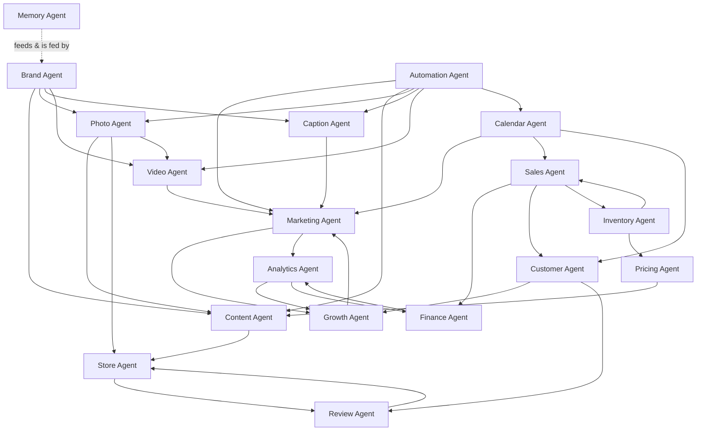
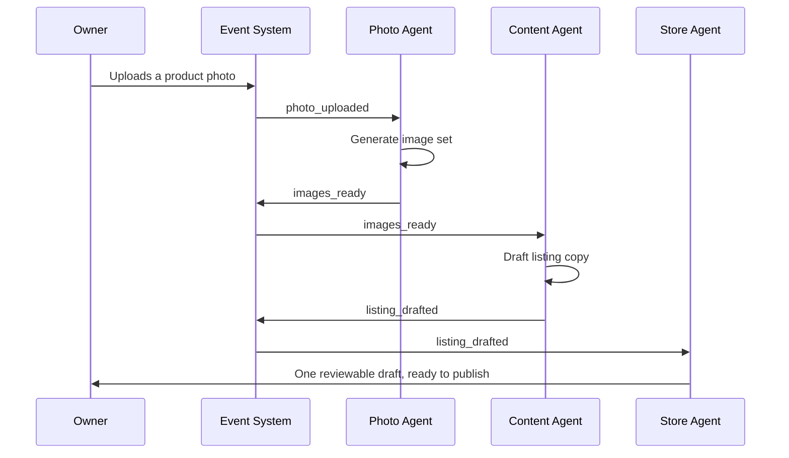

# CowQ AI Agent Architecture
### The AI Brain of CowQ
**Confidential · Internal Use Only · v1.0**
**docs/05-ai-agent-architecture.md**

> "CowQ runs my entire business."

---

## What This Document Is

This is a product architecture document, not an engineering spec. It defines the *mind* of CowQ — how CowQ's intelligence is organized into distinct areas of responsibility, how those areas relate to each other, what each one is trusted to decide on its own versus what it must ask a human about, and how the whole thing adds up to a business running itself. There is no code here, and nothing here should be read as an implementation plan. Engineers building against this document translate it into the AI Playbook's confidence tiers, prompt architecture, and Edge Function pipelines (`docs/04-ai-playbook.md`) — this document explains the shape of the mind those pipelines implement.

It draws on every prior CowQ document as context and does not repeat their content: the Product Bible for why CowQ exists, the Design DNA for how it should feel, the Engineering Handbook and Database Blueprint for what it's built on, the AI Playbook for the AI governance rules already in force, and the Wow Features brainstorm for where this could grow.

### A note on the word "agent"

CowQ does not have 18 separate autonomous programs making independent decisions. It has **one AI system**, governed end-to-end by the confidence-tiering, safety rules, and invisible-first philosophy already established in the AI Playbook (Chapters 1–4, 13–14). What this document calls an "Agent" is a **named area of responsibility** within that one system — a way of organizing what the AI knows, decides, and remembers so that the mind of CowQ stays legible as it grows, rather than becoming one undifferentiated blob of "AI does stuff."

Think of it the way a well-run small business has departments — not eighteen separate companies, one business with eighteen areas of clear ownership. This framing is also why the AI Playbook's own Chapter 36 ("AI Agents — Future") remains correct and undisturbed: that chapter is about a *fundamentally more autonomous* capability CowQ has not built and is not building. The Agents in this document are already-real areas of CowQ's existing, confidence-tiered, human-overseen intelligence — not a new autonomy tier.

---

# 1. Philosophy

CowQ's entire intelligence exists to make three things true at once, and every Agent in this document is measured against all three, not just one:

**CowQ runs my entire business.** Not "helps with tasks." Runs it. The test for any Agent's scope is whether it removes a piece of the business from the owner's plate entirely, or merely makes that piece faster to do by hand. The former is the goal; the latter is a consolation prize.

**AI should be invisible.** The 95%-invisible, 5%-branded law (AI Playbook Chapter 1) is not a UI guideline living one layer above the Agents — it is the architecture of the Agents themselves. An Agent that constantly announces itself has failed at its job as surely as one that gets things wrong. The best-run Agent in this system is the one the owner has almost forgotten is there, because everything it touches simply works.

**The owner should feel relief, not complexity.** Eighteen Agents is a lot of machinery. The owner must never see eighteen of anything. They see one calm business, running. The multiplicity in this document exists entirely on CowQ's side of the glass — internally organized so engineers and future Agents can reason about it clearly, externally invisible so the owner never has to.

---

# 2. The Agent Model

Every Agent in this system shares the same underlying shape:

- **A domain** — the slice of the business it's responsible for.
- **A set of decisions it's trusted to make alone** — the invisible tier (AI Playbook Chapter 3).
- **A set of decisions it must surface for a yes/no** — the branded tier (AI Playbook Chapter 4).
- **A set of decisions it is never allowed to make alone** — the permanently human-gated tier (AI Playbook Chapter 14).
- **A memory it reads from and writes to** — some shared with other Agents, some private to its domain.
- **A set of other Agents it talks to** — because no part of a real business operates in isolation, and neither should any Agent.

```mermaid
flowchart TD
  A[Owner action or real-world event] --> B[Event System — §8]
  B --> C[Relevant Agent(s) activated]
  C --> D{Decision within<br/>this Agent's invisible tier?}
  D -->|Yes| E[Acted silently, logged, editable]
  D -->|No, needs confirmation| F[Surfaced once, calmly, to owner]
  D -->|No, permanently human-gated| G[Never automated — always requires the owner]
  E --> H[Shared Memory updated — §7]
  F --> H
```

This is the same three-tier machine the AI Playbook already defines — this document's job is naming *which domain* is deciding, not inventing a new decision framework.

---

# 3–5. The 18 Core Agents

For each Agent: its purpose, what it's responsible for, what data it owns (and what it only borrows from another Agent), and which other Agents it talks to most.

---

### Brand Agent

**Purpose:** Keeps CowQ speaking, looking, and feeling like *this specific seller* — everywhere, always.

**Responsibilities:** Maintains the seller's tone, terminology, and visual style; learns from every correction the seller makes to any AI output, anywhere in the product; supplies every other Agent that generates seller-facing or customer-facing content with the seller's voice before it writes a word.

**Owns:** Brand Memory (tone, preferred/avoided terms, photo style).

**Borrows from:** Nothing — Brand Agent is the source of truth every other Agent reads from.

**Talks to:** Content Agent, Photo Agent, Caption Agent, Video Agent, Marketing Agent, Store Agent — every Agent that produces something the owner or a customer will see or hear.

---

### Content Agent

**Purpose:** Turns a single input (a photo, a spoken description, a bare fact) into a complete, sellable listing.

**Responsibilities:** Writes titles, descriptions, and structured product/service details; requests Brand Agent's voice before writing; hands finished text to Store Agent for publishing.

**Owns:** Generated listing text and its version history (what was written, when, from what input).

**Borrows from:** Brand Agent (voice), Photo Agent (what the product actually looks like, to write accurately), Pricing Agent (to write price-aware copy where relevant).

**Talks to:** Photo Agent, Pricing Agent, Store Agent, Caption Agent.

---

### Photo Agent

**Purpose:** Turns one uploaded photo into a full, professional set of product images.

**Responsibilities:** Analyzes the input photo; generates studio and styled variants; manages the brand-model-portrait configurator (attire, regional appearance, cultural style); regenerates individual angles on request without touching the rest of the set; always preserves the seller's original upload untouched.

**Owns:** Original and generated image assets and their version history.

**Borrows from:** Brand Agent (photo style preferences).

**Talks to:** Content Agent (supplies visual context for accurate copy), Store Agent (publishes finished images), Video Agent (may supply a starting frame or reference image).

---

### Video Agent

**Purpose:** Extends the Photo Agent's work into motion — product and, eventually, service video.

**Responsibilities:** Manages the video-generation pipeline and its longer, staged status reporting; operates only within its currently-enabled test cohort, never broadly, until real cost and quality data justify wider release; never auto-publishes a video without review, given the higher stakes of moving content.

**Owns:** Video assets and their generation history.

**Borrows from:** Brand Agent (style), Photo Agent (reference imagery), Caption Agent (accompanying text where a video is posted alongside a caption).

**Talks to:** Photo Agent, Marketing Agent, Store Agent.

---

### Caption Agent

**Purpose:** Writes the short-form text that accompanies a product or moment across social and messaging surfaces.

**Responsibilities:** Drafts platform-appropriate captions and hashtags; keeps caption phrasing genuinely varied rather than templated; learns which phrasing styles a given seller's audience responds to over time.

**Owns:** Generated captions and their performance signal (accepted, edited, or ignored).

**Borrows from:** Brand Agent (voice), Content Agent (what the post is actually about), Marketing Agent (when the caption is part of a larger campaign moment).

**Talks to:** Marketing Agent, Content Agent, Growth Agent.

---

### Calendar Agent

**Purpose:** Understands time — the seller's own schedule, their customers' booking slots, and the wider calendar of festivals and local moments that matter to a small Indian business.

**Responsibilities:** Manages service availability and booking confirmation with strict, race-condition-safe accuracy; tracks the festival and local-event calendar as a source of timely, honest marketing moments (never manufactured urgency); manages a seller's "away" periods and adjusts order acceptance and auto-replies accordingly.

**Owns:** Availability slots, bookings, vacation/away state, and the festival-calendar reference data.

**Borrows from:** Nothing structural — Calendar Agent is itself a source other Agents borrow from.

**Talks to:** Marketing Agent (festival-triggered content), Sales Agent (booking-to-order handoff), Customer Agent (booking confirmations and reminders).

---

### Marketing Agent

**Purpose:** Makes sure the business stays visible without the owner having to think about marketing as a separate job.

**Responsibilities:** Assembles content from Content, Photo, Video, and Caption Agents into a coherent posting plan; manages the weekly batch-review-then-schedule auto-posting rhythm; watches for genuinely timely local/festival moments via Calendar Agent; never posts anything the owner hasn't had the chance to review, at whatever review cadence they've earned.

**Owns:** The posting calendar/schedule and its review-approval history.

**Borrows from:** Content Agent, Photo Agent, Video Agent, Caption Agent, Calendar Agent, Brand Agent.

**Talks to:** Nearly every content-producing Agent, plus Growth Agent (referral-moment coordination) and Analytics Agent (what's actually working).

---

### Inventory Agent

**Purpose:** Keeps stock truthful — the single most trust-critical, quietly-running Agent in the system.

**Responsibilities:** Tracks live stock counts and low-stock thresholds; performs AI-assisted recounting from photo or video input, always as a suggestion requiring confirmation, never a silent overwrite; flags dead stock and predicts festival-driven stockouts ahead of time.

**Owns:** Stock counts, inventory movement history, and stock-related AI suggestions.

**Borrows from:** Calendar Agent (festival timing), Sales Agent (real-time consumption from orders).

**Talks to:** Sales Agent, Pricing Agent (dead-stock clearance pricing), Marketing Agent (restock announcements).

---

### Pricing Agent

**Purpose:** Helps a seller price with confidence instead of gut feeling alone.

**Responsibilities:** Suggests prices grounded in the seller's own historical decisions and, where privacy-safe, anonymized aggregate marketplace patterns; always explains its reasoning in plain language, capped at three factors, never technical jargon; never applies a price change without explicit seller confirmation, since price is always at least medium-stakes.

**Owns:** Price-suggestion history and the reasoning behind each suggestion.

**Borrows from:** Inventory Agent (dead-stock/clearance context), Analytics Agent (sales trend context), Marketplace Intelligence (anonymized, aggregate cross-seller signal).

**Talks to:** Content Agent (price-aware copy), Inventory Agent, Analytics Agent.

---

### Sales Agent

**Purpose:** Owns the moment money actually changes hands — cart through order confirmation.

**Responsibilities:** Manages cart, checkout, and the order lifecycle; keeps checkout the calmest, most stripped-down surface in the product, with zero upsells or AI surfaces intruding on it; coordinates atomic, race-condition-safe stock and booking-slot decrements at the exact moment of purchase.

**Owns:** Carts, orders, order status history, and payment status.

**Borrows from:** Inventory Agent (stock availability), Calendar Agent (booking availability), Pricing Agent (current price).

**Talks to:** Inventory Agent, Calendar Agent, Finance Agent, Customer Agent.

---

### Analytics Agent

**Purpose:** Turns raw activity into something a busy, non-technical owner can actually understand and act on.

**Responsibilities:** Computes revenue trends, catalog health, and AI-suggestion performance; always leads with a plain-language sentence before any chart; never presents a misleading number when data is genuinely insufficient, showing an honest "not enough data yet" instead.

**Owns:** Computed trend and performance data (not raw event logs, which belong to Memory Agent's shared substrate).

**Borrows from:** Sales Agent, Inventory Agent, Marketing Agent, Pricing Agent — Analytics Agent reads everyone's activity but originates none of it.

**Talks to:** Growth Agent (what's working, worth doubling down on), Marketing Agent, Finance Agent.

---

### Customer Agent

**Purpose:** Understands and nurtures the seller's relationship with each individual customer — strictly, permanently scoped to that one seller's relationship, never shared across sellers.

**Responsibilities:** Surfaces who a seller's best customers are and why; drafts (never auto-sends) replies to customer messages, including transcribing and responding to voice notes; detects genuine, well-timed referral moments; never lets one seller see another seller's view of the same real person.

**Owns:** Customer Memory, conversation threads, and per-customer relationship signals — entirely partitioned per seller.

**Borrows from:** Sales Agent (order history), Review Agent (satisfaction signal).

**Talks to:** Sales Agent, Review Agent, Growth Agent, Marketing Agent.

---

### Review Agent

**Purpose:** Protects the integrity of trust on the platform.

**Responsibilities:** Manages the review and testimonial systems; ensures reviews can never be hidden, filtered, or suppressed by a seller — a permanent, structural guarantee, not a policy choice; drafts (never auto-sends) fair, calm seller responses to reviews, including a de-escalation draft for angry or frustrated customer messages generally.

**Owns:** Reviews, seller responses, and testimonials.

**Borrows from:** Sales Agent (verifying a review is tied to a real, completed transaction), Customer Agent (relationship context for tone).

**Talks to:** Customer Agent, Store Agent (Trust Strip display), Brand Agent (response tone).

---

### Finance Agent

**Purpose:** Keeps the money story honest and complete — the Agent with the least tolerance for ambiguity anywhere in the system.

**Responsibilities:** Tracks payments, refunds, and the credit economy; owns the single, permanent rule that credits are only ever deducted through one sanctioned path, and only after a generation has genuinely succeeded; computes true per-product margin, including AI-generation cost, not just goods and delivery; reconciles cash and online sales into one true ledger.

**Owns:** Payments, refunds, credit balances and transactions, and margin computations.

**Borrows from:** Sales Agent (order totals), Content/Photo/Video Agents (credit cost of what was generated).

**Talks to:** Sales Agent, Analytics Agent, Pricing Agent.

---

### Growth Agent

**Purpose:** Helps the business get bigger, without ever nagging the owner or fabricating urgency to do it.

**Responsibilities:** Detects genuine referral moments and drafts the ask; coordinates any future shop-to-shop cross-promotion between consenting, complementary sellers; feeds honest, evidence-based performance signal back into Marketing Agent so the business's own history informs what it tries next.

**Owns:** Referral tracking and cross-promotion relationships.

**Borrows from:** Customer Agent (referral-moment detection), Analytics Agent (what's genuinely working), Review Agent (satisfaction as a referral precondition).

**Talks to:** Customer Agent, Marketing Agent, Analytics Agent.

---

### Store Agent

**Purpose:** Owns the storefront — the seller's public face to the world.

**Responsibilities:** Assembles the storefront from its fixed, curated section system — never a freeform canvas; keeps the Trust Strip accurate and current; manages collections, including the system-generated ones that need zero seller setup; ensures the storefront always renders fast and complete, even at zero customization.

**Owns:** The storefront itself, its sections, and collections.

**Borrows from:** Content Agent, Photo Agent, Brand Agent, Review Agent (Trust Strip), Pricing Agent (current prices).

**Talks to:** Content Agent, Photo Agent, Review Agent, Marketing Agent.

---

### Automation Agent

**Purpose:** Orchestrates multi-step, scheduled, or batched work across the other Agents — the conductor, not a soloist.

**Responsibilities:** Runs the weekly batch-review-then-schedule rhythm for auto-posting; manages the gradual, per-seller, per-action-type escalation of automation trust as it's earned; never grants itself broader autonomy than any individual Agent it's orchestrating already has — orchestration never bypasses governance.

**Owns:** Automation schedules, batch-review sessions, and per-seller automation trust levels.

**Borrows from:** Every content- and decision-producing Agent it sequences.

**Talks to:** Marketing Agent, Content Agent, Photo Agent, Caption Agent, Video Agent, Calendar Agent.

---

### Memory Agent

**Purpose:** The keeper of everything every other Agent has learned — the connective tissue that makes the whole system feel like it remembers the seller, not just processes their requests.

**Responsibilities:** Maintains Brand Memory, Business Memory, and Customer Memory as three genuinely distinct, correctly-scoped systems; aggregates real correction and behavior signal into memory updates on a pattern-threshold basis, never overreacting to one-off edits; keeps every memory system fully visible and editable by the seller, with no black boxes anywhere.

**Owns:** All three memory systems and the aggregation logic that updates them.

**Borrows from:** Every Agent — Memory Agent is the one Agent every other Agent both feeds and reads from.

**Talks to:** Brand Agent (most directly), and structurally, all eighteen.

---

# 6. Communication Map



Three Agents sit at structural center: **Memory Agent** (everyone's shared understanding of the seller), **Brand Agent** (everyone's shared voice), and **Sales Agent** (where every other Agent's work ultimately either does or doesn't turn into money). A useful architectural test for any new Agent: does it connect to at least one of these three? If not, it's probably not a real Agent — it's a feature that belongs inside an existing one.

---

# 7. Priority System

Agents will occasionally want the same scarce thing at the same time — the owner's attention, AI generation budget, or a conflicting decision about the same product. Priority resolves in this fixed order, never negotiated ad hoc:

1. **Safety and trust always win.** A Review Agent flag about a suppressed review, or a Finance Agent flag about a credit-deduction anomaly, pre-empts everything else, including in-progress marketing or content work.
2. **Money-moving decisions outrank content decisions.** Sales Agent and Finance Agent's needs are served before Marketing Agent's or Caption Agent's, when both are competing for the same moment of owner attention.
3. **One suggestion is visible to the owner at a time, system-wide** — not per Agent. If both Pricing Agent and Inventory Agent have something to say, they queue; the owner is never shown two things needing a decision simultaneously, regardless of which Agent generated each one.
4. **Invisible-tier work never blocks on visible-tier work.** An Agent operating silently (its own invisible-confidence decisions) proceeds regardless of whether another Agent currently has a suggestion pending owner review.
5. **Recently-dismissed requests from the same Agent yield.** An Agent whose suggestion type has been dismissed by this seller three times running (AI Playbook Chapter 4) drops in priority for that seller specifically, making room for Agents the seller has shown more appetite to hear from.

---

# 8. Agent Memory System

Every Agent draws from the same three-part memory architecture already governed by the AI Playbook (Chapters 5–8), organized here by who primarily owns and feeds each part:

| Memory type | Primary owner | Fed by | Read by |
|---|---|---|---|
| **Brand Memory** — tone, style, terminology | Brand Agent | Every content-producing Agent's corrections | Content, Photo, Caption, Video, Marketing, Store, Review |
| **Business Memory** — pricing philosophy, inventory behavior, fulfillment patterns | Memory Agent, informed by Pricing & Inventory Agents | Pricing Agent's suggestion outcomes, Inventory Agent's stock patterns | Pricing, Inventory, Automation, Growth |
| **Customer Memory** — per-seller, per-customer relationship signal | Customer Agent | Sales Agent (orders), Review Agent (satisfaction) | Customer, Growth, Marketing (never across sellers) |

No Agent maintains a private, un-inspectable memory of its own outside this structure. If an Agent needs to remember something new, that something joins one of these three systems, visible and editable by the seller — never a fourth, hidden memory layer invented ad hoc by a single Agent.

Beyond the three persistent memory types, every Agent also has a short-lived **working context** — the specific inputs relevant to the task in front of it right now (a photo just uploaded, an order just placed) — which is not memory in the persistent sense, just the immediate situation an Agent is reasoning about.

---

# 9. Event System

Agents don't poll each other or run on fixed schedules by default — they respond to events, the same way a real business responds to things happening rather than checking a clipboard every five minutes.

**Core event categories:**
- **Owner actions** — a photo uploaded, a product edited, a price changed, a message sent.
- **Customer actions** — an order placed, a review left, a message received, a booking requested.
- **Time-based events** — a scheduled auto-posting review window opening, a festival approaching, a booking slot's start time arriving.
- **System-detected events** — stock crossing a low threshold, a customer's behavior pattern suggesting a referral moment, a catalog item going quiet for months.



Every event is attributable to exactly one origin and every Agent's response to it is logged (mirroring the AI Playbook's Activity Log discipline) — not because this document is a technical spec, but because "the AI brain of CowQ" only stays trustworthy if every thought it has can, in principle, be traced back to why it had it.

---

# 10. Automation Rules

Automation is what happens when several Agents' invisible-tier work chains together into something that used to be a whole afternoon of a seller's time. The rules governing this chaining, at the product level:

1. **A chain of invisible decisions stays invisible only as long as every link in the chain is itself invisible-tier.** The moment any Agent in a chain would need to surface a decision, the whole chain pauses there for the owner — automation never "averages out" caution across a multi-step process.
2. **Automation is always reviewable in one place**, regardless of how many Agents contributed to it — a batch of a week's worth of Marketing Agent output, assembled from Content, Photo, Caption, and Video Agents, is reviewed by the owner as one coherent batch, never as four separate approval screens.
3. **Automation trust is earned per Agent, per seller, and grows gradually** — a seller who has approved twenty consecutive weeks of Marketing Agent's drafts without a single edit may reasonably see a lighter-touch review for that specific Agent; this never transfers automatically to a different Agent, especially not to Finance Agent or Sales Agent, whose trust bar is permanently higher.
4. **Every automated chain has an off switch the owner can find in one place**, and using it never breaks anything already in motion — an owner going on vacation (Calendar Agent) can pause Marketing Agent's posting without disrupting Sales Agent's order handling.

---

# 11. Future Agents

Not built, not scoped, not on the near-term roadmap — named here so future expansion has a place to land rather than being invented ad hoc.

- **Voice Agent** — a dedicated home for voice-first interaction (speaking a listing into existence, hearing a daily business briefing) once this grows beyond a capability inside Content and Analytics Agents into its own coherent domain.
- **Legal & Compliance Agent** — return policy, consumer-protection norms, and dispute-resolution fairness, currently living inside Review Agent, would graduate to its own Agent if CowQ's own payments/financial products (Product Bible Chapter 4) mature enough to need dedicated compliance ownership.
- **Logistics Agent** — real carrier booking, delivery tracking, and multi-carrier reconciliation, once CowQ moves beyond its current honest scope limitation (Product Bible Chapter 29) of address capture and status tracking alone.
- **Community Agent** — shop-to-shop referral networks and nearby-seller discovery, currently a Growth Agent responsibility, would graduate to its own Agent once cross-seller relationship features grow substantial enough to need dedicated ownership.
- **Orchestrator Agent** — a genuinely more autonomous, multi-step planning capability sitting above today's Automation Agent, corresponding to the AI Playbook's already-defined, deliberately speculative "AI Agents (Future)" chapter — this is the one true frontier this document acknowledges without building toward.

---

# 12. Principles

Five rules bind every Agent equally, with no exceptions granted to any single one of the eighteen, however important its domain:

**AI never asks unnecessary questions.** Before any Agent adds a question to any flow, it must prove the answer genuinely can't be inferred from a photo, a prior decision, or context another Agent already holds.

**Infer first.** The default assumption for any new input is that CowQ can figure it out — asking is the fallback, not the starting point, for every Agent without exception.

**One-click.** Wherever an Agent must surface a decision to the owner, that decision resolves in one tap. Multi-step confirmation flows are a signal the Agent hasn't done enough of the thinking itself yet.

**Hands-free.** The measure of a well-designed Agent is how much of the business keeps running while the owner is doing something else entirely — serving a customer, cooking dinner, asleep.

**Business-first.** Every Agent exists to serve the seller's actual business outcome, never CowQ's own engagement or usage metrics. An Agent that would technically increase how often a seller opens the app, at the cost of making them do more work or feel more anxious about their business, has failed regardless of what the metric says.

---

# 13. Success Metrics

How CowQ knows the eighteen-Agent mind is actually working, in the seller's real life, not just on a dashboard:

| Metric | What it tells us | Which Agents it reflects |
|---|---|---|
| Time-to-First-Value | Whether the mind gets a seller to real value fast enough to matter | Content, Photo, Store |
| AI Suggestion Acceptance Rate, per Agent | Whether each Agent's judgment is actually trustworthy | All branded-tier Agents |
| Invisible-tier correction rate | Whether silent decisions are staying silent because they're right, not because no one's checking | All Agents with invisible-tier decisions |
| Multi-pillar usage breadth per seller | Whether the seller is experiencing CowQ as one mind running their business, or a single useful tool | All Agents, in aggregate — the North Star Metric |
| Automation trust level distribution | Whether the relationship between seller and Agent is genuinely deepening over time, not stuck at day-one caution forever | Automation Agent, and every Agent it orchestrates |
| Support contacts citing confusion about "why did CowQ do this" | Whether the mind remains explainable as it grows more capable | Memory Agent, and any Agent whose reasoning wasn't legible enough |

None of these are new metrics — each traces directly to a measurement already established in the Product Bible (Chapter 51) or AI Playbook (Chapter 28). This document's contribution is reading them per-Agent, so a specific area of CowQ's mind can be diagnosed and improved without having to reason about the whole system at once.

---

## Version History

| Version | Date | Change | Author |
|---|---|---|---|
| 1.0 | 2026-07-30 | Initial AI Agent Architecture — 18 core Agents defined as responsibility domains within CowQ's single, existing, confidence-tiered AI system (not a new autonomy tier); communication map, priority system, three-part memory architecture, event system, automation rules, five future Agents named, and per-Agent success metrics. Explicitly reconciled with AI Playbook Chapter 36 rather than contradicting it. | CowQ AI Office |

---

*End of the CowQ AI Agent Architecture v1.0. Eighteen areas of responsibility, one mind, one business — and the owner should never have to know there were eighteen of anything.*
