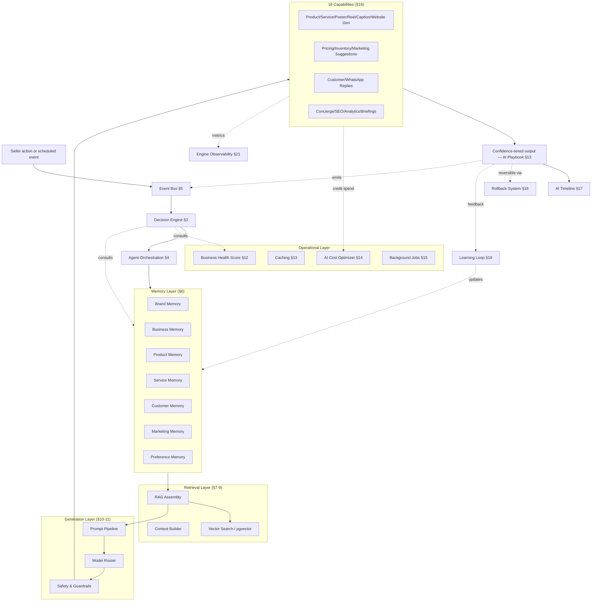
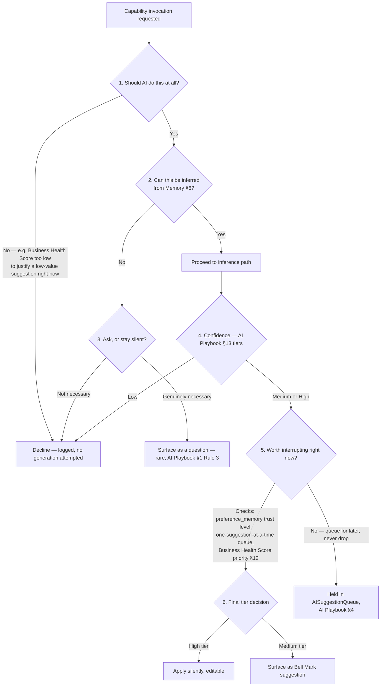
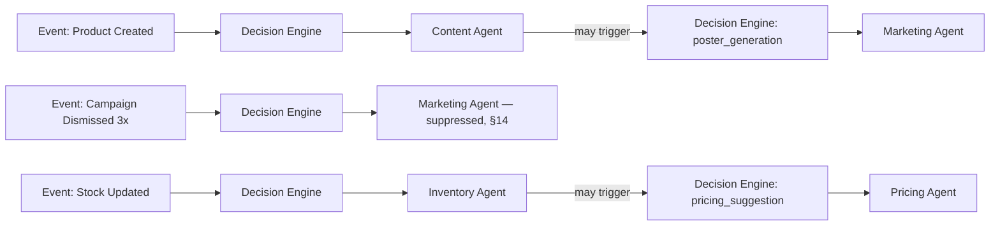
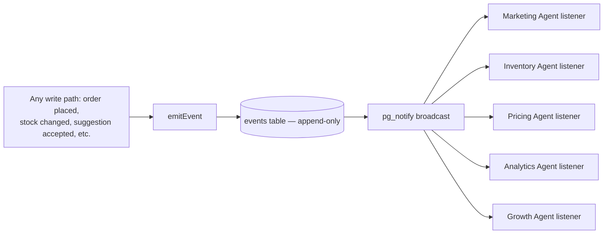
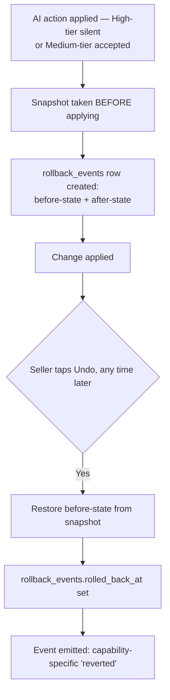
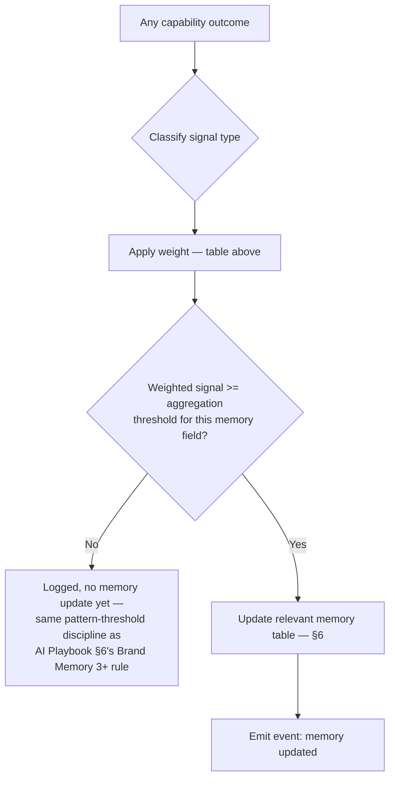
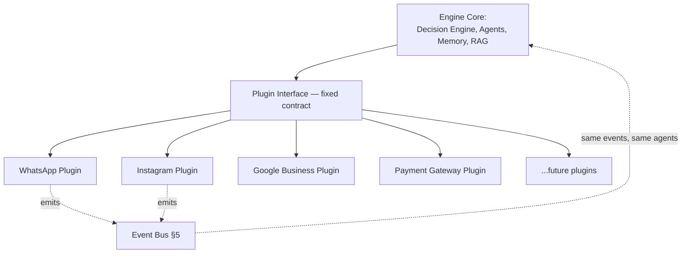

# CowQ AI Commerce Engine v2
### Production Architecture Document
**Confidential · Internal Use Only**

> "CowQ runs my entire business." — the Engine is the literal mechanism that makes this sentence true.

---

## What Changed From v1

v2 keeps every v1 decision intact — the seven memory types, the Context Builder, RAG/embeddings, the Prompt Pipeline, Model Routing, Caching, the 18-capability catalog, the API layer, database schema, UX contract, security, testing, and deployment plan are all still here, unedited in substance. v2 adds ten new subsystems, inserted where they naturally belong rather than tacked on at the end: a **Decision Engine** that now gates every capability before it runs, an **Agent Orchestration Layer** that groups the 18 capabilities into eight named agents, an **Event Bus** that replaces polling everywhere, a **Business Health Score** the Decision Engine uses to prioritize, an expanded **Cost Optimizer**, an **AI Timeline**, a **Rollback System**, a formalized **Learning Loop**, a **Plugin Architecture**, and full **Engine Observability**. Every v1 capability and pipeline step now explicitly routes through the Decision Engine and emits events — that integration is called out at each touchpoint, not left implicit.

---

# 1. Philosophy

*(Unchanged from v1.)*

The Engine exists to satisfy one sentence and four rules, restated here as the literal design constraints every section below is checked against:

**"CowQ runs my entire business."** The Engine's job is not to assist with tasks — it's to hold enough of the business in memory that the seller experiences fewer decisions, not more tools.

**Learn continuously.** Every seller interaction — a correction, an accepted suggestion, a dismissed one, a real sale — is a training signal the Engine captures and folds into memory, automatically, without the seller ever "training" anything explicitly.

**Infer first, ask only when necessary.** Before any capability adds a question to any flow, it must prove the answer can't be inferred from memory, from a photo, or from prior behavior.

**95% invisible, 5% branded.** The overwhelming majority of the Engine's work happens without the seller consciously interacting with "AI" as a concept. The rare branded moment (AI Playbook Chapter 4's Bell Mark) exists only where a genuine judgment call requires human sign-off.

---

# 2. Engine Architecture Overview (updated for v2)



**The one architectural rule every section below obeys (unchanged from v1):** memory is read by the Context Builder, never directly by an individual capability. **New in v2:** no capability *runs at all* without first clearing the Decision Engine (§3), and no capability's outcome goes unrecorded — every outcome is an event (§5), a Timeline entry (§17), and an observability data point (§21).

---

# 3. AI Decision Engine (new — highest priority)

## Purpose

The brain that runs *before* every one of the 18 capabilities in §16, and before every Agent (§4) action. Nothing in this Engine generates content, changes a price, or drafts a reply without first passing through this gate. It answers six questions, every time, for every capability invocation:

1. Should AI do this at all?
2. Should AI infer, or does this genuinely need to ask?
3. Should AI ask the seller, or stay silent?
4. Is confidence high enough to proceed?
5. Is this worth interrupting the seller for, right now?
6. What tier should the output surface at (invisible / suggested / never)?

## Architecture



## Database Changes

```sql
create table if not exists decision_engine_log (
  id uuid primary key default gen_random_uuid(),
  seller_id uuid not null references sellers(id) on delete cascade,
  capability text not null,
  decision text not null check (decision in ('declined', 'inferred_silent', 'inferred_suggested', 'asked', 'held_for_later')),
  reasoning jsonb not null, -- { businessHealthCheck, confidenceScore, trustLevel, queueState } — every input to the decision, for auditability
  ai_activity_log_id uuid references ai_activity_log(id), -- linked once the capability actually runs
  created_at timestamptz not null default now()
);
create index if not exists idx_decision_engine_log_seller_capability on decision_engine_log(seller_id, capability, created_at desc);
alter table decision_engine_log enable row level security;
create policy "Sellers view their own decision engine log"
  on decision_engine_log for select
  using (exists (select 1 from business_members where business_id = decision_engine_log.seller_id and user_id = auth.uid()));
-- Inserts via Edge Functions (service role) only.
```

## Implementation

```typescript
// supabase/functions/_shared/decision/decisionEngine.ts
export interface DecisionResult {
  decision: 'declined' | 'inferred_silent' | 'inferred_suggested' | 'asked' | 'held_for_later';
  reasoning: Record<string, unknown>;
}

export async function evaluate(
  sellerId: string, capability: AICapability, opts: { productId?: string; serviceId?: string } = {}
): Promise<DecisionResult> {
  // Question 1: worth doing at all?
  const healthScore = await getBusinessHealthScore(sellerId); // §12
  const minHealthForCapability = MIN_HEALTH_THRESHOLDS[capability] ?? 0;
  if (healthScore.overall < minHealthForCapability) {
    return logAndReturn(sellerId, capability, 'declined', { reason: 'business_health_below_threshold', healthScore: healthScore.overall });
  }

  // Question 2/3: infer or ask?
  const canInfer = await checkInferability(sellerId, capability, opts); // reads Memory via Context Builder, §7
  if (!canInfer && !CAPABILITIES_THAT_MAY_ASK.has(capability)) {
    return logAndReturn(sellerId, capability, 'declined', { reason: 'cannot_infer_and_asking_not_permitted_for_capability' });
  }
  if (!canInfer) {
    return logAndReturn(sellerId, capability, 'asked', { reason: 'genuine_inference_gap' });
  }

  // Question 4: confidence.
  const confidenceScore = await estimateConfidence(sellerId, capability, opts);
  const thresholds = await getConfidenceThresholds(capability); // AI Playbook §13, unchanged
  const tier = classifyConfidence(capability, confidenceScore, thresholds);
  if (tier === 'low') {
    return logAndReturn(sellerId, capability, 'declined', { reason: 'low_confidence', confidenceScore });
  }

  // Question 5: worth interrupting now?
  const trust = await getPreferenceMemory(sellerId, capability); // §6.7 (v1's Preference Memory, unchanged)
  const queueHasRoom = await checkSuggestionQueueRoom(sellerId); // AI Playbook §4 Rule 3, one-at-a-time
  if (tier === 'medium' && !queueHasRoom) {
    return logAndReturn(sellerId, capability, 'held_for_later', { reason: 'suggestion_queue_full' });
  }

  // Question 6: final tier.
  const decision = tier === 'high' && trust.automationTrustLevel !== 'review_required' ? 'inferred_silent' : 'inferred_suggested';
  return logAndReturn(sellerId, capability, decision, { confidenceScore, trustLevel: trust.automationTrustLevel, healthScore: healthScore.overall });
}

async function logAndReturn(sellerId: string, capability: string, decision: DecisionResult['decision'], reasoning: Record<string, unknown>): Promise<DecisionResult> {
  await supabaseAdmin.from('decision_engine_log').insert({ seller_id: sellerId, capability, decision, reasoning });
  return { decision, reasoning };
}
```

**Every one of the 18 capabilities in §16 now begins with a call to `evaluate()`** — this replaces each capability independently deciding its own confidence tiering, unifying that logic into one place. §16's capability catalog is otherwise unchanged; this is a routing change, not a content change.

## Edge Cases

A capability that is permanently restricted from `auto_apply` (AI Playbook §14 Rule 3 — irreversible financial/security actions) has that restriction enforced as a hard ceiling *inside* `evaluate()` — Question 6 can never return `inferred_silent` for such a capability regardless of confidence or trust level, closing the exact loophole the Preference Memory system (§6.7) would otherwise create if trust escalation were the only gate.

## Acceptance Criteria

- [ ] Every capability invocation in §16 produces exactly one `decision_engine_log` row before any generation call is attempted.
- [ ] Zero capabilities on the permanently-restricted list ever receive an `inferred_silent` decision, verified via test.

---

# 4. Agent Orchestration Layer (new)

## Purpose

The 18 capabilities in §16 don't operate as 18 independent functions competing for the seller's attention — they're grouped into eight named agents, each owning a coherent slice of the business, communicating exclusively through the Decision Engine (§3) rather than calling each other directly.

## The Eight Agents

| Agent | Owns (capabilities from §16) | Primary memory |
|---|---|---|
| **Content Agent** | Product Generation, Service Generation, Caption Generation, Website Generation | Brand, Product, Service |
| **Marketing Agent** | Poster Generation, Reel Generation, Festival Campaign, Marketing Suggestion | Brand, Marketing |
| **Pricing Agent** | Pricing Suggestion | Business, Product |
| **Inventory Agent** | Inventory Suggestion | Business, Product |
| **Store Agent** | Shop Optimization, SEO Generation | Brand, Business, Product, Service, Marketing |
| **Analytics Agent** | Analytics Insight, Daily Business Briefing, Weekly Growth Report | Business, Product, Service, Marketing |
| **Customer Agent** | Customer Reply, WhatsApp Reply, AI Store Assistant/Concierge | Brand, Customer |
| **Growth Agent** | *(no direct capability yet — consumes Business Health Score §12 and Marketing Memory to identify cross-agent opportunities, e.g. "Pricing Agent's last suggestion plus Marketing Agent's dismissal pattern suggests a bundle offer" — genuinely cross-cutting, deliberately thin in v2, expanded as real cross-agent signal accumulates)* | Business, Marketing |

**This mapping is identical in spirit to AI Playbook Chapter 19's already-established Agent model** (which frames "Agent" as a named area of responsibility within one AI system, not eighteen autonomous programs) — v2 makes that mapping concrete and binding for this Engine specifically.

## Architecture



**Agents never call each other's capabilities directly.** When Content Agent's Product Generation completes, it doesn't call Marketing Agent's Poster Generation itself — it emits a `product_created` event (§5), and Marketing Agent's own event listener decides, via the Decision Engine, whether a poster suggestion is warranted. This is what keeps eight agents from becoming a tangled call graph.

## Database Changes

```sql
create table if not exists agent_registry (
  agent_name text primary key,
  owned_capabilities text[] not null,
  primary_memory_types text[] not null
);
insert into agent_registry (agent_name, owned_capabilities, primary_memory_types) values
  ('content_agent', array['product_generation','service_generation','caption_generation','website_generation'], array['brand_memory','product_memory','service_memory']),
  ('marketing_agent', array['poster_generation','reel_generation','festival_campaign','marketing_suggestion'], array['brand_memory','marketing_memory']),
  ('pricing_agent', array['pricing_suggestion'], array['business_memory','product_memory']),
  ('inventory_agent', array['inventory_suggestion'], array['business_memory','product_memory']),
  ('store_agent', array['shop_optimization','seo_generation'], array['brand_memory','business_memory','product_memory','service_memory','marketing_memory']),
  ('analytics_agent', array['analytics_insight','daily_briefing','weekly_growth_report'], array['business_memory','product_memory','service_memory','marketing_memory']),
  ('customer_agent', array['customer_reply','whatsapp_reply','store_assistant'], array['brand_memory','customer_memory']),
  ('growth_agent', array[]::text[], array['business_memory','marketing_memory'])
on conflict (agent_name) do update set owned_capabilities = excluded.owned_capabilities;
```

## Implementation

```typescript
// supabase/functions/_shared/agents/agentRegistry.ts
export function getAgentForCapability(capability: AICapability): AgentName {
  const entry = Object.entries(AGENT_REGISTRY).find(([, agent]) => agent.ownedCapabilities.includes(capability));
  if (!entry) throw new Error(`No agent owns capability: ${capability}`);
  return entry[0] as AgentName;
}
```

Every Edge Function in §16/§22 is now attributed to its owning agent in its `decision_engine_log`/`ai_activity_log` entries — this is what makes the AI Timeline (§17) able to show a seller "your Marketing Agent posted this" rather than an unattributed action.

## Acceptance Criteria

- [ ] Every capability in §16 maps to exactly one agent in `agent_registry`.
- [ ] Zero direct capability-to-capability calls exist in the codebase — all cross-capability triggering happens via events (§5).

---

# 5. Event Bus (new)

## Purpose

Every meaningful thing that happens in CowQ emits an event. Every AI capability that needs to react to something listens for that event — it never polls a table looking for changes.

## Event Catalog

```typescript
export type CowQEvent =
  | { type: 'product_created'; sellerId: string; productId: string }
  | { type: 'product_sold'; sellerId: string; productId: string; orderId: string }
  | { type: 'stock_updated'; sellerId: string; productId: string; newCount: number }
  | { type: 'campaign_accepted'; sellerId: string; capability: string; generationId: string }
  | { type: 'campaign_dismissed'; sellerId: string; capability: string; generationId: string }
  | { type: 'poster_generated'; sellerId: string; productId: string; assetId: string }
  | { type: 'customer_asked_question'; sellerId: string; sessionId: string; intentType: string }
  | { type: 'payment_received'; sellerId: string; orderId: string; amountCents: number };
```

## Architecture



**This extends, rather than replaces, the existing `pg_notify`-based broadcast pattern already proven for AI job status streaming** (Database Blueprint §23/§47) — the Engine's Event Bus is the same underlying mechanism, generalized from one narrow use case (job status) to every meaningful business event.

## Database Changes

```sql
create table if not exists events (
  id uuid primary key default gen_random_uuid(),
  seller_id uuid not null references sellers(id) on delete cascade,
  event_type text not null,
  payload jsonb not null,
  processed boolean not null default false, -- for at-least-once delivery verification, see Edge Cases below
  created_at timestamptz not null default now()
);
create index if not exists idx_events_seller_type on events(seller_id, event_type, created_at desc);
create index if not exists idx_events_unprocessed on events(created_at) where processed = false;

alter table events enable row level security;
create policy "Sellers view their own events"
  on events for select
  using (exists (select 1 from business_members where business_id = events.seller_id and user_id = auth.uid()));
-- Inserts via a single shared emitEvent() function (service role) only.

create or replace function broadcast_event()
returns trigger language plpgsql as $$
begin
  perform pg_notify('cowq_events', json_build_object('type', new.event_type, 'sellerId', new.seller_id, 'eventId', new.id)::text);
  return new;
end;
$$;
create trigger trg_events_broadcast after insert on events
  for each row execute function broadcast_event();
```

## Implementation

```typescript
// supabase/functions/_shared/events/emitEvent.ts
export async function emitEvent(event: CowQEvent): Promise<void> {
  await supabaseAdmin.from('events').insert({
    seller_id: event.sellerId, event_type: event.type, payload: event,
  });
}

// supabase/functions/_shared/events/subscribe.ts — one listener per agent, not per capability
export function subscribeAgent(agentName: AgentName, eventTypes: string[], handler: (event: CowQEvent) => Promise<void>) {
  const channel = supabaseAdmin.channel('cowq_events').on('broadcast', { event: 'cowq_events' }, async (payload) => {
    if (!eventTypes.includes(payload.type)) return;
    const event = await fetchEventById(payload.eventId);
    await handler(event);
    await supabaseAdmin.from('events').update({ processed: true }).eq('id', payload.eventId);
  });
  channel.subscribe();
}
```

**Example — Marketing Agent's reaction to `product_created`:**

```typescript
// supabase/functions/marketing-agent-listener/index.ts
subscribeAgent('marketing_agent', ['product_created'], async (event) => {
  if (event.type !== 'product_created') return;
  const decision = await evaluate(event.sellerId, 'poster_generation', { productId: event.productId });
  if (decision.decision === 'declined') return; // Decision Engine already logged why
  await invokeCapability('poster_generation', event.sellerId, { productId: event.productId });
});
```

## Edge Cases

An event processed twice (a genuine at-least-once delivery risk with `pg_notify`) must never cause a duplicate generation — every capability invocation checks for an existing `ai_activity_log`/`decision_engine_log` entry for the same `(sellerId, capability, sourceEventId)` tuple before proceeding, making event handling idempotent rather than relying on `pg_notify` never double-firing.

## Acceptance Criteria

- [ ] Zero polling loops exist anywhere in the Engine's codebase — every reactive capability trigger is event-driven.
- [ ] Duplicate event delivery is verified, via test, to never produce a duplicate generation.

---

# 6. Memory Architecture

*(Unchanged from v1 — all seven memory types, unedited. Reproduced in full below since v2 is one complete document, not a diff.)*

## 6.1 Brand Memory (existing — Database Blueprint §8)

Tone, preferred/avoided terms, photo style, accent color, CTA style. Every capability in §16 that produces seller- or customer-facing text or imagery reads this first.

## 6.2 Business Memory (existing — Database Blueprint §9)

Pricing philosophy, inventory behavior notes, fulfillment patterns, fed by `business_memory_signals`.

```sql
alter table business_memory_signals drop constraint if exists business_memory_signals_signal_type_check;
alter table business_memory_signals add constraint business_memory_signals_signal_type_check
  check (signal_type in ('pricing_decision', 'restock_timing', 'fulfillment_timing', 'offer_response', 'competitor_reference'));
```

## 6.3 Product Memory (v1)

```sql
create table if not exists product_memory (
  product_id uuid primary key references catalog_items(id) on delete cascade,
  seller_id uuid not null references sellers(id) on delete cascade,
  best_performing_angle text,
  description_style_notes text,
  demand_pattern jsonb,
  last_regenerated_at timestamptz,
  updated_at timestamptz not null default now()
);
create index if not exists idx_product_memory_seller_id on product_memory(seller_id);
alter table product_memory enable row level security;
create policy "Sellers manage their own product memory"
  on product_memory for all
  using (exists (select 1 from business_members where business_id = product_memory.seller_id and user_id = auth.uid()));
```

## 6.4 Service Memory (v1)

```sql
create table if not exists service_memory (
  service_id uuid primary key references services(id) on delete cascade,
  seller_id uuid not null references sellers(id) on delete cascade,
  common_questions text[],
  booking_conversion_notes text,
  typical_lead_time_days numeric,
  updated_at timestamptz not null default now()
);
create index if not exists idx_service_memory_seller_id on service_memory(seller_id);
alter table service_memory enable row level security;
create policy "Sellers manage their own service memory"
  on service_memory for all
  using (exists (select 1 from business_members where business_id = service_memory.seller_id and user_id = auth.uid()));
```

## 6.5 Customer Memory (existing — Database Blueprint §10)

Strictly per-seller-relationship-scoped, computed live from `orders`. The Engine's single most privacy-sensitive memory type — never joined across sellers.

## 6.6 Marketing Memory (v1)

```sql
create table if not exists marketing_memory (
  id uuid primary key default gen_random_uuid(),
  seller_id uuid not null references sellers(id) on delete cascade,
  campaign_type text not null check (campaign_type in ('caption', 'poster', 'reel', 'festival', 'offer')),
  content_summary text not null,
  outcome_signal text check (outcome_signal in ('accepted', 'dismissed', 'edited_heavily', 'high_engagement', 'low_engagement')),
  linked_ai_generation_id uuid references ai_generations(id),
  created_at timestamptz not null default now()
);
create index if not exists idx_marketing_memory_seller_type on marketing_memory(seller_id, campaign_type, created_at desc);
alter table marketing_memory enable row level security;
create policy "Sellers view their own marketing memory"
  on marketing_memory for select
  using (exists (select 1 from business_members where business_id = marketing_memory.seller_id and user_id = auth.uid()));
```

## 6.7 Preference Memory (v1)

```sql
create table if not exists preference_memory (
  seller_id uuid not null references sellers(id) on delete cascade,
  capability text not null,
  automation_trust_level text not null default 'review_required' check (automation_trust_level in ('review_required', 'batch_review', 'auto_apply')),
  consecutive_accepts integer not null default 0,
  consecutive_dismisses integer not null default 0,
  updated_at timestamptz not null default now(),
  primary key (seller_id, capability)
);
alter table preference_memory enable row level security;
create policy "Sellers manage their own preference memory"
  on preference_memory for all
  using (exists (select 1 from business_members where business_id = preference_memory.seller_id and user_id = auth.uid()));
```

```typescript
// supabase/functions/_shared/memory/preferenceMemory.ts — unchanged from v1
export async function updateTrustLevel(sellerId: string, capability: string, outcome: 'accepted' | 'dismissed') {
  const { data: pref } = await supabaseAdmin.from('preference_memory').select('*')
    .eq('seller_id', sellerId).eq('capability', capability).maybeSingle();
  const current = pref ?? { automation_trust_level: 'review_required', consecutive_accepts: 0, consecutive_dismisses: 0 };
  const consecutiveAccepts = outcome === 'accepted' ? current.consecutive_accepts + 1 : 0;
  const consecutiveDismisses = outcome === 'dismissed' ? current.consecutive_dismisses + 1 : 0;
  let trustLevel = current.automation_trust_level;
  if (consecutiveAccepts >= 20 && trustLevel === 'review_required') trustLevel = 'batch_review';
  if (consecutiveAccepts >= 20 && trustLevel === 'batch_review') trustLevel = 'auto_apply';
  if (consecutiveDismisses >= 3) trustLevel = 'review_required';
  await supabaseAdmin.from('preference_memory').upsert({
    seller_id: sellerId, capability, automation_trust_level: trustLevel,
    consecutive_accepts: consecutiveAccepts, consecutive_dismisses: consecutiveDismisses,
    updated_at: new Date().toISOString(),
  });
  // NEW in v2: every trust-level update also emits an event and feeds the Learning Loop (§19).
  await emitEvent({ type: outcome === 'accepted' ? 'campaign_accepted' : 'campaign_dismissed', sellerId, capability, generationId: '' });
}
```

---

# 7. Context Builder

*(Unchanged from v1 — reproduced in full.)*

```typescript
// supabase/functions/_shared/context/buildContext.ts
export interface ContextRequirements {
  brandMemory: boolean; businessMemory: boolean; productMemory: boolean;
  serviceMemory: boolean; customerMemory: boolean; marketingMemory: boolean; preferenceMemory: boolean;
}

export const CONTEXT_REQUIREMENTS: Record<AICapability, ContextRequirements> = {
  product_generation: { brandMemory: true, businessMemory: false, productMemory: true, serviceMemory: false, customerMemory: false, marketingMemory: false, preferenceMemory: true },
  service_generation: { brandMemory: true, businessMemory: false, productMemory: false, serviceMemory: true, customerMemory: false, marketingMemory: false, preferenceMemory: true },
  poster_generation: { brandMemory: true, businessMemory: false, productMemory: true, serviceMemory: false, customerMemory: false, marketingMemory: true, preferenceMemory: true },
  reel_generation: { brandMemory: true, businessMemory: false, productMemory: true, serviceMemory: false, customerMemory: false, marketingMemory: true, preferenceMemory: true },
  caption_generation: { brandMemory: true, businessMemory: false, productMemory: false, serviceMemory: false, customerMemory: false, marketingMemory: true, preferenceMemory: false },
  website_generation: { brandMemory: true, businessMemory: true, productMemory: false, serviceMemory: false, customerMemory: false, marketingMemory: false, preferenceMemory: false },
  shop_optimization: { brandMemory: true, businessMemory: true, productMemory: true, serviceMemory: true, customerMemory: false, marketingMemory: true, preferenceMemory: false },
  pricing_suggestion: { brandMemory: false, businessMemory: true, productMemory: true, serviceMemory: false, customerMemory: false, marketingMemory: false, preferenceMemory: true },
  inventory_suggestion: { brandMemory: false, businessMemory: true, productMemory: true, serviceMemory: false, customerMemory: false, marketingMemory: false, preferenceMemory: true },
  marketing_suggestion: { brandMemory: true, businessMemory: true, productMemory: false, serviceMemory: false, customerMemory: false, marketingMemory: true, preferenceMemory: true },
  festival_campaign: { brandMemory: true, businessMemory: true, productMemory: true, serviceMemory: true, customerMemory: false, marketingMemory: true, preferenceMemory: true },
  customer_reply: { brandMemory: true, businessMemory: false, productMemory: false, serviceMemory: false, customerMemory: true, marketingMemory: false, preferenceMemory: false },
  whatsapp_reply: { brandMemory: true, businessMemory: false, productMemory: false, serviceMemory: false, customerMemory: true, marketingMemory: false, preferenceMemory: false },
  seo_generation: { brandMemory: true, businessMemory: false, productMemory: false, serviceMemory: false, customerMemory: false, marketingMemory: false, preferenceMemory: false },
  store_assistant: { brandMemory: true, businessMemory: false, productMemory: false, serviceMemory: false, customerMemory: false, marketingMemory: false, preferenceMemory: false },
  analytics_insight: { brandMemory: false, businessMemory: true, productMemory: true, serviceMemory: true, customerMemory: false, marketingMemory: true, preferenceMemory: false },
  daily_briefing: { brandMemory: true, businessMemory: true, productMemory: false, serviceMemory: false, customerMemory: false, marketingMemory: true, preferenceMemory: false },
  weekly_growth_report: { brandMemory: true, businessMemory: true, productMemory: true, serviceMemory: true, customerMemory: false, marketingMemory: true, preferenceMemory: false },
};

export async function buildContext(
  sellerId: string, capability: AICapability,
  opts: { productId?: string; serviceId?: string; customerId?: string } = {}
): Promise<EngineContext> {
  const req = CONTEXT_REQUIREMENTS[capability];
  const [brandMemory, businessMemory, productMemory, serviceMemory, customerMemory, marketingMemory, preferenceMemory] =
    await Promise.all([
      req.brandMemory ? getBrandMemory(sellerId) : undefined,
      req.businessMemory ? getBusinessMemory(sellerId) : undefined,
      req.productMemory && opts.productId ? getProductMemory(opts.productId) : undefined,
      req.serviceMemory && opts.serviceId ? getServiceMemory(opts.serviceId) : undefined,
      req.customerMemory && opts.customerId ? getCustomerMemorySummary(sellerId, opts.customerId) : undefined,
      req.marketingMemory ? getRecentMarketingMemory(sellerId) : undefined,
      req.preferenceMemory ? getPreferenceMemory(sellerId, capability) : undefined,
    ]);
  return { brandMemory, businessMemory, productMemory, serviceMemory, customerMemory, marketingMemory, preferenceMemory };
}
```

**v2 integration note:** the Decision Engine's `checkInferability` (§3) calls this exact function — Context Builder output is now consumed by two callers (the Decision Engine, and the capability's own generation step), never duplicated logic between them.

---

# 8. Embeddings & Vector Search

*(Unchanged from v1.)*

```sql
alter table catalog_embeddings drop constraint if exists catalog_embeddings_item_type_check;
alter table catalog_embeddings add constraint catalog_embeddings_item_type_check
  check (item_type in ('product', 'service', 'policy', 'marketing_memory'));

create or replace function queue_marketing_memory_embedding()
returns trigger language plpgsql as $$
begin
  perform pg_notify('embed_queue', json_build_object('item_type', 'marketing_memory', 'item_id', new.id, 'seller_id', new.seller_id)::text);
  return new;
end;
$$;
create trigger trg_marketing_memory_embed after insert on marketing_memory
  for each row execute function queue_marketing_memory_embedding();
```

Vector search remains strictly `seller_id`-scoped everywhere.

---

# 9. RAG / Retrieval Pipeline

*(Unchanged from v1.)*

```typescript
const SIMILARITY_THRESHOLD = 0.72;

export async function retrieve(sellerId: string, query: string, itemTypes: string[], matchCount = 6): Promise<RetrievalResult> {
  const queryEmbedding = await embedText(query);
  const { data } = await supabaseAdmin.rpc('match_embeddings_by_type', {
    p_seller_id: sellerId, p_query_embedding: queryEmbedding,
    p_item_types: itemTypes, p_similarity_threshold: SIMILARITY_THRESHOLD, p_match_count: matchCount,
  });
  return { items: data ?? [] };
}
```

```sql
create or replace function match_embeddings_by_type(
  p_seller_id uuid, p_query_embedding vector(768), p_item_types text[],
  p_similarity_threshold float, p_match_count int
) returns table(id uuid, item_type text, similarity float) language sql as $$
  select item_id as id, item_type, 1 - (embedding <=> p_query_embedding) as similarity
  from catalog_embeddings
  where seller_id = p_seller_id and item_type = any(p_item_types)
    and 1 - (embedding <=> p_query_embedding) > p_similarity_threshold
  order by embedding <=> p_query_embedding limit p_match_count;
$$;
```

**The RAG discipline, unchanged and still the single most important rule in this Engine:** retrieval runs before generation; if nothing clears the threshold, generation is never invoked.

---

# 10. Prompt Pipeline

*(Unchanged from v1.)*

```typescript
export function buildPrompt(params: {
  role: string; context: EngineContext; task: string; constraints: string[]; outputSchema: string;
}): string {
  const memorySection = [
    params.context.brandMemory && `Brand voice: ${params.context.brandMemory.tone ?? 'warm, plain, confident'}. Preferred terms: ${params.context.brandMemory.preferredTerms.join(', ') || 'none specified'}. Avoid: ${params.context.brandMemory.avoidedTerms.join(', ') || 'exclamation points, unfounded superlatives'}.`,
    params.context.businessMemory?.pricingPhilosophy && `Pricing philosophy: ${params.context.businessMemory.pricingPhilosophy}.`,
    params.context.productMemory?.descriptionStyleNotes && `This product's style notes: ${params.context.productMemory.descriptionStyleNotes}`,
    params.context.marketingMemory?.length && `Past campaigns for this seller: ${params.context.marketingMemory.map(m => `${m.campaignType} — ${m.outcomeSignal}`).join('; ')}`,
    params.context.preferenceMemory && `Automation trust level for this capability: ${params.context.preferenceMemory.automationTrustLevel}.`,
  ].filter(Boolean).join('\n');

  return `\n[ROLE/CONTEXT]\n${params.role}\n${memorySection}\n\n[TASK]\n${params.task}\n\n[CONSTRAINTS]\n${params.constraints.join('\n')}\n\n[OUTPUT SCHEMA]\n${params.outputSchema}\n`;
}
```

---

# 11. Model Routing & Safety

*(Unchanged from v1.)*

```typescript
type ActionCategory = 'vision' | 'text' | 'image_gen' | 'video_gen' | 'embedding';

export class ModelRouter {
  async route<T>(category: ActionCategory, payload: unknown): Promise<T> {
    switch (category) {
      case 'vision': case 'text': case 'image_gen': case 'embedding': return geminiClient.call(category, payload);
      case 'video_gen': return klingClient.call(payload);
    }
  }
}
```

```typescript
export function checkPricingClaim(suggestion: PricingSuggestion, groundingData: PricingContext): GuardrailResult {
  const claimedRange = extractPriceRangeFromReasoning(suggestion.reasoning);
  if (claimedRange && !isWithinGroundedRange(claimedRange, groundingData.comparableListings)) {
    return { passed: false, failures: [{ code: 'UNGROUNDED_PRICE_CLAIM', autoCorrectable: false }] };
  }
  return { passed: true };
}
```

**v2 integration note:** `ModelRouter.route()` now consults the Cost Optimizer (§14) before every call — see §14 for the specific "cheapest capable model" logic layered on top of this unchanged routing table.

---

# 12. Business Health Score (new)

## Purpose

One number, 0–100, summarizing how the business is doing right now. The Decision Engine (§3) uses it as the primary input to "is this worth doing / worth interrupting for" — a seller whose shop is thriving gets different suggestion priorities than one whose shop shows real warning signs.

## Composition

```typescript
export interface BusinessHealthScore {
  overall: number; // 0-100
  components: {
    revenue: number;      // trend vs. prior period, Database Blueprint §26
    activity: number;     // seller's own login/action frequency
    inventory: number;    // % of catalog with healthy stock, zero dead-stock flags
    storeQuality: number; // storefront completeness, photo freshness (Product Memory §6.3), Lighthouse-adjacent
    marketing: number;    // posting cadence + Marketing Memory acceptance rate
    responseTime: number; // Trust Layer's avgResponseMinutes/responseRate, Public Storefront V3 §20
    growth: number;       // week-over-week trend across the above, not a snapshot
  };
}
```

## Database Changes

```sql
create table if not exists business_health_scores (
  id uuid primary key default gen_random_uuid(),
  seller_id uuid not null references sellers(id) on delete cascade,
  overall_score integer not null check (overall_score between 0 and 100),
  revenue_score integer not null check (revenue_score between 0 and 100),
  activity_score integer not null check (activity_score between 0 and 100),
  inventory_score integer not null check (inventory_score between 0 and 100),
  store_quality_score integer not null check (store_quality_score between 0 and 100),
  marketing_score integer not null check (marketing_score between 0 and 100),
  response_time_score integer not null check (response_time_score between 0 and 100),
  growth_score integer not null check (growth_score between 0 and 100),
  computed_at timestamptz not null default now()
);
create index if not exists idx_business_health_scores_seller_id on business_health_scores(seller_id, computed_at desc);
alter table business_health_scores enable row level security;
create policy "Sellers view their own health score history"
  on business_health_scores for select
  using (exists (select 1 from business_members where business_id = business_health_scores.seller_id and user_id = auth.uid()));
```

## Implementation

```sql
create or replace function compute_business_health_score(p_seller_id uuid)
returns jsonb language plpgsql as $$
declare
  v_revenue_score integer; v_activity_score integer; v_inventory_score integer;
  v_store_quality_score integer; v_marketing_score integer; v_response_time_score integer; v_growth_score integer;
  v_overall integer;
begin
  -- Each sub-score is a bounded, explainable 0-100 computation over real
  -- data already tracked elsewhere in this canon — never a black-box ML
  -- score. Representative logic shown; full weighting tunable via config.
  select least(100, greatest(0, 50 + coalesce((get_revenue_trend(p_seller_id, 30)->>'percent_change')::int, 0)))
    into v_revenue_score;

  select least(100, count(*) * 10) into v_activity_score
    from ai_activity_log where seller_id = p_seller_id and created_at > now() - interval '7 days';

  select least(100, greatest(0, 100 - (count(*) filter (where stock_count = 0) * 20)))
    into v_inventory_score from catalog_items_active where seller_id = p_seller_id and status = 'published';

  select case when published then 70 else 0 end
    + case when hero_image_storage_path is not null then 15 else 0 end
    + case when seo_customized then 15 else 0 end
    into v_store_quality_score from storefronts where seller_id = p_seller_id;

  select least(100, count(*) filter (where outcome_signal in ('accepted','high_engagement')) * 15)
    into v_marketing_score from marketing_memory where seller_id = p_seller_id and created_at > now() - interval '30 days';

  select coalesce(round(((get_seller_trust_signals(p_seller_id)->>'responseRate')::numeric)), 50)
    into v_response_time_score;

  select least(100, greatest(0, 50 + (v_revenue_score - lag_score))) into v_growth_score
    from (select overall_score as lag_score from business_health_scores where seller_id = p_seller_id order by computed_at desc limit 1) prev;

  v_overall := round((v_revenue_score + v_activity_score + v_inventory_score + v_store_quality_score + v_marketing_score + v_response_time_score + coalesce(v_growth_score, 50)) / 7.0);

  insert into business_health_scores (seller_id, overall_score, revenue_score, activity_score, inventory_score, store_quality_score, marketing_score, response_time_score, growth_score)
  values (p_seller_id, v_overall, v_revenue_score, v_activity_score, v_inventory_score, v_store_quality_score, v_marketing_score, v_response_time_score, coalesce(v_growth_score, 50));

  return jsonb_build_object('overall', v_overall);
end;
$$;
```

## How the Decision Engine Uses It

```typescript
const MIN_HEALTH_THRESHOLDS: Partial<Record<AICapability, number>> = {
  // Low-priority, "nice to have" suggestions are declined outright for a
  // seller whose business shows real distress signals (health < 30) —
  // the Engine shouldn't suggest a festival poster to a seller whose
  // inventory is empty and who hasn't logged in for two weeks; it should
  // stay silent, or (future scope, Growth Agent) surface something more
  // fundamentally useful instead.
  shop_optimization: 20,
  marketing_suggestion: 20,
  festival_campaign: 30,
  // High-value, foundational capabilities have no health floor — a
  // struggling seller needs Product Generation and Daily Briefing more,
  // not less.
};
```

## Acceptance Criteria

- [ ] Every sub-score is independently explainable from real, already-tracked data — no opaque ML scoring model.
- [ ] The Decision Engine's health-threshold check is verified, via test, to correctly decline a low-priority suggestion for a low-health seller.

---

# 13. Caching Strategy

*(Unchanged from v1.)*

| Data | Cache | Invalidation |
|---|---|---|
| Brand/Business/Product/Service Memory | Client: 5 min `staleTime` | On any Preference/Marketing Memory write for that seller |
| Marketing Memory | Client: 2 min `staleTime` | On new campaign insert |
| Customer Memory | Never cached — computed live | N/A |
| Embeddings | Cached until source content changes | Re-embed job on source update |
| Preference Memory | Client: 5 min `staleTime` | On trust-level change |
| **Business Health Score (v2)** | **Computed daily via background job (§15), read from the latest `business_health_scores` row — never computed live per-request** | Recomputed on schedule, not on every Decision Engine check |

---

# 14. AI Cost Optimizer (expanded from v1's Cost Optimization & Credits)

## Purpose

Before any model call, the Engine checks — in this exact order — whether that call is actually necessary, and if so, whether it can be served more cheaply.

## The Five-Step Pre-Call Check

```typescript
// supabase/functions/_shared/cost/costOptimizer.ts
export async function optimizeBeforeCall(
  sellerId: string, capability: AICapability, opts: { productId?: string; query?: string }
): Promise<{ shortCircuit: CachedResult | null; modelOverride?: string }> {
  // 1. Check cache — is there already a fresh, valid result for this exact request?
  const cached = await checkResponseCache(sellerId, capability, opts);
  if (cached) return { shortCircuit: cached };

  // 2. Check memory — does Product/Service/Marketing Memory already answer this
  //    without a model call at all? (e.g. Service Memory's common_questions
  //    already has a stored answer close enough to reuse verbatim)
  const memoryAnswer = await checkMemoryForDirectAnswer(sellerId, capability, opts);
  if (memoryAnswer) return { shortCircuit: memoryAnswer };

  // 3. Check embeddings — for retrieval-based capabilities (Concierge, SEO
  //    keyword suggestions), is there a near-identical past query already embedded?
  const similarPastQuery = opts.query ? await findSimilarCachedQuery(sellerId, opts.query) : null;
  if (similarPastQuery) return { shortCircuit: similarPastQuery };

  // 4. Reuse previous work — for regeneration-adjacent capabilities, does
  //    Product Memory's last-accepted output already satisfy this request
  //    (e.g. a seller re-triggering poster_generation for a product whose
  //    brand/pricing/marketing memory hasn't changed since the last poster)?
  const reusable = await checkReusablePriorGeneration(sellerId, capability, opts);
  if (reusable) return { shortCircuit: reusable };

  // 5. Choose the cheapest capable model — not every capability needs the
  //    most expensive model tier; e.g. caption_generation and simple
  //    inference (category detection) route to a smaller/cheaper Gemini
  //    tier than poster_generation's image model, if the vendor offers one.
  const modelOverride = CHEAPEST_CAPABLE_MODEL[capability];

  return { shortCircuit: null, modelOverride };
}
```

## Database Changes

```sql
create table if not exists ai_response_cache (
  id uuid primary key default gen_random_uuid(),
  seller_id uuid not null references sellers(id) on delete cascade,
  capability text not null,
  request_fingerprint text not null, -- hash of (capability, relevant opts, relevant memory version)
  response jsonb not null,
  expires_at timestamptz not null,
  created_at timestamptz not null default now(),
  unique (seller_id, capability, request_fingerprint)
);
create index if not exists idx_ai_response_cache_lookup on ai_response_cache(seller_id, capability, request_fingerprint) where expires_at > now();
alter table ai_response_cache enable row level security;
create policy "Sellers view their own AI response cache"
  on ai_response_cache for select
  using (exists (select 1 from business_members where business_id = ai_response_cache.seller_id and user_id = auth.uid()));
```

**`request_fingerprint` includes a hash of the relevant memory's `updated_at` timestamps** — this is what makes the cache correctly invalidate itself the moment Brand Memory or Product Memory actually changes, without needing an explicit invalidation call from every memory-writing code path.

## Credit Costs (unchanged table from v1, reproduced)

```sql
insert into credit_costs (action_type, cost) values
  ('product_generation', 3), ('service_generation', 3), ('poster_generation', 4),
  ('reel_generation', 15), ('caption_generation', 1), ('website_generation', 5),
  ('shop_optimization', 2), ('pricing_suggestion', 1), ('inventory_suggestion', 1),
  ('marketing_suggestion', 1), ('festival_campaign', 6), ('customer_reply', 1),
  ('whatsapp_reply', 1), ('seo_generation', 1), ('daily_briefing', 0), ('weekly_growth_report', 0)
on conflict (action_type) do nothing;
```

**A cache hit or memory-direct-answer (steps 1–2 above) never deducts credits** — the seller is never charged for a response the Engine already had. This is the concrete mechanism behind "reduce API cost automatically," not just a stated goal.

## Acceptance Criteria

- [ ] Every capability invocation calls `optimizeBeforeCall` before any Model Router call, verified via code review checklist.
- [ ] A cache hit is verified, via test, to produce zero `credit_transactions` rows.
- [ ] `request_fingerprint` is verified to correctly invalidate when the relevant memory type's `updated_at` changes.

---

# 15. Background Jobs

*(Unchanged from v1, extended with two new jobs for v2's subsystems.)*

| Job | Trigger | What it does |
|---|---|---|
| `aggregate-brand-memory` | Nightly | Existing (AI Playbook §6) |
| `aggregate-business-memory` | Nightly | Existing (AI Playbook §7) |
| `aggregate-product-memory` | On edit + weekly | Existing (v1 §11) |
| `aggregate-service-memory` | Weekly | Existing (v1 §11) |
| `embed-catalog-item` | On create/edit | Existing, covers Marketing Memory too |
| `generate-daily-briefing` | Daily | Existing |
| `generate-weekly-growth-report` | Weekly | Existing |
| **`compute-business-health-score` (new)** | **Daily, per active seller** | **Runs `compute_business_health_score()` (§12), writes one new row — never computed synchronously inside a Decision Engine check** |
| **`expire-ai-response-cache` (new)** | **Hourly** | **Deletes `ai_response_cache` rows past `expires_at` — routine hygiene, keeps the cache table from growing unboundedly** |

```sql
create table if not exists background_job_runs (
  id uuid primary key default gen_random_uuid(),
  job_name text not null,
  seller_id uuid references sellers(id),
  status text not null check (status in ('running', 'succeeded', 'failed')),
  error_message text,
  started_at timestamptz not null default now(),
  completed_at timestamptz
);
create index if not exists idx_background_job_runs_job_status on background_job_runs(job_name, status, started_at desc);
```

---

# 16. AI Capabilities — Complete Catalog

*(Unchanged from v1 in scope and detail — all 18 capabilities. Each now implicitly begins with a Decision Engine `evaluate()` call per §3, and is attributed to its owning Agent per §4; these integration points are not repeated in each entry below since they're now uniform across all 18, per §13's Edge Function skeleton in §22.)*

**12.1 Product Generation** — one photo → full listing. Memory: Brand, Product, Preference. Agent: Content. Credit: 3.
**12.2 Service Generation** — structured service listing. Memory: Brand, Service, Preference. Agent: Content. Credit: 3.
**12.3 Poster Generation** — shareable marketing poster. Memory: Brand, Product, Marketing, Preference. Agent: Marketing. Credit: 4.
**12.4 Reel Generation** — short-form video. Memory: Brand, Product, Marketing, Preference. Agent: Marketing. Credit: 15 (provisional).
**12.5 Caption Generation** — social/WhatsApp caption text. Memory: Brand, Marketing. Agent: Content. Credit: 1.
**12.6 Website/Storefront Generation** — initial shop assembly. Memory: Brand, Business. Agent: Content. Credit: 5.
**12.7 Shop Optimization** — periodic batched improvement suggestions. Memory: Brand, Business, Product, Service, Marketing. Agent: Store. Credit: 2.
**12.8 Pricing Suggestion** — grounded price suggestions. Memory: Business, Product, Preference. Agent: Pricing. Credit: 1.
**12.9 Inventory Suggestion** — stock recount, restock timing, dead-stock flags. Memory: Business, Product, Preference. Agent: Inventory. Credit: 1.
**12.10 Marketing Suggestion** — proactive, evidence-based nudges. Memory: Brand, Business, Marketing, Preference. Agent: Marketing. Credit: 1.
**12.11 Festival Campaign** — coordinated multi-asset campaign. Memory: Brand, Business, Product, Service, Marketing, Preference. Agent: Marketing. Credit: 6.
**12.12 Customer Reply** — drafted, never auto-sent, replies. Memory: Brand, Customer. Agent: Customer. Credit: 1.
**12.13 WhatsApp Reply** — including voice-note transcription. Memory: Brand, Customer. Agent: Customer. Credit: 1.
**12.14 SEO Generation** — title/description/keywords/ALT/OG/schema. Memory: Brand. Agent: Store. Credit: 1.
**12.15 AI Store Assistant/Concierge** — customer-facing retrieval-gated entry point (full spec: Public Storefront V3 §19). Memory: Brand. Agent: Customer. Credit: metered per conversation.
**12.16 Analytics Insight** — plain-language-first insight layer. Memory: Business, Product, Service, Marketing. Agent: Analytics. Credit: 0.
**12.17 Daily Business Briefing** — short daily summary. Memory: Brand, Business, Marketing. Agent: Analytics. Credit: 0.
**12.18 Weekly Growth Report** — longer-form trend + campaign-outcome recap. Memory: Brand, Business, Product, Service, Marketing. Agent: Analytics. Credit: 0.

---

# 17. AI Timeline (new)

## Purpose

Every AI action, ever taken, visible to the seller in one place: what CowQ did, why, how confident it was, and what happened next (accepted / rejected / rolled back).

## Database Changes

The Timeline is a **view**, not a new table — it composes `decision_engine_log` (§3), `ai_activity_log` (AI Playbook §17, unchanged), and `rollback_events` (§18), so there is exactly one place any of these three tables is queried together, never three separate seller-facing screens.

```sql
create or replace view ai_timeline as
select
  d.id as decision_id,
  d.seller_id,
  d.capability,
  ag.agent_name,
  d.decision,
  d.reasoning,
  a.confidence_tier,
  a.confidence_score,
  a.outcome, -- 'accepted' | 'dismissed' | 'corrected' | 'unused', from ai_activity_log
  r.id is not null as was_rolled_back,
  r.rolled_back_at,
  d.created_at
from decision_engine_log d
left join ai_activity_log a on a.id = d.ai_activity_log_id
left join agent_registry ag on d.capability = any(ag.owned_capabilities)
left join rollback_events r on r.ai_activity_log_id = a.id
order by d.created_at desc;
```

## API

```typescript
export async function getAITimeline(sellerId: string, limit = 50): Promise<AITimelineEntry[]> {
  const { data } = await supabase.from('ai_timeline').select('*').eq('seller_id', sellerId).limit(limit);
  return data ?? [];
}
```

## Components

A simple, chronological, plain-language list — "Marketing Agent generated a poster for Blue Cotton Kurta (85% confidence) — accepted," "Pricing Agent suggested a price change (62% confidence) — dismissed" — each entry a one-tap expandable card showing the full `reasoning` JSON in human-readable form, and a rollback action where applicable (§18).

## Security

Inherits RLS from all three underlying tables — no new access surface, since the view only ever returns rows the seller could already see individually.

## Acceptance Criteria

- [ ] Every AI action taken by any of the 18 capabilities appears in `ai_timeline` within one request cycle of occurring.
- [ ] The view correctly shows `was_rolled_back = true` for any action later reversed via §18.

---

# 18. Rollback System (new)

## Purpose

Every AI change a capability makes is reversible with one click — caption, SEO, poster, pricing suggestion, Brand Voice update, Collections change.

## Architecture



**Every capability that mutates seller-visible data — not just generates a suggestion — takes a snapshot immediately before applying, every time**, regardless of confidence tier. This is what makes even a silently-applied High-tier change (e.g., an auto-applied SEO title) genuinely undoable, not just the Medium-tier suggestions that already had a confirm step.

## Database Changes

```sql
create table if not exists rollback_events (
  id uuid primary key default gen_random_uuid(),
  seller_id uuid not null references sellers(id) on delete cascade,
  ai_activity_log_id uuid references ai_activity_log(id),
  capability text not null,
  target_table text not null,
  target_id uuid not null,
  before_state jsonb not null, -- exact column values before the change
  after_state jsonb not null,
  rolled_back_at timestamptz,
  created_at timestamptz not null default now()
);
create index if not exists idx_rollback_events_seller_capability on rollback_events(seller_id, capability, created_at desc);
create index if not exists idx_rollback_events_target on rollback_events(target_table, target_id);
alter table rollback_events enable row level security;
create policy "Sellers manage their own rollback events"
  on rollback_events for all
  using (exists (select 1 from business_members where business_id = rollback_events.seller_id and user_id = auth.uid()));
```

## Implementation

```typescript
// supabase/functions/_shared/rollback/withRollbackSnapshot.ts
export async function withRollbackSnapshot<T>(
  sellerId: string, capability: string, targetTable: string, targetId: string,
  applyChange: () => Promise<{ beforeState: Record<string, unknown>; afterState: Record<string, unknown>; result: T }>
): Promise<T> {
  const { beforeState, afterState, result } = await applyChange();
  await supabaseAdmin.from('rollback_events').insert({
    seller_id: sellerId, capability, target_table: targetTable, target_id: targetId,
    before_state: beforeState, after_state: afterState,
  });
  return result;
}

export async function rollback(rollbackEventId: string): Promise<void> {
  const { data: event } = await supabaseAdmin.from('rollback_events').select('*').eq('id', rollbackEventId).single();
  if (!event || event.rolled_back_at) throw new Error('Cannot roll back — already rolled back or not found');
  await supabaseAdmin.from(event.target_table).update(event.before_state).eq('id', event.target_id);
  await supabaseAdmin.from('rollback_events').update({ rolled_back_at: new Date().toISOString() }).eq('id', rollbackEventId);
  await emitEvent({ type: 'campaign_dismissed', sellerId: event.seller_id, capability: `${event.capability}_rolled_back`, generationId: rollbackEventId });
}
```

**Example — SEO Generation using this pattern:**

```typescript
// Inside generate-seo/index.ts, applying an auto-generated title (High-tier)
await withRollbackSnapshot(sellerId, 'seo_generation', 'storefronts', storefrontId, async () => {
  const before = await supabaseAdmin.from('storefronts').select('seo_title').eq('id', storefrontId).single();
  await supabaseAdmin.from('storefronts').update({ seo_title: generatedTitle }).eq('id', storefrontId);
  return { beforeState: { seo_title: before.data?.seo_title }, afterState: { seo_title: generatedTitle }, result: generatedTitle };
});
```

## Edge Cases

A rollback attempted after the underlying row has since been further edited by the seller directly (not by AI) restores the *AI's* before-state, which may not match what the seller expects if they've since made unrelated manual changes to the same row — the rollback function should warn (via a confirmation dialog at the UI layer) if `before_state`'s captured fields don't match the row's *current* values for those same fields, rather than silently overwriting a seller's own subsequent manual edit.

## Acceptance Criteria

- [ ] Every capability that mutates seller-visible data uses `withRollbackSnapshot`, verified via code review checklist and a codebase audit for direct, unwrapped mutations.
- [ ] Rollback correctly restores exact prior field values, verified via test for at least one instance of each rollback-eligible capability (Caption, SEO, Poster, Pricing Suggestion, Brand Voice, Collections).
- [ ] A rollback attempted on an already-rolled-back event is rejected cleanly, not silently double-applied.

---

# 19. Learning Loop (new)

## Purpose

The exact, documented mechanism by which the Engine gets smarter — every signal type, weighted, feeding back into memory.

## Signal Types & Weights

```typescript
export const LEARNING_SIGNAL_WEIGHTS: Record<LearningSignal, number> = {
  accepted: 1.0,        // strongest positive signal — used as-is, no edit
  successful: 1.0,      // outcome-verified positive (e.g. a pricing suggestion that was followed by a real sale) — weighted equally to explicit acceptance
  edited: 0.5,          // partial signal — the direction was right, the specifics weren't; feeds Brand/Product Memory correction aggregation (AI Playbook §6) at half weight relative to an outright acceptance
  ignored: -0.25,       // weak negative — seen but not acted on; doesn't trigger Preference Memory regression alone (needs 3 consecutive per §6.7), but does count toward Marketing Memory's outcome tracking
  rejected: -1.0,       // strong negative — same magnitude as "accepted," opposite sign
  deleted: -1.0,        // treated identically to rejected — a seller removing AI-generated content after initially accepting it is a stronger negative signal than a same-session dismissal, logged distinctly for diagnostic purposes even though weighted the same
  failed: 0,            // a technical failure (Guardrail rejection, generation error) is NOT a learning signal about seller preference — explicitly zero-weighted, logged separately in Observability (§21), never folded into memory as if the seller had rejected something
};
```

## Architecture



**This formalizes, rather than replaces, the pattern-threshold discipline already established for Brand Memory (AI Playbook §6) and Business Memory (§7) — the Learning Loop is the general version of a rule that previously existed only for those two memory types**, now uniformly applied across all seven.

## Database Changes

```sql
create table if not exists learning_signals (
  id uuid primary key default gen_random_uuid(),
  seller_id uuid not null references sellers(id) on delete cascade,
  capability text not null,
  signal_type text not null check (signal_type in ('accepted', 'successful', 'edited', 'ignored', 'rejected', 'deleted', 'failed')),
  weight numeric not null,
  target_memory_type text, -- 'brand' | 'business' | 'product' | 'service' | 'marketing' | 'preference' | null (failed signals have no target)
  ai_activity_log_id uuid references ai_activity_log(id),
  created_at timestamptz not null default now()
);
create index if not exists idx_learning_signals_seller_capability on learning_signals(seller_id, capability, created_at desc);
alter table learning_signals enable row level security;
create policy "Sellers view their own learning signals"
  on learning_signals for select
  using (exists (select 1 from business_members where business_id = learning_signals.seller_id and user_id = auth.uid()));
```

## Implementation

```typescript
// supabase/functions/_shared/learning/recordSignal.ts
export async function recordSignal(
  sellerId: string, capability: string, signalType: LearningSignal, targetMemoryType: MemoryType | null, activityLogId: string
) {
  const weight = LEARNING_SIGNAL_WEIGHTS[signalType];
  await supabaseAdmin.from('learning_signals').insert({
    seller_id: sellerId, capability, signal_type: signalType, weight,
    target_memory_type: signalType === 'failed' ? null : targetMemoryType, ai_activity_log_id: activityLogId,
  });

  if (signalType === 'failed' || !targetMemoryType) return; // failures never touch memory, per the weights table above

  // Reuses the exact pattern-threshold aggregation logic already proven
  // for Brand Memory (AI Playbook §6) — a rolling window, weighted sum,
  // threshold-gated update, applied generically across all memory types now.
  const recentSignals = await getRecentSignals(sellerId, capability, targetMemoryType, { windowDays: 30 });
  const weightedSum = recentSignals.reduce((sum, s) => sum + s.weight, 0);
  if (Math.abs(weightedSum) >= AGGREGATION_THRESHOLDS[targetMemoryType]) {
    await triggerMemoryAggregationJob(sellerId, targetMemoryType); // one of §15's existing/new background jobs
  }
}
```

## Acceptance Criteria

- [ ] Every capability outcome is classified into exactly one signal type and recorded.
- [ ] `failed` signals are verified, via test, to never influence any memory table.
- [ ] The weighted-threshold aggregation trigger is verified to fire only after the documented threshold is crossed, not on every individual signal.

---

# 20. Plugin Architecture (new)

## Purpose

Design for WhatsApp, Instagram, Facebook, Google Business, Amazon, Flipkart, PhonePe, UPI, inventory systems, and payment gateways — without changing the Engine's core. No plugin is implemented in this document; the architecture that lets them be added later without a core rewrite is.

## Architecture



**The core insight making this safe:** a plugin is a **translator between an external system's data shape and CowQ's Event Bus** — it never gets special access to the Decision Engine, Agents, or Memory beyond what any capability already has. A new WhatsApp message arriving through the WhatsApp plugin becomes a `customer_asked_question` event exactly like one arriving through the existing in-app Concierge — Customer Agent doesn't know or care which surface it came from.

## Plugin Interface Contract

```typescript
// supabase/functions/_shared/plugins/pluginInterface.ts
export interface CowQPlugin {
  name: string;
  version: string;
  // A plugin translates its external system's events into CowQEvents —
  // this is its ONLY required responsibility.
  translateInboundEvent(rawPayload: unknown): CowQEvent | null;
  // A plugin optionally exposes an outbound action (e.g., "post this
  // caption to Instagram") — always invoked BY an Agent via the Decision
  // Engine's normal flow, never self-triggered.
  executeOutboundAction?(action: PluginOutboundAction): Promise<{ success: boolean; externalId?: string }>;
}
```

## Database Changes

```sql
create table if not exists plugin_registry (
  plugin_name text primary key,
  version text not null,
  enabled boolean not null default false,
  config jsonb not null default '{}', -- plugin-specific config (API keys live in secrets, never here — Engineering Handbook §35)
  created_at timestamptz not null default now()
);

create table if not exists seller_plugin_connections (
  id uuid primary key default gen_random_uuid(),
  seller_id uuid not null references sellers(id) on delete cascade,
  plugin_name text not null references plugin_registry(plugin_name),
  external_account_id text, -- e.g. WhatsApp Business Account ID, Instagram handle
  connected_at timestamptz not null default now(),
  status text not null default 'active' check (status in ('active', 'disconnected', 'error')),
  unique (seller_id, plugin_name)
);
alter table seller_plugin_connections enable row level security;
create policy "Sellers manage their own plugin connections"
  on seller_plugin_connections for all
  using (exists (select 1 from business_members where business_id = seller_plugin_connections.seller_id and user_id = auth.uid()));
```

## Why This Doesn't Require Core Changes Later

Every plugin's only integration point is `translateInboundEvent`/`executeOutboundAction` — adding a Flipkart plugin later means writing one new file implementing `CowQPlugin`, registering it in `plugin_registry`, and nothing else. The Decision Engine, Agents, Memory, and RAG layers have zero plugin-specific code anywhere in them — they only ever see `CowQEvent`s, regardless of origin.

## Acceptance Criteria

- [ ] `CowQPlugin` interface has zero required methods beyond `translateInboundEvent` — confirming the minimal-surface design.
- [ ] Adding a hypothetical new plugin is verified, via a design walkthrough (not full implementation), to require zero changes to `decisionEngine.ts`, `agentRegistry.ts`, or any memory table.

---

# 21. Engine Observability (new)

## Purpose

Everything measurable: latency, model cost, failure rate, hallucination rate, retry count, credits consumed, acceptance %, automation %.

## Database Changes

```sql
create table if not exists engine_metrics (
  id uuid primary key default gen_random_uuid(),
  seller_id uuid references sellers(id), -- nullable: some metrics are platform-wide, not per-seller
  capability text not null,
  agent_name text,
  metric_type text not null check (metric_type in (
    'latency_ms', 'model_cost_cents', 'failure', 'hallucination_flag',
    'retry_count', 'credits_consumed', 'acceptance', 'automation_level'
  )),
  value numeric not null,
  metadata jsonb,
  recorded_at timestamptz not null default now()
);
create index if not exists idx_engine_metrics_capability_type on engine_metrics(capability, metric_type, recorded_at desc);
create index if not exists idx_engine_metrics_seller on engine_metrics(seller_id, recorded_at desc) where seller_id is not null;
-- Internal-only table — no public/seller RLS read policy; consumed by
-- internal dashboards via service role, mirroring analytics.product_events'
-- established deny-by-default pattern (Database Blueprint §27).
alter table engine_metrics enable row level security;
create policy "No direct client access to engine_metrics"
  on engine_metrics for all using (false);
```

## What Feeds Each Metric

| Metric | Source |
|---|---|
| `latency_ms` | Wrapped around every Model Router call and every Edge Function's total execution time |
| `model_cost_cents` | Vendor API response metadata (token counts × known per-token cost) where available, else a per-capability estimated average |
| `failure_rate` | `engine_metrics` rows with `metric_type = 'failure'`, divided by total invocations, per capability |
| `hallucination_rate` | Guardrail rejections specifically citing ungrounded claims (§11's `checkPricingClaim` and its equivalents for other capabilities), as a fraction of total generations — the Engine's proxy for "how often did we almost say something untrue" |
| `retry_count` | AI Playbook §26's existing retry-wrapper, now emitting a metric per retry attempt, not just executing silently |
| `credits_consumed` | Direct pass-through from `credit_transactions`, joined for convenience into this unified metrics view |
| `acceptance_%` | `learning_signals` (§19) where `signal_type in ('accepted','successful')`, divided by total signals, per capability |
| `automation_%` | `preference_memory` (§6.7) rows at `automation_trust_level = 'auto_apply'`, as a fraction of total seller-capability pairs |

## Implementation

```typescript
// supabase/functions/_shared/observability/recordMetric.ts
export async function recordMetric(params: {
  sellerId?: string; capability: string; agentName?: string;
  metricType: EngineMetricType; value: number; metadata?: Record<string, unknown>;
}) {
  await supabaseAdmin.from('engine_metrics').insert({
    seller_id: params.sellerId, capability: params.capability, agent_name: params.agentName,
    metric_type: params.metricType, value: params.value, metadata: params.metadata,
  });
}

// Wrapping example — every Edge Function skeleton (§22) now includes this.
const start = performance.now();
try {
  const result = await modelRouter.route('image_gen', payload);
  await recordMetric({ sellerId, capability: 'poster_generation', metricType: 'latency_ms', value: performance.now() - start });
  return result;
} catch (error) {
  await recordMetric({ sellerId, capability: 'poster_generation', metricType: 'failure', value: 1, metadata: { error: String(error) } });
  throw error;
}
```

## Dashboards

A single internal dashboard (not built in this document, following the existing precedent of Database Blueprint §44's "internal BI tool" deferral) queries `engine_metrics` alongside `learning_signals` and `preference_memory` to produce, per capability and per agent: a latency trend, a cost trend, a failure/hallucination rate trend, and an acceptance/automation percentage trend — exactly the eight measures the brief requested, all sourced from tables this section defines.

## Acceptance Criteria

- [ ] Every one of the eight requested metrics is verified to have a real, queryable data source in `engine_metrics` or a joined existing table.
- [ ] `engine_metrics` is verified to have zero client-accessible read policy — internal tooling only.
- [ ] Retry attempts are verified to emit a distinct metric per attempt, not just a final success/failure.

---

# 22. API Layer (updated skeleton)

*(Structure unchanged from v1 — every capability is a distinct Edge Function. The five-step skeleton is now extended to seven steps, incorporating the Decision Engine, Cost Optimizer, Event Bus, Rollback, and Observability additions.)*

```
supabase/functions/
  generate-product/index.ts
  generate-service/index.ts
  generate-poster/index.ts
  generate-reel/index.ts
  generate-caption/index.ts
  generate-website/index.ts
  suggest-shop-optimization/index.ts
  suggest-pricing/index.ts
  suggest-inventory/index.ts
  suggest-marketing/index.ts
  generate-festival-campaign/index.ts
  draft-customer-reply/index.ts
  draft-whatsapp-reply/index.ts
  generate-seo/index.ts
  shop-concierge/index.ts
  generate-analytics-insight/index.ts
  generate-daily-briefing/index.ts
  generate-weekly-report/index.ts
  -- new in v2, agent event listeners (§5):
  marketing-agent-listener/index.ts
  pricing-agent-listener/index.ts
  inventory-agent-listener/index.ts
  analytics-agent-listener/index.ts
```

**The updated seven-step skeleton every function now follows:**

```typescript
// Representative skeleton — generate-poster/index.ts, v2
import { evaluate } from '../_shared/decision/decisionEngine.ts';           // NEW STEP 1
import { optimizeBeforeCall } from '../_shared/cost/costOptimizer.ts';     // NEW STEP 2
import { buildContext } from '../_shared/context/buildContext.ts';
import { buildPrompt } from '../_shared/prompts/promptBuilder.ts';
import { modelRouter } from '../_shared/modelRouter.ts';
import { runGuardrails } from '../_shared/guardrails/pipeline.ts';
import { classifyConfidence } from '../_shared/confidence/classifyConfidence.ts';
import { withRollbackSnapshot } from '../_shared/rollback/withRollbackSnapshot.ts'; // NEW STEP 6
import { recordMetric } from '../_shared/observability/recordMetric.ts';   // NEW STEP 7
import { emitEvent } from '../_shared/events/emitEvent.ts';                // NEW STEP 7
import { recordSignal } from '../_shared/learning/recordSignal.ts';        // NEW STEP 7

export default async function handler(req: Request): Promise<Response> {
  const { sellerId, productId } = await req.json();
  const start = performance.now();

  // STEP 1 (new): Decision Engine gate — replaces v1's standalone suppression check.
  const decision = await evaluate(sellerId, 'poster_generation', { productId });
  if (decision.decision === 'declined' || decision.decision === 'held_for_later') {
    return jsonResponse({ decision });
  }

  // STEP 2 (new): Cost Optimizer — cache/memory/embedding/reuse checks before any model call.
  const { shortCircuit, modelOverride } = await optimizeBeforeCall(sellerId, 'poster_generation', { productId });
  if (shortCircuit) return jsonResponse({ result: shortCircuit, fromCache: true });

  // STEP 3: Context (unchanged from v1).
  const context = await buildContext(sellerId, 'poster_generation', { productId });

  // STEP 4: Prompt + generation (unchanged from v1, now cost-optimized model selection).
  const prompt = buildPrompt({
    role: 'You are generating a marketing poster for a CowQ seller\'s product.',
    context, task: 'Generate a poster design brief for this product, matching the seller\'s brand.',
    constraints: ['No fabricated urgency or social proof.', 'Respect Brand Memory tone and accent color.'],
    outputSchema: '{ "designBrief": string, "accentColorHex": string }',
  });

  try {
    const draft = await modelRouter.route('image_gen', { prompt, model: modelOverride, referenceImage: await getProductPrimaryImage(productId) });

    // STEP 5: Guardrails (unchanged from v1).
    const guardrailResult = await runGuardrails(draft);
    if (!guardrailResult.passed) {
      await recordMetric({ sellerId, capability: 'poster_generation', metricType: 'hallucination_flag', value: 1 });
      return jsonResponse({ error: 'GUARDRAIL_FAILED' }, 422);
    }

    // STEP 6 (new): Rollback-safe application + credit spend, only after success.
    const tier = classifyConfidence('poster_generation', draft.confidenceScore, await getThresholds());
    const applied = await withRollbackSnapshot(sellerId, 'poster_generation', 'product_assets', productId, async () => {
      const before = await getExistingPosterState(productId);
      await applyPoster(productId, draft);
      return { beforeState: before, afterState: draft, result: draft };
    });
    if (tier !== 'low') {
      await supabaseAdmin.rpc('spend_credits', { p_user_id: sellerId, p_amount: 4, p_action_type: 'poster_generation' });
    }

    // STEP 7 (new): Observability + Event Bus + Learning Loop.
    await recordMetric({ sellerId, capability: 'poster_generation', metricType: 'latency_ms', value: performance.now() - start });
    await emitEvent({ type: 'poster_generated', sellerId, productId, assetId: applied.id });

    return jsonResponse({ tier, draft: applied });
  } catch (error) {
    await recordMetric({ sellerId, capability: 'poster_generation', metricType: 'failure', value: 1 });
    throw error;
  }
}
```

**Every one of the 18 capability Edge Functions, plus the four new agent-listener functions, follows this exact seven-step skeleton** — enforced at code review, per Engineering Handbook §41, exactly as v1's five-step version was.

---

# 23. Database Schema — Consolidated v2 Migration

```sql
-- CowQ AI Commerce Engine v2 — consolidated migration.
-- Assumes v1's product_memory, service_memory, marketing_memory,
-- preference_memory, and credit_costs entries already exist.

-- === §3: Decision Engine ===
create table if not exists decision_engine_log (
  id uuid primary key default gen_random_uuid(),
  seller_id uuid not null references sellers(id) on delete cascade,
  capability text not null,
  decision text not null check (decision in ('declined', 'inferred_silent', 'inferred_suggested', 'asked', 'held_for_later')),
  reasoning jsonb not null,
  ai_activity_log_id uuid references ai_activity_log(id),
  created_at timestamptz not null default now()
);
create index if not exists idx_decision_engine_log_seller_capability on decision_engine_log(seller_id, capability, created_at desc);
alter table decision_engine_log enable row level security;
create policy "Sellers view their own decision engine log"
  on decision_engine_log for select
  using (exists (select 1 from business_members where business_id = decision_engine_log.seller_id and user_id = auth.uid()));

-- === §4: Agent Orchestration ===
create table if not exists agent_registry (
  agent_name text primary key,
  owned_capabilities text[] not null,
  primary_memory_types text[] not null
);
insert into agent_registry (agent_name, owned_capabilities, primary_memory_types) values
  ('content_agent', array['product_generation','service_generation','caption_generation','website_generation'], array['brand_memory','product_memory','service_memory']),
  ('marketing_agent', array['poster_generation','reel_generation','festival_campaign','marketing_suggestion'], array['brand_memory','marketing_memory']),
  ('pricing_agent', array['pricing_suggestion'], array['business_memory','product_memory']),
  ('inventory_agent', array['inventory_suggestion'], array['business_memory','product_memory']),
  ('store_agent', array['shop_optimization','seo_generation'], array['brand_memory','business_memory','product_memory','service_memory','marketing_memory']),
  ('analytics_agent', array['analytics_insight','daily_briefing','weekly_growth_report'], array['business_memory','product_memory','service_memory','marketing_memory']),
  ('customer_agent', array['customer_reply','whatsapp_reply','store_assistant'], array['brand_memory','customer_memory']),
  ('growth_agent', array[]::text[], array['business_memory','marketing_memory'])
on conflict (agent_name) do update set owned_capabilities = excluded.owned_capabilities;

-- === §5: Event Bus ===
create table if not exists events (
  id uuid primary key default gen_random_uuid(),
  seller_id uuid not null references sellers(id) on delete cascade,
  event_type text not null,
  payload jsonb not null,
  processed boolean not null default false,
  created_at timestamptz not null default now()
);
create index if not exists idx_events_seller_type on events(seller_id, event_type, created_at desc);
create index if not exists idx_events_unprocessed on events(created_at) where processed = false;
alter table events enable row level security;
create policy "Sellers view their own events"
  on events for select
  using (exists (select 1 from business_members where business_id = events.seller_id and user_id = auth.uid()));

create or replace function broadcast_event()
returns trigger language plpgsql as $$
begin
  perform pg_notify('cowq_events', json_build_object('type', new.event_type, 'sellerId', new.seller_id, 'eventId', new.id)::text);
  return new;
end;
$$;
create trigger trg_events_broadcast after insert on events
  for each row execute function broadcast_event();

-- === §12: Business Health Score ===
create table if not exists business_health_scores (
  id uuid primary key default gen_random_uuid(),
  seller_id uuid not null references sellers(id) on delete cascade,
  overall_score integer not null check (overall_score between 0 and 100),
  revenue_score integer not null check (revenue_score between 0 and 100),
  activity_score integer not null check (activity_score between 0 and 100),
  inventory_score integer not null check (inventory_score between 0 and 100),
  store_quality_score integer not null check (store_quality_score between 0 and 100),
  marketing_score integer not null check (marketing_score between 0 and 100),
  response_time_score integer not null check (response_time_score between 0 and 100),
  growth_score integer not null check (growth_score between 0 and 100),
  computed_at timestamptz not null default now()
);
create index if not exists idx_business_health_scores_seller_id on business_health_scores(seller_id, computed_at desc);
alter table business_health_scores enable row level security;
create policy "Sellers view their own health score history"
  on business_health_scores for select
  using (exists (select 1 from business_members where business_id = business_health_scores.seller_id and user_id = auth.uid()));

-- === §14: AI Cost Optimizer ===
create table if not exists ai_response_cache (
  id uuid primary key default gen_random_uuid(),
  seller_id uuid not null references sellers(id) on delete cascade,
  capability text not null,
  request_fingerprint text not null,
  response jsonb not null,
  expires_at timestamptz not null,
  created_at timestamptz not null default now(),
  unique (seller_id, capability, request_fingerprint)
);
create index if not exists idx_ai_response_cache_lookup on ai_response_cache(seller_id, capability, request_fingerprint) where expires_at > now();
alter table ai_response_cache enable row level security;
create policy "Sellers view their own AI response cache"
  on ai_response_cache for select
  using (exists (select 1 from business_members where business_id = ai_response_cache.seller_id and user_id = auth.uid()));

-- === §17: AI Timeline (view, depends on §3/§18 tables existing first) ===
-- (created after rollback_events below)

-- === §18: Rollback System ===
create table if not exists rollback_events (
  id uuid primary key default gen_random_uuid(),
  seller_id uuid not null references sellers(id) on delete cascade,
  ai_activity_log_id uuid references ai_activity_log(id),
  capability text not null,
  target_table text not null,
  target_id uuid not null,
  before_state jsonb not null,
  after_state jsonb not null,
  rolled_back_at timestamptz,
  created_at timestamptz not null default now()
);
create index if not exists idx_rollback_events_seller_capability on rollback_events(seller_id, capability, created_at desc);
create index if not exists idx_rollback_events_target on rollback_events(target_table, target_id);
alter table rollback_events enable row level security;
create policy "Sellers manage their own rollback events"
  on rollback_events for all
  using (exists (select 1 from business_members where business_id = rollback_events.seller_id and user_id = auth.uid()));

create or replace view ai_timeline as
select
  d.id as decision_id, d.seller_id, d.capability, ag.agent_name, d.decision, d.reasoning,
  a.confidence_tier, a.confidence_score, a.outcome,
  r.id is not null as was_rolled_back, r.rolled_back_at, d.created_at
from decision_engine_log d
left join ai_activity_log a on a.id = d.ai_activity_log_id
left join agent_registry ag on d.capability = any(ag.owned_capabilities)
left join rollback_events r on r.ai_activity_log_id = a.id
order by d.created_at desc;

-- === §19: Learning Loop ===
create table if not exists learning_signals (
  id uuid primary key default gen_random_uuid(),
  seller_id uuid not null references sellers(id) on delete cascade,
  capability text not null,
  signal_type text not null check (signal_type in ('accepted', 'successful', 'edited', 'ignored', 'rejected', 'deleted', 'failed')),
  weight numeric not null,
  target_memory_type text,
  ai_activity_log_id uuid references ai_activity_log(id),
  created_at timestamptz not null default now()
);
create index if not exists idx_learning_signals_seller_capability on learning_signals(seller_id, capability, created_at desc);
alter table learning_signals enable row level security;
create policy "Sellers view their own learning signals"
  on learning_signals for select
  using (exists (select 1 from business_members where business_id = learning_signals.seller_id and user_id = auth.uid()));

-- === §20: Plugin Architecture ===
create table if not exists plugin_registry (
  plugin_name text primary key,
  version text not null,
  enabled boolean not null default false,
  config jsonb not null default '{}',
  created_at timestamptz not null default now()
);
create table if not exists seller_plugin_connections (
  id uuid primary key default gen_random_uuid(),
  seller_id uuid not null references sellers(id) on delete cascade,
  plugin_name text not null references plugin_registry(plugin_name),
  external_account_id text,
  connected_at timestamptz not null default now(),
  status text not null default 'active' check (status in ('active', 'disconnected', 'error')),
  unique (seller_id, plugin_name)
);
alter table seller_plugin_connections enable row level security;
create policy "Sellers manage their own plugin connections"
  on seller_plugin_connections for all
  using (exists (select 1 from business_members where business_id = seller_plugin_connections.seller_id and user_id = auth.uid()));

-- === §21: Engine Observability ===
create table if not exists engine_metrics (
  id uuid primary key default gen_random_uuid(),
  seller_id uuid references sellers(id),
  capability text not null,
  agent_name text,
  metric_type text not null check (metric_type in (
    'latency_ms', 'model_cost_cents', 'failure', 'hallucination_flag',
    'retry_count', 'credits_consumed', 'acceptance', 'automation_level'
  )),
  value numeric not null,
  metadata jsonb,
  recorded_at timestamptz not null default now()
);
create index if not exists idx_engine_metrics_capability_type on engine_metrics(capability, metric_type, recorded_at desc);
create index if not exists idx_engine_metrics_seller on engine_metrics(seller_id, recorded_at desc) where seller_id is not null;
alter table engine_metrics enable row level security;
create policy "No direct client access to engine_metrics"
  on engine_metrics for all using (false);
```

---

# 24. UX: The Invisible-AI Contract

*(Unchanged from v1, extended with the v2 subsystems' contribution to each rule.)*

| Rule | v1 enforcement | v2 addition |
|---|---|---|
| 95% invisible | High-tier capabilities apply silently | The Decision Engine (§3) is itself invisible — a seller never sees "the Decision Engine evaluated this," they just see the resulting suggestion or silence |
| 5% branded | Only Bell Mark + Concierge are AI-branded | The AI Timeline (§17) is the one new seller-visible AI-branded surface in v2 — deliberately, since "what did AI do and why" is exactly the kind of transparency that deserves a visible, ownable UI, not more invisibility |
| Never interrupt | One-suggestion-at-a-time queue | Business Health Score (§12) now actively *suppresses* low-priority interruptions for struggling sellers, going further than v1's queue-based throttling |
| Always infer | Context Builder reads memory first | The Cost Optimizer (§14) adds a second "infer first" layer — checking cache/memory/reuse before even considering a fresh model call |
| Always reduce work | Free Daily Briefing/Weekly Report | Rollback (§18) reduces work in a new way: a seller never has to manually undo an AI mistake field-by-field — one tap restores exact prior state |

---

# 25. Security

*(Unchanged from v1, extended.)*

- Every new table (§3–§21) follows Database Blueprint §43's Pattern 1 RLS.
- `engine_metrics` follows the deny-by-default pattern already established for `analytics.product_events`.
- Plugin secrets (API keys) live in Edge Function environment variables (Engineering Handbook §35), never in `plugin_registry.config`.
- The Rollback System's `before_state`/`after_state` snapshots contain the same data the underlying table already exposes to the seller via existing RLS — no new sensitive-data exposure, since a seller could already see their own current row state.
- The Decision Engine's `decision_engine_log.reasoning` field is seller-readable (§17's Timeline depends on this) — verified to never leak another seller's data even indirectly (e.g., a Business Health Score comparison must never name a specific other seller, only anonymized aggregate context per AI Playbook §34).

---

# 26. Testing Checklist

*(Unchanged v1 items retained, extended with v2.)*

- [ ] Every capability produces exactly one `decision_engine_log` row before generation (§3)
- [ ] Permanently-restricted capabilities never receive `inferred_silent` (§3)
- [ ] Zero direct capability-to-capability calls; all cross-agent triggering is event-driven (§4/§5)
- [ ] Duplicate event delivery never produces duplicate generation (§5)
- [ ] Business Health Score sub-scores are independently verifiable against real data (§12)
- [ ] Cache hits produce zero credit transactions (§14)
- [ ] Every rollback-eligible capability's undo restores exact prior field values (§18)
- [ ] `failed` learning signals never influence memory (§19)
- [ ] A hypothetical new plugin requires zero core-file changes (§20)
- [ ] All eight observability metrics have real, queryable data sources (§21)
- [ ] *(v1, retained)* Marketing Memory suppression blocks generation before any model call
- [ ] *(v1, retained)* `checkPricingClaim` rejects ungrounded price reasoning
- [ ] *(v1, retained)* Zero capability writes to `stock_count` directly

---

# 27. Deployment Plan

*(v1's plan retained as steps 1–8; v2 adds steps 9–14.)*

1–8. *(Unchanged — see v1: consolidated migration, shared modules, Daily Briefing/Weekly Report first, then High-tier generation capabilities, then Medium-tier suggestions with adversarial Guardrail testing, then customer-facing/external-communication capabilities, then Reel Generation gated behind the video test cohort, then global Preference Memory trust escalation.)*

9. Deploy the Decision Engine (§3) and Agent Registry (§4) *before* wiring any capability's Edge Function to call `evaluate()` — the gate must exist and be tested standalone first.
10. Deploy the Event Bus (§5) and migrate existing polling-based triggers (if any exist in the current codebase) to event-driven listeners, one at a time, verifying no regression in trigger reliability.
11. Deploy Business Health Score (§12) computation as a background job, let it run for at least one full week before wiring it into the Decision Engine's threshold checks — a health score with no history is not yet meaningful input.
12. Deploy the Cost Optimizer (§14), AI Timeline (§17), and Rollback System (§18) together — these three are tightly coupled (Timeline depends on Rollback's table) and should be verified as one deployment unit.
13. Deploy the Learning Loop (§19) and Engine Observability (§21) together — Observability's `acceptance_%`/`automation_%` metrics directly depend on Learning Loop data existing.
14. Plugin Architecture (§20) ships as an *interface only* in this release — no actual plugin is deployed; this step is "confirm the interface compiles and the registry table exists," not a customer-facing launch.

---

# 28. Final Engineering Review

*(v1's ten reviewer notes retained in substance; v2 adds explicit notes on the new subsystems from the same panel.)*

**Senior AI Architect:** The Decision Engine's placement — genuinely gating every capability, not just informing it — is the correct highest-priority addition in v2. Combined with Agent Orchestration, this Engine now has both a "should this happen" layer and a "who owns this" layer, which is what a system with 18 capabilities and growing genuinely needs to stay legible.

**Senior Backend Engineer:** The seven-step Edge Function skeleton (§22) is meaningfully more complex than v1's five-step version, and that complexity is justified — every new step (Decision Engine, Cost Optimizer, Rollback, Observability/Events/Learning) closes a real gap the brief asked for. Worth watching total per-request latency overhead as these steps compound; recommend a latency budget review once real production data exists.

**Senior Database Engineer:** Ten new tables, all following identical RLS discipline to everything else in this canon — no exceptions taken for being "infrastructure" tables rather than product-facing ones. The `ai_timeline` view correctly composes three tables rather than duplicating data, keeping exactly one source of truth for "what did AI do."

**Security Engineer:** The Rollback System's before/after-state-mismatch edge case (§18) is the one genuinely subtle new risk in v2 — a rollback that silently overwrites a seller's own subsequent manual edit would be a real trust violation. The documented mitigation (warn, don't silently overwrite) needs to actually ship as UI behavior, not just be a documented intention.

**Performance Engineer:** The Cost Optimizer's cache-fingerprint-includes-memory-version-hash design (§14) is the right mechanism for automatic invalidation — worth a dedicated load test once several memory-writing code paths exist, to confirm the fingerprint computation itself isn't a meaningful latency cost relative to the model call it's trying to avoid.

**AI Governance Reviewer:** The Learning Loop's explicit, weighted signal table (§19) is the single most important governance artifact added in v2 — it makes "how does this Engine actually get smarter" a documented, auditable, one-table answer instead of implicit logic scattered across every capability. The `failed`-signals-never-touch-memory rule is exactly the kind of guardrail that prevents a technical outage from being misread by the Engine as "the seller didn't like this."

**Plugin/Extensibility Reviewer (new role for v2):** The Plugin Interface's minimal surface (`translateInboundEvent` as the only required method) is correctly scoped — it resists the temptation to let a plugin reach into Memory or the Decision Engine directly, which is exactly what would make a future WhatsApp or Amazon integration a core-rewrite risk instead of an additive one.

---

**End of v2.** Every v1 decision remains intact; all ten requested v2 additions are specified end-to-end with real schema and real code, integrated into v1's existing capability catalog, API skeleton, and deployment plan rather than appended as a separate system. The standing cross-references: AI Playbook (confidence tiers, safety rules, the three original memory types), Database Blueprint (RLS patterns every new table here inherits), and Public Storefront V3 (the embeddings/RAG infrastructure this Engine's RAG layer reuses).
