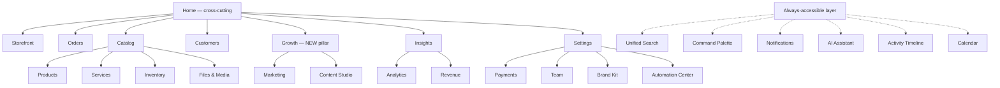
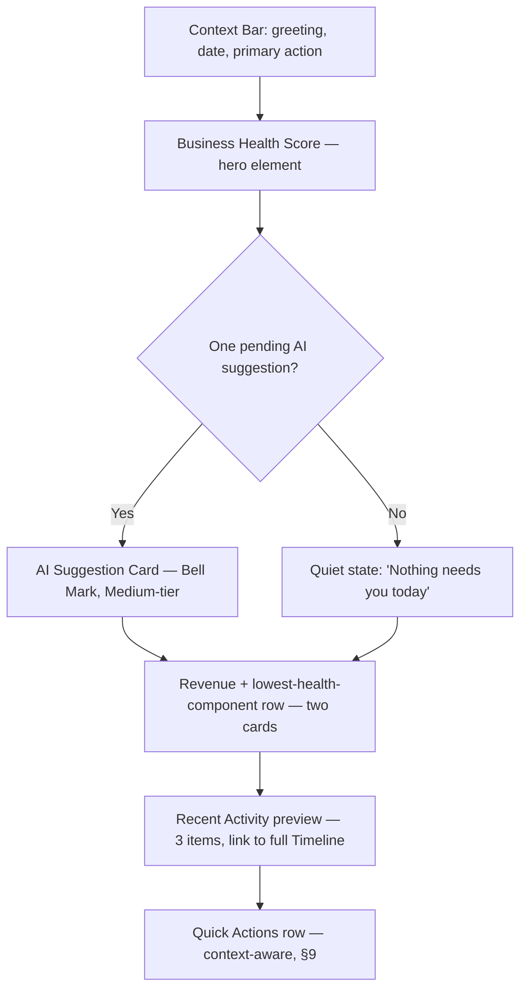
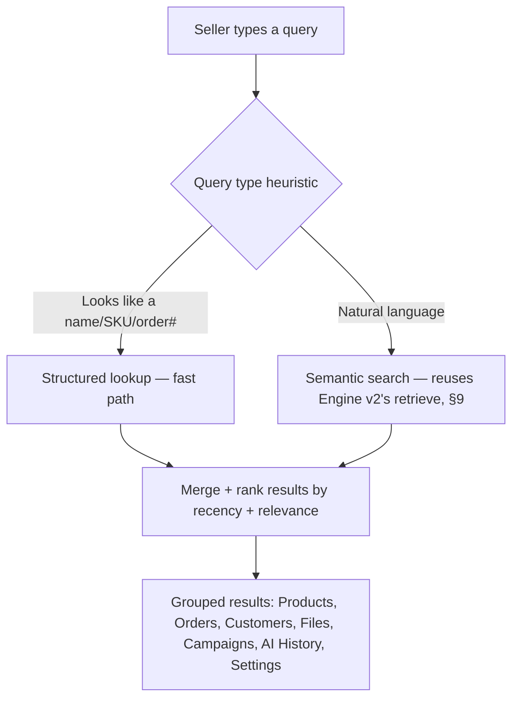
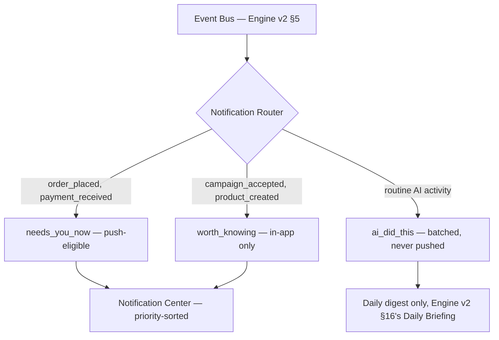
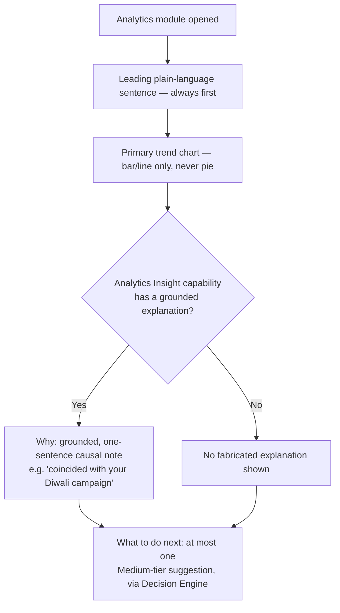

# CowQ Seller Operating System (SellerOS) v1
### Production Architecture Document
**Confidential · Internal Use Only**

> "Everything about my business happens here."

---

## What This Document Is

The AI Commerce Engine (v2) is CowQ's brain — memory, agents, decisions, generation. **SellerOS is the body** — the single interface a seller lives inside every day, where every one of the Engine's 18 capabilities, every piece of memory, and every AI decision actually becomes something a seller sees, touches, and acts on. This is not a dashboard bolted onto a database. It's the operating system: one home, one search, one command surface, one notification stream, one place a business runs from.

This document assumes the Engine v2 (Decision Engine, Agents, Memory, Event Bus, AI Timeline, Rollback) already exists and is the data/intelligence source for everything specified below. SellerOS adds no new AI logic — it is purely the visual, interaction, and orchestration layer that makes the Engine legible and usable, second to second, all day.

Every section is implementation-ready — real schema, real code, no placeholders.

---

# 1. Philosophy & Positioning

**What SellerOS is not:** a dashboard (a dashboard is something you check). Not an admin panel (an admin panel is something you configure). Not a page collection (pages are destinations you navigate *to* and *away from*). **SellerOS is an environment a seller stays inside** — the way an operating system isn't a program you open, it's the thing everything else happens within.

**The governing design philosophy, restated as binding constraints:** Apple simplicity, Arc Browser calmness, Linear speed, Notion flexibility, Superhuman productivity, CowQ intelligence. Concretely: one primary action per screen (Design DNA Principle 1, unchanged and load-bearing here more than anywhere else in this canon), zero unnecessary clicks, instant perceived response, and AI that's felt more than seen.

**Reconciling 22 modules with the existing five-pillar IA:** the Design DNA (§6) already established a fixed five-pillar navigation model — Storefront, Orders, Catalog, Customers, Insights, plus Settings. This brief's 22 modules are not a replacement for that model; they're what those five pillars actually contain once fully built out, plus the cross-cutting systems (Home, Search, Command Palette, Notifications, AI Assistant, Activity Timeline) that sit *above* all five pillars rather than inside any one of them. Section 2 maps every one of the 22 requested modules onto this existing structure explicitly — no module here invents a sixth pillar.

---

# 2. Information Architecture

## The Two Layers

**Cross-cutting layer** (always accessible, never "inside" a pillar): Home, Unified Search, Command Palette, Notifications, AI Assistant, Activity Timeline, Calendar.

**Pillar layer** (Design DNA §6, unchanged, now fully specified): Storefront, Orders, Catalog, Customers, Insights, Settings — each pillar now explicitly contains the requested modules that belong to it.

## Module Mapping

| Requested module | Home in the IA | Notes |
|---|---|---|
| Home | Cross-cutting — the literal landing surface | §3 |
| Business Overview | Lives inside Home as its primary content, not a separate destination | Avoids a redundant second "overview" screen |
| Products | Catalog pillar | Existing (Database Blueprint §11) |
| Services | Catalog pillar (product/service toggle, per Public Storefront §51.4) | Existing |
| Orders | Orders pillar | Existing |
| Customers | Customers pillar | Existing |
| Inventory | Catalog pillar, a dedicated tab within it | Existing (Blueprint §33) |
| Marketing | New sub-pillar under a renamed **Growth** area (see below) | Houses Marketing Suggestion, Festival Campaign outputs |
| Content Studio | Growth area | Houses Poster/Reel/Caption Generation (Engine §16) |
| AI Assistant | Cross-cutting | Seller-facing counterpart to the customer-facing Concierge (Public Storefront §19) — see §4 |
| AI Tasks | Cross-cutting, surfaced via Notifications + Home | Not a separate pillar — AI Tasks *are* the AI Suggestion Queue (AI Playbook §4) given a persistent home |
| Calendar | Cross-cutting | Bookings, festival campaign timing, vacation mode (Database Blueprint §32) |
| Notifications | Cross-cutting | §8 |
| Analytics | Insights pillar | Existing (Blueprint §26), now the Analytics module's full spec, §10 |
| Revenue | Insights pillar, a dedicated tab | Financial view over the same Insights data |
| Payments | Settings pillar | Existing (Blueprint §19) |
| Settings | Settings pillar | Existing (Design DNA §10) |
| Team Management | Settings pillar | `business_members` (Database Blueprint §6), UI now specified |
| Brand Kit | Settings pillar | Brand Memory's seller-facing editor (AI Playbook §6) |
| Automation Center | Settings pillar | Preference Memory's trust-level editor (Engine v2 §6.7) made visible |
| Activity Timeline | Cross-cutting | The AI Timeline (Engine v2 §17), given its own destination |
| Files & Media | Catalog pillar, a dedicated tab | Product/service asset library (Database Blueprint §13/§36) |

**A new pillar-adjacent area is introduced here, named explicitly:** **Growth** — housing Marketing, Content Studio, and (eventually) Referrals. This is the one genuine IA addition this document makes beyond the original five pillars, and it's justified the same way the original five were chosen: it's a coherent, permanent slice of what a seller does, not a temporary feature grouping. Six pillars total as of SellerOS v1: **Storefront, Orders, Catalog, Customers, Growth, Insights**, plus Settings.



---

# 3. Home Screen Specification

## The Six Questions Home Must Answer Instantly

1. How is my business today? → Business Health Score (Engine v2 §12), the single largest visual element.
2. What needs attention? → AI Suggestion Queue (AI Playbook §4), max one card visible.
3. What should I do next? → the same suggestion, reframed — Home never shows two competing "do this next" prompts.
4. What did AI already do? → a compact, collapsed AI Activity summary (Engine v2 §17's Timeline, previewed here, full history one tap away).
5. What is making money? → top-line revenue trend (Database Blueprint §26).
6. What is slowing growth? → the single lowest-scoring Business Health Score component, named plainly.

## Composition



**This is a direct extension of the Dashboard Pattern already specified in the UI/UX Design System (§5)** — same Context Bar, same independently-loading KPI cards, same one-suggestion-at-a-time rule. SellerOS's Home is that pattern's fullest, most important instance, not a new pattern.

## Implementation

```tsx
// src/app/routes/HomeScreen.tsx
import { useBusinessHealthScore } from '@/features/home/hooks/useBusinessHealthScore';
import { usePendingSuggestion } from '@/features/ai/hooks/usePendingSuggestion';
import { useRevenueTrend } from '@/features/insights/hooks/useRevenueTrend';
import { useRecentActivity } from '@/features/timeline/hooks/useRecentActivity';
import { QuickActionsRow } from '@/features/home/components/QuickActionsRow';

export default function HomeScreen() {
  const { data: health } = useBusinessHealthScore();
  const { data: suggestion } = usePendingSuggestion(); // reads the Decision Engine's queue, Engine v2 §3
  const { data: revenue } = useRevenueTrend(7);
  const { data: activity } = useRecentActivity(3);

  return (
    <div className="mx-auto max-w-[1120px] px-6 py-6 sm:px-8">
      <BusinessHealthHero score={health} />
      {suggestion ? <AISuggestionCard suggestion={suggestion} /> : <QuietState />}
      <div className="mt-6 grid grid-cols-1 gap-4 sm:grid-cols-2">
        <RevenueCard trend={revenue} />
        <LowestHealthComponentCard score={health} />
      </div>
      <RecentActivityPreview items={activity} />
      <QuickActionsRow />
    </div>
  );
}
```

## Acceptance Criteria

- [ ] Home answers all six questions within the first viewport on both mobile and desktop, no scrolling required for the primary read.
- [ ] Never more than one AI suggestion card visible on Home, enforced by `usePendingSuggestion` returning a single item, not an array.

---

# 4. AI Integration Layer

## The Rule: AI Is Everywhere, Visible Almost Nowhere

Every module in §2 surfaces AI Engine output, but only two SellerOS surfaces are *branded* as AI: the **AI Assistant** (seller-facing, distinct from the customer-facing Concierge) and the **Bell Mark** suggestion card wherever it appears. Every other AI-touched surface — a pre-filled product field, an auto-applied SEO title, a Home Health Score component — shows the *result* of AI work with zero AI chrome around it, per AI Playbook Chapter 1's 95/5 rule, now enforced at the SellerOS component level.

## AI Assistant (seller-facing)

**Distinct from the Concierge (Public Storefront V3 §19), which answers customers.** The seller-facing Assistant answers questions *about* the business — "how many orders came in this week," "why did my health score drop," "draft a reply to this customer" — grounded in the seller's own full Engine context (all seven memory types, not just Brand voice), reachable via Command Palette (§7) or a persistent, collapsed entry point identical in visual treatment to the Concierge's.

```typescript
// supabase/functions/seller-assistant/index.ts
// Structurally identical to shop-concierge (Public Storefront V3 §31) —
// same retrieval-gated, intent-routed pattern — but grounded in the full
// Engine Context Builder (Engine v2 §7) rather than customer-facing
// catalog/policy/availability retrieval alone. Seller Assistant questions
// route through the Decision Engine (§3) exactly like any other capability,
// added to the CONTEXT_REQUIREMENTS table as 'seller_assistant', full
// seven-memory-type access, Customer-Agent-owned per Engine v2 §4's
// existing agent registry pattern extended with this one new capability.
```

## Component: AISuggestionCard

The single, shared component every module reuses for a Medium-tier Engine suggestion (unchanged spec from Design DNA §24.11/AI Playbook §4) — SellerOS's contribution is making sure this component is *the same instance* whether it's shown on Home, inside Catalog after a stale-photo detection, or inside Insights after an analytics-derived nudge. One component, one visual language, everywhere.

## Acceptance Criteria

- [ ] Zero AI-branded chrome (Bell Mark, "AI" labels) appears on any High-tier, silently-applied Engine output anywhere in SellerOS.
- [ ] `AISuggestionCard` is verified, via component-usage audit, to be the single shared implementation across every module — no module builds its own suggestion-card variant.

---

# 5. Workspace System

## Purpose

Let a seller shape SellerOS around how *they* work — pinned tools, custom layouts, saved views, quick-access favorites — without ever making the base experience feel incomplete for a seller who customizes nothing (Design DNA's "looks complete with zero customization" rule, extended here to the operating layer itself).

## Database Changes

```sql
create table if not exists seller_workspace_layouts (
  seller_id uuid primary key references sellers(id) on delete cascade,
  home_widget_order text[] not null default array['health_score','ai_suggestion','revenue','recent_activity','quick_actions'],
  pinned_items jsonb not null default '[]', -- [{ type: 'product'|'view'|'report', id, label }]
  updated_at timestamptz not null default now()
);
alter table seller_workspace_layouts enable row level security;
create policy "Sellers manage their own workspace layout"
  on seller_workspace_layouts for all
  using (exists (select 1 from business_members where business_id = seller_workspace_layouts.seller_id and user_id = auth.uid()));

create table if not exists saved_views (
  id uuid primary key default gen_random_uuid(),
  seller_id uuid not null references sellers(id) on delete cascade,
  module text not null, -- 'orders' | 'catalog' | 'customers' | ...
  name text not null,
  filter_config jsonb not null, -- serialized filter/sort state, e.g. { status: 'pending', sortBy: 'created_at_desc' }
  is_favorite boolean not null default false,
  created_at timestamptz not null default now()
);
create index if not exists idx_saved_views_seller_module on saved_views(seller_id, module);
alter table saved_views enable row level security;
create policy "Sellers manage their own saved views"
  on saved_views for all
  using (exists (select 1 from business_members where business_id = saved_views.seller_id and user_id = auth.uid()));
```

**Deliberately not built:** a freeform, drag-anywhere widget grid (the Design DNA's storefront "no freeform page builder" principle applies equally here — customization is bounded reordering and pinning of a fixed component set, never arbitrary layout composition, which would break both visual consistency and performance predictability).

## Implementation

```typescript
// src/features/workspace/hooks/useWorkspaceLayout.ts
export function useWorkspaceLayout() {
  return useQuery({
    queryKey: ['workspace-layout'],
    queryFn: getMyWorkspaceLayout,
    staleTime: 5 * 60_000,
  });
}

export function useReorderHomeWidgets() {
  const queryClient = useQueryClient();
  return useMutation({
    mutationFn: (newOrder: string[]) => updateWorkspaceLayout({ home_widget_order: newOrder }),
    onSuccess: () => queryClient.invalidateQueries({ queryKey: ['workspace-layout'] }),
  });
}
```

## UX

Reordering is drag-and-drop among the *fixed* widget set from §3 — a seller can move Revenue above AI Suggestion, but cannot introduce a widget type that doesn't exist. Pinned items appear in a persistent rail, capped at 8 (Design DNA-consistent restraint — an unbounded pin list stops being "quick access").

## Acceptance Criteria

- [ ] Home renders correctly and completely with a seller's default (empty-customization) layout, unchanged from §3's spec.
- [ ] Pinned items are capped at 8, enforced at the mutation layer, not just the UI.

---

# 6. Unified Search

## Purpose

One search, everything — products, services, orders, customers, files, campaigns, AI history, settings — natural language, not just exact-match.

## Architecture



**Reuses the exact retrieval infrastructure Engine v2 already built** (`retrieve()`, §9 there) — extended here with two new embeddable item types, `order` and `setting`, so a query like "orders from last week that haven't shipped" or "where do I turn off WhatsApp notifications" resolves semantically, not just via keyword match.

## Database Changes

```sql
alter table catalog_embeddings drop constraint if exists catalog_embeddings_item_type_check;
alter table catalog_embeddings add constraint catalog_embeddings_item_type_check
  check (item_type in ('product', 'service', 'policy', 'marketing_memory', 'order', 'setting_page'));
-- Settings pages are embedded once, statically, at build/deploy time (they
-- don't change per-seller) — a small, fixed embedding set, not a per-seller job.
```

## Implementation

```typescript
// src/features/search/api/unifiedSearch.ts
export interface UnifiedSearchResults {
  products: CatalogItem[]; orders: Order[]; customers: Customer[];
  files: Asset[]; campaigns: MarketingMemoryEntry[]; aiHistory: AITimelineEntry[]; settings: SettingsResult[];
}

export async function unifiedSearch(sellerId: string, query: string): Promise<UnifiedSearchResults> {
  const [structured, semantic] = await Promise.all([
    structuredLookup(sellerId, query), // exact/prefix match on names, SKUs, order numbers, customer names
    retrieve(sellerId, query, ['product', 'service', 'order', 'setting_page']), // Engine v2 §9, reused directly
  ]);
  return mergeAndGroup(structured, semantic);
}
```

## Components

Full-screen takeover on mobile, expanding bar on desktop — the exact pattern already specified for marketplace search (Public Storefront §51.5), reused here for the seller-facing instance. Results grouped, each group capped at 3 with a "see all" expansion.

## Acceptance Criteria

- [ ] A natural-language query ("orders that haven't shipped") returns relevant, correctly-typed results without the seller needing exact keyword matches.
- [ ] Search never returns another seller's data under any query phrasing, verified via RLS-inheriting test.

---

# 7. Command Palette

## Purpose

Every meaningful action, reachable by keyboard, in under 3 keystrokes — "Create product," "Generate poster," "Find customer," "Open analytics," "Start campaign."

## Architecture

Extends the Unified Search (§6) with **action** results, not just navigation/content results — a command palette query returns both "navigate to Analytics" and "run Weekly Growth Report now" in the same ranked list.

```typescript
// src/shared/lib/commandRegistry.ts
export interface Command {
  id: string;
  label: string;
  keywords: string[]; // for fuzzy match
  shortcut?: string; // e.g. 'cmd+p'
  action: (ctx: CommandContext) => void | Promise<void>;
  requiresCapabilityAccess?: AICapability; // gates commands behind Decision Engine eligibility where relevant
}

export const COMMANDS: Command[] = [
  { id: 'create-product', label: 'Create product', keywords: ['new', 'add', 'product'], shortcut: 'cmd+shift+p', action: (ctx) => ctx.navigate('/catalog/new') },
  { id: 'create-service', label: 'Create service', keywords: ['new', 'add', 'service'], action: (ctx) => ctx.navigate('/catalog/new-service') },
  { id: 'generate-poster', label: 'Generate poster', keywords: ['marketing', 'image', 'ai'], action: (ctx) => ctx.openCapabilityModal('poster_generation') },
  { id: 'generate-reel', label: 'Generate reel', keywords: ['video', 'ai'], action: (ctx) => ctx.openCapabilityModal('reel_generation') },
  { id: 'find-customer', label: 'Find customer', keywords: ['search', 'customer'], action: (ctx) => ctx.openSearch({ scope: 'customers' }) },
  { id: 'open-analytics', label: 'Open analytics', keywords: ['insights', 'revenue'], shortcut: 'cmd+shift+a', action: (ctx) => ctx.navigate('/insights') },
  { id: 'start-campaign', label: 'Start campaign', keywords: ['marketing', 'festival'], action: (ctx) => ctx.openCapabilityModal('festival_campaign') },
];
```

**Every action-triggering command routes through the exact same Decision Engine + Edge Function pipeline any other capability invocation would** (Engine v2 §22) — the Command Palette is a faster *entry point*, never a bypass of the Engine's gating logic.

## Components

```tsx
// src/shared/components/CommandPalette.tsx
export function CommandPalette() {
  const [open, setOpen] = useState(false);
  useKeyboardShortcut('cmd+k', () => setOpen(true));
  // Renders via the shared glass-surface pattern (Design DNA §15),
  // fuzzy-matches COMMANDS + unifiedSearch results in one list.
}
```

## Acceptance Criteria

- [ ] Every command in the registry is reachable via fuzzy keyword match, not exact label match only.
- [ ] Every action-command's execution path is verified to pass through the Decision Engine, no exceptions.

---

# 8. Notification System

## Purpose

Priority-based: AI, Orders, Customers, Payments, Marketing, Inventory, Warnings. Only meaningful notifications, no spam.

## Architecture

**Directly reuses Engine v2's Event Bus (§5) and the existing three-tier notification model (Design DNA §35, AI Playbook §26)** — SellerOS adds no new notification logic, only the surface that displays it.



## Database Changes

No new tables — reuses `notifications`/`push_log` (Database Blueprint §28) exactly. SellerOS's contribution is a `category` column mapping notifications to the seven requested categories for filtering:

```sql
alter table notifications add column if not exists category text
  check (category in ('ai', 'orders', 'customers', 'payments', 'marketing', 'inventory', 'warnings'));
```

## Components

A persistent bell icon (unread count badge), opening a priority-sorted list — `needs_you_now` always above `worth_knowing`, filterable by the seven categories, each notification's tap target routing directly to relevant context (Design DNA §35 Rule 3, unchanged).

## Acceptance Criteria

- [ ] Zero `ai_did_this`-tier notification ever appears as a push, unchanged enforcement from Database Blueprint §28.
- [ ] Every notification's `category` is set at creation time, never inferred after the fact by the UI.

---

# 9. Quick Actions

## Purpose

Context-aware, one-click actions — Restock, Duplicate product, Reply to customer, Generate campaign, Share storefront, Request payment.

## Architecture

Quick Actions are **not a fixed list** — they're computed per-context from what's actually actionable right now, reusing the Business Health Score (Engine v2 §12) and recent Events (§5) to decide relevance.

```typescript
// src/features/home/lib/computeQuickActions.ts
export async function computeQuickActions(sellerId: string, context: 'home' | 'product_detail' | 'order_detail'): Promise<QuickAction[]> {
  const candidates: QuickAction[] = [];
  const health = await getBusinessHealthScore(sellerId);

  if (health.components.inventory < 50) {
    candidates.push({ id: 'restock', label: 'Restock low items', action: 'navigate:/catalog?filter=low_stock' });
  }
  if (context === 'product_detail') {
    candidates.push({ id: 'duplicate', label: 'Duplicate product', action: 'capability:duplicate_product' });
    candidates.push({ id: 'share', label: 'Share storefront link', action: 'share:product' });
  }
  if (context === 'order_detail') {
    candidates.push({ id: 'request-payment', label: 'Request payment', action: 'capability:request_payment' }); // future commerce hook, Engine v1 §29/§30
  }
  // Unresolved customer messages surface a "Reply to customer" quick action directly.
  const unrepliedCount = await getUnrepliedCustomerMessageCount(sellerId);
  if (unrepliedCount > 0) {
    candidates.push({ id: 'reply', label: `Reply to ${unrepliedCount} customer${unrepliedCount > 1 ? 's' : ''}`, action: 'navigate:/customers?filter=unreplied' });
  }
  return candidates.slice(0, 4); // never more than 4 — Design DNA's restraint principle applied to actions, not just content
}
```

## Acceptance Criteria

- [ ] Never more than 4 quick actions shown at once, enforced at the computation layer.
- [ ] Every quick action's underlying operation routes through the same capability/Decision Engine pipeline as its full-screen equivalent — no quick-action-only shortcut logic that bypasses gating.

---

# 10. Analytics Module

## Purpose

Simple, visual, actionable — explains why, explains what to do next, never overwhelms.

## Architecture

**Directly extends the existing Insights pillar spec (Database Blueprint §26, Design DNA §24.7, Engine v2 §16's Analytics Insight capability)** — SellerOS's Analytics module is the full-screen destination version of what Home's revenue card previews.



## Acceptance Criteria

- [ ] Zero pie charts, unchanged permanent guardrail.
- [ ] Every "why" explanation traces to a real, grounded Engine signal — never fabricated, per §10's `D -> F` path being the default when no grounding exists.

---

# 11. Component Hierarchy

```
App
├── AppShell (persistent: sidebar/bottom-nav, Command Palette listener, Notification bell)
│   ├── HomeScreen (§3)
│   ├── PillarLayout (shared shell per pillar: Storefront, Orders, Catalog, Customers, Growth, Insights, Settings)
│   │   ├── ModuleList (List pattern, UI/UX Design System §6)
│   │   └── ModuleDetail (Detail pattern, §7)
│   ├── UnifiedSearchOverlay (§6)
│   ├── CommandPalette (§7)
│   ├── NotificationCenter (§8)
│   ├── SellerAssistantPanel (§4)
│   └── ActivityTimelineScreen (Engine v2 §17's ai_timeline, full-screen destination)
```

Every leaf component reuses the shared Design DNA component library (§24 there) exactly — SellerOS introduces zero new base components, only new *compositions* of existing ones.

---

# 12. Folder Structure

```
src/
  app/
    shell/
      AppShell.tsx
      Sidebar.tsx
      BottomNav.tsx
    routes/
      HomeScreen.tsx
      ...pillar route files (existing, per Engineering Handbook §6)
  features/
    home/
      components/ (BusinessHealthHero, QuickActionsRow, RecentActivityPreview)
      hooks/ (useBusinessHealthScore, usePendingSuggestion)
      lib/ (computeQuickActions.ts)
    workspace/
      api/ (workspace.api.ts)
      hooks/ (useWorkspaceLayout.ts)
    search/
      api/ (unifiedSearch.ts)
      components/ (UnifiedSearchOverlay.tsx)
    command-palette/
      lib/ (commandRegistry.ts)
      components/ (CommandPalette.tsx)
    notifications/
      components/ (NotificationCenter.tsx, NotificationBell.tsx)
    ai-assistant/
      components/ (SellerAssistantPanel.tsx)
    timeline/
      components/ (ActivityTimelineScreen.tsx)
  shared/
    lib/ (unchanged — cn.ts, storage.ts, friendlyUrl.ts, etc.)
```

Follows the exact feature-first convention already established (Engineering Handbook §3) — no new top-level structure.

---

# 13. State Management

**Server state:** TanStack Query throughout, unchanged discipline (Engineering Handbook §8). New query keys introduced by SellerOS: `['workspace-layout']`, `['saved-views', module]`, `['unified-search', query]`, `['pending-suggestion']`, `['business-health-score']`, `['notifications', category]`.

**Cross-cutting UI state (new for SellerOS):** Command Palette open/closed and Notification Center open/closed are the *only* two pieces of genuinely global client state SellerOS introduces — both via a single, narrow `UIStateContext`, never a broader app-wide state store. Everything else remains local component state or server state, unchanged from existing conventions.

```typescript
// src/app/providers/UIStateContext.tsx
interface UIState {
  commandPaletteOpen: boolean;
  notificationCenterOpen: boolean;
}
// A single, narrow context — deliberately not a general-purpose global
// store, consistent with Engineering Handbook §8's "no additional state
// library without a documented architecture review" rule.
```

---

# 14. Navigation Architecture

```typescript
// src/app/routes/routes.tsx
export const routes: RouteObject[] = [
  { path: '/', element: <HomeScreen /> },
  { path: '/storefront', element: <StorefrontEditor /> },
  { path: '/orders', element: <OrdersList /> },
  { path: '/orders/:id', element: <OrderDetail /> },
  { path: '/catalog', element: <CatalogList /> },
  { path: '/catalog/:id', element: <ProductDetail /> },
  { path: '/catalog/inventory', element: <InventoryTab /> },
  { path: '/catalog/files', element: <FilesMediaTab /> },
  { path: '/customers', element: <CustomersList /> },
  { path: '/customers/:id', element: <CustomerDetail /> },
  { path: '/growth/marketing', element: <MarketingModule /> },
  { path: '/growth/content-studio', element: <ContentStudioModule /> },
  { path: '/insights', element: <AnalyticsModule /> },
  { path: '/insights/revenue', element: <RevenueModule /> },
  { path: '/settings', element: <Settings /> },
  { path: '/settings/team', element: <TeamManagement /> },
  { path: '/settings/brand-kit', element: <BrandKitEditor /> },
  { path: '/settings/automation', element: <AutomationCenter /> },
  { path: '/settings/payments', element: <PaymentsSettings /> },
  { path: '/timeline', element: <ActivityTimelineScreen /> },
  { path: '/calendar', element: <CalendarModule /> },
];
```

Six pillars plus Settings, each with sub-routes exactly matching §2's module mapping — no route exists outside this table, per Design DNA §23's IA-map acceptance criterion, extended here.

---

# 15. API Design

No new API paradigm — every SellerOS surface consumes existing Engine v2/Database Blueprint APIs, plus the narrow set of new endpoints this document introduces:

```typescript
// New in SellerOS:
getMyWorkspaceLayout(sellerId): Promise<WorkspaceLayout>
updateWorkspaceLayout(sellerId, patch): Promise<void>
getSavedViews(sellerId, module): Promise<SavedView[]>
createSavedView(sellerId, module, config): Promise<SavedView>
unifiedSearch(sellerId, query): Promise<UnifiedSearchResults>
getPendingSuggestion(sellerId): Promise<AISuggestion | null> // thin wrapper over Engine v2's Decision Engine queue
getBusinessHealthScore(sellerId): Promise<BusinessHealthScore> // thin wrapper over Engine v2 §12
computeQuickActions(sellerId, context): Promise<QuickAction[]>
```

Every one of these is a direct Supabase query or a thin read-only wrapper over an Engine v2 function — SellerOS introduces zero new Edge Functions of its own beyond `seller-assistant` (§4), which follows Engine v2 §22's exact seven-step skeleton unmodified.

---

# 16. Database Impact — Consolidated Migration

```sql
-- SellerOS v1 — consolidated migration. Assumes Engine v2's full schema
-- (decision_engine_log, business_health_scores, events, ai_timeline,
-- notifications, etc.) already exists.

create table if not exists seller_workspace_layouts (
  seller_id uuid primary key references sellers(id) on delete cascade,
  home_widget_order text[] not null default array['health_score','ai_suggestion','revenue','recent_activity','quick_actions'],
  pinned_items jsonb not null default '[]',
  updated_at timestamptz not null default now()
);
alter table seller_workspace_layouts enable row level security;
create policy "Sellers manage their own workspace layout"
  on seller_workspace_layouts for all
  using (exists (select 1 from business_members where business_id = seller_workspace_layouts.seller_id and user_id = auth.uid()));

create table if not exists saved_views (
  id uuid primary key default gen_random_uuid(),
  seller_id uuid not null references sellers(id) on delete cascade,
  module text not null,
  name text not null,
  filter_config jsonb not null,
  is_favorite boolean not null default false,
  created_at timestamptz not null default now()
);
create index if not exists idx_saved_views_seller_module on saved_views(seller_id, module);
alter table saved_views enable row level security;
create policy "Sellers manage their own saved views"
  on saved_views for all
  using (exists (select 1 from business_members where business_id = saved_views.seller_id and user_id = auth.uid()));

alter table catalog_embeddings drop constraint if exists catalog_embeddings_item_type_check;
alter table catalog_embeddings add constraint catalog_embeddings_item_type_check
  check (item_type in ('product', 'service', 'policy', 'marketing_memory', 'order', 'setting_page'));

alter table notifications add column if not exists category text
  check (category in ('ai', 'orders', 'customers', 'payments', 'marketing', 'inventory', 'warnings'));
```

**This is the entire schema footprint of SellerOS** — two new tables, two column/constraint additions. Everything else this document specifies is UI, orchestration, and read-composition over Engine v2's existing schema, which is exactly the intended relationship between the two documents (body, not a new brain).

---

# 17. Permissions & RLS

Every new table follows Database Blueprint §43 Pattern 1 exactly. **The one genuinely new authorization consideration SellerOS introduces:** Team Management (§2) surfaces `business_members` roles beyond `owner` for the first time in a real UI (the table has existed since Engineering Handbook §14, unpopulated beyond `owner` in practice) — SellerOS's Team Management module is the first real consumer of `staff`/`agency_manager` roles, and every module's RLS policy already inherits correct scoping for those roles automatically, since the underlying tables were built RLS-Pattern-1-compliant from the start specifically to make this moment non-disruptive.

---

# 18. Caching

Unchanged TanStack Query discipline throughout (Engineering Handbook §31, extended in Engine v2 §13). SellerOS-specific additions: `business-health-score` and `pending-suggestion` queries use a **short, 60-second `staleTime`** on Home specifically (shorter than their general 5-minute cache elsewhere) — Home is the surface a seller checks most reflexively, and it should feel closer to live than any other view in the product.

---

# 19. Realtime

**Notifications and the AI Suggestion Queue subscribe to Engine v2's Event Bus (§5) via Supabase Realtime**, exactly the `pg_notify`-based broadcast pattern already established there — SellerOS adds no new Realtime infrastructure, only new subscribers.

```typescript
// src/features/home/hooks/usePendingSuggestion.ts
export function usePendingSuggestion() {
  const queryClient = useQueryClient();
  useEffect(() => {
    const channel = supabase.channel('cowq_events').on('broadcast', { event: 'cowq_events' }, () => {
      queryClient.invalidateQueries({ queryKey: ['pending-suggestion'] });
    });
    channel.subscribe();
    return () => { supabase.removeChannel(channel); };
  }, [queryClient]);
  return useQuery({ queryKey: ['pending-suggestion'], queryFn: getPendingSuggestion, staleTime: 60_000 });
}
```

---

# 20. Background Jobs

No new background jobs — SellerOS is a read/orchestration layer over Engine v2's existing job set (§15 there: memory aggregation, embedding, briefings, health score computation). The one new scheduled consideration: **settings-page embeddings (§6) are regenerated only on deploy**, not per-seller, not on a recurring schedule — a fundamentally different, much simpler job than every other embedding source in this canon, worth noting explicitly so it isn't mistakenly wired into the per-seller nightly job set.

---

# 21. Performance

- **Instant loading:** every pillar's List/Detail screens follow the UI/UX Design System's existing skeleton discipline (§11 there) — unchanged, restated as binding for every one of the 22 modules.
- **Optimistic UI:** Quick Actions (§9) and Workspace reordering (§5) both apply optimistically, rolling back only on a confirmed server error — the same pattern already proven for cart quantity updates (Design DNA §52.1).
- **Offline support:** Home's last-fetched state remains visible and interactively browsable while offline (Design DNA §55.4's offline-first discipline, extended from the public shop to the seller-facing app for the first time in this canon).
- **Realtime updates:** §19.
- **Keyboard shortcuts:** every Command Palette entry with a `shortcut` field (§7) is globally bound; unchanged, this is the *only* place SellerOS binds global keyboard listeners, to avoid shortcut collisions across modules.
- **Mobile-first:** every module in §2 is designed mobile-first per the existing Mobile Experience DNA (Design DNA §55), with Home's six-question layout specifically verified to require zero horizontal scrolling on a standard mobile viewport.

## Acceptance Criteria

- [ ] Home's Lighthouse score meets the same ≥95 throttled-mobile bar already established for the public shop (Public Storefront V3 §10).
- [ ] Command Palette opens within 100ms of the keyboard shortcut, verified via performance test.

---

# 22. Scalability & Future Extensibility

- **Workspace System (§5)** is deliberately bounded (fixed widget set, 8-pin cap) specifically so it scales to millions of sellers without becoming a rendering-performance or support-burden risk — an unbounded, freeform system would not.
- **Unified Search/Command Palette (§6-7)** reuse Engine v2's existing vector infrastructure — no new scaling class introduced, inherits whatever scaling triggers already govern `catalog_embeddings` (Database Blueprint §50).
- **Team Management's real activation** (§17) is the clearest forward-looking extensibility point in this document — SellerOS's module structure was built assuming multi-seat access from day one, so activating `staff`/`agency_manager` roles later requires zero SellerOS-layer changes, only a Settings-module UI addition to actually invite team members (not built in this v1, explicitly deferred).

---

# 23. Security

- Every new table: RLS Pattern 1, no exceptions (§17).
- Command Palette's action-commands never bypass the Decision Engine (§7's explicit acceptance criterion) — this is the one place a UI shortcut could plausibly have been tempted to skip a safety gate for speed, and it's called out here specifically because that temptation is real and must be resisted.
- Unified Search never returns cross-seller results under any phrasing (§6), inheriting the same guarantee already proven for Engine v2's `retrieve()`.

---

# 24. Testing

- [ ] Home renders correctly with zero seller customization (default workspace layout).
- [ ] Command Palette's every command is keyboard-reachable and correctly routes through the Decision Engine.
- [ ] Unified Search returns zero cross-seller results under adversarial query phrasing.
- [ ] Quick Actions never exceed 4 shown simultaneously.
- [ ] Notification categories are correctly assigned at creation time for all seven category types.
- [ ] Workspace pin cap (8) is enforced server-side, not just client-side.
- [ ] Team Management's RLS correctly scopes a `staff`-role member's access once that role is populated (a forward-looking test, run against seeded test data even before real staff accounts exist).

---

# 25. Deployment Plan

1. Deploy the SellerOS migration (§16) to staging.
2. Deploy AppShell, HomeScreen, and the six-pillar routing structure (§14) — the foundational shell every other module depends on.
3. Deploy Notification Center and Realtime subscriptions (§8, §19) — low-risk, reuses fully-proven Engine v2 infrastructure.
4. Deploy Unified Search and Command Palette (§6-7) together, given their shared retrieval dependency.
5. Deploy the Workspace System (§5) and Quick Actions (§9) — both genuinely new interaction surfaces, warranting their own focused QA pass.
6. Deploy the Seller Assistant (§4) last among the cross-cutting systems, following the exact same adversarial-grounding-test gate already established for the customer-facing Concierge before its own broad rollout.
7. Enable Team Management's multi-role UI only once a real multi-seat seller need exists — the schema is ready from day one (§17), the UI ships when there's a real customer for it, not preemptively.

---

# 26. Final Engineering Review

**Senior Architect:** The decision to add exactly one new pillar (Growth) rather than let 22 requested modules sprawl into an ungoverned navigation structure is the correct call — it preserves the Design DNA's five/six-pillar discipline while genuinely accommodating everything the brief asked for. SellerOS's near-total reliance on Engine v2's existing schema (two new tables, two column additions) is exactly the right shape for a "body on top of an existing brain," not a second competing system.

**Senior Frontend Engineer:** Command Palette and Unified Search sharing retrieval infrastructure, rather than each inventing their own, mirrors the exact discipline Engine v2 already established for its own AI capabilities — good that this document held itself to the same standard rather than treating "it's just UI" as license to duplicate.

**Senior Backend Engineer:** Zero new Edge Functions beyond the Seller Assistant is a genuinely lean result for a document covering 22 modules — confirms this really is an orchestration/presentation layer, not a hidden second Engine.

**Senior Database Engineer:** The workspace/saved-views schema is appropriately minimal — a seller's customization footprint is two small tables, not a sprawling preferences system. RLS discipline holds without exception across both.

**Senior Product Designer:** Bounding the Workspace System to reordering + pinning (never freeform layout) is the correct, consistent extension of the "no freeform page builder" principle from the public storefront into the seller's own daily environment — the same restraint that keeps every seller's shop premium by default now keeps every seller's workspace usable by default too.

**Security Engineer:** The explicit callout that Command Palette must never bypass the Decision Engine is exactly the right thing to state plainly rather than assume — speed-oriented UI surfaces are precisely where a safety gate is most likely to be quietly skipped under implementation pressure, and naming that risk here should prevent it.

**Performance Engineer:** Home's shortened 60-second staleTime for health score and pending suggestion is a sensible, narrow exception to the general 5-minute caching discipline — proportionate to Home being the single most-visited surface in the product, not a general loosening of the caching rules elsewhere.

**AI Governance Reviewer:** SellerOS correctly treats the Bell Mark and Seller Assistant as the *only* two AI-branded surfaces across 22 modules — this is the 95/5 rule genuinely holding at scale, not just in a single feature, and it's the single most important thing this document gets right relative to the brief's own stated design philosophy.

---

**End of document.** SellerOS v1 adds no new intelligence — every suggestion, score, and generated asset it displays originates from the AI Commerce Engine v2. What this document adds is the environment: one home, one search, one command surface, one notification stream, six pillars, and the discipline to keep all of it feeling like Apple, Arc, and Linear rather than Shopify, however many modules it eventually contains.
